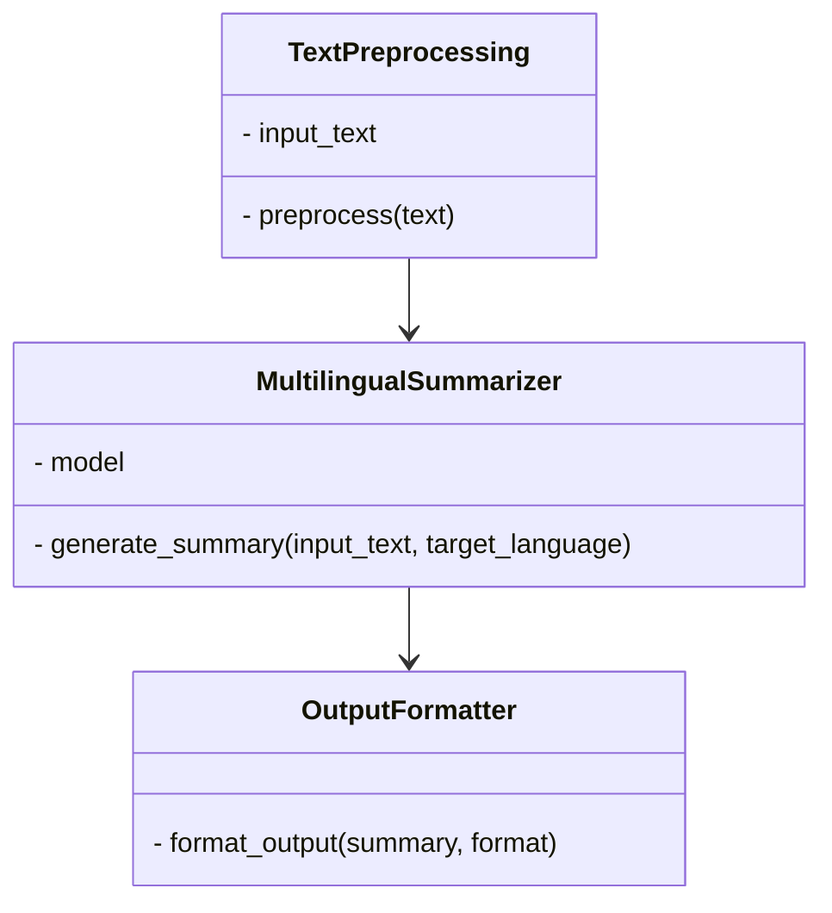
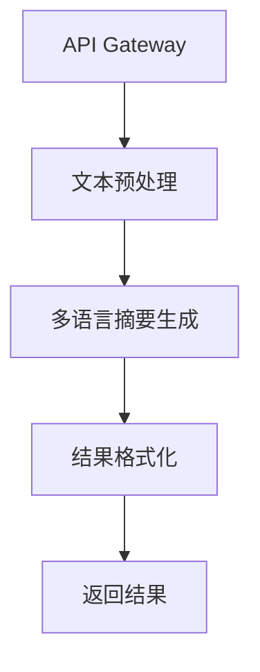
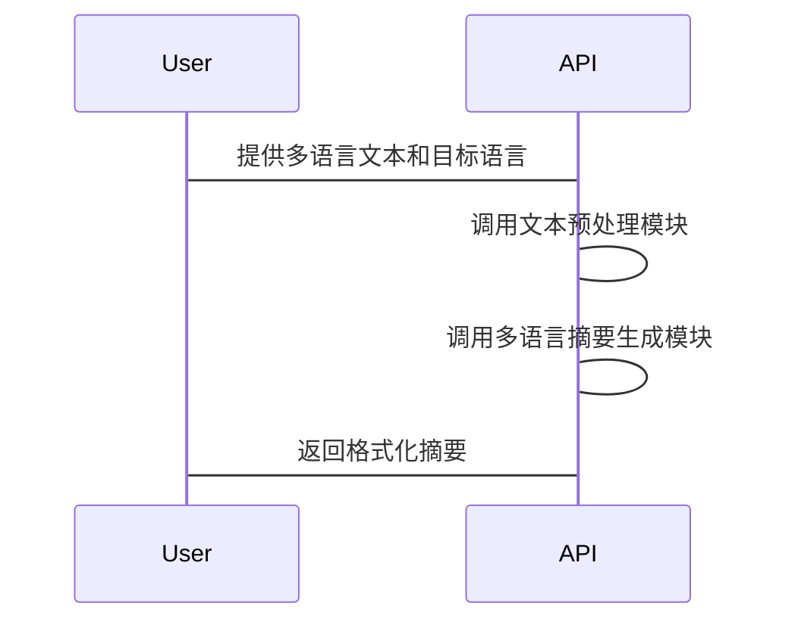

                 


# 开发AI Agent的多语言文本摘要生成器

> 关键词：AI Agent，多语言文本摘要，自然语言处理，Transformer模型，机器学习

> 摘要：本文详细探讨了开发AI Agent驱动的多语言文本摘要生成器的过程，从核心算法原理到系统架构设计，再到项目实战，深入剖析了实现细节和最佳实践。

---

# 第一部分: AI Agent与多语言文本摘要概述

## 第1章: AI Agent与多语言文本摘要概述

### 1.1 AI Agent的基本概念

#### 1.1.1 AI Agent的定义与特点
AI Agent（智能代理）是指能够感知环境、自主决策并执行任务的智能系统。它具备以下特点：
- **自主性**：无需外部干预，自主完成任务。
- **反应性**：能够实时感知环境变化并做出响应。
- **目标导向**：基于目标驱动行为。
- **学习能力**：通过数据和经验不断优化性能。

#### 1.1.2 多语言文本摘要的定义
多语言文本摘要是指从多种语言的文本中提取关键信息，生成简洁准确的摘要。其核心目标是跨越语言障碍，提供统一的摘要输出。

#### 1.1.3 AI Agent在文本摘要中的作用
AI Agent通过自然语言处理技术，自动分析输入文本，生成多语言摘要，实现信息的高效传递与理解。

### 1.2 多语言文本摘要的应用场景

#### 1.2.1 多语言摘要的市场需求
随着全球化进程加快，跨语言信息处理需求激增，多语言摘要在商业、教育、科研等领域具有广泛需求。

#### 1.2.2 典型应用场景分析
- **跨语言文档处理**：企业需要处理多语言文档，快速提取关键信息。
- **实时翻译与摘要**：支持多语言沟通的应用场景，如在线客服、即时通讯工具。
- **内容分发平台**：将多语言内容分发给不同语言的用户。

#### 1.2.3 技术挑战与解决方案
- **挑战**：跨语言信息理解难度大，数据稀疏性问题。
- **解决方案**：利用预训练多语言模型，结合跨语言对齐技术。

### 1.3 本章小结
本章介绍了AI Agent的基本概念、多语言文本摘要的定义及应用场景，为后续技术实现奠定了基础。

---

# 第二部分: 多语言文本摘要的核心算法原理

## 第2章: 文本摘要算法原理

### 2.1 文本摘要的基本原理

#### 2.1.1 文本摘要的分类
- **提取式摘要**：从原文中选择重要句子或词汇。
- **生成式摘要**：基于模型生成新的文本。

#### 2.1.2 基于统计的摘要方法
- **TF-IDF**：通过关键词频率计算重要性。
- **lsa**：利用潜在语义分析提取主题。

#### 2.1.3 基于生成模型的摘要方法
- **RNN**：循环神经网络，适用于序列生成。
- **Transformer**：基于自注意力机制，处理长文本效果更好。

### 2.2 多语言文本摘要的挑战

#### 2.2.1 多语言数据的处理难点
- **数据不平衡**：某些语言的数据量较少。
- **跨语言对齐**：不同语言之间的语义对齐困难。

#### 2.2.2 跨语言信息的理解与转换
- **语言间的语义差异**：直接翻译可能导致信息损失。
- **文化差异**：不同语言背后的文化背景可能影响摘要效果。

#### 2.2.3 模型的通用性与适应性
- **通用性**：模型需在多种语言上表现良好。
- **适应性**：针对特定语言进行微调。

### 2.3 基于Transformer的文本摘要模型

#### 2.3.1 Transformer模型的结构
- **编码器**：将输入文本转化为上下文表示。
- **解码器**：根据编码器输出生成目标文本。

#### 2.3.2 编码器-解码器架构
- **编码器**：处理输入文本，生成上下文表示。
- **解码器**：基于编码器输出生成目标摘要。

#### 2.3.3 注意力机制的作用
- **自注意力机制**：捕捉文本中长距离依赖关系。
- **交叉注意力机制**：编码器-解码器之间的信息交互。

### 2.4 多语言模型的训练与优化

#### 2.4.1 跨语言预训练
- **多语言预训练模型**：在多种语言数据上进行预训练，提升模型的跨语言理解能力。
- **模型架构**：采用共享参数，减少参数量。

#### 2.4.2 多任务学习
- **联合任务训练**：同时训练多种任务（如翻译、摘要），提升模型的通用性。

#### 2.4.3 模型调优策略
- **微调**：在特定任务上进行微调，提升性能。
- **参数共享**：在多语言模型中共享参数，减少训练数据需求。

## 第3章: 多语言文本摘要的数学模型

### 3.1 文本摘要的数学表示

#### 3.1.1 文本表示为向量空间
- **词嵌入**：将单词映射为向量。
- **句子向量**：通过聚合词向量生成句子表示。

#### 3.1.2 序列到序列模型的数学表达
- **编码器输入**：$x_1, x_2, ..., x_T$，其中$x_i$是输入序列的第i个元素。
- **解码器输出**：$y_1, y_2, ..., y_S$，其中$y_j$是输出序列的第j个元素。

#### 3.1.3 注意力机制的数学公式
- **自注意力权重计算**：$a_{ij} = \text{softmax}(\frac{QK^T}{\sqrt{d}})$，其中$Q$是查询向量，$K$是键向量，$d$是维度。
- **注意力输出**：$\text{Attention}(Q,K,V) = \sum_{i=1}^{n} a_{ij} V_i$。

### 3.2 基于Transformer的编码器-解码器模型

#### 3.2.1 编码器的数学推导
- **输入嵌入**：$x_i = W_e x_i$，其中$W_e$是嵌入矩阵。
- **位置编码**：$x_i' = x_i + P_i$，其中$P_i$是位置编码。
- **自注意力计算**：$A = \text{Attention}(Q,K,V)$。
- **前馈网络**：$F_{\text{enc}}(x_i) = \text{ReLU}(W_f x_i + b_f) + x_i$。

#### 3.2.2 解码器的数学推导
- **输入嵌入**：$y_j = W_d y_j$。
- **位置编码**：$y_j' = y_j + P_j$。
- **自注意力计算**：$A_{\text{self}} = \text{Attention}(Q,K,V)$。
- **交叉注意力计算**：$A_{\text{cross}} = \text{Attention}(Q_{\text{dec}}, K_{\text{enc}}, V_{\text{enc}})$。
- **前馈网络**：$F_{\text{dec}}(y_j) = \text{ReLU}(W_f y_j + b_f) + y_j$。

#### 3.2.3 注意力机制的公式展开
- **查询、键、值计算**：
  $$
  Q = W_q h, \quad K = W_k h, \quad V = W_v h
  $$
- **注意力权重计算**：
  $$
  a_{ij} = \frac{\exp(\text{similarity}(Q_i, K_j))}{\sum_{k} \exp(\text{similarity}(Q_i, K_k))}
  $$
- **注意力输出**：
  $$
  \text{Attention}(Q,K,V) = \sum_{j} a_{ij} V_j
  $$

### 3.3 多语言模型的数学扩展

#### 3.3.1 跨语言词嵌入的对齐方法
- **共享嵌入层**：不同语言的词嵌入向量共享参数，通过跨语言预训练对齐。
- **跨语言对齐损失**：引入对齐损失函数，使得不同语言的词嵌入向量在语义上对齐。

#### 3.3.2 跨语言注意力机制
- **跨语言注意力权重**：
  $$
  a_{ij}^{cross} = \frac{\exp(\text{similarity}(Q_i, K_j))}{\sum_{k} \exp(\text{similarity}(Q_i, K_k))}
  $$
- **跨语言注意力输出**：
  $$
  \text{Attention}_{\text{cross}}(Q,K,V) = \sum_{j} a_{ij}^{cross} V_j
  $$

#### 3.3.3 模型的损失函数与优化目标
- **生成式摘要的损失函数**：
  $$
  \mathcal{L} = -\sum_{i=1}^{N} \sum_{j=1}^{M} y_{ij} \log p(y_{ij}|x)
  $$
- **优化目标**：最小化损失函数，提升生成摘要的质量。

---

# 第三部分: 系统架构与设计

## 第4章: 系统架构设计

### 4.1 系统功能需求分析

#### 4.1.1 用户需求
- **输入功能**：支持多语言文本输入。
- **摘要生成**：生成指定语言的摘要。
- **输出格式**：支持多种格式输出（文本、JSON等）。

#### 4.1.2 系统功能模块
- **文本预处理模块**：清洗和格式化输入文本。
- **摘要生成模块**：调用多语言摘要模型生成摘要。
- **结果后处理模块**：格式化输出结果。

### 4.2 系统架构设计

#### 4.2.1 领域模型


#### 4.2.2 系统架构


#### 4.2.3 接口设计
- **输入接口**：接收多语言文本和目标语言。
- **输出接口**：返回格式化的摘要结果。

#### 4.2.4 交互设计


---

# 第四部分: 项目实战

## 第5章: 项目实战

### 5.1 环境安装

#### 5.1.1 安装Python和必要的库
```bash
pip install transformers numpy
```

#### 5.1.2 下载多语言预训练模型
```bash
from transformers import AutoTokenizer, AutoModelForSeq2Seq
tokenizer = AutoTokenizer.from_pretrained("facebook/m2m-large-100")
model = AutoModelForSeq2Seq.from_pretrained("facebook/m2m-large-100")
```

### 5.2 核心实现代码

#### 5.2.1 加载预训练模型
```python
from transformers import AutoTokenizer, AutoModelForSeq2Seq
import torch

tokenizer = AutoTokenizer.from_pretrained("facebook/m2m-large-100")
model = AutoModelForSeq2Seq.from_pretrained("facebook/m2m-large-100")

device = torch.device("cuda" if torch.cuda.is_available() else "cpu")
model.to(device)
```

#### 5.2.2 定义摘要生成函数
```python
def generate_summary(input_text, target_language):
    inputs = tokenizer.encode(input_text, return_tensors="pt", truncation=True)
    inputs = inputs.to(device)
    with torch.no_grad():
        outputs = model.generate(inputs, max_length=100, num_beams=5, early_stopping=True)
    summary = tokenizer.decode(outputs[0], skip_special_tokens=True)
    return summary
```

#### 5.2.3 测试代码
```python
input_text = "这是一个测试输入，用于生成摘要。"
target_language = "zh"
print(generate_summary(input_text, target_language))
```

### 5.3 实际案例分析

#### 5.3.1 训练数据准备
- **多语言数据集**：使用英汉对照数据进行训练。
- **数据预处理**：分词、对齐、归一化处理。

#### 5.3.2 模型训练
```python
from transformers import TrainingArguments, Trainer
from datasets import Dataset

def compute_metrics(eval_pred):
    # 定义评估指标
    pass

training_args = TrainingArguments(...)
trainer = Trainer(model=model, args=training_args, compute_metrics=compute_metrics)
trainer.train()
```

#### 5.3.3 模型优化
- **超参数调整**：学习率、批量大小、训练轮数。
- **模型剪枝**：减少参数数量，降低计算成本。
- **模型蒸馏**：使用小模型模仿大模型的行为。

### 5.4 项目小结
本章通过实际代码实现，展示了AI Agent驱动的多语言文本摘要生成器的开发过程，从环境配置到模型训练，再到代码实现，详细讲解了每个步骤的实现细节。

---

# 第五部分: 最佳实践与总结

## 第6章: 最佳实践

### 6.1 小结与总结
- **总结**：本文详细探讨了AI Agent驱动的多语言文本摘要生成器的开发过程，从算法原理到系统架构，再到项目实战，深入剖析了实现细节。
- **小结**：通过实际案例分析和代码实现，展示了如何利用现有工具和算法构建高效的多语言摘要系统。

### 6.2 注意事项
- **数据质量**：确保训练数据的多样性和质量。
- **模型选择**：根据具体需求选择合适的模型架构。
- **性能优化**：通过并行计算、模型剪枝等方法提升性能。

### 6.3 拓展阅读
- **相关论文**：阅读多语言文本摘要领域的最新论文，了解前沿技术。
- **工具与库**：深入学习Transformers库的使用，掌握更多模型调参技巧。

---

# 作者

作者：AI天才研究院/AI Genius Institute & 禅与计算机程序设计艺术 /Zen And The Art of Computer Programming

