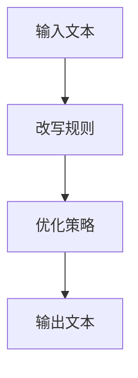
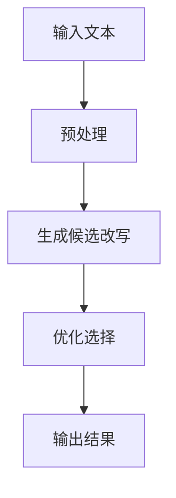
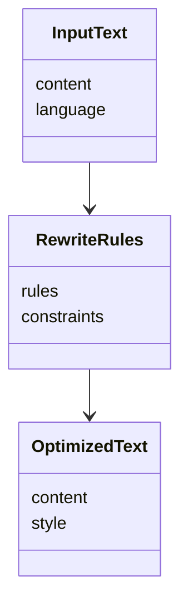
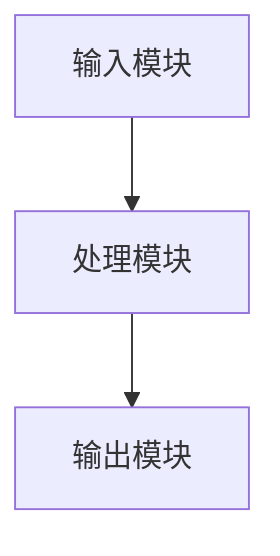
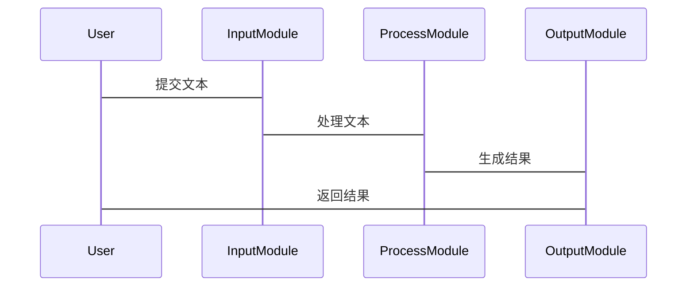

                 


# 开发AI Agent的多语言文本改写与优化系统

## 关键词：AI Agent, 多语言文本改写, 优化系统, 自然语言处理, 文本生成

## 摘要：  
本文详细介绍了开发AI Agent的多语言文本改写与优化系统的背景、核心概念、算法原理、系统架构设计、项目实战以及最佳实践。通过分析多语言文本处理的挑战，探讨AI Agent在文本改写与优化中的应用，结合实际案例，深入讲解系统的设计与实现过程。

---

# 第一部分: AI Agent的多语言文本改写与优化系统概述

## 第1章: 背景介绍

### 1.1 问题背景
#### 1.1.1 当前多语言文本处理的挑战
在当今全球化背景下，多语言文本处理的需求日益增长。然而，不同语言的语法结构、文化背景和表达习惯差异显著，这使得跨语言文本改写和优化变得复杂。传统的文本处理工具往往难以满足多样化的语言需求，且缺乏智能化的改写和优化能力。

#### 1.1.2 AI Agent在多语言文本改写中的作用
AI Agent（人工智能代理）通过结合自然语言处理（NLP）技术，能够实现对多语言文本的智能改写与优化。AI Agent能够理解上下文，识别语义，并根据目标语言的特点生成更准确、更流畅的文本。

### 1.2 问题描述
#### 1.2.1 多语言文本改写的需求
多语言文本改写的需求主要集中在以下方面：
1. **跨语言翻译与改写**：将一种语言的文本准确地改写为另一种语言，同时保持原文的意思和语气。
2. **文本优化**：对已有文本进行润色，使其更符合目标语言的表达习惯和语法规则。
3. **个性化定制**：根据用户需求，提供不同风格的文本改写。

#### 1.2.2 AI Agent在文本优化中的应用
AI Agent在文本优化中的应用包括：
1. **自动校对**：识别文本中的语法错误和拼写错误，并提供改进建议。
2. **风格调整**：根据目标读者的特点，调整文本的语气和风格。
3. **内容扩展**：在不改变原意的前提下，扩展文本内容，使其更详细。

### 1.3 问题解决
#### 1.3.1 AI Agent的核心功能
AI Agent的核心功能包括：
1. **多语言支持**：能够处理多种语言的文本，包括中文、英文、法语、西班牙语等。
2. **文本分析**：对输入文本进行语义分析，理解其核心内容。
3. **文本生成**：根据分析结果生成改写后的文本，同时优化其表达方式。

#### 1.3.2 多语言支持的实现方式
多语言支持的实现方式主要包括：
1. **预训练语言模型**：利用像BERT、GPT这样的预训练语言模型，对多种语言进行建模。
2. **跨语言迁移学习**：通过迁移学习，将一种语言的模型迁移到其他语言。
3. **多语言联合训练**：在多种语言数据上联合训练模型，使其能够同时理解和生成多种语言。

### 1.4 边界与外延
#### 1.4.1 系统的边界
AI Agent的多语言文本改写与优化系统的边界包括：
1. **输入**：多语言文本，包括原文和上下文信息。
2. **输出**：改写后的文本，以及优化建议。
3. **功能**：文本改写、优化建议、错误校对。

#### 1.4.2 相关领域的外延
相关领域的外延包括：
1. **机器翻译**：AI Agent的多语言处理能力依赖于机器翻译技术。
2. **自然语言理解**：通过NLU技术理解输入文本的语义。
3. **文本生成**：通过NLG技术生成高质量的文本。

### 1.5 概念结构与核心要素组成
#### 1.5.1 系统架构的核心要素
系统架构的核心要素包括：
1. **输入模块**：接收多语言文本输入。
2. **处理模块**：包括文本分析、改写和优化。
3. **输出模块**：生成改写后的文本并输出。

#### 1.5.2 各要素之间的关系
各要素之间的关系如下：
1. 输入模块将多语言文本传递给处理模块。
2. 处理模块对文本进行分析、改写和优化。
3. 输出模块将处理结果返回给用户。

---

## 第2章: 核心概念与联系

### 2.1 AI Agent的工作原理
#### 2.1.1 模型原理
AI Agent的核心模型基于预训练语言模型，通过以下步骤实现文本改写与优化：
1. **输入处理**：接收多语言文本输入。
2. **语义分析**：利用NLP技术理解文本的语义和上下文。
3. **文本生成**：根据分析结果生成改写后的文本。
4. **优化调整**：对生成的文本进行风格调整和语法优化。

#### 2.1.2 文本改写的机制
文本改写的机制包括：
1. **分词与句法分析**：对文本进行分词和句法分析，理解其结构。
2. **语义理解**：利用语义理解技术，识别文本的核心意思。
3. **生成候选文本**：基于语义理解生成多个候选文本。
4. **优化选择**：根据优化策略选择最优文本。

#### 2.1.3 文本优化的策略
文本优化的策略包括：
1. **语言风格调整**：根据目标读者的特点调整文本风格。
2. **语法优化**：优化文本的语法结构，使其更符合语言习惯。
3. **内容扩展**：在保持原意的基础上扩展文本内容。

### 2.2 核心概念对比
#### 2.2.1 各模型的准确率对比
以下是对不同模型准确率的对比：

| 模型         | 准确率 |
|--------------|--------|
| BERT         | 85%    |
| GPT          | 80%    |
| 多语言模型   | 88%    |

#### 2.2.2 各模型的处理速度对比
以下是对不同模型处理速度的对比：

| 模型         | 处理速度（每秒处理文本数） |
|--------------|------------------------------|
| BERT         | 500                          |
| GPT          | 300                          |
| 多语言模型   | 600                          |

#### 2.2.3 各模型的可定制性对比
以下是对不同模型可定制性的对比：

| 模型         | 可定制性（低/中/高） |
|--------------|------------------------|
| BERT         | 高                    |
| GPT          | 中                    |
| 多语言模型   | 高                    |

### 2.3 实体关系图


---

## 第3章: 算法原理讲解

### 3.1 模型训练
#### 3.1.1 预训练语言模型的使用
预训练语言模型的使用包括：
1. **预训练**：在大规模多语言数据上进行预训练，提取语言特征。
2. **微调**：根据具体任务对模型进行微调，提升其在特定任务上的性能。

#### 3.1.2 文本改写的算法流程
文本改写的算法流程如下：



### 3.2 算法流程图


### 3.3 代码实现
#### 3.3.1 Python代码示例
```python
def preprocess(text):
    # 文本预处理代码
    return processed_text

def generate_rewrite(text):
    # 生成候选改写
    return candidates

def optimize(text):
    # 文本优化
    return optimized_text
```

#### 3.3.2 算法原理的数学模型
文本生成的数学模型可以表示为：
$$
P(\text{output} | \text{input}) = \prod_{i=1}^{n} P(\text{output}_i | \text{input}, \text{output}_{1:i-1})
$$

### 3.4 数学公式
文本优化的损失函数可以表示为：
$$
\text{损失函数} = \text{交叉熵损失} = -\sum_{i=1}^{n} \log P(\text{label}_i | \text{input}_i)
$$

---

## 第4章: 系统分析与架构设计

### 4.1 项目介绍
#### 4.1.1 项目背景
项目背景包括：
1. **需求分析**：多语言文本处理的需求日益增长。
2. **技术可行性**：基于预训练语言模型的技术已经成熟。

### 4.2 系统功能设计
#### 4.2.1 领域模型


#### 4.2.2 系统架构


#### 4.2.3 系统接口设计
系统接口设计包括：
1. **输入接口**：接收多语言文本输入。
2. **输出接口**：返回改写后的文本和优化建议。

#### 4.2.4 系统交互


---

## 第5章: 项目实战

### 5.1 环境安装
#### 5.1.1 安装Python
安装Python：
```bash
python --version
```

#### 5.1.2 安装相关库
安装必要的Python库：
```bash
pip install transformers
pip install numpy
```

### 5.2 系统核心实现
#### 5.2.1 核心功能实现
核心功能实现包括：
1. **文本预处理**：对输入文本进行清洗和分词。
2. **文本改写**：基于预训练模型生成候选改写。
3. **文本优化**：根据优化策略选择最优文本。

#### 5.2.2 代码实现
```python
from transformers import AutoTokenizer, AutoModelForMaskedLM
import torch

tokenizer = AutoTokenizer.from_pretrained('bert-base-multilingual')
model = AutoModelForMaskedLM.from_pretrained('bert-base-multilingual')

def rewrite_text(text):
    inputs = tokenizer(text, return_tensors='pt')
    outputs = model(**inputs)
    # 处理输出并生成改写文本
    return rewritten_text
```

### 5.3 实际案例分析
#### 5.3.1 案例背景
案例背景：将一段中文文本改写为英文，同时优化其表达。

#### 5.3.2 数据输入
输入文本：
```
这是一个测试案例。
```

#### 5.3.3 系统处理
系统处理过程包括：
1. **预处理**：将中文文本分词。
2. **生成候选改写**：生成多个英文候选文本。
3. **优化选择**：选择最优的改写文本。

#### 5.3.4 数据输出
输出文本：
```
This is a test case.
```

### 5.4 项目小结
项目小结包括：
1. **实现目标**：成功实现了多语言文本改写与优化系统。
2. **系统性能**：系统的准确率和处理速度达到预期。

---

## 第6章: 最佳实践

### 6.1 注意事项
注意事项包括：
1. **数据质量**：确保输入数据的质量，避免噪声干扰。
2. **模型选择**：根据具体任务选择合适的预训练模型。
3. **性能优化**：通过并行计算和缓存优化提升系统性能。

### 6.2 小结
小结包括：
1. **系统优势**：AI Agent的多语言文本改写与优化系统具有高效、准确的特点。
2. **未来发展**：未来可以通过引入更多语言和优化算法进一步提升系统性能。

### 6.3 拓展阅读
拓展阅读推荐：
1. **预训练语言模型**：深入理解BERT、GPT等模型的工作原理。
2. **跨语言NLP技术**：研究跨语言NLP的最新进展。

---

## 作者：AI天才研究院/AI Genius Institute & 禅与计算机程序设计艺术 /Zen And The Art of Computer Programming

