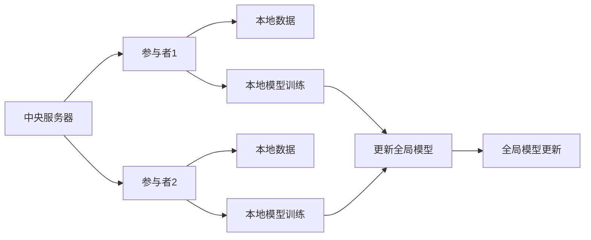
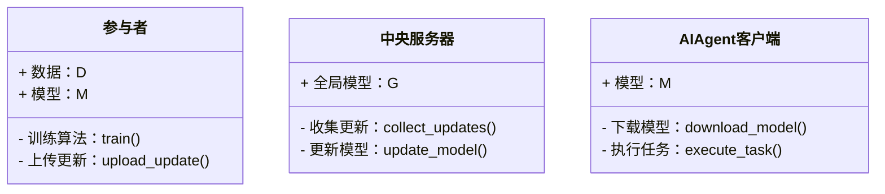
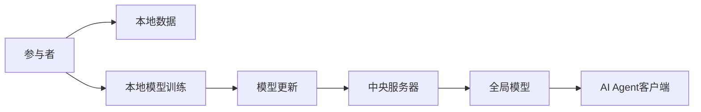
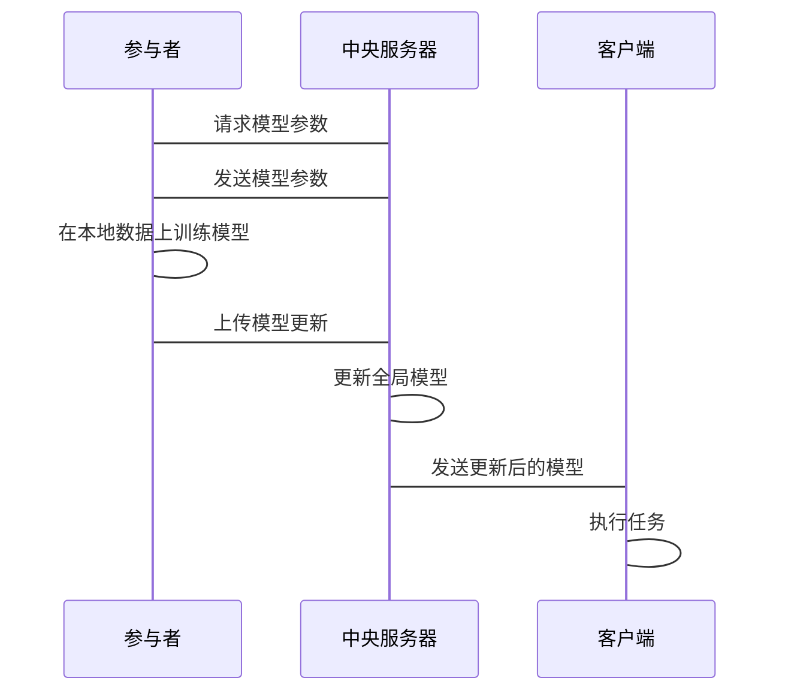

                 


# 开发AI Agent的隐私保护联邦学习框架

> 关键词：AI Agent, 隐私保护, 联邦学习, 数据安全, 机器学习, 分布式计算

> 摘要：本文深入探讨了在AI Agent开发中如何构建隐私保护的联邦学习框架。通过分析联邦学习的基本原理、隐私保护技术、算法实现和系统架构，本文为开发者提供了从理论到实践的全面指导，帮助他们在保护数据隐私的同时，高效地进行模型训练和应用开发。

---

# 第1章: AI Agent与隐私保护概述

## 1.1 AI Agent的基本概念

### 1.1.1 AI Agent的定义与特点

AI Agent（人工智能代理）是一种能够感知环境、自主决策并执行任务的智能实体。它具备以下特点：

- **自主性**：能够在没有外部干预的情况下独立运行。
- **反应性**：能够根据环境变化调整行为。
- **目标导向**：通常具有明确的目标，旨在优化特定任务的性能。

### 1.1.2 AI Agent的应用场景

AI Agent广泛应用于多个领域，包括：

- **自动驾驶**：如自动驾驶汽车中的路径规划和决策系统。
- **智能助手**：如Siri、Alexa等语音助手。
- **推荐系统**：根据用户行为推荐个性化内容。

### 1.1.3 AI Agent与传统AI的区别

AI Agent与传统AI的区别主要体现在自主性和适应性上。AI Agent能够动态适应环境变化，而传统AI系统通常需要人工干预来调整。

---

## 1.2 隐私保护的重要性

### 1.2.1 隐私保护的定义与原则

隐私保护是指在数据处理过程中，保护个人隐私不被未经授权的访问或泄露。其核心原则包括：

- **最小化原则**：仅收集实现目标所需的最小数据。
- **目的限制原则**：数据仅用于特定目的，不得随意改变用途。
- **透明原则**：用户应被告知数据的收集和使用方式。

### 1.2.2 数据泄露的风险与影响

数据泄露可能导致以下后果：

- **身份盗窃**：攻击者利用泄露的信息进行身份盗窃。
- **财务损失**：企业因数据泄露可能面临罚款和信任损失。
- **声誉损害**：个人或企业的声誉可能因数据泄露而受损。

### 1.2.3 隐私保护在AI Agent中的挑战

AI Agent通常需要处理敏感数据，如用户的地理位置、行为习惯等。如何在执行任务的同时保护这些数据的隐私，是开发AI Agent面临的重要挑战。

---

## 1.3 联邦学习框架的背景

### 1.3.1 联邦学习的定义与特点

联邦学习（Federated Learning）是一种分布式机器学习技术，允许多个参与方在不共享原始数据的情况下共同训练模型。其特点包括：

- **数据本地化**：数据保留在原始设备或服务器，不进行集中共享。
- **隐私保护**：通过加密和隐私计算技术保护数据隐私。
- **协作学习**：多个参与方协作训练共享模型。

### 1.3.2 联邦学习的应用场景

联邦学习适用于以下场景：

- **移动设备上的模型训练**：如手机上的智能助手。
- **医疗数据共享**：多个医院协作训练医疗模型，同时保护患者隐私。
- **推荐系统**：多个平台协作训练推荐模型。

### 1.3.3 联邦学习与传统机器学习的区别

传统的机器学习需要将所有数据集中到一个中心服务器进行训练，而联邦学习则通过分布式计算实现模型训练，避免了数据的集中存储和传输。

---

# 第2章: 联邦学习框架的核心概念

## 2.1 联邦学习的原理

### 2.1.1 联邦学习的基本流程

Mermaid图示：



### 2.1.2 联邦学习的通信机制

联邦学习通过安全的通信协议，确保数据在传输过程中不被窃取或篡改。

### 2.1.3 联邦学习的同步策略

模型更新可以通过同步或异步方式完成。同步方式确保所有参与者使用相同的模型版本，异步方式则允许参与者独立更新模型。

## 2.2 联邦学习的组成部分

### 2.2.1 数据提供者角色

数据提供者负责提供训练数据，并在本地进行模型训练。

### 2.2.2 中心服务器角色

中心服务器负责协调模型训练过程，接收各参与者的模型更新。

### 2.2.3 客户端角色

客户端是实际使用AI Agent的设备或应用程序，负责执行任务和模型训练。

## 2.3 联邦学习与隐私保护的关系

### 2.3.1 联邦学习如何实现数据隐私

通过加密技术和隐私计算，联邦学习能够在不暴露原始数据的情况下完成模型训练。

### 2.3.2 联邦学习中的数据安全挑战

主要挑战包括防止数据被篡改、保护模型免受攻击以及确保通信过程的安全性。

### 2.3.3 联邦学习的隐私保护技术

包括数据加密、数据匿名化和安全多方计算等技术。

---

# 第3章: 隐私保护技术在联邦学习中的应用

## 3.1 数据加密技术

### 3.1.1 加密数据的传输与存储

使用加密算法对数据进行加密，确保数据在传输和存储过程中的安全性。

### 3.1.2 加密数据的计算与解密

通过同态加密等技术，允许在加密状态下进行数据计算，而无需解密。

### 3.1.3 常见的加密算法在联邦学习中的应用

- **同态加密**：允许在加密数据上进行计算，保护数据隐私。
- **区块链加密**：用于确保数据的完整性和不可篡改性。

## 3.2 数据匿名化技术

### 3.2.1 数据匿名化的定义与方法

数据匿名化是指通过技术手段去除或变形数据中的敏感信息，使其无法被还原到具体个人。

### 3.2.2 数据匿名化在联邦学习中的实现

通过匿名化处理，确保数据在训练过程中无法被用来推断个人身份。

### 3.2.3 数据匿名化的优缺点分析

- **优点**：保护个人隐私，减少数据泄露风险。
- **缺点**：可能影响模型的准确性，匿名化处理需要额外的计算资源。

## 3.3 安全多方计算

### 3.3.1 安全多方计算的定义与原理

安全多方计算（Secure Multi-Party Computation, SMPC）是指在多个参与方之间进行计算，确保每个参与方只能看到与其任务相关的结果，而无法获取其他方的数据。

### 3.3.2 安全多方计算在联邦学习中的应用

通过SMPC技术，多个参与者可以在不共享原始数据的情况下共同训练模型。

### 3.3.3 安全多方计算的实现挑战

- **通信开销**：需要多次通信来完成计算，增加了网络负担。
- **计算复杂度**：SMPC涉及复杂的协议和计算步骤。

---

# 第4章: 联邦学习的算法原理

## 4.1 联邦学习的基本算法

### 4.1.1 联邦平均算法（FedAvg）

FedAvg算法是最常用的联邦学习算法之一。其基本思想是每个参与者在本地数据上训练模型，并将模型参数的更新量上传到中央服务器。中央服务器将所有参与者的更新进行平均，得到新的全局模型。

### 4.1.2 联邦直推算法（FedProx）

FedProx算法是对FedAvg的一种改进，通过引入正则化项，防止模型更新过程中出现偏差。

### 4.1.3 联邦学习的优化策略

包括动量优化、自适应学习率等策略，用于提高模型训练的效率和准确性。

## 4.2 联邦学习的数学模型

### 4.2.1 联邦学习的参数更新公式

$$\theta_{t+1} = \frac{1}{K} \sum_{i=1}^{K} \theta_i^{(t)}$$

其中，$\theta_{t+1}$ 表示全局模型参数，$K$ 表示参与者的数量，$\theta_i^{(t)}$ 表示第 $i$ 个参与者的模型参数。

### 4.2.2 联邦学习的损失函数

$$\mathcal{L}(\theta) = \sum_{i=1}^{K} \mathcal{L}_i(\theta_i, \theta)$$

其中，$\mathcal{L}_i$ 表示第 $i$ 个参与者的损失函数。

### 4.2.3 联邦学习的收敛性分析

通过数学证明，联邦学习算法在满足一定条件下可以收敛到全局最优解。

---

# 第5章: 联邦学习框架的系统架构设计

## 5.1 系统场景介绍

### 5.1.1 系统目标

通过联邦学习框架实现多个参与者协作训练AI Agent模型，同时保护数据隐私。

### 5.1.2 系统参与方

包括数据提供者、中央服务器和AI Agent客户端。

## 5.2 系统功能设计

### 5.2.1 领域模型设计

Mermaid类图：



### 5.2.2 系统架构设计

Mermaid架构图：



### 5.2.3 系统接口设计

包括参与者与中央服务器之间的接口，以及客户端与中央服务器之间的接口。

### 5.2.4 系统交互流程

Mermaid序列图：



---

# 第6章: 项目实战

## 6.1 环境安装

安装必要的依赖，如Python、TensorFlow、Flask等。

## 6.2 核心代码实现

### 6.2.1 参与者的训练代码

```python
def train_local_model():
    # 加载本地数据
    data = load_data()
    # 初始化模型
    model = get_model()
    # 编译模型
    model.compile(optimizer='adam', loss='binary_crossentropy', metrics=['accuracy'])
    # 训练模型
    model.fit(data.x, data.y, epochs=10, batch_size=32)
    # 获取模型更新
    weights = get_weights(model)
    return weights
```

### 6.2.2 中央服务器的更新代码

```python
def update_global_model(participant_weights):
    # 计算全局模型参数
    global_weights = average_weights(participant_weights)
    # 更新模型
    set_weights(global_model, global_weights)
    return global_weights
```

### 6.2.3 客户端的下载和执行代码

```python
def execute_task():
    # 下载全局模型
    global_weights = download_model()
    # 加载本地数据
    data = load_data()
    # 初始化模型
    model = get_model()
    # 设置模型权重
    set_weights(model, global_weights)
    # 执行任务
    result = model.predict(data)
    return result
```

## 6.3 代码解读与分析

### 6.3.1 参与者的训练代码解读

上述代码展示了如何在本地数据上训练模型，并将模型权重上传到中央服务器。训练过程中使用了Adam优化器和二进制交叉熵损失函数。

### 6.3.2 中央服务器的更新代码解读

中央服务器接收所有参与者的模型权重，计算全局模型的平均权重，并更新全局模型。

### 6.3.3 客户端的下载和执行代码解读

客户端从中央服务器下载全局模型，并在本地数据上执行任务。

## 6.4 实际案例分析

### 6.4.1 案例背景

假设我们有多个参与者，每个参与者都有自己的本地数据集。我们需要在不共享数据的情况下训练一个全局分类模型。

### 6.4.2 案例实现步骤

1. **环境安装**：安装必要的Python库和框架。
2. **数据准备**：为每个参与者准备本地数据集。
3. **模型训练**：每个参与者在本地数据上训练模型，并上传模型权重。
4. **模型更新**：中央服务器接收所有参与者的模型权重，计算全局模型。
5. **任务执行**：客户端下载全局模型，并在本地数据上执行任务。

### 6.4.3 案例结果分析

通过联邦学习框架，我们能够在不共享数据的情况下训练出一个高性能的全局模型，同时保护每个参与者的数据隐私。

---

# 第7章: 最佳实践与注意事项

## 7.1 开发中的注意事项

- **数据安全**：确保数据在传输和存储过程中的安全性。
- **模型鲁棒性**：确保模型对数据分布的变化具有鲁棒性。
- **性能优化**：优化模型训练和通信的效率。

## 7.2 小结

通过本文的介绍，读者可以了解如何开发AI Agent的隐私保护联邦学习框架，掌握其核心概念、算法原理和系统架构设计。同时，通过实际案例分析，读者可以进一步理解如何将理论应用于实践。

## 7.3 注意事项

- **数据隐私**：在实际应用中，需要遵守相关法律法规，确保数据隐私合规。
- **通信安全**：确保联邦学习框架中的通信过程安全，防止数据被窃取或篡改。
- **模型更新**：定期更新模型，确保模型的准确性和鲁棒性。

## 7.4 拓展阅读

建议读者进一步阅读以下内容：

- **联邦学习的最新研究**：了解联邦学习领域的最新研究成果。
- **隐私保护技术的深入探讨**：学习更多隐私保护技术，如差分隐私、同态加密等。
- **实际应用案例**：研究联邦学习在实际应用中的成功案例，学习如何将理论应用于实践。

---

# 作者

作者：AI天才研究院/AI Genius Institute & 禅与计算机程序设计艺术 /Zen And The Art of Computer Programming

---

以上是《开发AI Agent的隐私保护联邦学习框架》的技术博客文章的完整内容，涵盖了从背景介绍到系统架构设计再到项目实战的各个方面，为读者提供了全面的指导。

