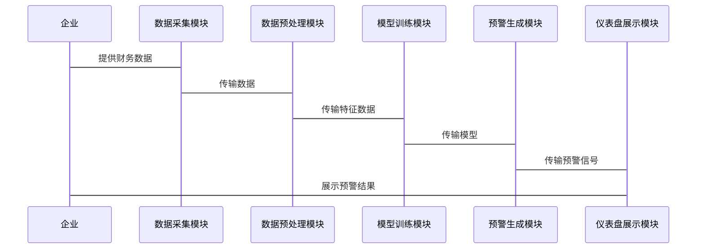

                 


# 开发AI辅助的企业财务风险预警仪表盘

> 关键词：企业财务风险，AI辅助，财务风险预警，机器学习，仪表盘开发

> 摘要：本文将详细探讨如何开发一个基于AI辅助的企业财务风险预警仪表盘。通过分析财务数据，利用机器学习算法，构建高效的财务风险预警系统，帮助企业在潜在风险发生前及时采取措施，保障财务安全。本文从背景介绍、核心算法、系统架构到项目实战，全面解析开发过程，并提供实际案例和代码示例。

---

## 第一部分: 企业财务风险预警仪表盘背景与概述

### 第1章: 财务风险预警系统概述

#### 1.1 财务风险预警的定义与重要性

##### 1.1.1 财务风险的基本概念
财务风险是指企业在经营过程中，由于内外部环境的变化，可能导致财务状况恶化或财务目标无法实现的可能性。常见的财务风险包括流动性风险、偿债风险和运营风险。

##### 1.1.2 财务风险预警的定义
财务风险预警是指通过分析企业的财务数据，预测潜在的财务风险，并提前发出警示信号，帮助企业采取应对措施。这种预警机制能够有效降低财务风险的发生概率和影响程度。

##### 1.1.3 财务风险预警的重要性
- **降低损失**：通过提前预警，企业可以在风险发生前采取措施，减少潜在损失。
- **提升决策效率**：财务风险预警系统能够快速分析大量数据，为企业管理者提供决策支持。
- **优化资源配置**：预警系统能够帮助企业合理分配资源，避免因财务问题导致的资源浪费。

#### 1.2 企业财务风险的主要类型

##### 1.2.1 财务流动性风险
流动性风险是指企业在短时间内无法将资产转化为现金，以偿还债务或满足其他资金需求的风险。例如，企业的库存积压或应收账款 overdue 可能导致流动性风险。

##### 1.2.2 财务偿债风险
偿债风险是指企业无法按时偿还债务，导致信用评级下降或面临破产的风险。这种情况通常与企业的负债结构和还款能力密切相关。

##### 1.2.3 财务运营风险
运营风险是指企业在日常运营中因管理不善或外部环境变化导致的财务风险。例如，原材料价格上涨、市场需求下降等都可能影响企业的盈利能力。

#### 1.3 AI在财务风险预警中的作用

##### 1.3.1 AI技术在财务分析中的优势
- **高效性**：AI能够快速处理海量数据，提高分析效率。
- **准确性**：通过机器学习算法，AI能够发现数据中的潜在规律，提高预警的准确性。
- **实时性**：AI系统可以实时监控企业的财务数据，及时发出预警信号。

##### 1.3.2 AI如何提升财务风险预警的准确性
通过机器学习算法，AI能够从历史数据中学习，识别出影响财务风险的关键因素，并预测未来可能出现的财务问题。例如，使用逻辑回归或随机森林算法对企业的财务状况进行分类，预测其是否可能面临偿债风险。

##### 1.3.3 AI在财务风险预警中的应用场景
- **实时监控**：通过AI系统实时监控企业的财务数据，及时发现潜在风险。
- **数据挖掘**：利用AI技术从历史数据中挖掘潜在规律，识别影响财务风险的关键因素。
- **决策支持**：基于AI分析结果，为企业管理者提供决策支持，优化资源配置。

### 第2章: AI辅助的企业财务风险预警系统的核心概念

#### 2.1 企业财务数据的特征与分类

##### 2.1.1 财务数据的来源与类型
- **来源**：企业的财务数据通常来源于会计系统、银行对账单、税务报表等。
- **类型**：包括收入、支出、资产、负债、利润等财务指标。

##### 2.1.2 财务数据的预处理方法
- **数据清洗**：去除重复数据、处理缺失值、纠正错误数据。
- **数据转换**：将数据转换为适合机器学习算法的格式，例如标准化、归一化。
- **数据特征提取**：从原始数据中提取有用的特征，例如将销售额、利润等指标作为模型的输入特征。

##### 2.1.3 财务数据的特征提取
- **特征选择**：通过统计分析或机器学习方法，选择对财务风险影响较大的特征。
- **特征工程**：对特征进行变换或组合，以提高模型的性能。

#### 2.2 财务风险预警模型的构建与评估

##### 2.2.1 模型构建的基本步骤
1. **数据收集**：收集企业的财务数据，包括收入、支出、资产、负债等。
2. **数据预处理**：对数据进行清洗、转换和特征提取。
3. **模型训练**：使用机器学习算法训练模型，例如逻辑回归、随机森林等。
4. **模型评估**：通过交叉验证、准确率、召回率等指标评估模型的性能。
5. **模型优化**：调整模型参数，选择最优模型。

##### 2.2.2 模型评估的指标与方法
- **准确率**：模型正确预测的样本数占总样本数的比例。
- **召回率**：模型正确预测的正类样本数占所有正类样本的比例。
- **F1分数**：综合准确率和召回率的调和平均数。
- **AUC曲线**：评估模型在不同阈值下的性能。

##### 2.2.3 模型优化与调优
- **参数调整**：通过网格搜索或随机搜索方法，找到最优的模型参数。
- **特征选择**：通过逐步特征选择方法，去除对模型性能影响较小的特征。
- **模型集成**：使用集成学习方法，如随机森林、梯度提升树等，提高模型的性能。

#### 2.3 AI算法在财务风险预警中的应用

##### 2.3.1 逻辑回归算法
- **基本原理**：逻辑回归是一种用于分类的统计方法，通过logit函数将线性组合映射到概率空间。
- **数学模型**：$$ P(y=1|x) = \frac{e^{\beta_0 + \beta_1x_1 + \cdots + \beta_kx_k}}{1 + e^{\beta_0 + \beta_1x_1 + \cdots + \beta_kx_k}} $$
- **应用**：适用于二分类问题，如判断企业是否面临偿债风险。

##### 2.3.2 支持向量机算法
- **基本原理**：支持向量机通过找到一个超平面，将数据点分成两类，使得两类之间的距离最大化。
- **数学模型**：$$ \text{min} \frac{1}{2} \sum_{i=1}^n \alpha_i^2 \quad \text{subject to} \quad y_i(\omega \cdot x_i + b) \geq 1 - \xi_i \quad \text{and} \quad \xi_i \geq 0 $$
- **应用**：适用于非线性分类问题，通过核函数可以处理复杂的特征空间。

##### 2.3.3 随机森林算法
- **基本原理**：随机森林是一种基于树的集成学习方法，通过随机选择特征和样本，构建多棵决策树，并取其平均或多数结果。
- **数学模型**：$$ y = \text{sign}(\sum_{i=1}^n \text{weight}_i \cdot \text{tree}_i(x)) $$
- **应用**：适用于高维数据的分类和回归问题，具有较强的抗过拟合能力。

##### 2.3.4 神经网络算法
- **基本原理**：神经网络通过多层感知机模拟人脑的神经网络结构，通过反向传播算法更新权重，最小化损失函数。
- **数学模型**：$$ y = \sigma(w_2 \cdot \sigma(w_1 \cdot x + b_1) + b_2) $$
- **应用**：适用于复杂的非线性分类和回归问题，如金融时间序列预测。

---

## 第二部分: AI辅助财务风险预警的核心算法与数学模型

### 第3章: 逻辑回归算法原理与应用

#### 3.1 逻辑回归的基本原理

##### 3.1.1 逻辑回归的数学模型
$$ P(y=1|x) = \frac{e^{\beta_0 + \beta_1x_1 + \cdots + \beta_kx_k}}{1 + e^{\beta_0 + \beta_1x_1 + \cdots + \beta_kx_k}} $$

##### 3.1.2 逻辑回归的损失函数
$$ \text{损失函数} = -\sum_{i=1}^n y_i \ln(p_i) + (1 - y_i) \ln(1 - p_i) $$

##### 3.1.3 逻辑回归的优化方法
- **梯度下降**：通过计算损失函数的梯度，更新模型参数，最小化损失函数。
- **L2正则化**：在损失函数中添加L2正则化项，防止模型过拟合。

#### 3.2 逻辑回归在财务风险预警中的应用

##### 3.2.1 数据特征的选择与处理
- **特征选择**：选择对企业财务风险影响较大的特征，例如收入增长率、资产负债率等。
- **特征处理**：对特征进行标准化或归一化处理，确保模型训练的稳定性。

##### 3.2.2 模型训练与验证
- **训练数据**：使用企业的历史财务数据进行模型训练。
- **验证数据**：通过交叉验证评估模型的性能，调整模型参数。

##### 3.2.3 模型评估与调优
- **评估指标**：准确率、召回率、F1分数等。
- **调优方法**：通过网格搜索调整模型参数，例如学习率、正则化系数等。

### 第4章: 支持向量机算法原理与应用

#### 4.1 支持向量机的基本原理

##### 4.1.1 支持向量机的数学模型
$$ \text{min} \frac{1}{2} \sum_{i=1}^n \alpha_i^2 \quad \text{subject to} \quad y_i(\omega \cdot x_i + b) \geq 1 - \xi_i \quad \text{and} \quad \xi_i \geq 0 $$

##### 4.1.2 核函数的作用与选择
- **核函数**：将低维数据映射到高维空间，处理非线性分类问题。
- **常用核函数**：线性核、多项式核、径向基函数（RBF）核、sigmoid核等。

##### 4.1.3 支持向量机的优化方法
- **序列最小化算法（SMO）**：通过分解问题，逐步优化模型参数。
- **LIBSVM工具包**：常用的SVM实现工具，支持多种核函数和参数设置。

#### 4.2 支持向量机在财务风险预警中的应用

##### 4.2.1 数据特征的非线性分类
- **应用场景**：当财务风险与特征之间的关系复杂且非线性时，SVM能够提供更好的分类效果。
- **实现步骤**：选择适当的核函数，训练SVM模型，评估模型性能。

##### 4.2.2 模型训练与验证
- **训练数据**：使用企业的历史财务数据进行模型训练。
- **验证数据**：通过交叉验证评估模型的性能，调整模型参数。

##### 4.2.3 模型评估与调优
- **评估指标**：准确率、召回率、F1分数等。
- **调优方法**：通过网格搜索调整模型参数，例如核函数参数、C参数等。

### 第5章: 随机森林算法原理与应用

#### 5.1 随机森林的基本原理

##### 5.1.1 随机森林的数学模型
$$ y = \text{sign}(\sum_{i=1}^n \text{weight}_i \cdot \text{tree}_i(x)) $$

##### 5.1.2 随机森林的优化方法
- **特征选择**：随机选择部分特征进行决策树的构建，避免特征冗余。
- **样本选择**：通过随机抽样方法，构建多棵决策树，提高模型的泛化能力。

##### 5.1.3 随机森林的集成学习
- **集成学习**：通过集成多棵决策树的结果，提高模型的准确率和稳定性。

#### 5.2 随机森林在财务风险预警中的应用

##### 5.2.1 数据特征的随机选择
- **应用场景**：当财务数据维度较高时，随机选择特征可以有效减少计算复杂度。
- **实现步骤**：在每棵决策树的构建过程中，随机选择部分特征。

##### 5.2.2 模型训练与验证
- **训练数据**：使用企业的历史财务数据进行模型训练。
- **验证数据**：通过交叉验证评估模型的性能，调整模型参数。

##### 5.2.3 模型评估与调优
- **评估指标**：准确率、召回率、F1分数等。
- **调优方法**：通过网格搜索调整模型参数，例如决策树的深度、特征选择的随机比例等。

---

## 第三部分: 企业财务风险预警仪表盘的系统架构与实现

### 第6章: 系统架构设计

#### 6.1 系统模块划分

##### 6.1.1 数据采集模块
- **功能**：从企业的财务系统中采集财务数据，例如收入、支出、资产、负债等。
- **实现**：通过API接口或数据库连接，获取实时财务数据。

##### 6.1.2 数据预处理模块
- **功能**：对采集到的财务数据进行清洗、转换和特征提取。
- **实现**：使用Python的pandas库进行数据处理，例如处理缺失值、去除异常值。

##### 6.1.3 模型训练模块
- **功能**：基于预处理后的财务数据，训练机器学习模型，例如逻辑回归、随机森林等。
- **实现**：使用scikit-learn库进行模型训练，调整模型参数，优化模型性能。

##### 6.1.4 预警生成模块
- **功能**：根据训练好的模型，预测企业的财务风险，并生成预警信号。
- **实现**：基于模型的预测结果，设置预警阈值，当预测概率超过阈值时，触发预警信号。

##### 6.1.5 仪表盘展示模块
- **功能**：将预警结果和财务数据可视化展示，方便企业管理者查看和分析。
- **实现**：使用Django或Flask框架开发Web界面，结合前端技术如D3.js或ECharts进行数据可视化。

#### 6.2 系统架构图

##### 6.2.1 系统架构的ER实体关系图


##### 6.2.2 系统交互的序列图


### 第7章: 项目实战与代码实现

#### 7.1 项目环境搭建

##### 7.1.1 安装Python环境
- 使用Anaconda安装Python 3.8及以上版本。
- 安装必要的Python库，例如pandas、numpy、scikit-learn、Django或Flask框架。

##### 7.1.2 数据采集与处理
- 使用pandas库读取企业的财务数据，例如从Excel文件或数据库中读取数据。
- 处理缺失值、异常值，提取特征。

##### 7.1.3 模型训练与评估
- 使用scikit-learn库训练逻辑回归、随机森林等模型。
- 通过交叉验证评估模型性能，调整模型参数。

#### 7.2 核心代码实现

##### 7.2.1 数据预处理代码
```python
import pandas as pd
import numpy as np

# 读取数据
data = pd.read_csv('financial_data.csv')

# 处理缺失值
data = data.dropna()

# 标准化处理
from sklearn.preprocessing import StandardScaler
scaler = StandardScaler()
scaled_data = scaler.fit_transform(data)
```

##### 7.2.2 模型训练代码
```python
from sklearn.ensemble import RandomForestClassifier
from sklearn.model_selection import train_test_split

# 划分训练集和测试集
X_train, X_test, y_train, y_test = train_test_split(scaled_data, data['target'], test_size=0.2, random_state=42)

# 训练模型
model = RandomForestClassifier(n_estimators=100, max_depth=10, random_state=42)
model.fit(X_train, y_train)

# 模型评估
print(f'Accuracy: {model.score(X_test, y_test)}')
print(f'Precision: {precision_score(y_test, model.predict(X_test))}')
print(f'Recall: {recall_score(y_test, model.predict(X_test))}')
```

##### 7.2.3 仪表盘展示代码
```python
from django.shortcuts import render
from django.http import HttpResponse

def dashboard(request):
    # 获取预警结果
    warning_signals = get_warning_signals()
    
    # 渲染仪表盘
    return render(request, 'dashboard.html', {'warnings': warning_signals})
```

#### 7.3 实际案例分析与结果解读

##### 7.3.1 案例背景
某制造企业面临销售额下降、应收账款增加的问题，可能存在流动性风险。

##### 7.3.2 数据分析
- 销售额同比下降10%
- 应收账款周转率下降5%
- 负债率上升8%

##### 7.3.3 模型预测
- 模型预测企业存在较高的流动性风险，触发预警信号。

##### 7.3.4 结果解读
- 企业应优化应收账款管理，加快资金回笼，降低流动性风险。

#### 7.4 项目小结

##### 7.4.1 项目总结
通过AI技术，企业能够快速识别潜在的财务风险，提前采取应对措施，保障财务安全。

##### 7.4.2 经验与教训
- 数据质量对模型性能影响较大，需重视数据预处理。
- 模型选择需结合实际业务需求，选择合适的算法。
- 仪表盘设计需注重用户体验，确保预警信息的清晰展示。

---

## 第四部分: 最佳实践与总结

### 第8章: 最佳实践与注意事项

#### 8.1 最佳实践

##### 8.1.1 数据处理
- 确保数据的完整性和准确性，避免因数据问题导致模型性能下降。
- 对特征进行合理的工程化处理，例如标准化、归一化等。

##### 8.1.2 模型选择
- 根据业务需求和数据特点选择合适的算法，例如逻辑回归适用于二分类问题，随机森林适用于高维数据。
- 使用集成学习方法，如投票法或加权法，进一步提高模型性能。

##### 8.1.3 系统设计
- 设计模块化的系统架构，方便后续的扩展和维护。
- 确保系统的可扩展性和可维护性，例如采用微服务架构。

#### 8.2 注意事项

##### 8.2.1 数据隐私与安全
- 在数据采集和处理过程中，需遵守相关法律法规，保护企业数据隐私。
- 对敏感数据进行加密处理，确保数据安全。

##### 8.2.2 模型解释性
- 在实际应用中，需关注模型的解释性，避免因“黑箱”问题导致决策困难。
- 使用特征重要性分析等方法，解释模型的预测结果。

##### 8.2.3 系统性能优化
- 优化系统运行效率，例如通过并行计算、分布式处理等方法。
- 定期更新模型，确保模型的准确性和及时性。

### 第9章: 总结与展望

#### 9.1 总结
本文详细介绍了如何开发一个基于AI辅助的企业财务风险预警仪表盘，从背景介绍、核心算法、系统架构到项目实战，全面解析了开发过程。通过机器学习算法，企业能够快速识别潜在的财务风险，提前采取应对措施，保障财务安全。

#### 9.2 展望
随着AI技术的不断发展，财务风险预警系统将更加智能化和自动化。未来，可以通过引入自然语言处理技术，分析企业财务报告中的文本信息，进一步提高预警的准确性。同时，结合区块链技术，确保数据的安全性和不可篡改性，为企业提供更加可靠的预警服务。

---

## 作者：AI天才研究院/AI Genius Institute & 禅与计算机程序设计艺术 /Zen And The Art of Computer Programming

---

以上是《开发AI辅助的企业财务风险预警仪表盘》的完整目录大纲和文章内容。

