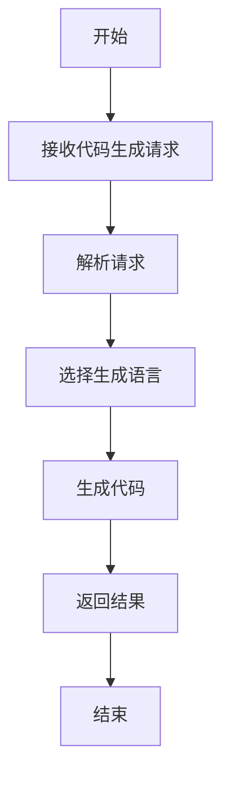
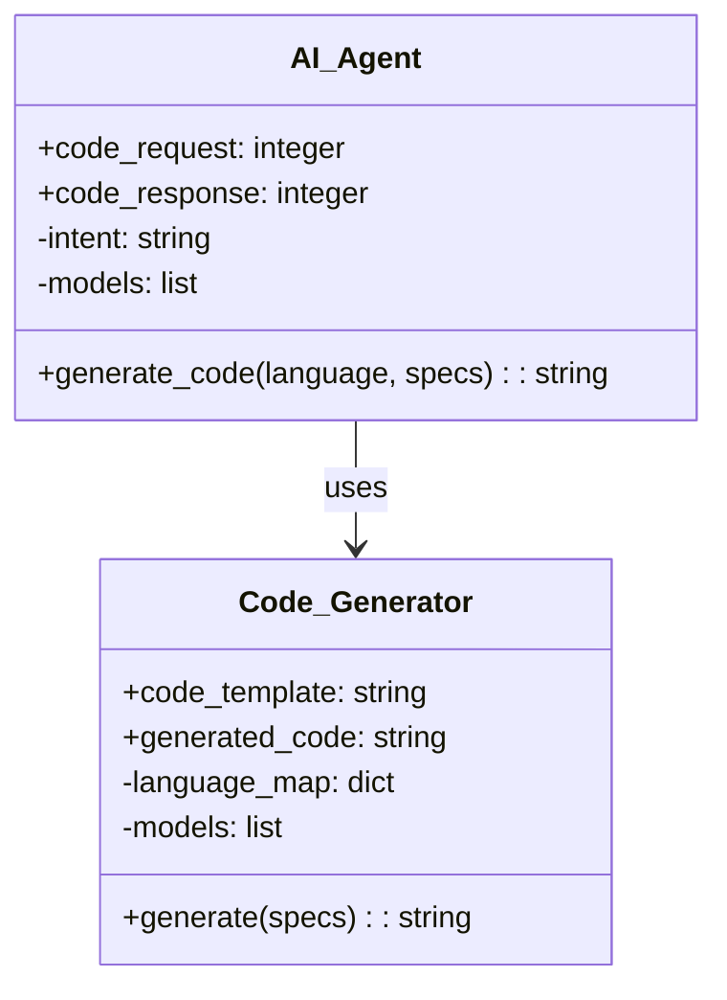
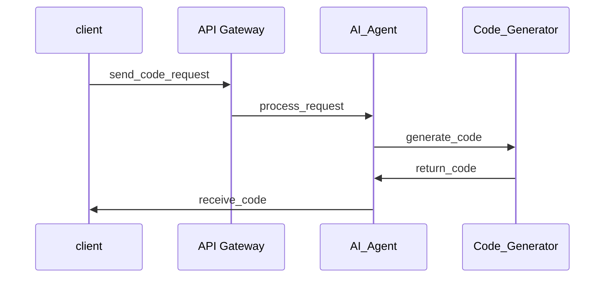

                 


---

# 开发具有多语言代码生成能力的AI Agent

---

## 关键词：
- AI Agent
- 多语言代码生成
- 人工智能
- 代码生成器
- 系统架构
- 机器学习

---

## 摘要：
本文深入探讨了如何开发具有多语言代码生成能力的AI Agent。首先，我们介绍了AI Agent的核心概念及其在软件开发中的作用。接着，详细分析了多语言代码生成的背景与挑战，并阐述了AI Agent与代码生成器之间的关系。随后，我们从算法原理、系统架构设计、项目实战等多个维度，详细讲解了如何构建这样一个AI Agent。最后，我们总结了当前的技术成果，并展望了未来的发展方向，为读者提供了全面的技术指导和实践指南。

---

## 目录大纲

### 第1章：背景介绍

#### 1.1 AI Agent的核心概念
- 1.1.1 AI Agent的定义与特点
- 1.1.2 多语言代码生成的背景与意义
- 1.1.3 AI Agent在软件开发中的作用

#### 1.2 多语言代码生成的背景与问题
- 1.2.1 软件开发中的代码生成现状
- 1.2.2 多语言代码生成的挑战
- 1.2.3 AI在代码生成中的优势

### 第2章：AI Agent与代码生成器的关系

#### 2.1 核心概念原理
- 2.1.1 AI Agent的决策机制
- 2.1.2 代码生成器的模型结构
- 2.1.3 两者结合的实现原理

#### 2.2 概念属性特征对比
- 2.2.1 AI Agent的属性分析
- 2.2.2 代码生成器的属性分析
- 2.2.3 对比分析表

#### 2.3 ER实体关系图
```mermaid
erDiagram
    actor(AI Agent) {
        code_request : integer
        code_response : integer
    }
    code_generator {
        code_template : string
        generated_code : string
    }
    AI_Agent --> code_generator : triggers
    code_generator --> AI_Agent : returns
```

### 第3章：多语言代码生成算法

#### 3.1 算法流程


#### 3.2 算法实现
```python
def generate_code(request):
    # 解析请求
    language = request['language']
    specs = request['specs']
    
    # 根据语言选择模型
    model = get_model(language)
    
    # 生成代码
    generated_code = model.generate(specs)
    
    return generated_code
```

#### 3.3 数学模型与公式
- 损失函数：$$ L = -\sum_{i=1}^{n} y_i \log(p(y_i)) $$
- 优化方法：$$ \theta = \theta - \eta \frac{\partial L}{\partial \theta} $$

### 第4章：系统分析与架构设计

#### 4.1 问题场景介绍
- 代码生成需求分析
- 系统功能设计

#### 4.2 领域模型设计


#### 4.3 系统架构设计


#### 4.4 系统接口设计


### 第5章：项目实战

#### 5.1 环境配置
- 安装必要的库：numpy、tensorflow、keras等

#### 5.2 核心实现
```python
def train_model():
    # 加载数据
    data = load_dataset()
    
    # 构建模型
    model = build_model()
    
    # 编译模型
    model.compile(optimizer='adam', loss='sparse_categorical_crossentropy', metrics=['accuracy'])
    
    # 训练模型
    model.fit(data, epochs=10, batch_size=32)
    
    return model
```

#### 5.3 测试与优化
- 单元测试
- 性能优化

### 第6章：总结与展望

#### 6.1 技术成果总结
- 本文的主要贡献
- 技术实现的亮点

#### 6.2 未来展望
- 新兴技术的影响
- 可能的改进方向

#### 6.3 最佳实践与注意事项
- 开发过程中的经验教训
- 使用AI Agent时的注意事项

---

## 作者：AI天才研究院/AI Genius Institute & 禅与计算机程序设计艺术 /Zen And The Art of Computer Programming

