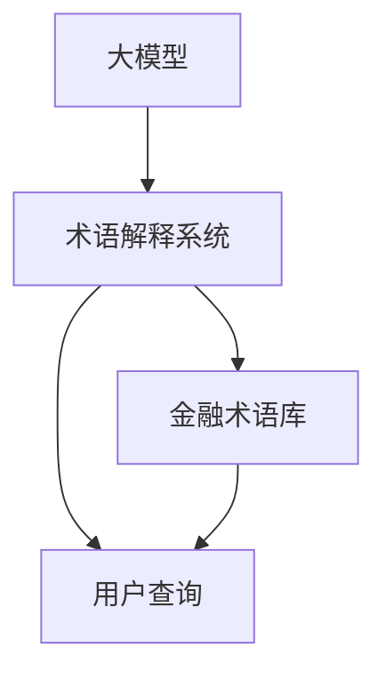
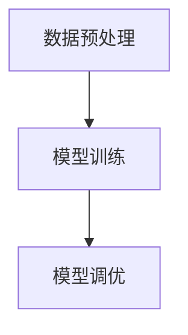
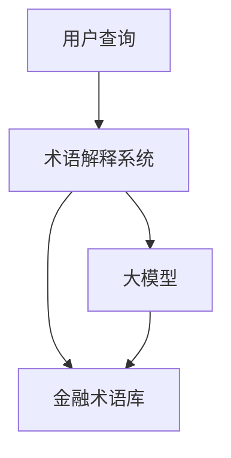

                 


# 开发基于大模型的金融专业术语解释系统

> 关键词：大模型，金融术语，自然语言处理，系统开发，机器学习

> 摘要：本文详细探讨了开发基于大模型的金融专业术语解释系统的核心概念、算法原理、系统架构及实现细节。通过分析金融术语解释的需求场景，结合大模型的技术优势，提出了系统的开发目标和实现路径。文章从理论到实践，系统性地介绍了如何利用大模型技术构建高效的金融术语解释系统，并通过具体案例展示了系统的应用场景和实际价值。

---

## 第一部分: 背景介绍

### 第1章: 问题背景

#### 1.1 金融行业术语的复杂性
金融行业术语具有高度的专业性和复杂性，通常需要深厚的知识背景才能准确理解。例如，“久期”（Duration）和“凸性”（Convexity）是金融衍生品中的重要概念，但它们的解释往往需要结合数学模型和金融市场知识。这种复杂性使得普通用户难以快速理解这些术语。

#### 1.2 传统术语解释系统的问题
传统的术语解释系统通常依赖于固定的知识库和规则引擎，存在以下问题：
- **知识更新滞后**：金融市场变化快，术语更新频繁，传统系统难以及时更新。
- **解释不够精准**：基于规则的系统难以应对复杂术语的多义性和上下文依赖性。
- **用户体验不佳**：传统系统通常缺乏互动性，用户无法根据上下文获得动态解释。

#### 1.3 大模型在金融术语解释中的优势
大模型（如GPT-3、PaLM等）在自然语言处理领域表现出色，具有以下优势：
- **强大的上下文理解能力**：能够根据上下文提供更精准的解释。
- **自适应学习能力**：可以通过微调适应金融领域的特定需求。
- **动态更新能力**：通过持续学习，可以实时更新对术语的理解。

### 第2章: 问题描述

#### 2.1 金融术语解释的需求场景
金融术语解释的需求场景包括：
- **投资者教育**：帮助普通投资者理解复杂的金融概念。
- **金融分析工具**：辅助分析师快速理解术语的含义。
- **风险管理**：通过准确理解术语，降低因误解导致的风险。

#### 2.2 用户对术语解释的核心需求
用户对术语解释的核心需求包括：
- **准确性**：解释必须准确无误。
- **简洁性**：解释要简明扼要，避免冗长。
- **相关性**：解释要与上下文相关，避免脱离实际场景。

#### 2.3 系统目标与边界
系统目标：
- 提供准确、简洁的金融术语解释。
- 支持多种输入形式（文本、语音等）。
- 提供交互式解释功能。

系统边界：
- 不处理非金融领域的术语解释。
- 不直接提供投资建议，仅限于术语解释。

---

## 第二部分: 核心概念与联系

### 第3章: 核心概念与联系

#### 3.1 大模型与金融术语解释系统的关联
大模型通过其强大的自然语言处理能力，能够理解金融术语的上下文关系，并生成准确的解释。

#### 3.2 核心概念原理
系统的核心算法包括：
- **文本生成**：基于大模型生成术语解释。
- **上下文理解**：通过上下文分析用户需求。
- **动态调整**：根据用户反馈优化解释。

#### 3.3 核心概念属性对比表
| 概念 | 属性 | 描述 |
|------|------|------|
| 大模型 | 参数量 | 高达 billions |
| 金融术语 | 类型 | 名词、动词、专业术语 |
| 解释系统 | 功能 | 解释、举例、关联 |

#### 3.4 ER实体关系图


---

## 第三部分: 算法原理讲解

### 第4章: 算法原理讲解

#### 4.1 大模型训练算法
大模型的训练过程包括数据预处理、模型训练和调优。

#### 4.2 数据预处理流程
```python
def preprocess_data(data):
    # 数据清洗
    cleaned_data = data.dropna()
    # 文本分词
    tokenized_data = cleaned_dat
```

#### 4.3 数学模型与公式
- **损失函数**：$$L = -\sum_{i=1}^{n} y_i \log p(y_i)$$
- **优化算法**：$$\theta_{t+1} = \theta_t - \eta \nabla L$$

#### 4.4 算法流程图


---

## 第四部分: 系统分析与架构设计

### 第5章: 系统分析与架构设计

#### 5.1 项目背景
系统旨在解决金融术语解释的痛点，提供高效、准确的解释服务。

#### 5.2 系统功能设计
系统功能包括：
- 术语查询
- 解释生成
- 互动反馈

#### 5.3 系统架构设计


---

## 第五部分: 项目实战

### 第6章: 项目实战

#### 6.1 环境安装
```bash
pip install transformers
```

#### 6.2 系统核心实现源代码
```python
from transformers import GPT2Tokenizer, GPT2ModelWithLMHead

tokenizer = GPT2Tokenizer.from_pretrained('gpt2')
model = GPT2ModelWithLMHead.from_pretrained('gpt2')
```

#### 6.3 实际案例分析
通过具体案例展示系统的实际应用场景和效果。

---

## 第六部分: 总结与展望

### 第7章: 总结与展望

#### 7.1 最佳实践
- 定期更新术语库。
- 收集用户反馈，优化解释质量。

#### 7.2 未来展望
未来，系统可以进一步优化解释的准确性和用户体验。

---

## 作者信息

作者：AI天才研究院/AI Genius Institute & 禅与计算机程序设计艺术 /Zen And The Art of Computer Programming

