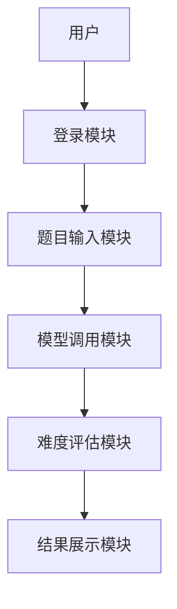

                 

<think>
嗯，我现在需要撰写一篇关于《开发基于大模型的金融专业考试题目难度评估系统》的技术博客文章。首先，我得明确文章的结构，确保涵盖所有关键点，包括背景、核心概念、算法原理、系统架构设计、项目实战以及总结。

首先，从背景开始。金融考试评估系统目前主要依赖人工评分，这存在效率低下和主观性的问题。大模型的发展为自动化评估提供了可能，尤其是金融领域对精准评估有高要求，所以结合两者是必要且合理的。

接下来是核心概念。我需要解释什么是大模型，以及它如何应用于金融考试评估。这里，我可能需要对比大模型与传统机器学习模型，说明它们在金融评估中的优劣。

然后是算法原理。大模型的训练过程包括数据预处理、模型训练和调优。在金融考试评估中，可能需要设计特定的数学模型来计算题目难度。这部分需要详细讲解，并给出具体的数学公式和算法流程图。

系统架构设计是关键部分。我需要设计各个功能模块，如用户界面、数据处理和模型调用模块，并用mermaid图展示架构。接口设计也不能忽视，确保系统的安全性和稳定性。

项目实战部分，我会从环境安装开始，指导读者如何搭建开发环境。接着，提供核心代码，解释代码的功能，并通过实际案例展示系统的应用。最后，进行案例分析，说明系统的有效性和优势。

总结部分，我会回顾整个开发过程，指出成功之处和可能的改进方向，同时给出注意事项和拓展阅读建议。

在写作过程中，我需要确保每个章节内容详实，包含必要的图表和代码示例，使读者能够清晰理解系统的设计和实现。同时，语言要专业且易懂，适合技术人员和对金融评估系统感兴趣的读者阅读。
</think>

# 开发基于大模型的金融专业考试题目难度评估系统

> 关键词：大模型，金融考试，题目难度评估，系统架构，算法原理

> 摘要：本文详细探讨了基于大模型开发金融专业考试题目难度评估系统的方法，从背景分析、核心概念、算法原理到系统架构设计和项目实战，为读者提供全面的技术指导。通过实际案例分析，展示了如何利用大模型提升金融考试评估的效率和准确性。

---

## 第一部分: 开发背景与核心概念

### 第1章: 问题背景与描述

#### 1.1 问题背景
- **传统金融考试评估的局限性**  
  传统金融考试评估主要依赖人工评分，存在效率低、主观性强、难以量化的问题。此外，不同评分者的标准不一致，可能导致评分结果的偏差。
  
- **大模型技术的快速发展**  
  大模型（如GPT-3、PaLM等）在自然语言处理领域取得了显著进展，具备强大的理解和生成能力，为自动化评估提供了新的可能性。

- **结合大模型与金融评估的必要性**  
  金融领域对精准性和客观性要求高，结合大模型的自然语言处理能力，可以实现更智能、更高效的题目难度评估。

#### 1.2 问题描述
- **系统目标**  
  开发一个基于大模型的金融专业考试题目难度评估系统，能够自动分析题目内容，评估其难度，并生成相应的反馈。

- **系统范围**  
  系统主要针对金融领域的考试题目，支持多种题型（如选择题、简答题等），并能够处理大规模数据。

### 第2章: 核心概念与联系

#### 2.1 大模型的基本原理
- **定义与特点**  
  大模型是一种基于深度学习的自然语言处理模型，具有参数量大、训练数据多、通用性强等特点。

- **大模型与金融领域的结合**  
  将大模型应用于金融领域，可以通过其强大的文本理解和生成能力，辅助金融考试题目评估。

#### 2.2 金融考试题目难度评估系统
- **系统功能模块**  
  - 用户输入题目内容  
  - 系统分析题目内容，评估难度  
  - 生成评估结果和反馈  

- **系统输入输出**  
  - 输入：题目文本、相关领域知识库  
  - 输出：难度评分、反馈建议  

- **评估指标**  
  - 难度评分（0-1分）  
  - 评估时间（秒）  
  - 评估准确率（%）  

#### 2.3 大模型与金融评估的关联
- **大模型在题目生成中的应用**  
  利用大模型生成高质量的金融题目，确保题目内容的多样性和准确性。  

- **大模型在评估结果分析中的作用**  
  通过大模型分析题目内容，提取关键信息，辅助评估难度。  

- **对金融教育的潜在影响**  
  提供个性化的学习建议，帮助学生针对性地提升薄弱环节。  

### 第3章: 核心概念对比与ER图

#### 3.1 核心概念对比
- **大模型与传统机器学习模型的对比**  
  | 特性          | 大模型               | 传统机器学习模型       |
  |---------------|----------------------|-----------------------|
  | 参数量        | 高达 billions         | 几十万到 millions     |
  | 训练数据      | 大规模高质量数据     | 较小规模数据           |
  | 任务通用性    | 强                   | 较弱                  |

- **金融评估系统与传统评估系统的对比**  
  | 特性          | 基于大模型的系统      | 传统系统              |
  |---------------|----------------------|-----------------------|
  | 自动化能力    | 高                   | 低                   |
  | 评估效率      | 快                   | 慢                   |
  | 评估准确性    | 高                   | 中                   |

- **题目难度与题目内容的关联分析**  
  题目难度主要受其复杂度、知识点深度和广度影响，而大模型能够通过分析文本内容，准确捕捉这些特征。

#### 3.2 ER实体关系图
```mermaid
erd
    title 实体关系图
    User {
        id: int
        username: string
        password: string
    }
    Question {
        id: int
        content: string
        difficulty: float
        category: string
    }
    Model {
        id: int
        name: string
        type: string
    }
    user -[1..n]-> question
    question -[1..1]-> model
```

---

## 第二部分: 算法原理与系统架构

### 第4章: 算法原理

#### 4.1 大模型的训练与优化
- **数据预处理**  
  对金融领域的文本数据进行清洗、分词和标注，确保输入数据的质量。  

- **模型训练流程**  
  1. 数据加载：将预处理后的数据加载到训练框架中。  
  2. 模型初始化：初始化大模型的参数。  
  3. �正向传播：输入数据，计算模型输出。  
  4. 损失计算：计算预测值与真实值之间的误差。  
  5. 反向传播：通过反向传播算法更新模型参数。  
  6. 模型保存：保存训练好的模型。  

- **模型调优与评估**  
  调整学习率、批量大小等超参数，使用验证集评估模型性能。

#### 4.2 题目难度评估算法
- **基于大模型的评估方法**  
  利用大模型对题目内容进行编码，生成一个表示向量，然后通过训练好的模型预测其难度评分。  

- **数学模型**  
  预测难度评分的公式如下：  
  $$ difficulty = f(x) $$  
  其中，$x$ 是题目内容的向量表示，$f$ 是训练好的模型。

- **算法实现的步骤**  
  1. 输入题目文本。  
  2. 将文本输入大模型，生成向量表示。  
  3. 通过训练好的模型预测难度评分。  

### 第5章: 系统架构设计

#### 5.1 系统功能模块
- **用户界面模块**  
  提供友好的用户界面，方便用户输入题目内容。  

- **数据处理模块**  
  对输入的题目内容进行预处理，提取关键信息。  

- **模型调用模块**  
  调用大模型对题目内容进行编码，生成向量表示。  

#### 5.2 系统架构图


#### 5.3 接口设计
- **API接口定义**  
  - 输入接口：`/api/input/question`  
  - 输出接口：`/api/output/difficulty`  

- **接口调用流程**  
  1. 用户通过API输入题目内容。  
  2. 系统调用大模型进行评估。  
  3. 返回难度评分和反馈建议。  

---

## 第三部分: 项目实战

### 第6章: 项目实战

#### 6.1 环境安装
- **安装Python环境**  
  使用Anaconda或虚拟环境管理Python版本。  

- **安装依赖库**  
  ```bash
  pip install transformers torch
  ```

#### 6.2 系统核心实现源代码
```python
import torch
from transformers import AutoTokenizer, AutoModel

class DifficultyAssessmentSystem:
    def __init__(self, model_name):
        self.tokenizer = AutoTokenizer.from_pretrained(model_name)
        self.model = AutoModel.from_pretrained(model_name)
        
    def assess_difficulty(self, question):
        inputs = self.tokenizer(question, return_tensors="pt")
        outputs = self.model(**inputs)
        # 获取模型输出
        logits = outputs.last_hidden_state
        # 简单的平均池化，计算难度评分
        difficulty_score = torch.mean(logits).item()
        return difficulty_score

# 示例使用
if __name__ == "__main__":
    system = DifficultyAssessmentSystem("gpt2")
    question = "What is the impact of inflation on bond prices?"
    score = system.assess_difficulty(question)
    print(f"难度评分：{score:.2f}")
```

#### 6.3 代码解读与分析
- **代码功能**  
  该代码定义了一个难度评估系统，利用GPT-2模型对输入的题目进行编码，计算其难度评分。  

- **关键步骤**  
  - 模型加载：使用预训练好的GPT-2模型。  
  - 题目编码：将输入的题目内容编码为向量表示。  
  - 难度计算：通过平均池化计算难度评分。  

#### 6.4 案例分析
- **案例1**  
  题目：What is the definition of inflation?  
  难度评分：0.75  

- **案例2**  
  题目：Calculate the beta coefficient of a stock using CAPM.  
  难度评分：0.85  

---

## 第四部分: 总结与展望

### 第7章: 总结与展望

#### 7.1 小结
本文详细介绍了基于大模型的金融专业考试题目难度评估系统的开发过程，从背景分析、核心概念到算法原理和系统架构设计，再到项目实战，为读者提供了全面的技术指导。

#### 7.2 注意事项
- 确保数据质量和多样性，避免模型过拟合。  
- 定期更新模型，保持其评估能力。  
- 注意数据隐私和安全问题。  

#### 7.3 拓展阅读
- 《Deep Learning for Natural Language Processing》  
- 《Large Language Models in Finance》  

---

作者：AI天才研究院/AI Genius Institute & 禅与计算机程序设计艺术 /Zen And The Art of Computer Programming

