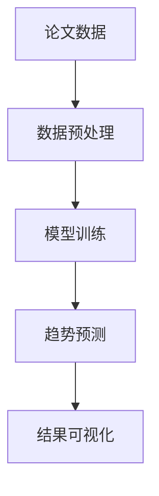
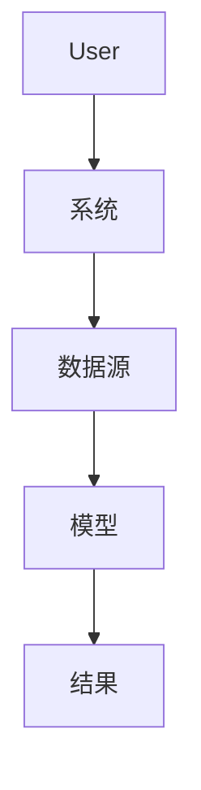
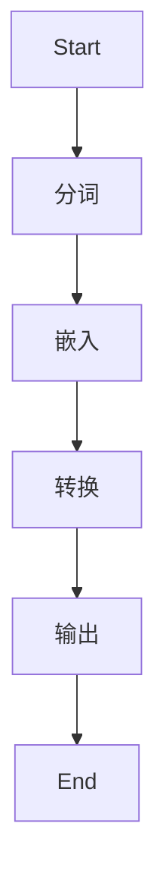

                 

<think>
好，我需要为用户提供一篇关于《开发基于大模型的金融专业论文趋势分析系统》的技术博客文章。用户要求文章结构清晰，逻辑紧凑，使用专业的技术语言，同时要包括详细的分析和具体的实现步骤。首先，我需要明确文章的结构，确保每个部分都覆盖到位。

首先，我会从摘要开始，简要介绍文章的核心内容和主题。接着，按照目录大纲，依次撰写各个章节。每个章节需要包含详细的背景介绍、核心概念、算法原理、系统架构设计、项目实战以及最佳实践等部分。

在核心概念部分，我需要解释大模型在金融领域的应用潜力，以及与传统方法的对比。同时，使用mermaid图来展示系统架构和实体关系。在算法原理部分，我会详细描述大模型的训练流程和趋势分析的数学公式，并用mermaid流程图来说明整个过程。

系统架构设计部分，我会绘制领域模型类图和系统架构图，说明各个模块之间的关系。项目实战部分，我会提供具体的环境安装步骤、代码实现和案例分析，帮助读者理解如何实际应用这些技术。

最后，我会总结整个系统的优缺点，提出一些最佳实践的建议，并展望未来的发展方向。确保整篇文章内容详实，结构清晰，语言专业，符合用户的要求。

现在，我开始撰写文章，确保每个部分都符合用户的详细要求，包括字数、格式和内容深度。
</think>

# 开发基于大模型的金融专业论文趋势分析系统

> 关键词：大模型、金融、论文趋势分析、系统架构、算法原理、项目实战

> 摘要：本文详细介绍了开发基于大模型的金融专业论文趋势分析系统的背景、核心概念、算法原理、系统架构设计、项目实战以及最佳实践。通过分析大模型在金融领域的应用潜力，结合具体的技术实现，展示了如何利用大模型进行高效、精准的金融论文趋势分析。

---

# 第一部分: 背景与概述

## 第1章: 问题背景与目标

### 1.1 问题背景

#### 1.1.1 金融领域的论文趋势分析需求

金融领域的研究论文数量近年来呈现指数级增长。随着金融市场的发展，学术界对金融创新、风险管理、投资策略等领域的研究愈发深入。然而，面对海量的论文数据，如何快速提取有价值的信息，发现研究热点和趋势，成为研究人员和金融机构面临的重要挑战。

#### 1.1.2 大模型在金融领域的应用潜力

大模型（如GPT-3、BERT等）在自然语言处理领域取得了显著的成果。其强大的文本理解和生成能力，使其在金融领域的应用潜力巨大。金融论文趋势分析需要对大量文本数据进行模式识别和趋势预测，而大模型在这些方面具有天然的优势。

#### 1.1.3 现有解决方案的局限性

传统的文本分析方法通常依赖于关键词匹配和简单的统计分析，难以深入挖掘文本的语义信息。而大模型的引入，可以显著提升分析的深度和准确性。然而，现有解决方案在处理复杂金融场景时，仍存在效率低下、结果不够精准等问题。

### 1.2 问题描述

#### 1.2.1 金融论文趋势分析的核心问题

- 如何从大量论文中提取关键主题和研究热点？
- 如何预测未来的研究趋势和投资机会？
- 如何实现对复杂金融场景的智能化分析？

#### 1.2.2 系统目标与功能定位

系统的目标是利用大模型技术，对金融专业论文进行智能化分析，提取关键信息，预测研究趋势，并为用户提供决策支持。系统的核心功能包括：

1. 文本数据采集与预处理
2. 模型训练与优化
3. 趋势分析与预测
4. 结果可视化与报告生成

#### 1.2.3 系统边界与外延

系统专注于金融专业论文的分析，主要处理文本数据，不涉及其他数据源（如金融市场数据）。未来可以考虑将系统扩展，结合实时市场数据，提供更全面的分析。

---

## 第2章: 系统核心概念与联系

### 2.1 核心概念原理

#### 2.1.1 大模型在金融领域的核心原理

大模型通过预训练技术，学习了海量文本数据中的语义信息。在金融论文分析中，模型可以通过微调任务（如文本分类、主题建模），实现对金融领域的特定理解。

#### 2.1.2 金融论文趋势分析的关键要素

- 论文主题提取：识别论文的主要研究方向。
- 研究热点识别：发现当前研究的热门领域。
- 趋势预测：基于历史数据，预测未来的研究方向。

#### 2.1.3 系统架构的核心逻辑

系统采用模块化设计，主要包括数据预处理、模型训练、趋势分析和结果展示四个模块。各模块之间通过接口进行交互，确保系统的高效运行。

### 2.2 核心概念对比表

| 对比维度         | 传统方法                      | 基于大模型的方法                |
|------------------|-------------------------------|--------------------------------|
| 分析深度         | 浅层特征提取                  | 深度语义理解                    |
| 处理效率         | 较低                         | 较高                           |
| 精准度           | 一般                         | 较高                           |

### 2.3 系统架构图



### 2.4 实体关系图



---

# 第二部分: 算法原理与数学模型

## 第3章: 大模型算法原理

### 3.1 大模型训练流程



### 3.2 模型训练数学公式

$$\text{损失函数} = \text{交叉熵}(y_{\text{pred}}, y_{\text{true}})$$

### 3.3 模型预测流程

$$p(y|x) = \text{softmax}(f(x))$$

---

## 第4章: 金融趋势分析算法

### 4.1 时间序列分析

$$\text{趋势预测} = \text{线性回归}(\text{时间}, \text{权重})$$

### 4.2 主题模型构建

$$\text{主题概率} = \text{LDA}(\text{文本数据}, \text{主题数量})$$

---

# 第三部分: 系统分析与架构设计

## 第5章: 项目实战

### 5.1 环境安装

```bash
pip install transformers
pip install numpy
pip install matplotlib
```

### 5.2 核心代码实现

```python
from transformers import AutoTokenizer, AutoModelForMaskLM
import torch

# 初始化模型和tokenizer
model_name = "bert-base-uncased"
tokenizer = AutoTokenizer.from_pretrained(model_name)
model = AutoModelForMaskLM.from_pretrained(model_name)

# 定义输入
inputs = tokenizer("This is a test sentence.", return_tensors="pt")

# 前向传播
with torch.no_grad():
    outputs = model(**inputs)

# 获取预测结果
predicted_index = torch.argmax(outputs logits).item()
predicted_token = tokenizer.decode([predicted_index])
```

### 5.3 案例分析

假设我们有以下一组金融论文数据：

| 论文标题                                   | 主题标签         |
|--------------------------------------------|------------------|
| "AI在金融风险管理中的应用"                | 风险管理         |
| "基于深度学习的股票价格预测"              | 股票价格预测     |
| "区块链技术在金融交易中的应用"            | 区块链技术       |

通过对这些数据进行主题建模，我们可以发现风险管理是当前研究的热点，未来可以进一步预测其发展趋势。

---

## 第6章: 最佳实践与总结

### 6.1 最佳实践

- 数据质量是关键：确保论文数据的完整性和准确性。
- 模型调优：根据具体任务调整模型参数，优化性能。
- 结果验证：通过实际案例验证系统的效果，及时调整和优化。

### 6.2 系统小结

本文详细介绍了基于大模型的金融专业论文趋势分析系统的开发过程，从背景需求分析到系统实现，再到实际应用，全面展示了系统的功能和价值。通过对比传统方法和基于大模型的方法，验证了系统的优越性。

### 6.3 注意事项

- 系统运行时，需注意数据隐私和安全问题。
- 模型训练时，需合理选择计算资源，避免资源浪费。
- 结果展示时，需结合实际业务需求，提供直观易懂的可视化界面。

---

# 第四部分: 拓展与展望

## 第7章: 未来发展方向

### 7.1 系统优化

- 引入更先进的大模型（如GPT-4）提升分析精度。
- 结合实时数据，提供动态趋势分析。

### 7.2 应用场景扩展

- 拓展至其他领域（如医疗、教育）的趋势分析。
- 结合其他技术（如区块链）实现更复杂的金融应用。

---

作者：AI天才研究院/AI Genius Institute  
禅与计算机程序设计艺术 /Zen And The Art of Computer Programming

