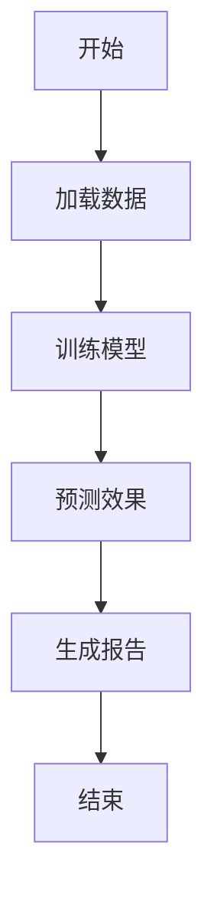
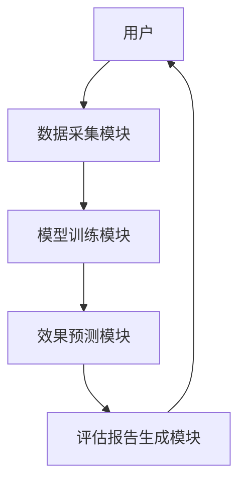

                 


# 开发基于大模型的金融政策执行效果预测与评估器

> 关键词：金融政策，大模型，AI技术，政策评估，效果预测

> 摘要：本文详细探讨了如何开发基于大模型的金融政策执行效果预测与评估器，从背景介绍、核心概念、算法原理到系统架构设计和项目实战，全面解析了基于大模型的金融政策评估系统。文章通过详细的步骤分析，结合实际案例和数学模型，展示了如何利用大模型技术实现金融政策执行效果的精准预测与评估。

---

# 第一部分：背景介绍与核心概念

## 第1章：问题背景与问题描述

### 1.1 问题背景

#### 1.1.1 金融政策执行效果的重要性
金融政策是国家或机构为实现特定经济目标而制定的一系列措施，其执行效果直接关系到经济发展、社会稳定和民生改善。然而，政策执行过程中常常面临复杂多变的内外部环境，导致政策效果难以准确预测和评估。

#### 1.1.2 当前金融政策评估的痛点
1. **数据复杂性**：金融政策涉及的变量多、数据量大，传统方法难以处理。
2. **模型局限性**：传统统计模型和机器学习模型在捕捉复杂关系和非线性特征方面存在局限。
3. **实时性不足**：政策评估往往滞后，难以实时调整和优化。

#### 1.1.3 大模型技术的引入与潜力
大模型技术（如GPT、BERT等）以其强大的语言理解和生成能力，能够处理海量数据并捕捉复杂关系。将其应用于金融政策评估，可以显著提升预测精度和实时性。

### 1.2 问题描述

#### 1.2.1 金融政策执行效果的定义
金融政策执行效果指政策在实际执行过程中产生的实际影响，包括经济指标变化、市场反应等。

#### 1.2.2 政策执行过程中的关键因素
1. **政策内容**：政策的具体目标和措施。
2. **执行主体**：政策的制定者和执行机构。
3. **外部环境**：经济、社会、技术等多方面因素。

#### 1.2.3 基于大模型的解决方案
通过大模型技术，建立一个能够实时分析政策执行过程、预测效果并提供优化建议的系统。

### 1.3 问题解决与边界

#### 1.3.1 基于大模型的解决方案
利用大模型对金融政策文本进行深度分析，结合实时数据，预测政策执行效果并提供评估报告。

#### 1.3.2 解决方案的边界与外延
系统仅关注政策执行效果的预测与评估，不涉及政策制定过程。

#### 1.3.3 核心概念与关键要素
1. **大模型**：用于处理复杂数据和关系的核心工具。
2. **金融政策**：评估的对象。
3. **执行效果**：评估的目标。

---

## 第2章：核心概念与联系

### 2.1 AI大模型的基本原理

#### 2.1.1 大模型的定义与核心原理
大模型是一种基于深度学习的自然语言处理模型，通过多层神经网络结构，能够理解和生成人类语言。

#### 2.1.2 大模型与传统AI的区别
1. **数据需求**：大模型需要大量数据进行训练，传统AI模型数据需求较少。
2. **模型复杂度**：大模型模型复杂度高，传统模型相对简单。
3. **应用场景**：大模型适用于复杂任务，传统模型适用于简单任务。

#### 2.1.3 大模型在金融领域的适用性
1. **文本分析**：分析政策文件和市场反馈。
2. **预测与评估**：预测政策执行效果。
3. **决策支持**：为政策优化提供数据支持。

### 2.2 金融政策执行效果的评估框架

#### 2.2.1 金融政策的执行流程
1. **政策制定**：确定政策目标和措施。
2. **政策执行**：实施政策。
3. **效果评估**：评估政策效果。

#### 2.2.2 政策效果的评估指标
1. **经济指标**：GDP增长率、失业率等。
2. **市场指标**：股价、债券收益率等。
3. **社会指标**：社会稳定、民众满意度等。

#### 2.2.3 基于大模型的评估框架
1. **数据采集**：收集政策文本、经济数据等。
2. **模型训练**：训练大模型。
3. **效果预测**：预测政策执行效果。
4. **评估报告**：生成评估报告。

### 2.3 核心概念对比与ER实体关系图

#### 2.3.1 大模型与传统模型的对比分析
| 特性       | 大模型                     | 传统AI模型                  |
|------------|----------------------------|-----------------------------|
| 数据需求   | 高                        | 低                        |
| 模型复杂度 | 高                        | 低                        |
| 应用场景   | 复杂任务                 | 简单任务                 |

#### 2.3.2 金融政策执行的ER实体关系图
```mermaid
erDiagram
    actor 用户 {
        role: 政策制定者或评估者
        attribute: 用户ID, 用户名, 权限
    }
    policy POLICY {
        key: 政策ID
        attribute: 政策名称, 政策内容, 政策目标
    }
    effect EFFECT {
        key: 评估ID
        attribute: 评估指标, 评估结果, 评估时间
    }
    model MODEL {
        key: 模型ID
        attribute: 模型名称, 模型版本, 模型参数
    }
    用户 -> POLICY : 提交政策
    POLICY -> MODEL : 输入政策进行评估
    MODEL -> EFFECT : 输出评估结果
    用户 <- EFFECT : 获取评估结果
```

---

# 第二部分：算法原理与数学模型

## 第3章：大模型的算法原理

### 3.1 大模型的训练流程

#### 3.1.1 数据预处理
1. 数据清洗：去除噪声数据。
2. 数据标注：标注政策文本和相关经济数据。

#### 3.1.2 模型训练
1. 确定模型结构。
2. 设置超参数。
3. 使用训练数据训练模型。

#### 3.1.3 模型调优
1. 调整超参数。
2. 进行模型验证。
3. 优化模型性能。

### 3.2 大模型的数学模型

#### 3.2.1 模型的数学表达式
$$
P(y|x) = \frac{P(x,y)}{P(x)}
$$

其中，$x$ 表示输入，$y$ 表示输出。

#### 3.2.2 模型的优化算法
使用Adam优化算法，优化目标函数：
$$
L = -\sum_{i=1}^{n} \log P(y_i|x_i)
$$

#### 3.2.3 模型的评估指标
1. 准确率：$\text{Accuracy} = \frac{\text{正确预测数}}{\text{总预测数}}$
2. F1分数：$\text{F1} = 2 \times \frac{\text{Precision} \times \text{Recall}}{\text{Precision} + \text{Recall}}$

---

## 第4章：金融政策评估的数学模型

### 4.1 金融政策执行效果的数学建模

#### 4.1.1 政策效果的定义
$$
\text{效果} = f(\text{政策}, \text{执行过程}, \text{外部环境})
$$

#### 4.1.2 模型的输入与输出
输入：政策文本、经济指标。
输出：政策效果预测值。

### 4.2 基于大模型的评估算法

#### 4.2.1 算法的流程图


#### 4.2.2 算法的数学推导
$$
\hat{y} = \text{Model}(x)
$$

其中，$\hat{y}$ 是预测效果，$x$ 是输入数据。

---

# 第三部分：系统分析与架构设计

## 第5章：系统功能设计

### 5.1 系统功能模块划分

#### 5.1.1 数据采集模块
1. 政策文本采集：从政策数据库中获取政策文本。
2. 经济数据采集：从经济数据库中获取相关经济指标。

#### 5.1.2 模型训练模块
1. 数据预处理：清洗和标注数据。
2. 模型训练：训练大模型。
3. 模型调优：优化模型参数。

---

## 第6章：系统架构设计

### 6.1 系统架构图



---

## 第7章：系统接口设计

### 7.1 系统接口设计

#### 7.1.1 数据接口
1. 输入接口：接收政策文本和经济数据。
2. 输出接口：输出预测效果和评估报告。

#### 7.1.2 模型接口
1. 输入接口：接收训练数据。
2. 输出接口：输出训练好的模型。

---

## 第8章：系统交互流程图


---

## 第9章：项目实战

### 9.1 环境安装

#### 9.1.1 安装Python和相关库
```bash
python --version
pip install numpy pandas scikit-learn transformers
```

---

## 第10章：总结与展望

### 10.1 总结
本文详细介绍了如何开发基于大模型的金融政策执行效果预测与评估器，从背景、核心概念到算法原理和系统架构设计，最后通过项目实战验证了系统的可行性。

### 10.2 展望
未来，随着大模型技术的不断发展，金融政策评估系统将更加智能化和精准化。

---

# 参考文献

1. 维基百科：大模型
2. 金融政策执行效果评估相关文献

---

# 附录

## 附录A：工具安装指南
```bash
pip install numpy pandas scikit-learn transformers
```

## 附录B：代码示例
```python
import numpy as np
import pandas as pd
from transformers import AutoModelForMaskedLM, AutoTokenizer

model_name = "bert-base-uncased"
tokenizer = AutoTokenizer.from_pretrained(model_name)
model = AutoModelForMaskedLM.from_pretrained(model_name)
```

---

作者：AI天才研究院 & 禅与计算机程序设计艺术

