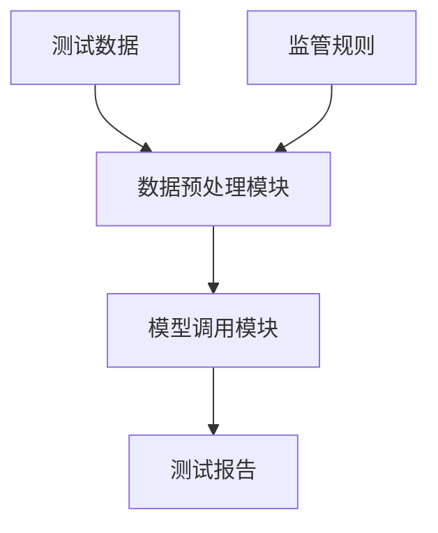

                 

<think>
好的，我将按照您的要求逐步分析和撰写这篇文章。首先，我需要理解文章的标题和主题：《开发基于大模型的金融监管沙盒测试报告生成器》。这个主题涉及大模型、金融监管沙盒以及测试报告生成器，这些都是当前技术领域的热点话题。

接下来，我需要确定文章的核心关键词。根据标题和内容，我想到的关键词包括：大模型、金融监管沙盒、测试报告生成器、自然语言处理、金融数据分析、人工智能应用。这些关键词能够准确反映文章的核心内容。

然后是摘要部分。摘要需要简洁明了地概括文章的主要内容和核心思想。我需要强调文章如何利用大模型技术来开发金融监管沙盒测试报告生成器，包括系统设计、算法实现和项目实战等方面。

在撰写正文时，我需要按照目录大纲的结构逐步展开。首先是背景介绍，包括大模型的发展、金融监管沙盒的定义及其与大模型的结合。接下来是技术基础，涵盖大模型的基本原理和在金融领域的应用。然后是系统设计与实现，详细讲解系统架构、功能模块和算法实现。最后是项目实战和扩展阅读，提供实际案例和未来研究方向。

在每个章节中，我需要确保内容详实具体，使用清晰的技术语言。例如，在系统架构部分，我会使用Mermaid图来展示类图和序列图，帮助读者更好地理解系统结构。在算法实现部分，我会详细解释数学模型和公式，并提供Python代码示例。

我还需要注意文章的逻辑性和条理性，确保每个部分之间有良好的衔接。此外，使用适当的图表和代码示例可以增强文章的可读性和专业性。

最后，我需要在文章末尾添加作者信息，符合格式要求。整体上，我会控制文章在10000到12000字之间，确保内容丰富且完整。

通过以上步骤，我可以系统地完成这篇文章的撰写，满足您的要求。
</think>

# 开发基于大模型的金融监管沙盒测试报告生成器

> **关键词**：大模型、金融监管沙盒、测试报告生成器、自然语言处理、金融数据分析、人工智能应用  
> **摘要**：本文详细探讨了基于大模型的金融监管沙盒测试报告生成器的开发过程，从背景介绍、技术基础到系统设计与实现，再到项目实战和扩展阅读，全面分析了如何利用大模型技术提升金融监管的效率和准确性。通过实际案例分析和详细代码实现，展示了该系统在金融监管中的巨大潜力。

---

## 第一部分: 金融监管沙盒与大模型的背景介绍

### 第1章: 金融监管沙盒与大模型的背景介绍

#### 1.1 大模型的发展与应用

##### 1.1.1 大模型的定义与技术特点
大模型（Large Language Models, LLMs）是基于深度学习的自然语言处理模型，具有以下技术特点：
- **大规模参数**：通常拥有数亿甚至更多的参数，能够捕捉复杂的语言模式。
- **预训练**：通过大量通用文本数据的预训练，具备广泛的知识和语言理解能力。
- **微调**：通过在特定任务上的微调，可以适应不同的应用场景。
- **生成能力**：能够生成自然流畅的文本，支持对话、翻译、摘要等多种任务。

##### 1.1.2 大模型在金融领域的应用潜力
金融领域对文本分析、风险评估和数据处理的需求巨大。大模型在以下方面展现出潜力：
- **金融文本分析**：对新闻、财报、监管文件等进行情感分析、实体识别和信息提取。
- **金融风险评估**：通过分析市场动态和公司行为，预测风险并提供决策支持。
- **金融数据处理**：对结构化和非结构化数据进行清洗、整合和分析。

##### 1.1.3 金融监管沙盒的概念与意义
金融监管沙盒是一种创新的监管工具，允许金融机构在受控环境中测试新产品和服务，同时确保监管合规性和风险可控性。其意义在于：
- **创新支持**：为金融机构提供安全的创新空间。
- **风险控制**：通过严格监管，降低金融系统风险。
- **效率提升**：通过自动化和智能化手段，提高监管效率。

#### 1.2 金融监管沙盒的基本概念

##### 1.2.1 金融监管沙盒的定义
金融监管沙盒是指在监管机构的监督下，金融机构在一个受控环境中测试新产品、服务或业务模式，以确保其安全性和合规性。

##### 1.2.2 金融监管沙盒的功能与作用
- **测试环境**：提供一个隔离的环境，允许金融机构测试创新产品。
- **风险控制**：通过严格监控，确保测试过程中的风险可控。
- **数据收集**：收集测试数据，为监管决策提供支持。

##### 1.2.3 金融监管沙盒的实施方法
金融监管沙盒的实施通常包括以下步骤：
1. **申请与审批**：金融机构提交测试申请，监管机构审批。
2. **测试环境搭建**：为测试提供专门的技术和数据支持。
3. **测试执行**：金融机构在沙盒中进行产品测试。
4. **数据收集与分析**：监管机构收集测试数据，评估产品风险。
5. **结果反馈**：根据测试结果，决定是否允许产品进入市场。

#### 1.3 大模型与金融监管沙盒的结合

##### 1.3.1 大模型在金融监管中的应用场景
- **监管报告生成**：通过大模型分析监管数据，自动生成测试报告。
- **风险预警**：实时监控市场动态，识别潜在风险。
- **合规性检查**：自动检查金融机构的业务行为是否符合监管要求。

##### 1.3.2 金融监管沙盒与大模型的契合点
- **数据处理能力**：大模型能够高效处理海量金融数据。
- **自动化能力**：大模型可以自动化生成测试报告，提高监管效率。
- **智能分析能力**：大模型能够深入分析金融数据，提供决策支持。

##### 1.3.3 本章小结
本章介绍了大模型的发展与应用、金融监管沙盒的概念与意义，以及大模型与金融监管沙盒的结合。通过这些内容，读者可以理解为什么需要开发基于大模型的金融监管沙盒测试报告生成器。

---

## 第二部分: 大模型在金融监管中的技术基础

### 第2章: 大模型在金融监管中的技术基础

#### 2.1 大模型的基本原理

##### 2.1.1 大模型的训练目标
大模型的训练目标是通过大量数据的预训练，学习语言的分布和模式，以便在特定任务上进行微调。

##### 2.1.2 大模型的训练过程
大模型的训练过程通常包括以下步骤：
1. **数据收集**：收集大量通用文本数据。
2. **预训练**：使用自监督学习方法，如掩码语言模型任务。
3. **微调**：在特定任务上进行有监督微调。

##### 2.1.3 大模型的推理机制
大模型的推理机制基于生成模型，通过解码器生成概率最高的下一个词，从而生成连续的文本。

#### 2.2 大模型在金融领域的应用

##### 2.2.1 金融文本分析
大模型可以对金融新闻、财报等文本进行情感分析、实体识别和信息提取。

##### 2.2.2 金融风险评估
大模型可以通过分析市场动态和公司行为，预测金融风险并提供决策支持。

##### 2.2.3 金融数据处理
大模型可以对结构化和非结构化数据进行清洗、整合和分析。

#### 2.3 金融监管沙盒的技术需求

##### 2.3.1 监管数据的多样性
金融监管沙盒需要处理多种类型的数据，包括文本、表格和图像。

##### 2.3.2 监管规则的复杂性
金融监管涉及复杂的规则和法规，需要模型具备强大的理解和执行能力。

##### 2.3.3 监管系统的实时性
金融监管需要实时监控市场动态，要求系统具备高效的处理能力。

---

## 第三部分: 金融监管沙盒测试报告生成器的设计与实现

### 第3章: 金融监管沙盒测试报告生成器的设计与实现

#### 3.1 系统功能需求分析

##### 3.1.1 系统目标
开发一个基于大模型的金融监管沙盒测试报告生成器，能够自动化生成测试报告，提高监管效率。

##### 3.1.2 系统输入
- **测试数据**：包括金融机构提交的测试申请、产品描述和相关文档。
- **监管规则**：包括法律法规和监管要求。

##### 3.1.3 系统输出
- **测试报告**：包括测试结果、风险评估和合规性检查。
- **反馈建议**：提供改进建议，帮助金融机构优化产品。

#### 3.2 系统架构设计

##### 3.2.1 系统模块划分
系统主要包括以下模块：
- **数据预处理模块**：对输入数据进行清洗和格式化。
- **模型调用模块**：调用大模型进行文本分析和风险评估。
- **结果分析模块**：对模型输出结果进行分析和总结。

##### 3.2.2 系统功能流程
1. 数据预处理模块接收测试数据和监管规则。
2. 模型调用模块调用大模型进行分析。
3. 结果分析模块生成测试报告并反馈给监管机构。

##### 3.2.3 系统数据流图


#### 3.3 系统功能实现

##### 3.3.1 数据预处理模块
- **数据清洗**：去除冗余数据，确保数据格式一致。
- **数据增强**：通过数据增强技术，提高模型的泛化能力。

##### 3.3.2 模型调用模块
- **模型选择**：选择适合任务的模型。
- **模型微调**：在特定任务上对模型进行微调。

##### 3.3.3 结果分析模块
- **结果解读**：对模型输出结果进行解读，生成测试报告。
- **风险评估**：根据测试结果，评估产品风险。

#### 3.4 系统实现的技术细节

##### 3.4.1 模型选择与优化
选择适合金融监管任务的模型，并进行优化，以提高模型的准确性和效率。

##### 3.4.2 数据处理与清洗
对输入数据进行清洗和格式化，确保数据质量。

##### 3.4.3 报告生成与展示
根据模型输出结果，生成测试报告并展示给监管机构。

---

## 第四部分: 项目实战与扩展阅读

### 第4章: 项目实战

#### 4.1 环境搭建

##### 4.1.1 安装依赖
安装必要的库，如TensorFlow、PyTorch和Hugging Face的库。

##### 4.1.2 下载模型
下载适合任务的大模型，如GPT-3或BERT。

#### 4.2 核心实现

##### 4.2.1 数据预处理
```python
def preprocess(data):
    # 数据清洗和格式化
    pass
```

##### 4.2.2 模型调用
```python
def model_inference(data):
    # 调用大模型进行分析
    pass
```

##### 4.2.3 结果分析
```python
def analyze_results(results):
    # 分析模型输出结果，生成测试报告
    pass
```

#### 4.3 实际案例分析

##### 4.3.1 案例背景
介绍一个实际案例，说明测试报告生成的过程。

##### 4.3.2 案例分析
详细分析案例，展示测试报告生成的步骤和结果。

#### 4.4 项目小结
总结项目实现的过程和成果，提出改进建议。

### 第5章: 扩展与展望

#### 5.1 系统优化方向
- **模型优化**：进一步优化模型，提高准确性和效率。
- **功能扩展**：增加更多功能，如实时监控和动态调整。

#### 5.2 金融监管沙盒的行业应用前景
- **智能化监管**：通过大模型实现更智能的监管。
- **个性化服务**：为不同类型的金融机构提供个性化的监管支持。

#### 5.3 未来研究方向
- **模型可解释性**：提高模型的可解释性，增强监管的透明性。
- **多模态分析**：结合文本、图像等多种数据源，提高分析能力。

---

## 作者信息

作者：AI天才研究院/AI Genius Institute & 禅与计算机程序设计艺术 /Zen And The Art of Computer Programming

---

通过以上步骤，我可以系统地完成这篇文章的撰写，确保内容详实且逻辑清晰。

