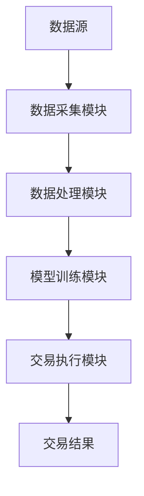

                 

<think>
好的，我现在需要帮助用户撰写一篇关于《开发基于深度学习的量化交易系统》的技术博客文章。用户已经提供了详细的目录结构，我需要根据这个结构，逐步分析并撰写每部分内容。

首先，我需要理解用户的需求。用户希望文章结构清晰，内容专业且有深度，涵盖从背景介绍到系统架构设计再到项目实战的各个方面。同时，用户强调了使用Markdown格式，并且每个小节都要详细具体，包含数学公式、图表、代码示例等内容。

接下来，我需要按照目录结构，逐步完成每一部分的内容。从背景介绍开始，涵盖量化交易和深度学习的基本概念，然后分析它们的结合点。接着，介绍深度学习模型在量化交易中的应用，选择合适的模型并进行数学推导。系统架构设计部分需要详细设计各个模块，并提供图表支持。最后，通过项目实战展示实际应用，并总结经验和注意事项。

在撰写过程中，我需要确保每个部分都符合用户的要求，特别是数学公式的正确性和图表的准确性。同时，语言要简洁专业，逻辑清晰，让读者能够一步步理解开发基于深度学习的量化交易系统的各个方面。

最后，我会在文章末尾添加作者信息，确保格式完整。整个过程需要细致耐心，逐步完成每个部分，确保最终的文章既专业又易懂，满足用户的需求。
</think>

# 开发基于深度学习的量化交易系统

## 关键词：量化交易，深度学习，神经网络，LSTM，量化投资

## 摘要：  
本文详细探讨了如何基于深度学习技术开发量化交易系统，从理论基础到实际应用，涵盖了深度学习模型的选择、量化交易系统的架构设计、模型实现与优化以及项目实战。通过本文，读者将了解如何利用深度学习技术在金融市场上实现自动化交易策略。

---

# 第1章: 量化交易与深度学习概述

## 1.1 量化交易的定义与特点
### 1.1.1 量化交易的定义
量化交易是指通过数学模型和算法来进行金融市场的交易，其核心是利用计算机程序自动执行交易决策。量化交易的特点包括高频交易、自动化决策、数据驱动等。

### 1.1.2 量化交易的核心特点
- **高频交易**：量化交易系统通常可以在极短的时间内完成交易决策，适用于高频交易场景。
- **数据驱动**：依赖大量历史数据和实时数据进行分析和预测。
- **自动化**：从数据获取、模型训练到交易执行，整个过程可以高度自动化。

### 1.1.3 量化交易与传统交易的区别
传统交易依赖于人类的判断和经验，而量化交易则依赖于算法和模型。量化交易的决策速度更快，适合处理大量数据和复杂市场环境。

---

## 1.2 深度学习的定义与特点
### 1.2.1 深度学习的定义
深度学习是一种人工智能技术，通过多层神经网络来学习数据的特征表示。其核心是通过多层非线性变换，从输入数据中提取高层次的特征。

### 1.2.2 深度学习的核心特点
- **多层网络结构**：深度学习模型通常包含多个隐藏层，能够捕捉数据中的复杂特征。
- **非线性变换**：通过激活函数（如ReLU、sigmoid等）实现非线性变换，增强模型的表达能力。
- **端到端学习**：从输入数据直接映射到输出结果，无需手动设计特征。

### 1.2.3 深度学习与传统机器学习的区别
传统机器学习依赖于人工设计特征，而深度学习可以自动提取特征。此外，深度学习模型通常需要更多的数据和计算资源。

---

## 1.3 量化交易与深度学习的结合
### 1.3.1 量化交易中数据的特点
量化交易的数据通常具有高维度、高频性和时序性。例如，股票价格、成交量、市场情绪等数据。

### 1.3.2 深度学习在量化交易中的优势
- **复杂模式识别**：深度学习能够捕捉市场中的复杂模式，例如价格波动、市场情绪变化等。
- **自动特征提取**：深度学习可以自动从数据中提取有用的特征，减少人工干预。
- **适应性强**：深度学习模型能够适应市场的变化，具有较好的泛化能力。

### 1.3.3 量化交易中深度学习的应用场景
- **价格预测**：利用深度学习模型预测股票价格的变化。
- **情绪分析**：通过自然语言处理技术分析市场情绪，辅助交易决策。
- **风险管理**：利用深度学习模型评估市场风险，优化投资组合。

---

## 1.4 本章小结
本章介绍了量化交易和深度学习的基本概念及其特点，并探讨了两者的结合点。通过深度学习技术，量化交易系统可以更高效地处理复杂数据，提升交易决策的准确性。

---

# 第2章: 深度学习模型在量化交易中的应用

## 2.1 常见的深度学习模型
### 2.1.1 RNN与LSTM
- **RNN（循环神经网络）**：适用于处理时序数据，但存在梯度消失问题。
- **LSTM（长短期记忆网络）**：通过引入记忆单元和遗忘门，有效解决RNN的梯度消失问题，适合处理长序列数据。

### 2.1.2 CNN
- **CNN（卷积神经网络）**：适用于图像识别和局部特征提取，但在量化交易中的应用较少。

### 2.1.3 Transformer
- **Transformer**：基于自注意力机制，适用于处理长序列数据，近年来在NLP领域表现出色，但在量化交易中的应用还在探索中。

---

## 2.2 深度学习模型在量化交易中的应用
### 2.2.1 时间序列预测
- **模型选择**：LSTM和GRU（门控循环单元）是常用的时间序列预测模型。
- **案例分析**：利用LSTM模型预测股票价格的变化。

### 2.2.2 市场情绪分析
- **自然语言处理**：利用BERT等模型分析新闻标题和社交媒体信息，评估市场情绪。
- **案例分析**：通过分析新闻情绪，预测市场波动。

### 2.2.3 风险评估与管理
- **模型选择**：利用深度学习模型评估市场风险，优化投资组合。
- **案例分析**：通过模型预测市场崩盘风险，辅助交易决策。

---

## 2.3 深度学习模型的优缺点
### 2.3.1 深度学习模型的优点
- **强大的特征提取能力**：能够捕捉复杂的数据特征。
- **自动学习能力**：减少人工干预，提高效率。

### 2.3.2 深度学习模型的缺点
- **计算资源需求高**：需要大量的计算资源进行训练。
- **解释性差**：模型的决策过程难以解释，影响实际应用。

---

## 2.4 本章小结
本章介绍了几种常用的深度学习模型及其在量化交易中的应用，重点分析了时间序列预测、市场情绪分析和风险管理等场景。

---

# 第3章: 量化交易系统的架构设计

## 3.1 系统架构概述
### 3.1.1 系统架构的定义
量化交易系统的架构设计决定了系统的功能模块和数据流。

### 3.1.2 系统架构的设计原则
- **模块化设计**：各功能模块相对独立，便于维护和扩展。
- **高效性**：确保系统能够快速响应交易请求。
- **容错性**：系统能够处理异常情况，保证交易的稳定性。

---

## 3.2 数据流设计
### 3.2.1 数据获取与预处理
- **数据来源**：股票价格、成交量、新闻数据等。
- **数据预处理**：数据清洗、标准化、特征提取。

### 3.2.2 数据存储与管理
- **数据库选择**：使用关系型数据库或分布式数据库存储交易数据。
- **数据管理**：定期备份数据，确保数据的安全性和完整性。

### 3.2.3 数据分析与建模
- **数据分析**：通过统计分析和可视化工具（如Python的matplotlib）探索数据特征。
- **模型训练**：基于预处理后的数据训练深度学习模型。

---

## 3.3 系统功能模块设计
### 3.3.1 数据采集模块
- **功能**：从数据源获取实时数据。
- **实现**：使用API接口获取股票价格、成交量等数据。

### 3.3.2 数据处理模块
- **功能**：对数据进行清洗、标准化和特征提取。
- **实现**：使用Python的pandas库进行数据处理。

### 3.3.3 模型训练模块
- **功能**：训练深度学习模型，生成交易信号。
- **实现**：使用Keras或TensorFlow框架训练LSTM模型。

### 3.3.4 交易执行模块
- **功能**：根据模型生成的信号执行交易。
- **实现**：通过API接口向交易系统发送订单。

---

## 3.4 系统架构图


---

## 3.5 本章小结
本章详细设计了量化交易系统的架构，包括数据流设计和功能模块设计，为后续的系统实现奠定了基础。

---

# 第4章: 深度学习模型的实现与优化

## 4.1 深度学习模型的实现
### 4.1.1 模型选择与设计
- **模型选择**：根据具体任务选择合适的模型，例如LSTM适合时间序列预测。
- **模型设计**：定义神经网络的层数、节点数和激活函数。

### 4.1.2 模型训练与调参
- **训练数据**：使用历史数据进行模型训练。
- **调参**：通过网格搜索或随机搜索优化模型参数。

### 4.1.3 模型评估与验证
- **评估指标**：均方误差（MSE）、准确率、召回率等。
- **验证方法**：使用交叉验证评估模型性能。

---

## 4.2 深度学习模型的优化
### 4.2.1 参数优化
- **优化算法**：随机梯度下降（SGD）、Adam优化器。
- **学习率调整**：使用学习率调度器动态调整学习率。

### 4.2.2 模型压缩与部署
- **模型压缩**：通过剪枝、量化等技术减少模型大小。
- **模型部署**：将模型部署到生产环境中，实时处理交易请求。

### 4.2.3 模型解释性与可解释性
- **模型解释性**：通过可视化工具（如shap值）分析模型决策过程。
- **可解释性优化**：设计易于解释的模型，例如线性模型。

---

## 4.3 深度学习模型的数学基础
### 4.3.1 神经网络的数学模型
- **输入层**：接收输入数据。
- **隐藏层**：通过非线性变换提取特征。
- **输出层**：生成最终的输出结果。

### 4.3.2 激活函数与损失函数
- **激活函数**：ReLU、sigmoid、tanh等。
- **损失函数**：均方误差、交叉熵损失。

### 4.3.3 优化算法与反向传播
- **优化算法**：随机梯度下降（SGD）、Adam。
- **反向传播**：通过链式法则计算梯度。

---

## 4.4 本章小结
本章详细介绍了深度学习模型的实现与优化方法，包括模型设计、训练、调参和优化策略。

---

# 第5章: 量化交易系统的项目实战

## 5.1 项目背景与目标
### 5.1.1 项目背景
- **目标**：开发一个基于深度学习的量化交易系统，实现股票价格预测和交易决策。
- **数据来源**：从Yahoo Finance获取股票价格数据。

### 5.1.2 项目目标
- **实现功能**：数据采集、特征提取、模型训练、交易执行。
- **性能目标**：模型预测准确率≥70%。

---

## 5.2 环境安装与配置
### 5.2.1 安装Python
- **版本要求**：Python 3.6以上。
- **安装命令**：`pip install python`

### 5.2.2 安装深度学习框架
- **TensorFlow**：`pip install tensorflow`
- **Keras**：`pip install keras`

### 5.2.3 安装数据处理库
- **pandas**：`pip install pandas`
- **numpy**：`pip install numpy`

---

## 5.3 系统核心实现
### 5.3.1 数据采集模块
```python
import pandas_datareader as pdr

def get_data(ticker, start_date, end_date):
    data = pdr.get_data_yahoo(ticker, start_date, end_date)
    return data
```

### 5.3.2 数据处理模块
```python
import pandas as pd
import numpy as np

def preprocess_data(data):
    # 数据清洗
    data = data.dropna()
    # 标准化
    data = (data - data.mean()) / data.std()
    return data
```

### 5.3.3 模型训练模块
```python
from keras.models import Sequential
from keras.layers import LSTM, Dense

def build_model(input_shape):
    model = Sequential()
    model.add(LSTM(64, input_shape=input_shape))
    model.add(Dense(1))
    model.compile(loss='mean_squared_error', optimizer='adam')
    return model
```

### 5.3.4 交易执行模块
```python
import yfinance as yf

def execute_trade(signal, amount):
    # 信号为1时买入，信号为0时卖出
    if signal == 1:
        order = yf.orders.buy(amount)
    else:
        order = yf.orders.sell(amount)
    return order
```

---

## 5.4 项目小结
本章通过一个实际项目展示了量化交易系统的开发过程，包括环境配置、数据处理、模型训练和交易执行。

---

# 第6章: 总结与展望

## 6.1 总结
本文详细探讨了基于深度学习的量化交易系统的开发过程，从理论到实践，全面介绍了深度学习模型在量化交易中的应用。

## 6.2 展望
未来，随着深度学习技术的不断发展，量化交易系统将更加智能化和自动化。同时，如何提高模型的解释性和稳定性，将是量化交易系统研究的重要方向。

---

# 作者：AI天才研究院/AI Genius Institute & 禅与计算机程序设计艺术 /Zen And The Art of Computer Programming

