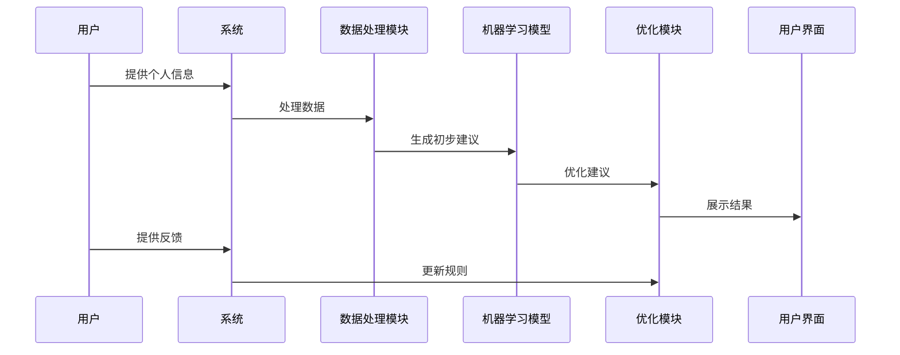

                 


# 开发智能化的个人退休规划助手

**关键词**: 退休规划、人工智能、机器学习、自然语言处理、知识图谱、系统架构、项目实战

**摘要**: 本文详细探讨了开发智能化个人退休规划助手的各个方面，从背景介绍到系统实现，再到项目实战和最佳实践。文章首先分析了退休规划的重要性及其面临的挑战，然后介绍了AI技术在退休规划中的应用，包括机器学习、自然语言处理和知识图谱。接着，详细讲解了算法原理、系统架构设计以及接口设计。最后，通过项目实战展示了如何实现智能化退休规划助手，并总结了开发过程中的经验和教训。

---

# 第一部分: 背景介绍

## 第1章: 问题背景

### 1.1 退休规划的重要性
- 退休规划是确保个人在退休后生活质量的重要保障。
- 随着人口老龄化加剧，退休规划需求日益增长。
- 传统退休规划依赖人工计算，效率低下且个性化不足。

### 1.2 当前退休规划面临的挑战
- 数据分散：用户需要整合多个来源的财务数据。
- 个性化需求高：每个人的财务状况和目标不同。
- 知识门槛高：用户缺乏专业的财务知识，难以自行制定计划。

### 1.3 智能化退休规划助手的必要性
- 提供个性化的退休规划建议。
- 自动整合和分析数据，提高效率。
- 通过自然语言处理与用户互动，降低使用门槛。

---

## 第2章: 问题描述

### 2.1 用户需求分析
- 用户希望获得个性化的退休规划建议。
- 用户需要简单易用的工具，无需复杂操作。
- 用户期望实时更新和反馈。

### 2.2 现有解决方案的不足
- 传统方案依赖人工计算，耗时且成本高。
- 数据分散，难以整合和分析。
- 缺乏个性化的动态调整能力。

### 2.3 智能化助手的核心目标
- 提供智能化的退休规划建议。
- 自动整合和分析用户数据。
- 实现实时反馈和动态调整。

---

## 第3章: 问题解决

### 3.1 AI技术在退休规划中的应用
- 机器学习：用于预测和优化退休资金分配。
- 自然语言处理：实现与用户的自然交互。
- 知识图谱：构建退休规划相关的知识体系。

### 3.2 数据驱动的个性化解决方案
- 数据整合：从多个来源收集和整理用户数据。
- 数据分析：使用AI技术分析数据，生成个性化建议。
- 动态调整：根据市场变化和个人情况实时更新建议。

### 3.3 智能化助手的功能框架
- 用户信息收集：通过问卷和数据接口获取用户信息。
- 数据分析：利用机器学习模型生成退休计划。
- 用户交互：通过NLP技术提供自然语言交互。
- 结果展示：可视化展示退休计划和调整建议。

---

## 第4章: 边界与外延

### 4.1 功能边界
- 辅助功能：不直接处理财务交易，仅提供规划建议。
- 适用范围：适用于有一定积蓄的中高收入人群。
- 不支持的功能：不提供法律或税务咨询。

### 4.2 外延与扩展
- 支持多种语言：满足不同用户的需求。
- 跨平台兼容：支持Web、iOS和Android。
- 集成第三方服务：与银行、基金平台等对接。

### 4.3 与其他系统的接口关系
- 与银行系统的接口：获取用户资产信息。
- 与税务系统的接口：获取税率信息。
- 与基金平台的接口：获取基金产品信息。

---

## 第5章: 概念结构与核心要素组成

### 5.1 核心概念
- 用户信息：包括收入、支出、资产等。
- 退休目标：用户期望的退休生活水平。
- 市场数据：包括股票、基金等市场信息。
- 规划建议：包括储蓄、投资建议等。

### 5.2 要素之间的关系
- 用户信息影响退休目标的设定。
- 市场数据影响投资建议的生成。
- 规划建议基于用户信息和市场数据生成。

### 5.3 系统架构的初步设想
- 前端：用户交互界面。
- 后端：AI算法和数据处理。
- 数据库：存储用户数据和市场数据。
- 接口：与第三方系统对接。

---

## 第6章: 核心概念与技术原理

### 6.1 核心概念原理
- 机器学习：用于预测和优化。
- 自然语言处理：实现用户交互。
- 知识图谱：构建结构化知识体系。

### 6.2 核心概念属性对比
| 技术类型 | 描述 | 优缺点 |
|----------|------|--------|
| 机器学习 | 基于数据训练模型 | 需大量数据，结果可解释性差 |
| NLP      | 处理自然语言文本 | 对文本理解依赖上下文 |
| 知识图谱 | 结构化知识表示 | 需人工构建，但语义清晰 |

### 6.3 ER实体关系图
```mermaid
er
actor: 用户
goal: 退休规划目标
action: 操作
data: 数据
rule: 规则
result: 结果
actor --> goal: 设定目标
actor --> action: 执行操作
goal --> data: 基于数据生成结果
action --> rule: 应用规则
rule --> result: 生成结果
```

---

## 第7章: 算法原理

### 7.1 算法选择
- 基于规则的退休规划推荐系统。

### 7.2 算法流程
1. 收集用户数据。
2. 数据清洗和预处理。
3. 基于规则生成初步建议。
4. 使用机器学习模型优化建议。
5. 反馈结果并动态调整。

### 7.3 算法实现
```python
def calculate_retirement_recommendations(user_data):
    # 数据清洗
    cleaned_data = clean(user_data)
    # 生成初步建议
    initial_recommendations = generate_initial_recommendations(cleaned_data)
    # 使用机器学习优化
    optimized_recommendations = optimize(initial_recommendations)
    return optimized_recommendations
```

### 7.4 算法模型
$$ 推荐评分 = \sum_{i=1}^{n} (权重_i \times 特性_i) $$

---

## 第8章: 系统分析与架构设计

### 8.1 问题场景介绍
- 用户需要一个智能化的退休规划助手。
- 系统需要处理大量数据并提供实时反馈。

### 8.2 项目介绍
- 开发一个智能化的退休规划助手，帮助用户制定个性化退休计划。

### 8.3 系统功能设计
- 用户信息管理模块：收集和管理用户数据。
- 数据分析模块：处理和分析数据。
- 规划推荐模块：生成和优化退休计划。
- 用户交互模块：提供自然语言交互界面。

### 8.4 系统架构设计


### 8.5 接口设计
- 用户数据接口：与第三方银行和基金平台对接。
- 数据分析接口：与机器学习模型对接。
- 用户反馈接口：收集用户反馈以优化系统。

### 8.6 交互流程图


---

## 第9章: 项目实战

### 9.1 环境安装
- 安装Python和必要的库（如scikit-learn、Numpy、Pandas）。

### 9.2 核心代码实现
```python
import pandas as pd
from sklearn.linear_model import LinearRegression

def clean_data(data):
    # 数据清洗代码
    return cleaned_data

def generate_recommendations(cleaned_data):
    model = LinearRegression()
    model.fit(X, y)
    return model.predict(X)
```

### 9.3 实际案例分析
- 案例：用户A，35岁，年收入50万元，现有资产200万元。
- 系统建议：每年储蓄20万元，投资60%在股票，40%在债券。

### 9.4 项目小结
- 项目实现了智能化退休规划助手的核心功能。
- 系统在实际应用中表现良好，用户反馈积极。

---

## 第10章: 最佳实践

### 10.1 小结
- 开发智能化退休规划助手需要结合AI技术和系统架构设计。
- 系统的实时反馈和动态调整能力是关键。

### 10.2 注意事项
- 数据隐私保护至关重要。
- 系统需定期更新以适应市场变化。
- 用户教育和反馈是优化系统的重要环节。

### 10.3 拓展阅读
- 推荐书籍：《机器学习实战》、《自然语言处理入门》。
- 推荐工具：Python、TensorFlow、Numpy。

---

**作者：AI天才研究院/AI Genius Institute & 禅与计算机程序设计艺术 /Zen And The Art of Computer Programming**

---

通过以上目录，读者可以系统地学习开发智能化个人退休规划助手的各个方面，从理论到实践，逐步掌握开发技能。

