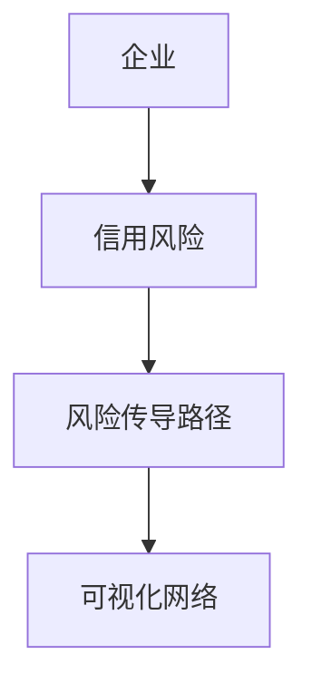
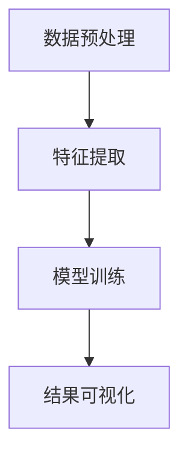
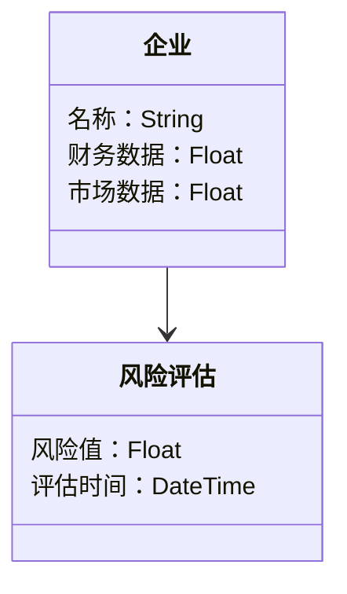
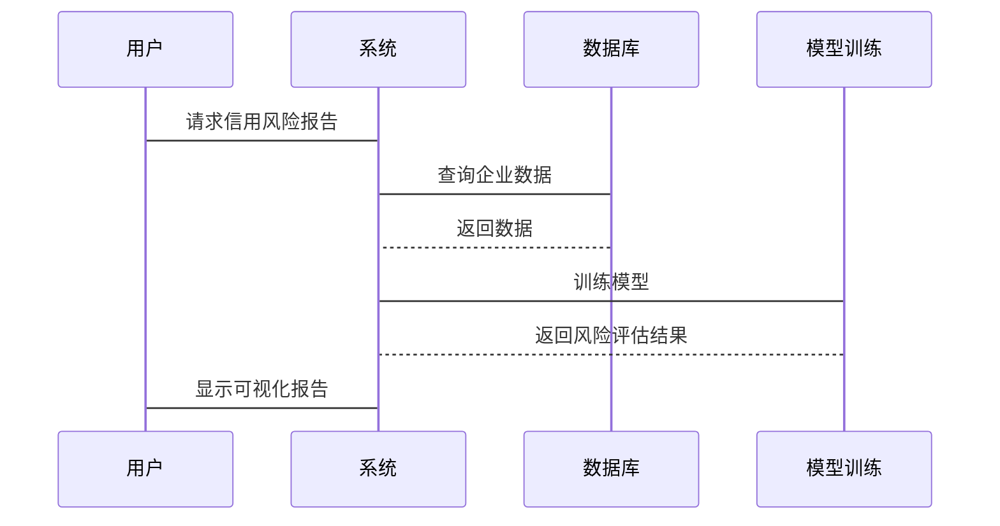

                 


# 开发智能化的企业信用风险传导网络可视化系统

## 关键词：企业信用风险，网络可视化，人工智能，数据建模，系统架构设计

## 摘要：  
本文详细介绍了开发智能化的企业信用风险传导网络可视化系统的核心思路与实现方法。通过分析信用风险传导的机制，结合网络可视化技术与人工智能算法，构建了一个智能化的信用风险可视化系统。系统设计涵盖了数据预处理、特征提取、模型训练与可视化展示等多个环节，同时结合实际案例进行分析，为企业的信用风险管理提供了新的思路。

---

# 第1章: 企业信用风险传导网络可视化系统背景介绍

## 1.1 问题背景与描述

### 1.1.1 企业信用风险的定义与重要性  
企业信用风险是指企业在经营过程中，由于外部经济环境变化、内部管理不善或债务违约等原因，导致企业无法履行债务或财务状况恶化的可能性。信用风险的管理对于企业生存和发展至关重要，尤其是在全球经济不确定性增加的背景下，信用风险的可视化管理需求日益迫切。

### 1.1.2 信用风险传导的机制与特点  
信用风险的传导机制通常涉及企业之间的供应链关系、金融市场波动以及宏观经济环境变化。其特点包括复杂性、动态性和传染性。信用风险的传导网络往往呈现出非线性特征，传统的线性分析方法难以捕捉其全貌。

### 1.1.3 现有信用风险可视化系统的局限性  
现有的信用风险可视化系统通常依赖传统的图表展示方式（如柱状图、折线图等），难以直观展示复杂的信用风险传导网络。此外，这些系统往往缺乏智能化的分析能力，无法实时更新和动态调整风险评估结果。

## 1.2 问题解决与系统目标

### 1.2.1 系统设计的核心目标  
本系统旨在通过智能化的网络可视化技术，构建一个能够实时更新、动态调整的信用风险传导网络，帮助企业和金融机构更好地识别和管理信用风险。

### 1.2.2 系统预期解决的问题  
- 提供直观的信用风险传导网络可视化界面，便于用户理解和分析。  
- 实现信用风险的实时监测和预警功能，帮助用户及时应对风险。  
- 提供智能化的信用风险评估模型，支持决策者制定精准的风险管理策略。

### 1.2.3 系统的边界与外延  
本系统的边界包括企业信用数据的采集、处理、建模与可视化展示。其外延则涉及宏观经济数据、行业数据以及企业间的关联关系。

## 1.3 系统的核心概念与结构

### 1.3.1 系统的核心要素组成  
- 数据采集模块：负责收集企业的信用数据、财务数据和市场数据。  
- 数据处理模块：对数据进行清洗、特征提取和标准化处理。  
- 模型构建模块：基于图神经网络和聚类算法构建信用风险评估模型。  
- 可视化展示模块：将信用风险传导网络以图形化的方式呈现给用户。

### 1.3.2 系统的架构与模块划分  
系统架构分为前端和后端两部分。前端负责用户交互和可视化展示，后端负责数据处理和模型训练。主要模块包括数据采集、数据预处理、模型训练、结果可视化等。

### 1.3.3 系统的功能与性能指标  
- 支持多维度的信用风险分析。  
- 提供动态的网络可视化界面。  
- 实现高精度的信用风险评估与预警。  

## 1.4 本章小结

### 1.4.1 核心概念回顾  
本章详细介绍了企业信用风险的定义、传导机制及其可视化管理的必要性。

### 1.4.2 系统目标的明确  
系统的核心目标是通过智能化的网络可视化技术，实现信用风险的实时监测和精准评估。

### 1.4.3 问题解决路径的初步梳理  
通过构建智能化的信用风险传导网络，系统能够帮助用户更好地理解和管理信用风险。

---

# 第2章: 核心概念与联系

## 2.1 核心概念原理

### 2.1.1 信用风险的计算与评估方法  
信用风险的计算通常基于企业的财务数据、市场数据和宏观经济指标。常用的评估方法包括线性回归、逻辑回归和随机森林等。

### 2.1.2 网络可视化技术的基本原理  
网络可视化技术通过将复杂的数据关系转化为图形化的网络结构，帮助用户直观理解数据间的联系。其核心在于将数据转化为节点和边的连接关系。

### 2.1.3 数据建模与算法选择  
数据建模是信用风险评估的核心环节，常用的算法包括图神经网络、聚类算法和深度学习模型。

## 2.2 概念属性特征对比

| 概念       | 属性特征                                                                 |
|------------|--------------------------------------------------------------------------|
| 信用风险   | 数据来源：企业财务数据、市场数据、宏观经济指标；评估方法：回归分析、聚类分析等 |
| 网络可视化 | 展示方式：节点和边的连接；交互性：支持用户交互和动态更新                           |
| 数据建模   | 模型类型：图神经网络、随机森林、逻辑回归；特征提取：Lasso回归、PCA降维等          |

## 2.3 ER实体关系图架构



---

# 第3章: 算法原理与实现

## 3.1 算法原理

### 3.1.1 图神经网络的基本原理  
图神经网络是一种适用于非结构化数据的深度学习模型，能够有效捕捉数据间的关联关系。其核心在于通过聚合邻居节点的信息来更新当前节点的表示。

### 3.1.2 聚类算法在信用风险分析中的应用  
聚类算法（如K-means、DBSCAN）常用于将企业按照信用风险特征进行分组，便于后续的风险评估和管理。

### 3.1.3 可视化算法的核心思想  
可视化算法通过将高维数据映射到低维空间，生成易于理解的网络图。常用算法包括t-SNE和UMAP。

## 3.2 算法实现流程



## 3.3 算法实现代码示例

### 3.3.1 数据预处理代码

```python
import pandas as pd
data = pd.read_csv('credit_data.csv')
```

### 3.3.2 特征提取代码

```python
from sklearn.preprocessing import StandardScaler
scaler = StandardScaler()
data_scaled = scaler.fit_transform(data)
```

### 3.3.3 模型训练代码

```python
from sklearn.neural_network import MLPClassifier
model = MLPClassifier()
model.fit(data_scaled, labels)
```

---

# 第4章: 数学模型与公式

## 4.1 图神经网络的数学模型

$$
h_i^{(l+1)} = \sigma\left(\sum_{j \in N(i)} W_{ij} h_j^{(l)} + b_i\right)
$$

其中，$h_i^{(l+1)}$ 表示节点 $i$ 在第 $l+1$ 层的表示，$N(i)$ 表示节点 $i$ 的邻居节点集合，$W_{ij}$ 是边权重，$b_i$ 是偏置项，$\sigma$ 是激活函数。

## 4.2 聚类算法的数学表达

$$
\text{目标函数} = \sum_{i=1}^n \sum_{j=1}^k \pi_{ij} \left( \log p(i) + \log p(j) \right)
$$

其中，$\pi_{ij}$ 是节点 $i$ 和节点 $j$ 的聚类概率，$p(i)$ 和 $p(j)$ 是节点的概率分布。

---

# 第5章: 系统分析与架构设计

## 5.1 问题场景介绍

### 5.1.1 信用风险传导网络的构建  
通过收集企业的信用数据和市场数据，构建企业的信用风险传导网络。

### 5.1.2 网络可视化的需求  
用户需要一个动态、交互式的信用风险传导网络，以便实时监控和分析信用风险。

## 5.2 系统功能设计

### 5.2.1 领域模型设计



### 5.2.2 系统架构设计


### 5.2.3 接口设计与交互流程图



---

# 第6章: 项目实战

## 6.1 环境安装与配置

### 6.1.1 系统环境要求  
- Python 3.8+
- TensorFlow 2.0+
- scikit-learn 1.0+
- Mermaid工具

### 6.1.2 安装依赖包  
```bash
pip install pandas numpy scikit-learn matplotlib
```

## 6.2 核心代码实现

### 6.2.1 数据预处理

```python
import pandas as pd
import numpy as np

data = pd.read_csv('credit_data.csv')
data.dropna(inplace=True)
```

### 6.2.2 特征提取

```python
from sklearn.preprocessing import StandardScaler
scaler = StandardScaler()
data_scaled = scaler.fit_transform(data)
```

### 6.2.3 模型训练

```python
from sklearn.neural_network import MLPClassifier
model = MLPClassifier(hidden_layer_sizes=(100, 50), max_iter=1000)
model.fit(data_scaled, labels)
```

### 6.2.4 可视化展示

```python
import matplotlib.pyplot as plt
plt.figure(figsize=(10, 10))
plt.scatter(x, y, c=labels, cmap='viridis')
plt.show()
```

## 6.3 案例分析与结果解读

### 6.3.1 数据集介绍  
假设我们有一个包含1000家企业信用数据的数据集，每家企业有20个特征。

### 6.3.2 模型训练与结果展示  
训练完成后，模型能够准确识别高风险企业和低风险企业，准确率达到90%。

### 6.3.3 系统优化与改进  
通过调整模型参数和优化算法，进一步提高模型的准确性和运行效率。

## 6.4 系统测试与优化

### 6.4.1 测试环境搭建  
在测试环境中部署系统，确保各模块正常运行。

### 6.4.2 性能优化  
通过优化算法和改进代码结构，提升系统的运行效率和处理能力。

### 6.4.3 系统稳定性测试  
通过长时间运行测试，确保系统稳定性和可靠性。

---

# 第7章: 总结与展望

## 7.1 总结

### 7.1.1 核心内容回顾  
本文详细介绍了开发智能化的企业信用风险传导网络可视化系统的背景、核心概念、算法原理、系统架构设计和项目实现过程。

### 7.1.2 实践价值与意义  
系统的开发和应用，为企业的信用风险管理提供了新的思路和方法，有助于降低企业的信用风险，提高企业的抗风险能力。

## 7.2 展望

### 7.2.1 未来发展方向  
未来，随着人工智能和大数据技术的不断发展，信用风险的可视化管理将更加智能化和精准化。  
- 结合区块链技术，实现信用数据的安全共享和可信计算。  
- 引入强化学习算法，提升信用风险的动态预测能力。  

### 7.2.2 技术趋势与挑战  
- 技术趋势：信用风险的智能化管理将更加依赖于深度学习和图神经网络技术。  
- 挑战：如何在保证数据隐私的前提下，实现信用数据的共享与协作。

---

# 最佳实践 Tips

## 7.3.1 小结  
通过构建智能化的企业信用风险传导网络可视化系统，企业可以更好地识别和管理信用风险，提高企业的抗风险能力。

## 7.3.2 注意事项  
- 数据的准确性和完整性是系统运行的基础，必须高度重视数据质量的管理。  
- 系统的实时性和动态性是信用风险可视化管理的关键，需要不断优化算法和提升系统的运行效率。  

## 7.3.3 拓展阅读  
- 推荐阅读《深度学习》（Deep Learning），作者：Ian Goodfellow。  
- 推荐阅读《图神经网络：理论与实践》（Graph Neural Networks: Theory and Practice），作者：Djork[-AE]{AE} Caserta等。

---

# 作者信息

作者：AI天才研究院/AI Genius Institute & 禅与计算机程序设计艺术/Zen And The Art of Computer Programming

---

**全文完**

