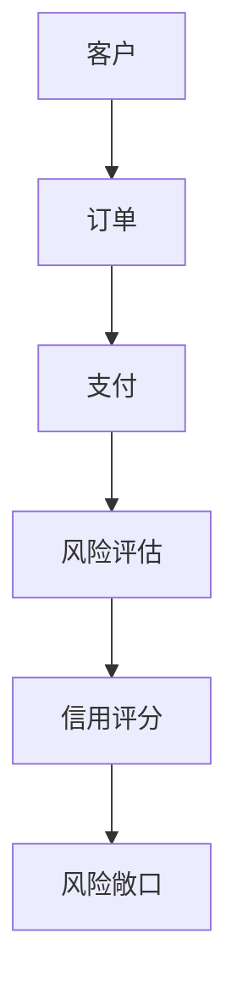
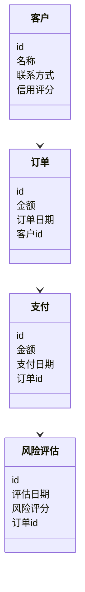
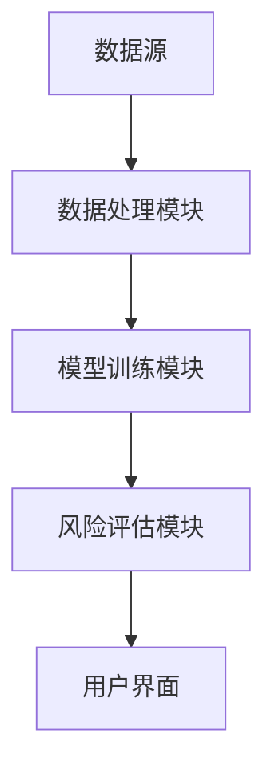
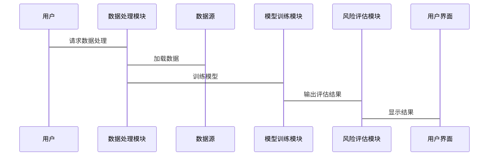

                 


# 开发智能化的企业信用风险敞口动态管理系统

> 关键词：企业信用风险，风险敞口，智能化管理，机器学习，大数据分析，系统架构设计

> 摘要：本文详细探讨了如何开发一个智能化的企业信用风险敞口动态管理系统。文章首先介绍了企业信用风险敞口的定义及其动态管理的必要性，然后阐述了系统的核心概念与联系，接着深入分析了算法原理及其数学模型，随后详细设计了系统的架构，并通过项目实战展示了系统的实现过程。最后，本文总结了最佳实践和拓展阅读，为读者提供了一个全面的技术指南。

---

## 第1章：企业信用风险敞口动态管理系统的背景与问题描述

### 1.1 企业信用风险敞口的定义与重要性

#### 1.1.1 信用风险的定义与内涵
信用风险是指由于交易对手方（客户或供应商）未能履行其财务义务而给企业带来的潜在损失。在企业经营中，信用风险是影响企业财务健康的重要因素。

#### 1.1.2 企业信用风险敞口的定义
企业信用风险敞口是指企业在一定时间内，由于客户的信用风险而可能遭受的最大潜在损失。敞口的大小取决于客户信用状况的变化和企业的风险管理能力。

#### 1.1.3 信用风险敞口动态管理的必要性
传统的信用风险管理通常基于静态数据分析，难以应对市场环境的快速变化。动态管理能够实时监控风险敞口的变化，及时采取措施，降低潜在损失。

---

### 1.2 问题背景与挑战

#### 1.2.1 传统信用风险管理的局限性
传统方法依赖人工审核和静态数据分析，效率低下且容易遗漏潜在风险。此外，人工判断的主观性可能导致决策失误。

#### 1.2.2 数字化与智能化时代的信用风险管理需求
随着大数据和人工智能技术的发展，企业需要更高效、准确的工具来管理信用风险敞口。智能化系统能够实时分析海量数据，提供实时预警和优化建议。

#### 1.2.3 企业信用风险敞口动态管理的痛点与难点
- 数据量大且复杂，难以高效处理。
- 风险敞口的变化速度快，需要实时响应。
- 数据隐私和安全问题。

---

### 1.3 问题解决思路与目标

#### 1.3.1 智能化管理的核心思想
利用机器学习和大数据分析技术，构建智能化系统，实时监控和预测信用风险敞口的变化。

#### 1.3.2 系统建设的目标与价值
- 实时监控和预测信用风险敞口。
- 提供风险预警和优化建议。
- 提高企业信用风险管理的效率和准确性。

#### 1.3.3 边界与外延
系统仅关注企业信用风险敞口的动态管理，不涉及企业的其他风险管理领域。

---

## 第2章：企业信用风险敞口动态管理的核心概念与联系

### 2.1 核心概念的原理与特征

#### 2.1.1 信用评分模型的原理
信用评分模型通过分析客户的信用历史、财务状况等指标，评估客户的信用风险等级。

#### 2.1.2 风险敞口的动态变化特征
风险敞口会随着市场环境和客户信用状况的变化而动态变化，需要实时监控。

#### 2.1.3 智能化管理的关键技术
- 机器学习算法。
- 大数据分析技术。
- 实时数据处理技术。

---

### 2.2 核心概念的属性特征对比

#### 2.2.1 信用评分模型的分类与对比
| 模型类型       | 描述                     | 优点                       | 缺点                       |
|----------------|--------------------------|-----------------------------|-----------------------------|
| 线性回归模型     | 基于线性关系预测信用评分   | 简单易实现                 | 鲁棒性差，适合线性关系     |
| 支持向量机模型   | 基于数据点的分类          | 高精度，适合小样本数据     | 参数选择敏感               |
| 神经网络模型     | 多层网络结构，非线性关系   | 强大学习能力，适合复杂数据 | 训练时间长，容易过拟合       |

---

### 2.3 ER实体关系图架构



---

## 第3章：企业信用风险敞口动态管理系统的算法原理

### 3.1 算法原理概述

#### 3.1.1 信用评分模型的分类
- 线性回归模型。
- 支持向量机模型。
- 神经网络模型。

#### 3.1.2 风险敞口动态预测的核心算法
- 使用机器学习算法预测信用风险。
- 基于时间序列分析的动态预测。

#### 3.1.3 算法的优缺点分析
- 线性回归模型：简单，但可能无法捕捉非线性关系。
- 支持向量机模型：高精度，但需要大量数据。
- 神经网络模型：强大学习能力，但训练时间长。

---

### 3.2 算法实现流程

#### 3.2.1 数据预处理流程
1. 数据清洗：去除重复数据和异常值。
2. 数据标准化：归一化处理。
3. 数据分割：训练集、验证集和测试集。

#### 3.2.2 模型训练流程
1. 数据加载。
2. 模型训练。
3. 模型评估。

#### 3.2.3 模型评估与优化流程
1. 模型评估：准确率、召回率。
2. 超参数优化：网格搜索。

---

### 3.3 算法实现的数学模型与公式

#### 3.3.1 线性回归模型
$$ y = \beta_0 + \beta_1x + \epsilon $$

#### 3.3.2 支持向量机模型
$$ \text{目标函数：最小化} \frac{1}{2}\|w\|^2 + C\sum_{i=1}^{n} \xi_i $$
$$ \text{约束条件：} y_i(w \cdot x_i + b) \geq 1 - \xi_i $$

#### 3.3.3 神经网络模型
$$ \text{输出层：} a^{(3)} = \sigma(w^{(2)}a^{(2)} + b^{(2)}) $$
$$ \text{隐藏层：} a^{(2)} = \sigma(w^{(1)}x + b^{(1)}) $$

---

### 3.4 算法实现的Python代码示例

#### 3.4.1 数据加载与预处理
```python
import pandas as pd
from sklearn.model_selection import train_test_split
from sklearn.preprocessing import StandardScaler

# 加载数据
data = pd.read_csv('credit_risk.csv')

# 分割特征和标签
X = data.drop('label', axis=1)
y = data['label']

# 数据分割
X_train, X_test, y_train, y_test = train_test_split(X, y, test_size=0.2)

# 标准化处理
scaler = StandardScaler()
X_train_scaled = scaler.fit_transform(X_train)
X_test_scaled = scaler.transform(X_test)
```

#### 3.4.2 模型训练
```python
from sklearn.linear_model import LogisticRegression

# 训练模型
model = LogisticRegression()
model.fit(X_train_scaled, y_train)
```

#### 3.4.3 模型评估
```python
from sklearn.metrics import accuracy_score

# 模型预测
y_pred = model.predict(X_test_scaled)

# 计算准确率
accuracy = accuracy_score(y_test, y_pred)
print(f'准确率：{accuracy}')
```

---

## 第4章：企业信用风险敞口动态管理系统的架构设计

### 4.1 系统功能设计

#### 4.1.1 领域模型类图


#### 4.1.2 系统架构图


#### 4.1.3 接口设计
- 数据接口：数据加载和处理。
- 模型接口：模型训练和预测。
- 用户接口：展示风险评估结果。

#### 4.1.4 交互序列图


---

## 第5章：企业信用风险敞口动态管理系统的项目实战

### 5.1 环境安装与配置

#### 5.1.1 安装依赖
```bash
pip install pandas scikit-learn numpy
```

#### 5.1.2 数据集准备
下载信用风险数据集，格式为CSV。

---

### 5.2 系统核心实现

#### 5.2.1 数据预处理代码
```python
import pandas as pd
from sklearn.model_selection import train_test_split
from sklearn.preprocessing import StandardScaler

# 加载数据
data = pd.read_csv('credit_risk.csv')

# 分割特征和标签
X = data.drop('label', axis=1)
y = data['label']

# 数据分割
X_train, X_test, y_train, y_test = train_test_split(X, y, test_size=0.2)

# 标准化处理
scaler = StandardScaler()
X_train_scaled = scaler.fit_transform(X_train)
X_test_scaled = scaler.transform(X_test)
```

#### 5.2.2 模型训练代码
```python
from sklearn.linear_model import LogisticRegression

# 训练模型
model = LogisticRegression()
model.fit(X_train_scaled, y_train)
```

#### 5.2.3 模型评估代码
```python
from sklearn.metrics import accuracy_score

# 模型预测
y_pred = model.predict(X_test_scaled)

# 计算准确率
accuracy = accuracy_score(y_test, y_pred)
print(f'准确率：{accuracy}')
```

---

### 5.3 实际案例分析

#### 5.3.1 数据分析
分析客户的信用评分分布，识别高风险客户。

#### 5.3.2 风险评估
基于模型预测，评估客户的信用风险等级。

#### 5.3.3 系统优化
根据评估结果，优化模型参数，提高预测准确率。

---

## 第6章：最佳实践、小结与注意事项

### 6.1 最佳实践

#### 6.1.1 数据质量管理
确保数据的准确性和完整性。

#### 6.1.2 模型优化
定期更新模型，适应市场变化。

#### 6.1.3 系统安全性
加强数据安全措施，防止数据泄露。

---

### 6.2 小结

本文详细介绍了企业信用风险敞口动态管理系统的开发过程，从背景到实现，再到应用，为读者提供了一个全面的技术指南。

---

### 6.3 注意事项

- 数据隐私和安全问题需高度重视。
- 系统需定期更新，以适应市场变化。
- 模型的选择和优化需结合实际业务需求。

---

### 6.4 拓展阅读

- 《机器学习实战》。
- 《大数据分析与应用》。
- 《信用风险管理》。

---

## 作者信息

作者：AI天才研究院/AI Genius Institute & 禅与计算机程序设计艺术 /Zen And The Art of Computer Programming

---

以上是《开发智能化的企业信用风险敞口动态管理系统》的技术博客文章的完整大纲和内容，涵盖背景、核心概念、算法原理、系统架构设计、项目实战及最佳实践等多个方面，确保内容详实、逻辑清晰，为读者提供了一个全面的技术指南。

