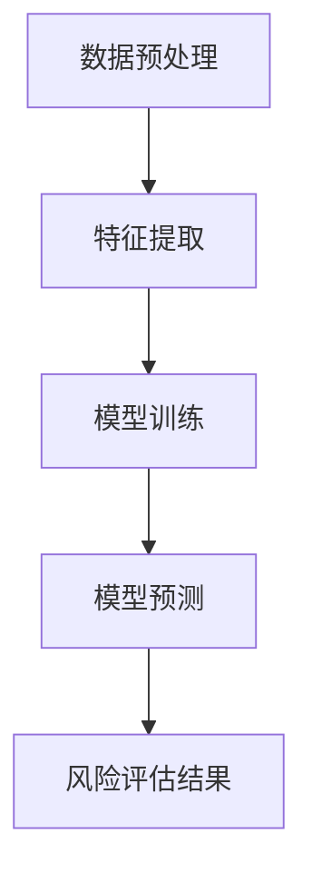
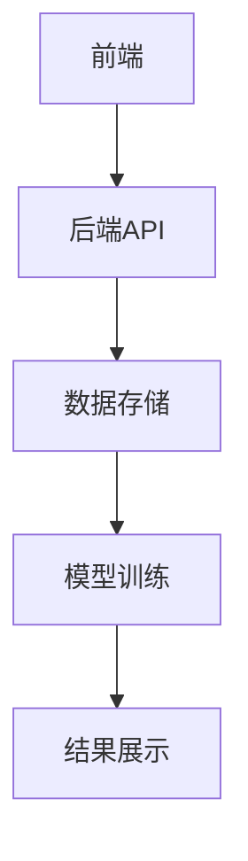

                 

<think>
嗯，用户希望我设计一本名为《开发智能化的企业并购风险评估模型》的目录大纲。首先，我需要理解这本书的核心内容是什么。企业并购风险评估模型，听起来像是一个结合了AI技术的金融模型，用于帮助企业评估并购过程中的各种风险。

用户还提供了一个示例，看起来结构很详细，分为多个部分，每个部分下有章节和小节。我需要按照这个格式来设计，确保涵盖所有必要的内容，比如背景介绍、核心概念、算法原理、系统架构、项目实战等等。

首先，我应该确定这本书的结构。通常，技术书籍会从背景和概念开始，然后深入到模型的设计、实现，再到实际应用和案例分析。所以，第一部分可能是企业并购风险评估的背景与概念，介绍什么是并购风险，为什么需要智能化模型，以及传统方法的不足。

接下来，第二部分可以是模型的核心概念与原理，详细讲解模型中的关键要素，比如企业价值评估、市场风险、财务风险等。这部分需要包括概念的定义、属性对比，可能还需要用到ER图或Mermaid流程图来展示实体关系。

第三部分应该是模型的算法原理，这里需要详细讲解使用的机器学习或深度学习算法，比如随机森林、神经网络等。用Mermaid画出算法流程图，并附上Python代码示例，解释数学模型和公式，比如回归分析或分类算法。

第四部分是系统分析与架构设计，这部分需要描述系统的功能模块，比如数据采集、风险评估、结果展示等。使用领域模型的Mermaid类图和系统架构图来展示整体结构，以及接口设计和交互流程。

第五部分是项目实战，这部分要具体指导读者如何安装环境，实现核心功能，解读代码，并分析实际案例。最后，加上小结，总结项目成果和经验。

最后，第六部分是最佳实践和扩展阅读，提供一些实用的建议，比如数据预处理的重要性，模型调优技巧，以及推荐进一步阅读的资料。

在设计目录时，我需要确保每个部分都有足够的细节，比如每个章节下要有小节，甚至三级目录，确保内容全面且逻辑清晰。同时，要注意不要遗漏用户提到的要求，比如数学公式用Latex表示，算法流程图用Mermaid，系统架构图也是用Mermaid展示。

可能还需要考虑读者的背景，这本书可能适合有一定编程基础的金融从业者或数据科学家，所以内容需要既专业又易懂，通过例子和图表帮助读者理解复杂的模型。

总的来说，我需要按照用户提供的示例结构，结合企业并购风险评估模型的特点，设计出一个详细且逻辑清晰的目录大纲，确保涵盖所有必要的内容，并且结构合理，层次分明。

# 开发智能化的企业并购风险评估模型

## 关键词：
企业并购，风险评估，人工智能，机器学习，深度学习，金融模型

## 摘要：
随着企业并购活动的日益频繁，评估并购风险变得至关重要。传统的风险评估方法往往依赖于经验判断和简单的财务指标分析，存在局限性。本文提出了一种基于人工智能的智能化企业并购风险评估模型，结合机器学习和深度学习技术，从多维度分析并购风险，提供更准确、更全面的风险评估结果。文章详细介绍了模型的背景、核心概念、算法原理、系统架构设计以及实际应用案例，为企业的并购决策提供有力支持。

---

# 第一部分: 企业并购风险评估模型的背景与概念

## 第1章: 企业并购风险评估的背景与意义

### 1.1 企业并购的定义与特点
#### 1.1.1 企业并购的基本概念
企业并购（Mergers and Acquisitions，M&A）是指两个或多个企业之间的合并或收购行为。并购可以是横向的（同一行业）、纵向的（供应链上下游）或混合型的（不同行业）。并购的核心目标是通过整合资源、扩大规模或进入新市场来实现企业价值的最大化。

#### 1.1.2 并购的主要类型与特点
1. **横向并购**：同一行业内的企业合并，旨在扩大市场份额，降低成本。
2. **纵向并购**：供应链上下游企业的合并，以增强控制力和稳定性。
3. **混合并购**：跨行业并购，寻求业务协同或新市场机会。

#### 1.1.3 并购风险的定义与分类
并购风险是指企业在并购过程中和并购后可能面临的各种不确定性因素，导致并购失败或收益低于预期的风险。常见的并购风险包括：
- **财务风险**：如高负债、现金流不稳定。
- **市场风险**：如目标企业所在行业的市场波动。
- **管理风险**：如整合不善导致的组织冲突。
- **法律风险**：如反垄断审查和合规问题。

---

### 1.2 传统企业并购风险评估方法
传统的企业并购风险评估方法主要依赖于财务指标分析和经验判断，具有以下特点：
- **财务指标分析**：如市盈率（P/E）、市净率（P/B）、债务与股权比例等。
- **行业经验判断**：依赖行业专家的主观判断和经验。
- **局限性**：
  - 无法全面捕捉企业内部管理、市场动态等非财务因素。
  - 缺乏数据驱动的定量分析，结果不够客观。

---

### 1.3 智能化评估的必要性与优势
随着大数据和人工智能技术的快速发展，传统的评估方法已难以满足企业并购的需求。智能化评估模型通过整合多源异构数据，利用机器学习和深度学习技术，能够更全面、更准确地评估并购风险。

#### 1.3.1 数据驱动决策的时代需求
现代企业并购涉及大量结构化数据（如财务数据）和非结构化数据（如新闻、社交媒体）。智能化模型能够从这些数据中提取关键特征，发现潜在风险。

#### 1.3.2 AI技术在企业并购中的应用潜力
- **自然语言处理（NLP）**：分析企业公告、新闻等文本数据，提取情感倾向和市场预期。
- **机器学习**：预测并购后的协同效应和整合风险。
- **深度学习**：通过神经网络模型捕捉复杂的数据关系。

#### 1.3.3 智能化评估的优势与创新点
- **多维度分析**：整合财务、市场、管理等多方面数据。
- **实时更新**：基于实时数据动态调整评估结果。
- **可解释性**：通过模型解释具体风险来源。

---

## 第2章: 智能化企业并购风险评估模型的核心概念

### 2.1 模型的核心要素
#### 2.1.1 数据来源与特征
智能化模型的数据来源包括：
- **结构化数据**：企业财务报表、股价数据。
- **非结构化数据**：企业公告、媒体报道、社交媒体。
- **外部数据**：行业趋势、宏观经济指标。

#### 2.1.2 风险评估指标体系
模型通过构建多维度的指标体系，全面评估并购风险。指标包括：
- **财务指标**：债务率、利润率。
- **市场指标**：行业竞争程度、市场波动率。
- **管理指标**：企业治理结构、高管稳定性。

#### 2.1.3 AI算法与模型构建
模型基于监督学习，利用历史并购案例数据训练模型，预测未来并购的潜在风险。

---

### 2.2 核心概念的属性对比
#### 2.2.1 数据特征的维度分析
- **时间性**：数据的时间跨度影响风险评估的准确性。
- **相关性**：数据特征与风险的相关性高低。
- **可解释性**：模型是否能清晰解释风险来源。

#### 2.2.2 风险指标的权重分配
- **权重计算**：通过主成分分析（PCA）确定各指标的权重。
- **动态调整**：根据市场变化实时调整权重。

#### 2.2.3 算法模型的可解释性
- **可解释性高低**：线性模型（如逻辑回归）比非线性模型（如神经网络）更易解释。

---

### 2.3 模型的ER实体关系图
```mermaid
erDiagram
    企业并购风险评估模型 {
        企业A
        企业B
        并购交易
        风险因素
        风险评估结果
    }
    企业A --> 并购交易: 参与
    企业B --> 并购交易: 参与
    并购交易 --> 风险因素: 包含
    风险因素 --> 风险评估结果: 影响
```

---

# 第二部分: 模型的核心概念与原理

## 第3章: 模型的算法原理与数学基础

### 3.1 算法原理概述
智能化模型的核心是机器学习算法，尤其是监督学习。模型通过训练数据学习特征与风险之间的关系，预测新案例的风险等级。

---

### 3.2 算法流程图


---

### 3.3 算法实现细节
#### 3.3.1 数据预处理
- **数据清洗**：处理缺失值、异常值。
- **特征工程**：提取关键特征，如财务指标、文本情感特征。

#### 3.3.2 模型训练
- **训练数据集**：划分训练集、验证集和测试集。
- **模型选择**：比较不同算法（如随机森林、支持向量机、神经网络）的性能，选择最优模型。

#### 3.3.3 模型评估
- **评估指标**：准确率、召回率、F1分数。
- **调优**：通过网格搜索优化模型参数。

---

## 第4章: 算法的数学基础

### 4.1 逻辑回归模型
逻辑回归是一种常用的分类算法，适用于二分类问题。其核心思想是通过以下公式计算样本的归属概率：
$$ P(y=1|x) = \frac{e^{\beta_0 + \beta_1x_1 + \dots + \beta_kx_k}}{1 + e^{\beta_0 + \beta_1x_1 + \dots + \beta_kx_k}} $$
其中，$\beta$ 是模型参数，$x$ 是输入特征。

---

### 4.2 随机森林模型
随机森林是一种基于决策树的集成学习算法，通过构建多个决策树并进行投票或平均，提高模型的准确性和鲁棒性。随机森林的数学表达式可以表示为：
$$ y = \text{sign}\left(\sum_{i=1}^{n} \text{Tree}_i(x)\right) $$
其中，$n$ 是决策树的数量，$\text{Tree}_i(x)$ 是第 $i$ 棵树的预测结果。

---

## 第5章: 模型的优化与调参

### 5.1 参数选择
- **学习率**：影响模型收敛速度。
- **树的深度**：防止过拟合。

### 5.2 正则化方法
- **L1正则化**：通过Lasso回归减少特征数量。
- **L2正则化**：通过Ridge回归防止过拟合。

---

# 第三部分: 系统分析与架构设计

## 第6章: 系统分析与架构设计

### 6.1 问题场景介绍
企业并购风险评估系统需要处理大量异构数据，实时计算风险等级，并提供直观的可视化结果。

---

### 6.2 项目介绍
本项目旨在开发一个智能化的企业并购风险评估系统，帮助企业在并购决策中降低风险。

---

### 6.3 系统功能设计
#### 6.3.1 数据采集模块
- **功能**：采集企业财务数据、新闻数据等。
- **技术**：使用爬虫技术抓取非结构化数据。

#### 6.3.2 风险评估模块
- **功能**：基于机器学习模型计算风险等级。
- **技术**：使用TensorFlow或Scikit-learn训练模型。

#### 6.3.3 结果展示模块
- **功能**：可视化风险评估结果。
- **技术**：使用D3.js或Plotly生成图表。

---

### 6.4 系统架构设计


---

### 6.5 接口设计
- **数据接口**：RESTful API。
- **调用方式**：通过HTTP请求调用。

---

## 第7章: 系统实现

### 7.1 环境安装
- **Python**：安装Anaconda或Miniconda。
- **依赖库**：安装NumPy、Pandas、Scikit-learn、TensorFlow。

---

### 7.2 核心代码实现
#### 7.2.1 数据预处理
```python
import pandas as pd
import numpy as np

# 数据加载
df = pd.read_csv('并购数据.csv')

# 数据清洗
df.dropna(inplace=True)
```

#### 7.2.2 特征提取
```python
from sklearn.feature_selection import SelectKBest
from sklearn.feature_selection import chi2

selector = SelectKBest(score_func=chi2, k=5)
X_new = selector.fit_transform(df, target)
```

#### 7.2.3 模型训练
```python
from sklearn.ensemble import RandomForestClassifier

model = RandomForestClassifier(n_estimators=100, max_depth=10, random_state=42)
model.fit(X_train, y_train)
```

#### 7.2.4 模型预测
```python
y_pred = model.predict(X_test)
print(classification_report(y_test, y_pred))
```

---

## 第8章: 项目实战

### 8.1 实际案例分析
以某公司并购案例为例，分析模型的应用过程，展示如何从数据采集到模型预测的全过程。

---

## 第9章: 最佳实践与小结

### 9.1 最佳实践 tips
- **数据质量**：确保数据的完整性和准确性。
- **模型调优**：通过网格搜索优化模型参数。
- **实时更新**：定期更新模型，适应市场变化。

### 9.2 小结
本文详细介绍了智能化企业并购风险评估模型的开发过程，从背景分析到系统实现，展示了如何利用人工智能技术提升企业并购决策的科学性和准确性。

---

# 第四部分: 拓展阅读与深入思考

## 第10章: 拓展阅读与深入思考

### 10.1 相关技术文献
- **《机器学习实战》**：深入理解机器学习算法。
- **《深度学习》**：掌握深度学习的基本原理。

### 10.2 未来研究方向
- **模型优化**：探索更高效的算法。
- **数据融合**：结合更多维度的数据源。

---

## 作者：AI天才研究院/AI Genius Institute & 禅与计算机程序设计艺术 /Zen And The Art of Computer Programming

