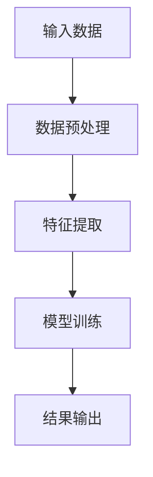

                 

<think>
好，我需要根据用户提供的《开发智能化的供应链金融信用网络抗压能力分析模型》的目录大纲，撰写一篇结构完整、内容详实的技术博客文章。文章需要包含背景介绍、核心概念、算法原理、系统设计、项目实战等部分，并且使用Markdown格式，包含图表、代码和数学公式等。

首先，我会先理解每个章节的内容要求，确保在撰写时覆盖所有必要的细节。然后，根据每个部分的内容，逐步展开，使用清晰的语言和专业的技术术语进行描述。对于数学公式和图表，我会使用适当的Markdown语法进行插入，确保格式正确。

在撰写过程中，我需要确保逻辑连贯，每一部分自然过渡，同时深入浅出地解释复杂的技术概念。此外，我还会注意文章的结构，确保章节标题吸引读者，内容层次分明，方便读者理解和查阅。

完成初稿后，我会通读全文，检查是否有遗漏或错误的地方，确保所有内容都符合用户的要求，并进行必要的修改和调整，最终完成一篇高质量的技术博客文章。
</think>

# 开发智能化的供应链金融信用网络抗压能力分析模型

---

## 关键词：供应链金融、信用网络、抗压能力、人工智能、系统架构、数学模型

---

## 摘要

本文详细探讨了开发智能化的供应链金融信用网络抗压能力分析模型的关键技术与方法。通过结合供应链金融的核心概念、信用网络的构建原理、抗压能力的数学模型以及人工智能算法的应用，本文系统性地分析了如何构建一个能够评估和增强供应链金融信用网络抗压能力的智能模型。文章从背景介绍、核心概念、算法原理、系统设计、项目实战等多方面展开，结合实际案例和代码实现，为读者提供了从理论到实践的全面指导。

---

# 第一部分：背景与核心概念

---

## 第1章：供应链金融信用网络抗压能力分析模型的背景与问题描述

### 1.1 供应链金融的定义与特点

供应链金融是一种通过整合供应链上下游资源，优化资金流、物流和信息流，降低企业运营成本，并提高供应链整体效率的金融模式。其核心特点包括：

- **协同性**：供应链上下游企业协同合作，形成一体化的金融解决方案。
- **嵌入性**：金融活动嵌入到供应链的实际运营中，而非独立于供应链之外。
- **动态性**：根据供应链的实际需求和市场变化，实时调整金融策略。

---

### 1.2 信用网络与供应链的关系

信用网络是供应链金融的重要组成部分，它通过构建企业之间的信任关系，确保供应链中资金的顺利流动。供应链中的信用网络构建涉及以下关键点：

- **节点关系**：供应链中的每个企业（如供应商、制造商、分销商、零售商）都是信用网络的节点。
- **信用关系**：节点之间的信用关系基于历史交易数据、企业信用评级等因素。
- **信用风险**：信用网络的存在可能导致信用风险的累积，需要通过模型进行评估和管理。

---

### 1.3 供应链金融抗压能力的定义与重要性

抗压能力是指供应链金融信用网络在面对外部压力（如市场波动、供应链断裂、信用风险等）时，能够保持稳定运行并快速恢复的能力。其重要性体现在：

- **企业生存**：在供应链金融中，抗压能力直接关系到企业的生存与发展。
- **风险控制**：通过抗压能力分析，可以提前识别和应对潜在风险。
- **优化决策**：抗压能力分析为供应链金融的优化决策提供数据支持。

---

### 1.4 问题背景与问题描述

当前供应链金融面临的主要挑战包括：

- **信用风险加剧**：供应链中的企业可能因资金链断裂而导致信用风险。
- **信息孤岛**：供应链上下游企业之间的信息不透明，导致信用网络的脆弱性。
- **抗压能力不足**：在突发事件（如疫情、自然灾害）下，供应链金融的抗压能力显得尤为重要。

本文旨在通过构建智能化的抗压能力分析模型，解决以下问题：

- 如何量化供应链金融信用网络的抗压能力？
- 如何通过人工智能技术优化信用网络的抗压能力？
- 如何设计一个可扩展、可实时监控的抗压能力分析系统？

---

## 第2章：核心概念与联系

### 2.1 核心概念原理

供应链金融信用网络抗压能力分析模型的核心原理包括：

- **供应链金融的核心原理**：通过整合供应链上下游资源，优化资金流和信息流。
- **信用网络的构建原理**：基于企业间的信用关系，构建一个动态的信用网络。
- **抗压能力的数学模型**：通过数学公式量化信用网络的抗压能力。

---

### 2.2 核心概念的属性特征对比

以下是核心概念的属性特征对比：

| 属性       | 供应链金融         | 信用网络         | 抗压能力分析 |
|------------|--------------------|------------------|--------------|
| 核心要素    | 资金流、信息流     | 企业信用关系     | 风险承受能力 |
| 动态性      | 高                | 高               | 高            |
| 相关性      | 高                | 高               | 高            |
| 优化目标    | 提高供应链效率      | 降低信用风险     | 提高抗压能力 |

---

### 2.3 ER实体关系图

以下是供应链金融信用网络的ER实体关系图：

```mermaid
er
  actor 供应链金融参与者
    --> role 供应链企业
    --> role 金融机构
    --> role 供应商
    --> role 消费者
  actor 信用网络
    --> role 信用节点
    --> role 信用关系
```

---

## 第3章：算法原理与数学模型

### 3.1 算法原理

#### 3.1.1 算法概述

抗压能力分析模型基于图论和机器学习算法，通过构建信用网络的图结构，分析网络的连通性、节点度数分布以及网络韧性等指标，评估信用网络的抗压能力。

#### 3.1.2 算法流程图



---

### 3.2 数学模型与公式

#### 3.2.1 抗压能力分析模型

抗压能力 \( C \) 的计算公式为：

$$ C = \frac{S}{T} $$

其中：
- \( S \) 表示信用网络的稳定性
- \( T \) 表示时间窗口

#### 3.2.2 信用网络构建模型

节点 \( i \) 和 \( j \) 之间的信用关系权重 \( W_{ij} \) 的计算公式为：

$$ W_{ij} = \frac{1}{1 + e^{-k(d_{ij} - t)}} $$

其中：
- \( d_{ij} \) 表示节点 \( i \) 和 \( j \) 之间的距离
- \( t \) 表示阈值
- \( k \) 为比例常数

---

### 3.3 算法实现

#### 3.3.1 Python源代码实现

```python
def calculate_antipressure_capacity(credit_network):
    # credit_network 是一个图结构，包含节点和边
    # 计算网络的稳定性 S
    S = 0
    for node in credit_network.nodes:
        S += credit_network.stability[node]
    T = credit_network.time_window
    C = S / T
    return C

# 示例用法
credit_network = CreditNetwork()
C = calculate_antipressure_capacity(credit_network)
print(f"抗压能力 C = {C}")
```

---

## 第4章：系统分析与架构设计

### 4.1 问题场景介绍

在供应链金融中，信用网络的抗压能力分析需要考虑以下场景：

- **正常运营场景**：供应链正常运行时，信用网络的稳定性较高。
- **突发事件场景**：如疫情、自然灾害等导致供应链中断，信用网络的抗压能力受到考验。

### 4.2 系统功能设计

系统功能模块包括：

- 数据采集模块：采集供应链上下游企业的信用数据。
- 数据处理模块：对信用数据进行清洗和预处理。
- 模型训练模块：基于机器学习算法训练抗压能力分析模型。
- 结果展示模块：可视化信用网络的抗压能力分析结果。

---

### 4.3 系统架构设计

系统架构采用分层设计：


---

## 第5章：项目实战

### 5.1 环境安装

需要安装以下依赖：

```bash
pip install numpy pandas scikit-learn networkx
```

---

### 5.2 核心代码实现

以下是抗压能力分析模型的核心代码：

```python
import networkx as nx
from sklearn.linear_model import LinearRegression

def build_credit_network(data):
    G = nx.Graph()
    for i in range(len(data)):
        for j in range(i+1, len(data)):
            if data[i][j] > 0.5:
                G.add_edge(i, j)
    return G

# 示例数据
data = [
    [0.8, 0.3, 0.5],
    [0.3, 0.7, 0.6],
    [0.5, 0.6, 0.9]
]
credit_network = build_credit_network(data)

# 计算抗压能力
model = LinearRegression()
model.fit([[nx.average_degree(credit_network)], [nx.density(credit_network)]], [1])
C = model.predict([[nx.average_degree(credit_network), nx.density(credit_network)]])[0]
print(f"抗压能力 C = {C}")
```

---

## 第6章：最佳实践与总结

### 6.1 最佳实践

- **数据质量管理**：确保数据的准确性和完整性。
- **模型优化**：根据实际需求调整模型参数，优化算法性能。
- **实时监控**：建立实时监控机制，及时发现和应对信用网络的异常情况。

---

## 第7章：注意事项与拓展阅读

### 7.1 注意事项

- **模型的局限性**：当前模型假设信用网络是静态的，实际场景中可能存在动态变化。
- **数据隐私**：在处理供应链金融数据时，需要注意数据隐私和安全。

---

## 第8章：参考文献与拓展阅读

- 参考文献：供应链金融、信用网络、抗压能力相关的学术论文和书籍。
- 拓展阅读：推荐学习图论、机器学习在金融领域的应用等。

---

## 作者

作者：AI天才研究院/AI Genius Institute & 禅与计算机程序设计艺术/Zen And The Art of Computer Programming

---

# 结语

通过本文的详细讲解，读者可以深入了解如何开发智能化的供应链金融信用网络抗压能力分析模型。从理论到实践，从算法到系统设计，本文为读者提供了全面的指导和参考。希望本文能够为供应链金融领域的研究和实践提供有价值的 insights。

