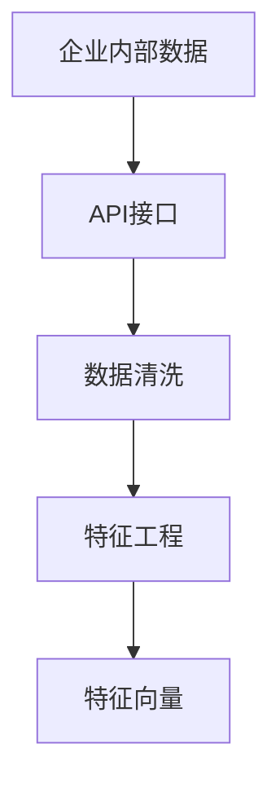
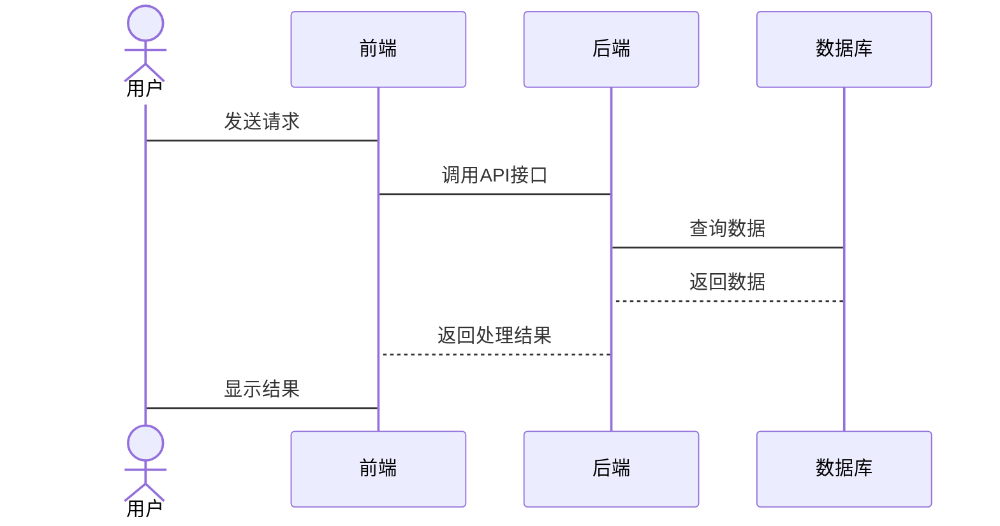
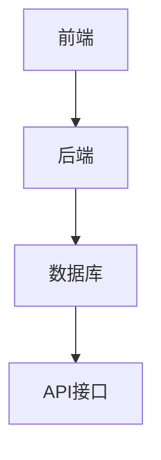

                 


# 开发智能化的供应链金融信用评级模型

## 关键词

供应链金融，信用评级，人工智能，机器学习，数学建模

## 摘要

供应链金融是现代企业运营中的重要组成部分，而信用评级则是供应链金融中的关键环节。随着人工智能和大数据技术的发展，智能化的信用评级模型逐渐成为供应链金融的核心竞争力。本文将从供应链金融的背景与核心概念出发，详细讲解信用评级模型的算法原理、数学模型、系统架构设计以及项目实战，最后总结最佳实践和注意事项。

---

# 第四部分: 供应链金融信用评级模型的系统分析与架构设计

## 第4章: 供应链金融数据的获取与预处理

### 4.1 数据来源与特征

#### 4.1.1 数据来源
供应链金融中的数据来源包括企业内部数据（如财务数据、交易记录）和外部数据（如行业数据、市场数据）。通过API接口获取实时数据，并通过数据清洗和特征工程提取关键特征。

#### 4.1.2 数据清洗与特征工程
- 数据清洗：处理缺失值、异常值和重复数据。
- 特征工程：将原始数据转换为有用的特征，例如将销售额转化为年增长率。

#### 4.1.3 数据流图


### 4.2 供应链金融数据的特征

#### 4.2.1 企业基本面特征
- 财务数据：收入、利润、负债等。
- 经营数据：订单量、交货周期等。

#### 4.2.2 供应链关系特征
- 供应商稳定性：供应商数量、合作时间。
- 客户关系：客户分布、合同履行情况。

#### 4.2.3 市场环境特征
- 行业周期：行业增长率、竞争程度。
- 宏观经济指标：GDP、利率等。

### 4.3 数据预处理与特征提取的Python实现

#### 4.3.1 数据清洗代码示例
```python
import pandas as pd

# 读取数据
data = pd.read_csv('supply_chain.csv')

# 处理缺失值
data = data.dropna()

# 处理重复数据
data = data.drop_duplicates()

# 处理异常值
# 使用IQR方法检测异常值
Q1 = data['revenue'].quantile(0.25)
Q3 = data['revenue'].quantile(0.75)
IQR = Q3 - Q1
lower_bound = Q1 - 1.5 * IQR
upper_bound = Q3 + 1.5 * IQR
data = data[(data['revenue'] >= lower_bound) & (data['revenue'] <= upper_bound)]
```

#### 4.3.2 特征工程代码示例
```python
from sklearn.preprocessing import StandardScaler

# 提取特征
features = data[['revenue', 'profit', '负债率']]
scaler = StandardScaler()
features_scaled = scaler.fit_transform(features)

# 保存处理后的数据
data['scaled_revenue'] = features_scaled[:, 0]
data['scaled_profit'] = features_scaled[:, 1]
data.to_csv('processed_supply_chain.csv', index=False)
```

## 第5章: 供应链金融信用评级模型的算法原理与数学模型

### 5.1 算法原理

#### 5.1.1 逻辑回归算法
- 原理：通过sigmoid函数将线性回归的结果映射到概率空间。
- 优势：简单易用，适合二分类问题。
- 劣势：对特征分布敏感，适合线性可分的数据。

#### 5.1.2 支持向量机（SVM）
- 原理：通过构建超平面将数据分成两类。
- 优势：适合小样本数据，鲁棒性好。
- 劣势：对高维数据处理能力较弱。

#### 5.1.3 随机森林
- 原理：通过构建多个决策树进行投票或平均。
- 优势：适合高维数据，抗过拟合能力强。
- 劣势：解释性较差。

### 5.2 算法选择与模型训练

#### 5.2.1 选择合适的算法
- 根据数据量和特征数量选择算法。
- 通过交叉验证评估模型性能。

#### 5.2.2 模型训练代码示例
```python
from sklearn.model_selection import train_test_split
from sklearn.linear_model import LogisticRegression
from sklearn.metrics import accuracy_score

# 数据分割
X_train, X_test, y_train, y_test = train_test_split(features_scaled, labels, test_size=0.2, random_state=42)

# 模型训练
model = LogisticRegression()
model.fit(X_train, y_train)

# 模型评估
y_pred = model.predict(X_test)
print("准确率：", accuracy_score(y_test, y_pred))
```

### 5.3 数学模型与公式

#### 5.3.1 逻辑回归模型
- 概率公式：
  $$ P(y=1|x) = \frac{e^{\beta_0 + \beta_1x}}{1 + e^{\beta_0 + \beta_1x}} $$
- 损失函数：
  $$ L = -\sum_{i=1}^{n} [y_i \ln p_i + (1 - y_i)\ln(1 - p_i)] $$

#### 5.3.2 随机森林模型
- 树的构建：基于特征的随机选择和样本的随机抽取。
- 预测概率：通过投票或加权平均计算。

### 5.4 模型优化与调优

#### 5.4.1 超参数调优
- 使用网格搜索（Grid Search）或随机搜索（Random Search）优化模型参数。

#### 5.4.2 模型评估指标
- 准确率（Accuracy）
- 精确率（Precision）
- 召回率（Recall）
- F1分数（F1 Score）

#### 5.4.3 模型优化代码示例
```python
from sklearn.model_selection import GridSearchCV

# 定义参数范围
param_grid = {'C': [0.1, 1, 10], 'penalty': ['l1', 'l2']}

# 超参数调优
grid_search = GridSearchCV(LogisticRegression(), param_grid, cv=5)
grid_search.fit(X_train, y_train)

# 输出最佳参数
print("最佳参数：", grid_search.best_params_)
```

## 第6章: 供应链金融信用评级系统的架构设计

### 6.1 系统架构设计

#### 6.1.1 系统功能模块
- 数据采集模块：从数据库中获取供应链数据。
- 数据处理模块：清洗和特征工程。
- 模型训练模块：训练和优化信用评级模型。
- 结果展示模块：可视化评分结果。

#### 6.1.2 系统架构图


### 6.2 系统实现细节

#### 6.2.1 数据库设计
- 数据表结构：企业信息表、交易记录表、信用评分表。
- 数据库接口：使用REST API进行数据交互。

#### 6.2.2 系统接口设计
- API接口：用于数据采集和模型调用。
- 接口文档：详细描述输入参数和输出格式。

#### 6.2.3 系统交互流程


### 6.3 系统实现代码示例

#### 6.3.1 API接口代码
```python
from flask import Flask, request, jsonify

app = Flask(__name__)

@app.route('/api/v1/credit_score', methods=['POST'])
def credit_score():
    data = request.json
    # 数据处理逻辑
    return jsonify({'status': 'success', 'score': 85})

if __name__ == '__main__':
    app.run(debug=True)
```

#### 6.3.2 系统架构图


## 第7章: 项目实战与案例分析

### 7.1 项目实战

#### 7.1.1 环境安装
- 安装Python和必要的库（如Pandas、Scikit-learn、Flask）。
- 安装Jupyter Notebook用于数据分析和建模。

#### 7.1.2 核心代码实现
- 数据处理：读取数据、清洗、特征工程。
- 模型训练：选择算法、训练、优化。
- 系统部署：编写API接口，部署到服务器。

#### 7.1.3 案例分析
- 以某企业为例，详细讲解数据处理和模型训练过程。
- 展示评分结果，并分析模型的优缺点。

### 7.2 最佳实践

#### 7.2.1 数据处理注意事项
- 数据清洗要彻底，避免遗漏异常值。
- 特征工程要结合业务背景，选择有意义的特征。

#### 7.2.2 模型选择建议
- 根据数据量和特征数量选择合适的算法。
- 多尝试不同的模型，进行交叉验证。

#### 7.2.3 系统部署技巧
- 使用容器化技术（如Docker）部署系统。
- 定期更新模型，保持评分结果的准确性。

### 7.3 项目小结

#### 7.3.1 小结
通过本章的实战，读者可以掌握从数据处理到系统部署的完整流程。

#### 7.3.2 注意事项
- 数据隐私保护：确保数据安全，避免泄露。
- 模型更新：定期重新训练模型，适应市场变化。

#### 7.3.3 拓展阅读
- 供应链金融的最新技术动态。
- 更高级的机器学习算法（如XGBoost、神经网络）在信用评级中的应用。

---

# 结语

开发智能化的供应链金融信用评级模型是一个复杂的系统工程，需要结合业务背景、数据分析能力和技术实现。通过本文的讲解，读者可以掌握从数据处理到系统部署的完整流程，并能够根据实际需求进行模型优化和系统改进。未来，随着人工智能和大数据技术的不断发展，供应链金融信用评级模型将更加智能化和精准化，为企业创造更大的价值。

---

# 作者

作者：AI天才研究院/AI Genius Institute & 禅与计算机程序设计艺术 /Zen And The Art of Computer Programming

