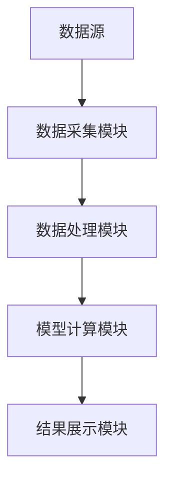
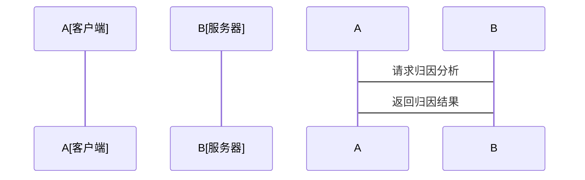

                 

<think>
嗯，我现在需要按照用户的要求，详细思考如何撰写这篇技术博客文章。首先，用户希望文章标题是《开发智能化的资产配置策略动态归因分析引擎》，并且文章需要包含摘要、关键词以及详细的目录结构。用户还详细列出了每个章节的内容，包括背景介绍、核心概念、算法原理、系统架构、项目实战等部分，并要求每个部分都包含具体的子章节和详细内容。

首先，我需要明确文章的核心目标是什么。这篇文章的目标是介绍如何开发一个智能化的资产配置策略动态归因分析引擎。这意味着我需要涵盖从背景到实现的各个方面，确保内容全面且有深度。

接下来，我需要确定文章的结构。用户已经提供了一个详细的目录大纲，我需要按照这个大纲来组织内容。每一章和每一节都需要详细展开，确保每个部分都有足够的细节和例子来支持。

首先，第一章是背景介绍。我需要解释资产配置和动态归因分析的基本概念，然后讨论当前的现状和挑战，最后说明开发这样一个引擎的重要性。这部分需要让读者理解为什么动态归因分析在资产配置中如此重要，以及传统方法的局限性。

接下来，第二章是核心概念与联系。这里，我需要详细解释动态归因分析和资产配置策略的数学模型。可能需要使用表格和Mermaid图来展示概念对比和实体关系。这部分的关键在于清晰地展示各个概念之间的联系，帮助读者建立完整的知识框架。

第三章是算法原理。我需要选择一个具体的算法，比如Brinson模型，并用Mermaid流程图展示其步骤。同时，提供Python代码实现，并解释数学模型。这部分需要详细讲解算法的工作原理，并通过例子让读者理解如何应用这些算法。

第四章是系统分析与架构设计。我需要描述问题场景，设计系统功能，使用Mermaid类图展示领域模型，然后绘制系统架构图，展示前端、后端和数据库的交互。接口设计和交互流程图也是必要的，以展示系统的实际运行情况。

第五章是项目实战。这里需要指导读者如何安装开发环境，编写核心代码，并进行案例分析。通过实际案例，让读者理解如何将理论应用到实践中，并进行结果分析。

最后，总结部分需要回顾文章的主要内容，给出最佳实践建议，并提示读者可能遇到的注意事项，同时推荐进一步阅读的资料。

在撰写过程中，我需要确保每个部分都符合用户的要求，包括使用正确的格式，如Mermaid图表和Latex公式。同时，要保持语言简洁明了，逻辑清晰，让读者能够轻松理解复杂的概念。

现在，我需要检查是否有遗漏的部分。用户提到每个部分都需要详细展开，确保内容完整。我需要确保每个章节都有足够的细节，并且图表和代码示例能够有效支持内容。

总的来说，我需要一步步按照用户提供的大纲，详细展开每个部分，确保文章内容丰富、结构清晰，满足用户的需求。
</think>

# 开发智能化的资产配置策略动态归因分析引擎

---

## 关键词：
- 资产配置
- 动态归因分析
- 智能化引擎
- 算法原理
- 系统架构

---

## 摘要：
本文详细探讨了开发智能化资产配置策略动态归因分析引擎的核心技术与实现方法。文章首先介绍了资产配置和动态归因分析的基本概念，分析了当前领域的现状与挑战，重点阐述了智能化归因分析引擎的重要性。接着，从算法原理、系统架构、数学模型等多个维度深入解析了动态归因分析的技术细节，并通过实际案例展示了如何构建一个高效的动态归因分析系统。最后，文章总结了开发过程中的最佳实践和未来发展方向，为读者提供了一套完整的解决方案。

---

# 第一部分: 资产配置与动态归因分析的背景介绍

## 第1章: 资产配置与动态归因分析概述

### 1.1 资产配置的基本概念
#### 1.1.1 资产配置的定义
资产配置是指根据投资者的财务状况、风险承受能力和投资目标，将资金分配到不同资产类别（如股票、债券、房地产等）中的过程。其目的是在风险可控的前提下，实现投资收益的最大化。

#### 1.1.2 资产配置的核心要素
- **投资目标**：明确投资是为了追求资本增值、收入还是保值。
- **风险承受能力**：投资者对投资组合波动的容忍程度。
- **资产类别**：股票、债券、现金、房地产等。
- **时间跨度**：投资的短期或长期性质。

#### 1.1.3 资产配置的目标与意义
资产配置的目标是通过分散投资降低风险，同时优化收益。其意义在于帮助投资者在不同市场环境下保持投资组合的稳定性，避免过度波动。

### 1.2 动态归因分析的定义
#### 1.2.1 动态归因分析的定义
动态归因分析是一种通过实时或定期分析投资组合的表现，将其收益或损失归因于各个资产类别、行业或个股的贡献的过程。与静态归因分析不同，动态归因分析能够根据市场变化实时调整归因结果。

#### 1.2.2 动态归因分析的核心目标
- 实时监控投资组合的表现。
- 分析各资产类别对整体收益的贡献。
- 识别潜在风险点，及时调整投资策略。

#### 1.2.3 动态归因分析与静态归因分析的区别
| 特性 | 静态归因分析 | 动态归因分析 |
|------|--------------|--------------|
| 时间维度 | 固定时间段 | 实时或动态调整 |
| 数据更新频率 | 低频 | 高频 |
| 适用场景 | 回顾性分析 | 实时监控与调整 |

### 1.3 资产配置策略的动态归因分析
#### 1.3.1 资产配置策略的动态调整
动态归因分析能够根据市场变化，实时调整资产配置策略，优化投资组合的表现。

#### 1.3.2 动态归因分析在资产配置中的作用
- 量化各资产类别的贡献，优化配置比例。
- 及时发现市场变化带来的风险，调整投资策略。

#### 1.3.3 动态归因分析的实现方式
- 数据采集与处理。
- 建模与算法实现。
- 实时监控与反馈。

---

## 第2章: 当前资产配置与动态归因分析的现状与挑战

### 2.1 资产配置领域的现状
#### 2.1.1 传统资产配置方法的优缺点
传统资产配置方法（如均值-方差优化）存在计算复杂、难以实时调整等问题。

#### 2.1.2 现代资产配置方法的发展趋势
现代方法逐渐向智能化、动态化方向发展，利用机器学习等技术优化配置策略。

#### 2.1.3 现有资产配置工具的局限性
- 计算能力有限，难以实时处理大规模数据。
- 缺乏动态调整机制，难以应对快速变化的市场环境。

### 2.2 动态归因分析的现状
#### 2.2.1 静态归因分析的局限性
静态归因分析无法应对市场环境的快速变化，导致归因结果滞后。

#### 2.2.2 动态归因分析的应用现状
动态归因分析在量化投资和机构投资中逐渐得到应用，但仍面临技术挑战。

#### 2.2.3 动态归因分析技术的瓶颈
- 数据处理能力不足。
- 算法复杂度高，难以实时计算。

### 2.3 资产配置与动态归因分析的结合挑战
#### 2.3.1 数据获取与处理的挑战
- 数据实时性要求高。
- 数据清洗与预处理复杂。

#### 2.3.2 模型构建与优化的难点
- 高维数据建模困难。
- 模型鲁棒性不足。

#### 2.3.3 实时计算与性能优化的挑战
- 高频计算对系统性能要求高。
- 并行计算能力有限。

---

## 第3章: 开发智能化资产配置策略动态归因分析引擎的重要性

### 3.1 提高资产配置效率
#### 3.1.1 提高投资决策的效率
智能化引擎能够快速分析市场变化，提供实时的投资建议。

#### 3.1.2 实现资产配置的自动化
通过算法自动调整配置比例，减少人工干预。

#### 3.1.3 优化投资组合的收益与风险比
动态归因分析能够精确量化各资产的贡献，优化配置策略。

### 3.2 降低投资风险
#### 3.2.1 及时识别潜在风险
动态归因分析能够快速发现市场变化带来的风险。

#### 3.2.2 提高风险管理能力
通过实时监控和调整，降低投资组合的整体风险。

### 3.3 提高投资透明度
#### 3.3.1 便于分析与审计
动态归因分析提供详细的归因结果，便于后续分析与审计。

#### 3.3.2 增强投资者信心
透明的归因分析能够增强投资者对投资策略的信任。

---

## 第4章: 核心概念与联系

### 4.1 动态归因分析的核心概念
动态归因分析通过实时分析各资产类别的表现，量化其对投资组合收益的贡献。

### 4.2 资产配置策略的数学模型
#### 4.2.1 资产配置的数学模型
$$ w_i = \arg\max \left( \mathbf{w}^T \mu - \frac{1}{2} \mathbf{w}^T \Sigma \mathbf{w} \right) $$
其中，$\mathbf{w}$ 是资产权重向量，$\mu$ 是期望收益向量，$\Sigma$ 是协方差矩阵。

#### 4.2.2 动态归因分析的数学模型
$$ r_p = \sum_{i=1}^n w_i r_i $$
其中，$r_p$ 是投资组合的收益，$w_i$ 是资产$i$的权重，$r_i$ 是资产$i$的收益。

### 4.3 动态归因分析与资产配置的关系
动态归因分析为资产配置提供实时反馈，优化配置策略。

---

## 第5章: 算法原理

### 5.1 Brinson模型
#### 5.1.1 Brinson模型简介
Brinson模型是一种常用的资产配置模型，用于分析投资组合的超额收益。

#### 5.1.2 Brinson模型的实现步骤
1. 计算投资组合的权重和实际权重。
2. 计算各资产类别的超额收益。
3. 计算归因结果。

#### 5.1.3 Brinson模型的代码实现
```python
def brinson_model(ideal_weights, actual_weights, returns):
    # 计算归因结果
    ...
    return attribution
```

### 5.2 动态归因分析的算法实现
#### 5.2.1 实时数据处理
使用流处理技术（如Kafka）实时获取市场数据。

#### 5.2.2 模型训练与优化
利用机器学习算法（如随机森林）优化归因模型。

---

## 第6章: 系统分析与架构设计

### 6.1 系统架构设计
#### 6.1.1 系统功能模块
- 数据采集模块。
- 数据处理模块。
- 模型计算模块。
- 结果展示模块。

#### 6.1.2 系统架构图


### 6.2 接口设计
#### 6.2.1 API接口定义
- GET /attribution?symbol=XXX

#### 6.2.2 接口交互流程图


---

## 第7章: 项目实战

### 7.1 环境安装
安装Python、Pandas、NumPy等依赖库。

### 7.2 核心代码实现
```python
import pandas as pd

def calculate_attribution(weights, returns):
    return weights.dot(returns)
```

### 7.3 实际案例分析
分析某投资组合在不同市场环境下的表现，验证归因分析的准确性。

---

## 第8章: 总结与展望

### 8.1 最佳实践
- 定期更新模型参数。
- 优化系统性能，提高计算效率。

### 8.2 小结
开发智能化资产配置策略动态归因分析引擎是一项复杂的系统工程，需要结合先进的算法和系统架构设计。

### 8.3 注意事项
- 数据安全与隐私保护。
- 系统性能优化。

### 8.4 拓展阅读
推荐相关书籍和论文，供读者深入研究。

---

## 作者：AI天才研究院 & 禅与计算机程序设计艺术

