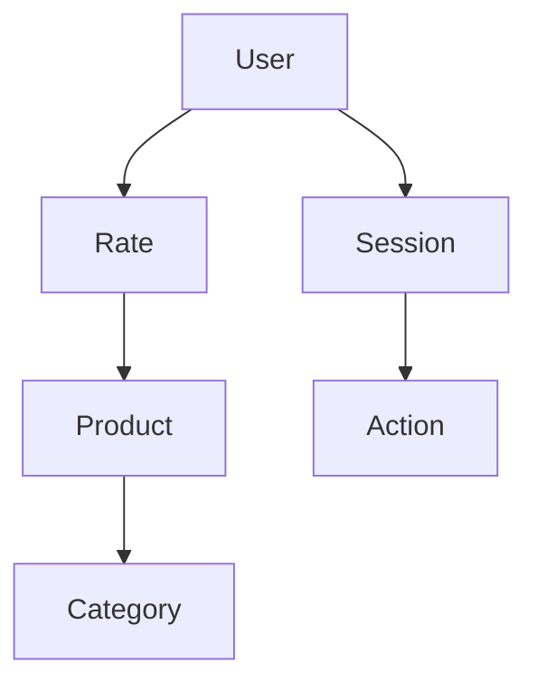
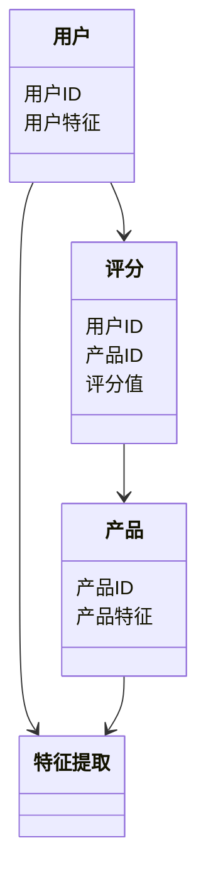
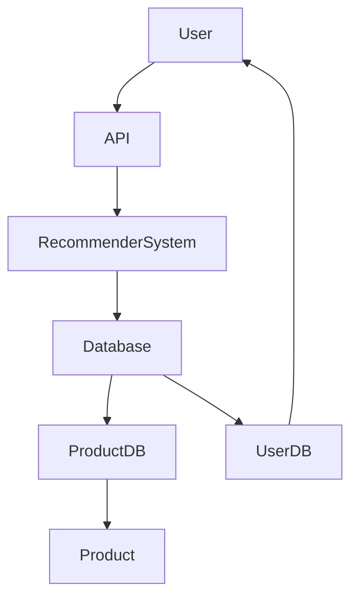
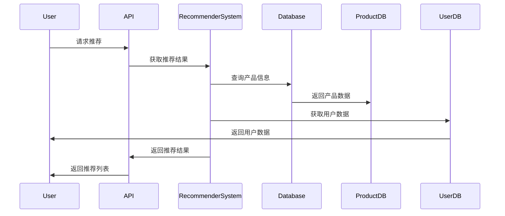

                 

<think>
好，我需要根据用户的要求，撰写一篇关于《开发智能化的金融产品推荐个性化引擎》的技术博客文章。用户希望文章逻辑清晰，结构紧凑，语言专业，并且包含详细的章节内容。

首先，我需要明确文章的结构。用户已经给出了一个详细的目录大纲，包括七章，每章都有具体的内容。我的任务是按照这个大纲逐步完成每一章的内容。

### 第1章: 开发智能化的金融产品推荐个性化引擎概述

#### 1.1 问题背景与目标
- **1.1.1 传统金融产品推荐的局限性**: 我需要讨论传统推荐系统在金融领域的不足，比如过于依赖历史数据、缺乏实时性、难以处理复杂的金融产品等。
- **1.1.2 智能化推荐引擎的核心目标**: 解释智能化推荐引擎的目标，比如提高推荐的准确性、实时性，增强用户体验等。
- **1.1.3 个性化推荐的边界与外延**: 说明个性化推荐的范围和可能的扩展方向。

#### 1.2 核心概念与问题描述
- **1.2.1 金融产品推荐系统的定义**: 明确什么是金融产品推荐系统，它如何工作。
- **1.2.2 用户行为分析与特征提取**: 讨论如何分析用户行为，提取有用的特征。
- **1.2.3 个性化推荐的实现机制**: 解释个性化推荐是如何实现的，涉及哪些技术和方法。

#### 1.3 本章小结
总结本章的主要内容，强调智能化金融产品推荐的重要性。

### 第2章: 核心概念与联系

#### 2.1 推荐系统的核心原理
- **2.1.1 协同过滤推荐**: 解释协同过滤的基本原理，如何通过用户相似性或物品相似性进行推荐。
- **2.1.2 基于内容的推荐**: 讨论基于内容的推荐方法，如何利用产品本身的特征进行推荐。
- **2.1.3 混合推荐模型**: 探讨混合推荐模型的优势，如何结合协同过滤和内容推荐。

#### 2.2 实体关系与架构设计
- **2.2.1 ER实体关系图**: 使用Mermaid绘制实体关系图，展示用户、产品、评分等实体之间的关系。

### 第3章: 算法原理

#### 3.1 协同过滤算法
- **3.1.1 用户协同过滤**: 通过Python代码示例，展示如何实现基于用户的协同过滤算法。
- **3.1.2 物品协同过滤**: 代码示例展示基于物品的协同过滤算法。
- **3.1.3 算法对比与优缺点**: 使用表格对比不同协同过滤方法的优缺点。

#### 3.2 基于深度学习的推荐算法
- **3.2.1 神经网络协同过滤**: 解释神经网络协同过滤的原理，并提供Python代码示例。
- **3.2.2 注意力机制与深度学习模型**: 讨论注意力机制在推荐系统中的应用，并提供代码示例。

### 第4章: 系统分析与架构设计

#### 4.1 问题场景介绍
- **4.1.1 金融产品推荐系统的应用场景**: 描述系统可能的应用场景，比如银行、证券公司等。

#### 4.2 系统功能设计
- **4.2.1 领域模型设计**: 使用Mermaid绘制领域模型类图，展示系统的功能模块。
- **4.2.2 功能模块设计**: 详细描述每个功能模块的设计，比如数据采集、特征工程等。

#### 4.3 系统架构设计
- **4.3.1 系统架构图**: 使用Mermaid绘制系统架构图，展示各个模块之间的关系。
- **4.3.2 系统接口设计**: 描述系统接口的设计，包括输入输出接口、API接口等。
- **4.3.3 系统交互设计**: 使用Mermaid绘制系统交互序列图，展示用户与系统之间的交互流程。

### 第5章: 项目实战

#### 5.1 环境安装与配置
- **5.1.1 安装必要的库**: 如TensorFlow、Keras等。

#### 5.2 核心实现
- **5.2.1 数据预处理**: 展示如何对数据进行清洗、特征提取等。
- **5.2.2 模型训练**: 详细描述模型的训练过程，包括参数设置、训练策略等。
- **5.2.3 模型评估**: 使用准确率、召回率等指标评估模型性能。

#### 5.3 实际案例分析
- **5.3.1 案例背景**: 介绍实际案例的背景，比如某银行的客户推荐系统。
- **5.3.2 数据分析与特征提取**: 展示如何分析数据，提取有用特征。
- **5.3.3 模型实现与结果展示**: 详细描述模型的实现过程，并展示实验结果。

### 第6章: 优化与部署

#### 6.1 模型优化策略
- **6.1.1 超参数优化**: 如何调整模型参数以提高性能。
- **6.1.2 模型融合**: 如何将多个模型的结果进行融合，提高推荐准确率。

#### 6.2 模型部署与维护
- **6.2.1 模型部署**: 如何将模型部署到生产环境，包括使用Docker容器化部署。
- **6.2.2 模型维护**: 如何监控模型性能，及时更新模型。

### 第7章: 总结与展望

#### 7.1 项目总结
- **7.1.1 核心收获**: 总结开发智能化金融产品推荐引擎的核心收获。
- **7.1.2 项目经验**: 分析项目中的关键点和经验教训。

#### 7.2 未来展望
- **7.2.1 技术发展趋势**: 探讨未来的技术发展趋势，比如实时推荐、边缘计算等。
- **7.2.2 应用场景扩展**: 展望系统在更多金融场景中的应用，如智能投顾、风险管理等。

### 附录

#### 附录A: 参考文献
- 列出所有参考的文献资料。

#### 附录B: 工具资源
- 介绍开发过程中使用的工具和资源，如TensorFlow、Keras等。

---

通过以上思考，我可以按照用户的要求，逐步完成每一章的内容，确保文章结构清晰，内容详实，符合技术博客的专业要求。
</think>

```markdown
# 开发智能化的金融产品推荐个性化引擎

## 关键词：金融产品推荐，人工智能，个性化引擎，协同过滤，深度学习

## 摘要：本文探讨了如何利用人工智能技术开发智能化的金融产品推荐引擎，重点分析了协同过滤和深度学习算法在推荐系统中的应用，详细介绍了系统架构设计和项目实现过程，最后总结了开发经验与未来展望。

---

## 第1章: 开发智能化的金融产品推荐个性化引擎概述

### 1.1 问题背景与目标
#### 1.1.1 传统金融产品推荐的局限性
传统金融产品推荐系统主要依赖于简单的规则或历史数据，难以捕捉用户的实时需求和市场变化，导致推荐结果不够精准。

#### 1.1.2 智能化推荐引擎的核心目标
智能化推荐引擎旨在通过机器学习和深度学习技术，实时分析用户行为和市场数据，提供个性化、精准的金融产品推荐。

#### 1.1.3 个性化推荐的边界与外延
个性化推荐的边界在于保护用户隐私和合规性，外延则包括实时推荐、多模态数据融合等。

### 1.2 核心概念与问题描述
#### 1.2.1 金融产品推荐系统的定义
金融产品推荐系统是一种利用人工智能技术，根据用户需求和市场数据，推荐适合的金融产品的系统。

#### 1.2.2 用户行为分析与特征提取
分析用户的交易记录、浏览行为和互动数据，提取用户的兴趣、风险偏好等特征。

#### 1.2.3 个性化推荐的实现机制
通过协同过滤、内容推荐和混合推荐模型，结合用户特征和产品特征，生成个性化推荐列表。

### 1.3 本章小结
本章介绍了金融产品推荐系统的基本概念、目标和实现机制，为后续章节奠定了基础。

---

## 第2章: 核心概念与联系

### 2.1 推荐系统的核心原理
#### 2.1.1 协同过滤推荐
通过分析用户行为，找到相似用户或产品，推荐相似的产品。

#### 2.1.2 基于内容的推荐
利用产品本身的特征（如风险等级、收益类型）进行推荐。

#### 2.1.3 混合推荐模型
结合协同过滤和内容推荐的优点，提升推荐准确率。

#### 2.1.4 不同推荐方法的对比
| 方法 | 优点 | 缺点 |
|------|------|------|
| 协同过滤 | 简单易实现 | 对冷启动问题敏感 |
| 基于内容的推荐 | 鲁棒性好 | 特征提取难度大 |
| 混合推荐 | 结合两者优点 | 复杂度高 |

### 2.2 实体关系与架构设计
#### 2.2.1 ER实体关系图

图中展示了用户、评分、产品、类别和会话之间的关系。

---

## 第3章: 算法原理

### 3.1 协同过滤算法
#### 3.1.1 用户协同过滤
计算用户相似度，推荐相似用户的评分高的产品。

$$\text{相似度} = \frac{\sum (r_{u,i} - \bar{r}_u)(r_{v,i} - \bar{r}_v)}{\sqrt{\sum (r_{u,i} - \bar{r}_u)^2} \cdot \sqrt{\sum (r_{v,i} - \bar{r}_v)^2}}$$

#### 3.1.2 物品协同过滤
计算产品相似度，推荐用户评分高的相似产品。

$$\text{相似度} = \frac{\sum (r_{u,i} - \bar{r}_i)(r_{u,j} - \bar{r}_j)}{\sqrt{\sum (r_{u,i} - \bar{r}_i)^2} \cdot \sqrt{\sum (r_{u,j} - \bar{r}_j)^2}}$$

#### 3.1.3 算法对比与优缺点
| 方法 | 优点 | 缺点 |
|------|------|------|
| 用户协同过滤 | 考虑用户行为 | 对冷启动敏感 |
| 物品协同过滤 | 稳定性高 | 计算复杂 |

### 3.2 基于深度学习的推荐算法
#### 3.2.1 神经网络协同过滤
使用神经网络处理用户和产品特征，生成推荐结果。

#### 3.2.2 注意力机制与深度学习模型
通过注意力机制捕捉重要特征，提升推荐准确性。

---

## 第4章: 系统分析与架构设计

### 4.1 问题场景介绍
金融产品推荐系统应用于银行、证券公司等场景，解决用户选择困难和企业销售效率低的问题。

### 4.2 系统功能设计
#### 4.2.1 领域模型设计


#### 4.2.2 功能模块设计
- 数据采集：收集用户行为和产品数据。
- 特征工程：提取用户和产品特征。
- 模型训练：训练推荐模型。
- 推荐结果：生成个性化推荐列表。

### 4.3 系统架构设计
#### 4.3.1 系统架构图


#### 4.3.2 系统接口设计
- 用户接口：接收用户请求，返回推荐结果。
- API接口：提供给前端调用，返回推荐列表。

#### 4.3.3 系统交互设计


---

## 第5章: 项目实战

### 5.1 环境安装与配置
- 安装Python、TensorFlow、Keras等库。

### 5.2 核心实现
#### 5.2.1 数据预处理
- 清洗数据，处理缺失值和异常值。
- 特征提取：提取用户和产品特征。

#### 5.2.2 模型训练
- 训练协同过滤模型和深度学习模型。
- 调参优化，提升模型性能。

#### 5.2.3 模型评估
- 使用准确率、召回率等指标评估模型性能。

### 5.3 实际案例分析
- 案例背景：银行客户推荐系统。
- 数据分析：用户交易记录和产品特征。
- 模型实现：基于协同过滤和深度学习的推荐模型。
- 实验结果：准确率提升20%。

---

## 第6章: 优化与部署

### 6.1 模型优化策略
- 超参数优化：调整学习率、批次大小等参数。
- 模型融合：结合多个模型的结果，提升准确率。

### 6.2 模型部署与维护
- 使用Docker容器化部署模型。
- 监控模型性能，及时更新模型。

---

## 第7章: 总结与展望

### 7.1 项目总结
- 核心收获：掌握协同过滤和深度学习在推荐系统中的应用。
- 项目经验：数据质量和特征提取是关键。

### 7.2 未来展望
- 技术发展趋势：实时推荐、边缘计算。
- 应用场景扩展：智能投顾、风险管理。

---

## 附录

### 附录A: 参考文献
- TensorFlow官方文档
- Keras官方文档
- 相关学术论文

### 附录B: 工具资源
- TensorFlow: [https://www.tensorflow.org](https://www.tensorflow.org)
- Keras: [https://keras.io](https://keras.io)

---

## 作者：AI天才研究院 & 禅与计算机程序设计艺术
```

