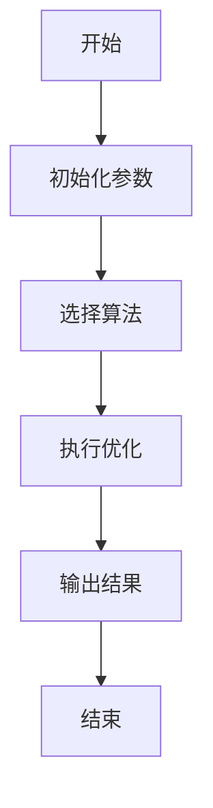
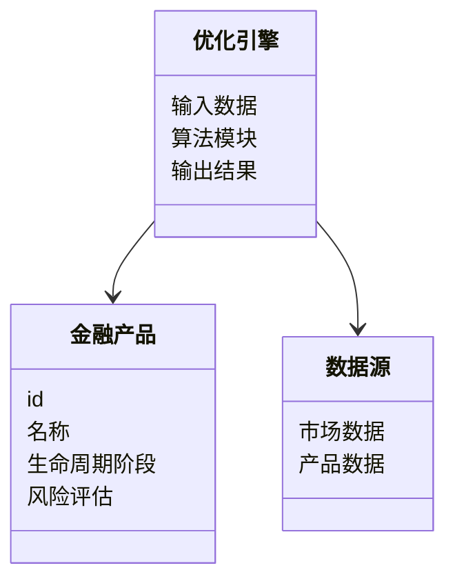
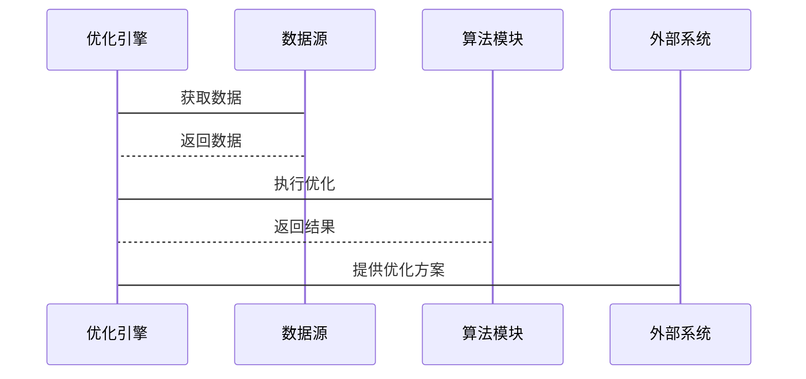

                 


# 开发智能化的金融产品生命周期管理与优化引擎

## 关键词：金融产品生命周期，优化引擎，人工智能，强化学习，遗传算法，系统架构

## 摘要：
随着金融行业的快速发展，金融产品的生命周期管理变得越来越复杂。传统的管理方式已经难以满足现代金融市场的高效需求。本文将介绍如何利用人工智能技术，开发智能化的金融产品生命周期管理与优化引擎。通过强化学习和遗传算法等先进算法，结合系统化的架构设计，我们能够实现对金融产品全生命周期的智能化管理与优化，从而提升金融产品的市场竞争力和风险管理能力。

---

# 第1章: 金融产品生命周期管理的背景与挑战

## 1.1 金融产品生命周期管理的重要性

### 1.1.1 金融产品的定义与分类
- 金融产品是金融机构为满足客户需求而设计的各类服务或工具，包括理财产品、基金、保险、股票等。
- 金融产品的生命周期包括设计、发行、运作、终止四个阶段。

### 1.1.2 金融产品生命周期管理的目标
- 确保产品合规性与风险可控性。
- 提升产品市场竞争力。
- 实现产品全生命周期的高效管理。

### 1.1.3 传统金融产品管理的挑战
- 人工管理效率低，难以应对海量产品。
- 数据分散，缺乏统一的管理平台。
- 缺乏智能化手段，难以实现精准优化。

## 1.2 智能化管理的必要性

### 1.2.1 金融行业的数字化转型
- 金融机构 increasingly rely on technology to improve efficiency and risk management.
- 智能化管理能够帮助金融机构快速响应市场变化。

### 1.2.2 AI与大数据在金融产品管理中的应用
- AI技术可以用于产品设计、风险评估和市场预测。
- 大数据技术能够整合多源数据，为优化决策提供支持。

### 1.2.3 优化引擎的目标与意义
- 优化引擎旨在通过智能化手段，提升金融产品生命周期管理的效率和效果。
- 引擎的应用能够降低管理成本，提高产品收益。

## 1.3 优化引擎的核心目标与边界

### 1.3.1 核心目标
- 提供智能化的产品设计与优化建议。
- 实现产品生命周期的动态监控与风险预警。
- 支持决策者快速制定最优策略。

### 1.3.2 边界与外延
- 引擎仅关注产品生命周期的管理与优化，不涉及具体的业务操作。
- 引擎可以与其他系统（如CRM、风控系统）集成，形成完整的金融解决方案。

---

# 第2章: 优化引擎的核心概念与联系

## 2.1 核心概念原理

### 2.1.1 优化引擎的工作原理
- 引擎通过收集和分析金融产品的数据，利用算法生成优化方案。
- 引擎的核心是算法模块，包括强化学习、遗传算法等。

### 2.1.2 关键算法的类型
- 强化学习：适用于动态环境下的决策优化。
- 遗传算法：适用于复杂问题的全局优化。

### 2.1.3 引擎与金融产品的关系
- 引擎是金融产品的管理工具，通过优化算法提升产品性能。
- 产品是引擎的输入，引擎的输出是优化后的方案。

## 2.2 核心概念属性特征对比

### 2.2.1 优化引擎的属性特征
| 属性 | 特征 |
|------|------|
| 输入 | 产品数据、市场数据 |
| 输出 | 优化方案、风险预警 |
| 算法 | 强化学习、遗传算法 |

### 2.2.2 金融产品的属性特征
| 属性 | 特征 |
|------|------|
| 类型 | 理财、基金、保险等 |
| 生命周期 | 设计、发行、运作、终止 |
| 风险 | 市场风险、信用风险 |

### 2.2.3 引擎与产品的特征对比
- 引擎的输入是产品的数据，输出是对产品的优化建议。
- 引擎的算法是动态调整的，能够适应市场的变化。

## 2.3 ER实体关系图

```mermaid
erd
    章节2-3
    实体：金融产品、生命周期阶段、优化方案
    关系：金融产品与生命周期阶段是一对一关系，生命周期阶段与优化方案是一对多关系。
```

---

# 第3章: 优化引擎的算法原理

## 3.1 强化学习算法

### 3.1.1 强化学习的基本概念
- 强化学习是一种通过试错学习的方法，通过与环境的交互获得奖励，从而优化决策策略。
- 在优化引擎中，强化学习用于动态环境下的产品优化。

### 3.1.2 强化学习的数学模型
$$ Q-learning: Q(s,a) = r + \gamma \max_{a'} Q(s',a') $$
$$ 策略评估: V(s) = \max_a Q(s,a) $$

### 3.1.3 强化学习的Python实现
```python
import numpy as np

class QLearning:
    def __init__(self, state_space, action_space, gamma=0.99):
        self.state_space = state_space
        self.action_space = action_space
        self.gamma = gamma
        self.q_table = np.zeros((state_space, action_space))

    def choose_action(self, state):
        return np.argmax(self.q_table[state])

    def update_q_table(self, state, action, reward, next_state):
        self.q_table[state][action] = reward + self.gamma * np.max(self.q_table[next_state])
```

## 3.2 遗传算法

### 3.2.1 遗传算法的基本概念
- 遗传算法是一种模拟生物进化的过程，通过选择、交叉和变异操作生成新的解。
- 在优化引擎中，遗传算法用于复杂问题的全局优化。

### 3.2.2 遗传算法的数学模型
$$ 适应度函数: f(x) = \sum_{i=1}^n w_i x_i $$
$$ 选择概率: P(x) = \frac{f(x)}{\sum f(x)} $$

### 3.2.3 遗传算法的Python实现
```python
import random

class GeneticAlgorithm:
    def __init__(self, population_size, chromosome_length):
        self.population_size = population_size
        self.chromosome_length = chromosome_length
        self.population = [random.choices([0,1], k=chromosome_length) for _ in range(population_size)]

    def evaluate(self, fitness_function):
        self.fitness = [fitness_function(ind) for ind in self.population]

    def select(self):
        # 轮盘赌选择
        total = sum(self.fitness)
        probabilities = [f/total for f in self.fitness]
        new_population = []
        for _ in range(self.population_size):
            r = random.uniform(0,1)
            for i in range(len(probabilities)):
                if r < probabilities[i]:
                    new_population.append(self.population[i])
                    break
        self.population = new_population

    def crossover(self, crossover_rate=0.8):
        # 单点交叉
        for i in range(0, self.population_size, 2):
            if random.random() < crossover_rate:
                point = random.randint(1, self.chromosome_length-1)
                self.population[i], self.population[i+1] = self.population[i+1][:point], self.population[i][:point] + self.population[i+1][point:]

    def mutate(self, mutation_rate=0.1):
        for i in range(self.population_size):
            for j in range(self.chromosome_length):
                if random.random() < mutation_rate:
                    self.population[i][j] = 1 - self.population[i][j]
```

## 3.3 算法流程图



---

# 第4章: 优化引擎的系统架构设计

## 4.1 问题场景介绍

### 4.1.1 金融产品生命周期的管理需求
- 需要对产品进行实时监控与优化。
- 需要处理海量数据，支持快速决策。

### 4.1.2 优化引擎的系统目标
- 提供智能化的产品设计与优化建议。
- 实现产品生命周期的动态监控与风险预警。

## 4.2 系统功能设计

### 4.2.1 领域模型（类图）


### 4.2.2 系统架构（架构图）


### 4.2.3 接口设计
- 数据接口：与数据源对接，获取产品数据和市场数据。
- 优化接口：提供优化方案，支持外部系统调用。

### 4.2.4 交互流程（序列图）


---

# 第5章: 优化引擎的项目实战

## 5.1 环境安装

### 5.1.1 安装Python
- 安装Python 3.8以上版本。
- 安装必要的库：numpy、pandas、scikit-learn、mermaid、latex。

### 5.1.2 安装依赖
- 使用pip安装所需的依赖包。

## 5.2 核心代码实现

### 5.2.1 优化引擎的核心代码
```python
class OptimizerEngine:
    def __init__(self, data_source):
        self.data_source = data_source
        self.algorithm = self._choose_algorithm()

    def _choose_algorithm(self):
        # 根据数据特点选择算法
        return QLearning(...) if ... else GeneticAlgorithm(...)

    def optimize(self):
        data = self.data_source.get_data()
        self.algorithm.train(data)
        return self.algorithm.predict(data)
```

### 5.2.2 数据处理与分析
```python
import pandas as pd

data = pd.read_csv('product_data.csv')
data_processed = data.dropna().fillna(0)
```

### 5.2.3 案例分析
- 选取某类金融产品，使用优化引擎进行生命周期优化。
- 对比优化前后的效果，分析引擎的有效性。

## 5.3 项目总结

### 5.3.1 实战经验总结
- 算法选择的重要性。
- 数据质量对优化结果的影响。

### 5.3.2 优化引擎的应用价值
- 提高金融产品的市场竞争力。
- 降低产品管理的成本。

---

# 第6章: 最佳实践与小结

## 6.1 最佳实践

### 6.1.1 算法选择的注意事项
- 根据问题类型选择合适的算法。
- 考虑计算资源和时间限制。

### 6.1.2 系统设计的注意事项
- 确保系统的可扩展性和可维护性。
- 处理数据安全和隐私问题。

## 6.2 小结

### 6.2.1 核心内容回顾
- 优化引擎的核心概念与算法原理。
- 系统架构设计与项目实战经验。

### 6.2.2 未来发展方向
- 深度学习在优化引擎中的应用。
- 引擎与其他金融系统的集成。

---

# 附录

## 附录A: 工具安装指南
- Python安装教程。
- 依赖库的安装方法。

## 附录B: 术语表
- 优化引擎：用于金融产品生命周期管理的智能化工具。
- 强化学习：一种基于试错的优化算法。
- 遗传算法：一种基于生物进化的全局优化算法。

## 附录C: 参考文献
- 文献1：强化学习在金融中的应用。
- 文献2：遗传算法在金融优化中的应用。

---

# 作者：AI天才研究院 & 禅与计算机程序设计艺术

