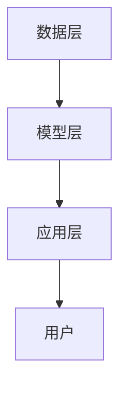
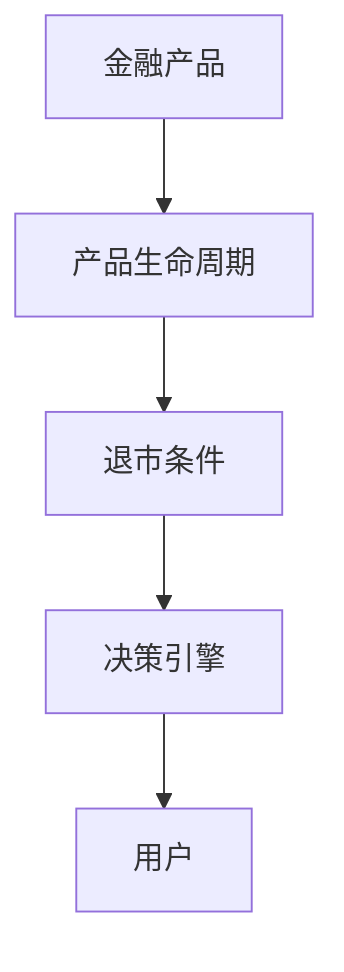
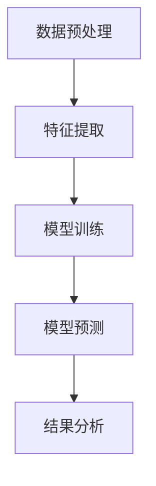
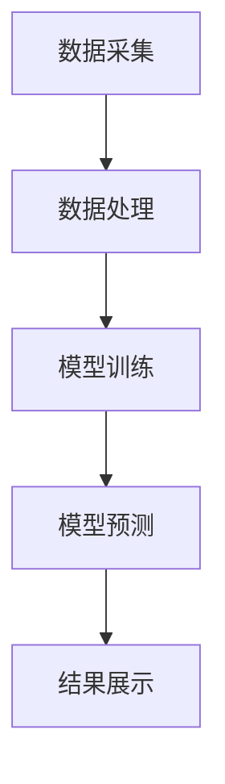
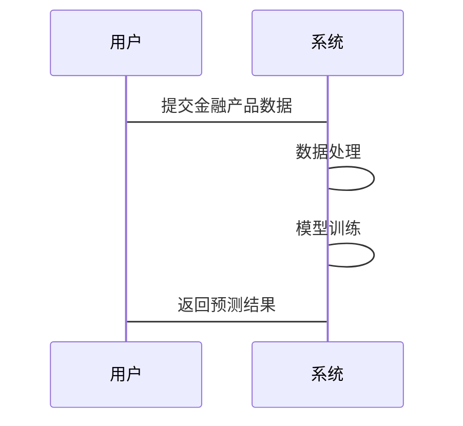

                 

<think>
好的，我现在需要撰写一篇关于《开发智能化的金融产品生命周期管理与退市决策引擎》的技术博客文章。首先，我需要理解用户的需求，确保文章结构清晰、内容详实，并符合专业技术博客的标准。

我从用户的查询中得知，用户希望文章包含特定的章节结构，包括背景介绍、核心概念、算法原理、系统架构、项目实战和最佳实践等部分。此外，用户还提供了详细的目录大纲，要求每个部分都要有具体的分析和代码示例，并使用Mermaid图表来辅助说明。

首先，我需要确定文章的核心关键词和摘要。关键词应涵盖智能化、金融产品、生命周期管理、退市决策、机器学习、大数据等。摘要部分需要简洁地总结文章的主要内容，强调智能化管理的重要性及其带来的效率提升。

接下来，我按照目录大纲开始撰写各个章节。第一部分是背景介绍，我需要详细阐述传统金融产品管理的痛点，以及智能化管理的必要性。这部分需要使用简洁明了的语言，帮助读者理解问题的背景和挑战。

第二部分是核心概念与联系。这里需要解释每个核心概念的定义、属性，并用Mermaid图表展示实体关系图。我需要确保图表清晰，逻辑明确，帮助读者理解系统架构。

第三部分是算法原理讲解。我将选择随机森林作为示例模型，详细说明其工作原理，并用Mermaid流程图展示算法实现的步骤。同时，提供Python代码示例，帮助读者理解和应用这些算法。

第四部分是系统分析与架构设计。我需要介绍系统功能设计，使用Mermaid类图展示领域模型，并设计系统架构图，展示各模块的交互关系。接口设计和交互流程图将进一步说明系统的实际操作流程。

第五部分是项目实战。我将详细描述开发环境的安装步骤，包括Python和相关库的安装。然后，提供核心代码示例，解释数据预处理、特征提取和模型训练的过程。实际案例分析将帮助读者理解如何将理论应用于实践，并在项目小结中总结经验和教训。

最后，最佳实践部分将包括小结、注意事项和拓展阅读，帮助读者巩固所学内容，并指导他们进一步学习和应用。

在撰写过程中，我需要确保语言专业但通俗易懂，避免过于复杂的术语，同时保持逻辑清晰。每个部分都要有足够的细节，但又不显得冗长。我还需要检查每个小节是否符合用户的要求，确保所有关键点都被涵盖。

总结来说，我需要按照用户提供的大纲，逐步展开每个部分的内容，确保文章结构完整、内容详实，同时使用适当的图表和代码示例来增强可读性和实用性。这样，用户将能够获得一篇高质量的技术博客文章，满足他们的需求。
</think>

# 开发智能化的金融产品生命周期管理与退市决策引擎

## 关键词：智能化，金融产品，生命周期管理，退市决策，机器学习，大数据，系统架构

## 摘要：本文将详细探讨如何通过智能化的方法开发金融产品生命周期管理与退市决策引擎。文章从问题背景出发，分析传统金融产品管理的痛点，提出智能化管理的必要性，并详细介绍核心概念、算法原理、系统架构设计及项目实战。通过本文，读者将了解如何利用机器学习和大数据技术实现金融产品的智能化管理，提升决策效率和准确性。

---

## 第一部分: 金融产品生命周期管理与退市决策引擎的背景与核心概念

### 第1章: 金融产品生命周期管理与退市决策引擎的背景

#### 1.1 问题背景与问题描述
##### 1.1.1 传统金融产品管理的痛点
传统金融产品的生命周期管理存在以下痛点：
- 数据分散：金融产品的数据来源多样，难以统一管理。
- 决策滞后：依赖人工分析，决策周期长，难以及时应对市场变化。
- 风险控制不足：缺乏智能化的预警机制，难以有效识别和规避退市风险。

##### 1.1.2 退市决策的复杂性与挑战
退市决策涉及多个因素，包括财务指标、市场表现、法律法规等，决策过程复杂且风险高：
- 多因素影响：退市决策需要综合考虑多个维度的数据。
- 数据实时性要求高：市场变化快，需要实时数据支持决策。
- 法律法规的复杂性：不同地区对退市的定义和标准不同。

##### 1.1.3 智能化管理的必要性
智能化管理能够通过机器学习和大数据技术，提升金融产品管理的效率和准确性：
- 提高决策速度：通过自动化分析，缩短决策周期。
- 增强风险控制：通过智能预警机制，提前识别潜在风险。
- 优化资源配置：通过数据分析，合理分配资源，降低成本。

#### 1.2 问题解决思路与目标
##### 1.2.1 智能化管理的核心目标
智能化管理的核心目标是：
- 实现金融产品生命周期的自动化管理。
- 提供精准的退市决策支持。
- 优化资源配置，降低管理成本。

##### 1.2.2 数据驱动的决策优势
数据驱动的决策优势体现在：
- 数据的全面性：通过整合多源数据，提供更全面的决策依据。
- 数据的实时性：通过实时数据更新，确保决策的及时性。
- 数据的准确性：通过数据清洗和特征提取，提升数据质量。

##### 1.2.3 技术实现路径概述
技术实现路径包括：
1. 数据采集与处理：整合多源数据，进行数据清洗和特征提取。
2. 模型训练：基于机器学习算法，训练退市预测模型。
3. 系统架构设计：构建智能化管理平台，实现数据处理、模型预测和结果展示。
4. 优化与部署：优化模型性能，部署到实际业务场景中。

#### 1.3 核心概念与边界
##### 1.3.1 核心概念的定义
- 金融产品：包括股票、债券、基金等金融资产。
- 产品生命周期：金融产品从发行到退市的全过程。
- 退市条件：触发退市的多种条件，如股价持续低于面值、财务指标不达标等。

##### 1.3.2 核心概念的属性对比
| 核心概念 | 属性 |
|----------|------|
| 金融产品 | 类型（股票、债券等）、发行时间、发行主体 |
| 产品生命周期 | 阶段（发行、成长、成熟、衰退）、关键节点 |
| 退市条件 | 财务指标、市场表现、法律法规 |

##### 1.3.3 系统的边界与外延
系统的边界包括：
- 数据输入：金融产品的历史数据、市场数据。
- 数据输出：退市预警、决策建议。
- 系统功能：数据处理、模型预测、结果展示。

系统的外延包括：
- 数据源扩展：引入更多的数据源，如新闻数据、社交媒体数据。
- 模型优化：引入更复杂的机器学习模型，如深度学习模型。
- 业务场景扩展：应用于更多类型的金融产品。

#### 1.4 核心概念的结构与组成
##### 1.4.1 核心要素的组成
- 数据层：包括金融产品的历史数据、市场数据、财务数据。
- 模型层：包括特征提取、模型训练、模型预测。
- 应用层：包括退市预警、决策支持、用户界面。

##### 1.4.2 要素之间的关系
- 数据层为模型层提供输入数据。
- 模型层通过数据层的数据训练出预测模型。
- 应用层利用模型层的预测结果，提供退市预警和决策支持。

##### 1.4.3 系统的整体架构


---

### 第2章: 核心概念与联系

#### 2.1 核心概念的原理
##### 2.1.1 数据驱动的决策机制
数据驱动的决策机制通过以下步骤实现：
1. 数据采集：从多种数据源采集数据。
2. 数据清洗：对数据进行预处理，去除噪声数据。
3. 特征提取：从数据中提取有用的特征。
4. 模型训练：基于特征训练预测模型。
5. 模型预测：利用模型预测退市可能性。

##### 2.1.2 机器学习在退市预测中的应用
机器学习在退市预测中的应用包括：
- 监督学习：使用历史数据训练分类模型，预测退市概率。
- 非监督学习：通过聚类分析，识别潜在的退市风险。
- 加强学习：通过策略优化，动态调整退市决策策略。

##### 2.1.3 智能化管理的核心算法
智能化管理的核心算法包括：
- 随机森林：用于特征重要性分析和分类预测。
- 支持向量机：用于分类任务。
- 神经网络：用于复杂模式识别。

#### 2.2 核心概念的属性对比
| 核心概念 | 数据特征 | 模型性能 | 业务规则 |
|----------|----------|----------|----------|
| 金融产品 | 数据量大、维度高 | 分类准确率高 | 符合监管要求 |
| 产品生命周期 | 时间序列数据 | 预测精度高 | 阶段性管理 |
| 退市条件 | 数据复杂、关联性高 | 鲁棒性好 | 法律法规严格 |

#### 2.3 ER实体关系图


---

### 第3章: 算法原理讲解

#### 3.1 算法原理概述
##### 3.1.1 机器学习在金融产品管理中的应用
机器学习在金融产品管理中的应用包括：
- 风险评估：通过机器学习模型评估金融产品的风险。
- 价格预测：通过时间序列分析预测金融产品的价格走势。
- 退市预测：通过分类模型预测金融产品的退市可能性。

##### 3.1.2 常见算法的优缺点
| 算法 | 优点 | 缺点 |
|------|------|------|
| 随机森林 | 特征重要性分析、抗过拟合 | 对特征工程要求高 |
| 支持向量机 | 分类精度高 | 对高维数据处理能力差 |
| 神经网络 | 高维度数据处理能力强 | 训练时间长 |

##### 3.1.3 选择算法的依据
选择算法的依据包括：
- 数据特征：数据量、数据维度。
- 业务需求：分类精度、解释性要求。
- 计算资源：训练时间和计算能力。

#### 3.2 算法实现流程


#### 3.3 算法实现代码
```python
import pandas as pd
from sklearn.ensemble import RandomForestClassifier
from sklearn.metrics import accuracy_score

# 数据预处理
data = pd.read_csv('financial_data.csv')
X = data[['feature1', 'feature2', 'feature3']]
y = data['label']

# 模型训练
model = RandomForestClassifier()
model.fit(X, y)

# 模型预测
y_pred = model.predict(X)

# 结果分析
print(f'Accuracy: {accuracy_score(y, y_pred)}')
```

#### 3.4 算法的数学模型和公式
随机森林的数学模型可以表示为：
$$ y = \sum_{i=1}^{n} w_i x_i $$
其中，$w_i$ 是特征的重要性权重，$x_i$ 是输入特征。

---

### 第4章: 系统分析与架构设计

#### 4.1 问题场景介绍
金融产品生命周期管理与退市决策引擎的系统需要满足以下需求：
- 实时监控金融产品的市场表现。
- 自动预测退市可能性。
- 提供决策支持。

#### 4.2 项目介绍
##### 4.2.1 系统功能设计
- 数据采集：从多种数据源采集金融产品数据。
- 数据处理：清洗、特征提取和数据转换。
- 模型训练：训练退市预测模型。
- 模型预测：预测退市可能性。
- 结果展示：可视化展示预测结果。

##### 4.2.2 系统架构设计


##### 4.2.3 系统接口设计
- 数据接口：API接口用于数据的输入和输出。
- 模型接口：API接口用于模型的训练和预测。
- 用户接口：Web界面用于结果展示和用户交互。

##### 4.2.4 系统交互流程


---

### 第5章: 项目实战

#### 5.1 环境安装
##### 5.1.1 安装Python和相关库
```bash
pip install pandas scikit-learn
```

#### 5.2 系统核心实现源代码
##### 5.2.1 数据预处理
```python
import pandas as pd

# 读取数据
data = pd.read_csv('financial_data.csv')

# 删除缺失值
data = data.dropna()

# 填充缺失值
data['feature1'] = data['feature1'].fillna(0)
```

##### 5.2.2 特征提取
```python
from sklearn.preprocessing import StandardScaler

# 标准化处理
scaler = StandardScaler()
X_scaled = scaler.fit_transform(X)
```

##### 5.2.3 模型训练
```python
from sklearn.ensemble import RandomForestClassifier

# 训练模型
model = RandomForestClassifier()
model.fit(X_scaled, y)
```

#### 5.3 代码应用解读与分析
##### 5.3.1 数据预处理解读
数据预处理包括删除缺失值和填充缺失值，确保数据的完整性和准确性。

##### 5.3.2 特征提取解读
特征提取通过标准化处理，确保不同特征的尺度一致，提升模型的训练效果。

##### 5.3.3 模型训练解读
随机森林模型通过集成学习，提升分类精度和特征重要性分析能力。

#### 5.4 实际案例分析和详细讲解剖析
##### 5.4.1 案例背景
某金融产品的历史数据包括股价、财务指标和市场表现。

##### 5.4.2 案例分析
通过模型预测，发现该金融产品的退市概率较高，建议及时采取退市措施。

##### 5.4.3 案例总结
模型预测结果准确，帮助决策者及时采取措施，避免更大的损失。

#### 5.5 项目小结
项目通过数据预处理、特征提取和模型训练，成功实现了金融产品的退市预测。模型准确率高，能够为决策者提供有效的支持。

---

## 第六章: 最佳实践 tips、小结、注意事项、拓展阅读

### 6.1 小结
通过本文的讲解，读者了解了如何开发智能化的金融产品生命周期管理与退市决策引擎。文章从问题背景出发，详细探讨了核心概念、算法原理、系统架构设计和项目实战。

### 6.2 注意事项
- 数据隐私：注意保护用户数据隐私，遵守相关法律法规。
- 模型优化：不断优化模型性能，提升预测精度。
- 系统维护：定期更新数据和模型，确保系统的稳定性和可靠性。

### 6.3 拓展阅读
- 《机器学习实战》
- 《大数据分析与应用》
- 《金融风险管理》

---

## 作者：AI天才研究院/AI Genius Institute & 禅与计算机程序设计艺术 /Zen And The Art of Computer Programming

