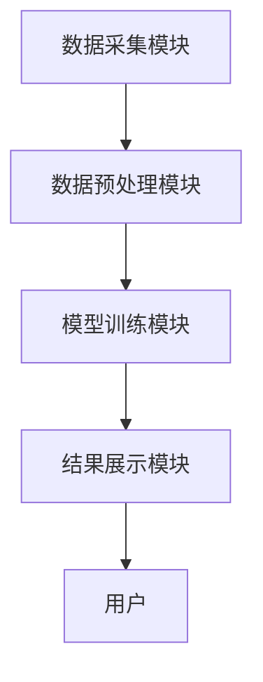

                 


```markdown
# 开发智能化的金融市场流动性风险评估模型

> 关键词：金融市场、流动性风险、机器学习、深度学习、人工智能、风险管理

> 摘要：本文系统地介绍了开发智能化的金融市场流动性风险评估模型的过程，从背景知识到核心概念，再到算法原理、系统架构和项目实战，全面阐述了如何利用现代人工智能技术来优化流动性风险评估。文章首先分析了金融市场中的流动性风险及其重要性，然后详细讲解了相关的核心概念和模型，接着深入探讨了基于机器学习和深度学习的算法原理，提供了系统的架构设计和实现方案。最后，通过一个具体的项目实战案例，展示了如何将理论应用于实践，并总结了开发过程中的关键经验与最佳实践。

---

# 第一部分：金融市场流动性风险评估模型概述

# 第1章：金融市场与流动性风险概述

## 1.1 金融市场的基本概念

### 1.1.1 金融市场的定义与分类
金融市场是资金流动和资产交易的场所，主要分为债务市场、股票市场、外汇市场和衍生品市场。根据交易方式的不同，可以进一步分为一级市场和二级市场。

### 1.1.2 流动性风险的定义与特征
流动性风险是指资产在短时间内无法以合理价格变现的风险。其主要特征包括时间性、波动性和传染性。

### 1.1.3 流动性风险的重要性与影响
流动性风险直接影响金融机构的稳定性，可能导致系统性金融危机。因此，准确评估和管理流动性风险至关重要。

## 1.2 流动性风险评估模型的背景与需求

### 1.2.1 传统流动性风险评估方法的局限性
传统方法主要依赖历史数据和统计指标，难以捕捉市场波动和复杂关系。

### 1.2.2 智能化评估模型的必要性
随着金融市场的复杂化，传统方法已无法满足需求，引入人工智能技术可以提升模型的准确性和实时性。

### 1.2.3 金融市场数据的特点与挑战
金融市场数据具有高频性、非线性和噪声多等特点，对模型的实时性和鲁棒性提出了更高要求。

---

# 第二部分：流动性风险评估模型的核心概念与联系

# 第2章：流动性风险评估模型的核心概念

## 2.1 流动性风险评估模型的定义与组成

### 2.1.1 模型的定义
流动性风险评估模型是通过分析市场数据和相关指标，预测资产或机构在特定时间内的流动性风险程度的数学模型。

### 2.1.2 模型的核心要素
- 数据输入：市场数据、资产头寸、交易记录等。
- 模型算法：机器学习或深度学习算法。
- 输出结果：流动性风险评分或预警信号。

### 2.1.3 模型的边界与外延
模型适用于短期流动性风险评估，但不考虑长期投资策略和宏观经济因素。

## 2.2 核心概念的属性特征对比

### 2.2.1 流动性风险与市场风险的对比
| 属性      | 流动性风险         | 市场风险           |
|-----------|------------------|------------------|
| 定义      | 资产变现能力       | 资产价值波动       |
| 影响因素  | 交易量、价格       | 利率、经济指标     |
| 应对策略  | 增加流动性储备     | 多样化投资组合     |

### 2.2.2 不同模型的特征分析
| 模型类型   | 传统统计模型       | 机器学习模型       | 深度学习模型       |
|-----------|--------------------|--------------------|--------------------|
| 输入数据   | 历史数据           | 市场数据、新闻数据   | 多源异构数据       |
| 输出结果   | 风险评分           | 预测值、概率       | 高精度预测         |
| 优势       | 易解释             | 高准确性           | 强大的非线性建模能力 |

### 2.2.3 模型选择的依据与标准
- 数据特性：数据量、数据类型、数据质量。
- 业务需求：实时性、准确性、可解释性。
- 技术可行性：算法复杂度、计算资源。

## 2.3 ER实体关系图架构

```mermaid
erDiagram
    actor 金融机构
    actor 监管机构
    actor 投资者
    actor 交易系统
    entity 市场数据
    entity 资产头寸
    entity 流动性风险评估报告
    entity 交易记录
    entity 经济指标
    entity 新闻事件
    entity 预测模型
    entity 风险预警
    entity 历史数据
    entity 系统日志
    entity 用户配置
    entity 反馈机制
    entity 操作记录
    entity 审计报告

    金融机构 --> 市场数据
    金融机构 --> 资产头寸
    金融机构 --> 交易记录
    金融机构 --> 预测模型
    金融机构 --> 风险预警
    监管机构 --> 经济指标
    监管机构 --> 风险预警
    投资者 --> 新闻事件
    交易系统 --> 市场数据
    交易系统 --> 交易记录
    预测模型 --> 历史数据
    预测模型 --> 市场数据
    预测模型 --> 资产头寸
    预测模型 --> 经济指标
    预测模型 --> 新闻事件
    预测模型 --> 风险预警
    风险预警 --> 监管机构
    风险预警 --> 投资者
    风险预警 --> 金融机构
```

---

# 第三部分：流动性风险评估模型的算法原理

# 第3章：算法原理与实现

## 3.1 机器学习算法

### 3.1.1 线性回归
线性回归是一种简单的回归分析方法，用于预测连续型变量。其数学模型为：
$$ y = \beta_0 + \beta_1 x_1 + \beta_2 x_2 + ... + \beta_n x_n + \epsilon $$
其中，$\beta$为回归系数，$\epsilon$为误差项。

### 3.1.2 支持向量机
支持向量机（SVM）适用于分类和回归问题。其核心思想是通过寻找最优超平面，实现数据的线性或非线性分离。

### 3.1.3 时间序列分析
时间序列分析常用于预测未来的市场走势。ARIMA模型是一种常用的时间序列预测方法，其结构包括自回归（AR）、差分（I）和移动平均（MA）部分。

## 3.2 深度学习算法

### 3.2.1 长短期记忆网络（LSTM）
LSTM是一种特殊的RNN，能够有效处理时间序列数据中的长距离依赖关系。其核心组件包括输入门、遗忘门和输出门。

### 3.2.2 Transformer
Transformer架构通过自注意力机制，提升了模型对序列数据的处理能力，已成为处理时间序列数据的主流方法之一。

---

# 第四部分：系统架构与实现方案

# 第4章：系统架构设计

## 4.1 系统功能设计

### 4.1.1 数据采集模块
负责从多种数据源采集市场数据、交易记录等信息。

### 4.1.2 数据预处理模块
对数据进行清洗、标准化和特征提取，确保数据质量。

### 4.1.3 模型训练模块
基于预处理后的数据，训练流动性风险评估模型。

### 4.1.4 结果展示模块
将模型的预测结果以可视化形式展示，便于用户理解和决策。

## 4.2 系统架构图



---

# 第五部分：项目实战与经验分享

# 第5章：项目实战

## 5.1 环境配置

```python
# 安装必要的库
import pandas as pd
import numpy as np
from sklearn.model import LinearRegression
from keras.layers import LSTM, Dense, Dropout
from keras.models import Sequential
```

## 5.2 核心代码实现

```python
# 示例代码：使用LSTM进行流动性风险预测
model = Sequential()
model.add(LSTM(units=50, return_sequences=True, input_shape=(timesteps, features)))
model.add(Dropout(0.2))
model.add(LSTM(units=50, return_sequences=False))
model.add(Dense(1))
model.compile(optimizer='adam', loss='mean_squared_error')

# 训练模型
model.fit(X_train, y_train, epochs=50, batch_size=32)
```

## 5.3 结果分析与优化

### 5.3.1 模型性能评估
通过回测和交叉验证，评估模型的准确性和稳定性。

### 5.3.2 模型优化
根据评估结果，调整模型参数和结构，提升预测精度。

---

# 第六部分：总结与展望

# 第6章：总结与展望

## 6.1 本书总结
本文系统地介绍了开发智能化的金融市场流动性风险评估模型的过程，从理论到实践，全面覆盖了相关知识点。

## 6.2 未来展望
随着人工智能技术的不断发展，未来流动性风险评估模型将更加智能化和个性化，为金融市场提供更精准的风险管理工具。

---

# 作者：AI天才研究院/AI Genius Institute & 禅与计算机程序设计艺术 /Zen And The Art of Computer Programming

---

**注**：以上内容为文章的结构框架和部分内容示例，实际撰写时需要根据具体需求和数据补充完整细节。
```

