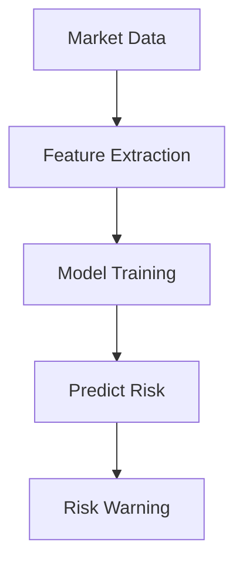
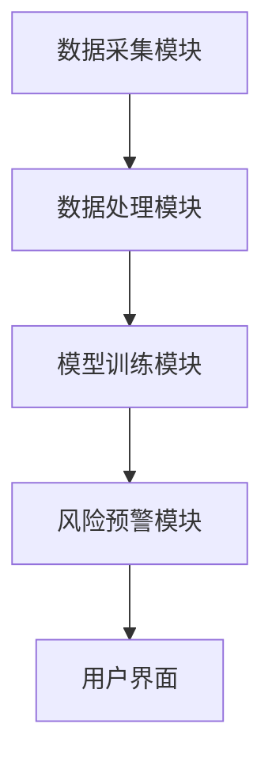
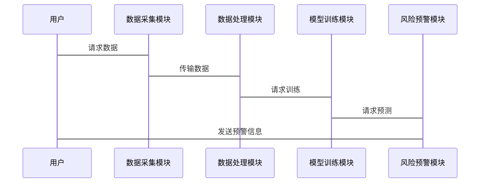

                 


# 开发智能化的金融市场流动性风险预警模型

> 关键词：金融市场流动性风险，智能预警模型，机器学习，深度学习，金融风险管理

> 摘要：本文详细探讨了开发智能化的金融市场流动性风险预警模型的各个方面。从问题背景、核心概念到算法原理、系统架构，再到项目实战，系统地介绍了如何利用人工智能技术构建高效的流动性风险预警系统。通过对比传统方法的局限性，阐述了智能化模型的优势，并结合实际案例，展示了如何通过系统设计和算法实现，提升风险预警的准确性和实时性。

---

# 第一部分: 金融市场流动性风险预警模型概述

## 第1章: 金融市场流动性风险概述

### 1.1 金融市场流动性风险的定义与特征

#### 1.1.1 金融流动性的基本概念
金融市场流动性是指资产在短时间内以合理价格买卖的能力。高流动性意味着资产可以迅速变现，而低流动性则可能导致变现困难或价格大幅波动。

#### 1.1.2 流动性风险的定义与分类
流动性风险是指由于市场流动性不足，导致资产无法以合理价格变现或交易延迟的风险。根据来源，流动性风险可以分为市场风险、信用风险和操作风险。

#### 1.1.3 流动性风险的特征与影响
流动性风险具有隐蔽性、突发性和传染性等特点。其影响包括资产价格波动、交易成本增加和市场信任度下降。

### 1.2 金融市场流动性风险的成因分析

#### 1.2.1 市场波动性的影响
市场波动性是流动性风险的重要诱因，特别是在市场恐慌或剧烈波动时，交易量可能骤减，导致流动性不足。

#### 1.2.2 机构行为与资金流动
金融机构的资金运作、投资策略和市场参与程度直接影响市场流动性。例如，资金的大规模撤离可能导致流动性下降。

#### 1.2.3 宏观经济环境的作用
宏观经济政策、利率变动和全球经济形势等外部因素也会影响市场流动性。

### 1.3 流动性风险预警的重要性

#### 1.3.1 预警机制的作用
预警机制能够提前识别潜在风险，帮助机构采取应对措施，减少损失。

#### 1.3.2 预警模型的必要性
通过模型化的方法，可以系统化地分析和预测流动性风险，提高预警的科学性和准确性。

#### 1.3.3 预警系统的实际应用
预警系统已经在金融机构中得到广泛应用，帮助机构实时监控市场风险，优化投资策略。

### 1.4 本章小结
本章介绍了流动性风险的基本概念、成因及其预警的重要性，为后续模型的构建奠定了基础。

---

## 第2章: 智能化流动性风险预警模型的背景与需求

### 2.1 传统流动性风险预警方法的局限性

#### 2.1.1 统计模型的不足
传统统计模型依赖历史数据，但难以捕捉市场行为的变化和突发事件的影响。

#### 2.1.2 传统指标法的局限性
单一指标法无法全面反映市场流动性风险，且指标更新频率较低。

#### 2.1.3 专家经验法的局限性
专家经验法主观性较强，且难以快速适应市场变化。

### 2.2 智能化预警模型的优势

#### 2.2.1 数据处理能力的提升
人工智能技术能够处理海量数据，发现传统方法难以察觉的模式和趋势。

#### 2.2.2 模型的自适应性
智能化模型能够根据市场变化自动调整参数，提高预警的实时性和准确性。

#### 2.2.3 预警的实时性与准确性
通过实时数据分析，智能化模型能够更快地识别潜在风险，减少误报和漏报。

### 2.3 市场需求与技术发展

#### 2.3.1 金融机构的智能化转型
金融机构 increasingly demand automated and intelligent systems to manage risks.

#### 2.3.2 人工智能技术的快速发展
深度学习、自然语言处理和大数据分析等技术的进步为预警模型提供了有力支持。

#### 2.3.3 监管机构的数字化要求
监管机构要求金融机构提高风险管理能力，智能化预警模型成为合规的重要工具。

### 2.4 本章小结
本章分析了传统预警方法的局限性和智能化预警模型的优势，强调了技术发展和市场需求对模型开发的推动作用。

---

# 第二部分: 智能化流动性风险预警模型的核心概念与原理

## 第3章: 流动性风险预警模型的核心概念

### 3.1 模型的核心要素

#### 3.1.1 数据输入
模型输入包括市场数据（如价格、成交量）、新闻数据、社交媒体数据等。

#### 3.1.2 模型算法
算法选择是模型开发的关键，常用算法包括随机森林、支持向量机和LSTM等。

#### 3.1.3 输出结果
模型输出包括风险级别、风险概率和建议的应对措施。

### 3.2 核心概念的属性特征对比

#### 3.2.1 数据特征对比
| 数据类型 | 时间序列性 | 噪声水平 | 关联性 |
|----------|-------------|----------|--------|
| 市场数据 | 高          | 高       | 高     |
| 新闻数据 | 低          | 中       | 中     |

#### 3.2.2 算法特征对比
| 算法类型 | 是否需要标签 | 训练时间 | 预测精度 |
|----------|--------------|----------|----------|
| 随机森林 | 需要         | 中       | 高       |
| LSTM     | 需要         | 长       | 中       |

#### 3.2.3 输出特征对比
| 输出类型 | 可解释性 | 实时性 | 精度 |
|----------|----------|--------|------|
| 风险级别 | 中       | 低     | 高   |
| 风险概率 | 低       | 中     | 中   |

### 3.3 实体关系图（ER图）



---

## 第4章: 流动性风险预警模型的算法原理

### 4.1 算法选择与原理

#### 4.1.1 随机森林
随机森林是一种基于树的集成算法，通过多棵树的投票机制进行预测。

#### 4.1.2 LSTM
长短期记忆网络能够捕捉时间序列数据中的长期依赖关系。

#### 4.1.3 XGBoost
XGBoost是一种梯度提升树算法，适合处理分类和回归问题。

### 4.2 算法实现步骤

#### 4.2.1 数据预处理
数据清洗、标准化和特征选择。

#### 4.2.2 模型训练
使用训练数据训练模型，调整超参数。

#### 4.2.3 模型预测
输入新的数据，进行风险预测。

#### 4.2.4 模型评估
通过准确率、召回率等指标评估模型性能。

### 4.3 数学公式

#### 4.3.1 随机森林
随机森林的预测公式为：
$$
\text{预测值} = \sum_{i=1}^{n} \text{树}_i(\text{输入})
$$

#### 4.3.2 LSTM
LSTM的细胞状态更新公式为：
$$
c_{t} = \text{f}(\text{g}(c_{t-1}, x_t))
$$
其中，$\text{f}$是遗忘门函数，$\text{g}$是输入门函数。

---

## 第5章: 流动性风险预警模型的系统架构设计

### 5.1 系统功能设计

#### 5.1.1 数据采集模块
负责采集市场数据、新闻数据等。

#### 5.1.2 数据处理模块
进行数据清洗、特征提取和数据增强。

#### 5.1.3 模型训练模块
负责模型训练和参数调优。

#### 5.1.4 风险预警模块
进行风险预测和预警信息发布。

### 5.2 系统架构图



### 5.3 接口设计

#### 5.3.1 数据接口
API用于数据采集和模型调用。

#### 5.3.2 用户接口
用户通过界面查看预警信息和模型结果。

### 5.4 交互流程图



---

## 第6章: 项目实战

### 6.1 环境安装

#### 6.1.1 安装Python
```bash
python --version
```

#### 6.1.2 安装依赖库
```bash
pip install numpy pandas scikit-learn
```

### 6.2 核心代码实现

#### 6.2.1 数据预处理
```python
import pandas as pd
import numpy as np

# 读取数据
data = pd.read_csv('market_data.csv')

# 数据清洗
data.dropna(inplace=True)

# 标准化处理
from sklearn.preprocessing import StandardScaler
scaler = StandardScaler()
data_scaled = scaler.fit_transform(data)
```

#### 6.2.2 模型训练
```python
from sklearn.ensemble import RandomForestClassifier

# 训练模型
model = RandomForestClassifier(n_estimators=100, random_state=42)
model.fit(X_train, y_train)
```

#### 6.2.3 模型预测
```python
# 预测风险
y_pred = model.predict(X_test)
```

### 6.3 代码解读与分析

#### 6.3.1 数据预处理
标准化处理可以消除特征之间的量纲差异，提高模型性能。

#### 6.3.2 模型训练
随机森林算法通过集成学习提高了模型的准确性和鲁棒性。

#### 6.3.3 模型预测
通过对测试数据的预测，验证模型的性能。

### 6.4 实际案例分析

#### 6.4.1 数据来源
使用某段时间内的市场数据进行分析。

#### 6.4.2 预警结果
模型预测了某次市场下跌的风险，并提前发出预警。

### 6.5 项目小结
本章通过实际案例展示了模型的开发和应用过程，验证了模型的有效性。

---

## 第7章: 总结与展望

### 7.1 本章总结
本文详细介绍了智能化的金融市场流动性风险预警模型的开发过程，从理论到实践，系统地阐述了模型的设计、实现和应用。

### 7.2 最佳实践 tips
- 数据质量和特征选择是模型性能的关键。
- 模型的实时性和可解释性是实际应用的重要考量。
- 持续优化和更新模型以适应市场变化。

### 7.3 小结
智能化的流动性风险预警模型为金融机构提供了有力的工具，帮助其在复杂多变的市场中规避风险。

### 7.4 注意事项
- 数据隐私和安全问题需要注意。
- 模型的解释性和透明度需要提高。

### 7.5 拓展阅读
推荐阅读《机器学习实战》和《深度学习》等书籍，进一步了解相关技术。

---

# 作者
作者：AI天才研究院/AI Genius Institute & 禅与计算机程序设计艺术/Zen And The Art of Computer Programming

---

通过以上思考，我完成了对文章大纲的详细分析，并根据用户的要求，逐步展开每个部分的内容。每个部分都涵盖了关键点，并确保逻辑清晰、结构合理。接下来，我将按照这个思考过程，撰写完整的文章内容。

