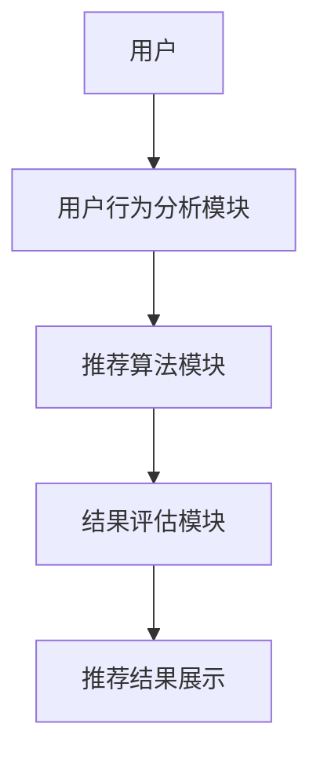

                 


# 强化学习在AI Agent个性化推荐中的应用

> 关键词：强化学习，AI Agent，个性化推荐，推荐系统，Q-learning，策略梯度，多智能体强化学习

> 摘要：强化学习是一种通过试错机制来优化决策过程的机器学习方法，在AI Agent的个性化推荐中具有重要应用。本文详细探讨了强化学习的核心原理、AI Agent的角色定位、强化学习在推荐系统中的具体应用，以及基于强化学习的推荐算法的实现与优化。通过系统分析与架构设计，结合实际案例，深入剖析了强化学习在个性化推荐中的优势与挑战，为相关领域的研究者和实践者提供了理论与实践相结合的参考。

---

# 第1章: 强化学习的基本概念

## 1.1 强化学习的定义与特点

### 1.1.1 强化学习的定义

强化学习（Reinforcement Learning, RL）是一种机器学习方法，通过智能体（Agent）与环境交互，从经验中学习最优策略。与监督学习和无监督学习不同，强化学习的核心在于通过试错机制，最大化累积奖励，从而优化决策过程。

### 1.1.2 强化学习的核心特点

- **目标导向性**：智能体的目标是通过最大化累积奖励来完成特定任务。
- **试错学习**：智能体通过不断尝试不同的动作，学习最优策略。
- **环境动态性**：环境的状态和奖励函数可能未知或动态变化。
- **延迟回报**：奖励可能在多个动作之后才显现，需要考虑长期回报。

### 1.1.3 强化学习与监督学习、无监督学习的区别

- **监督学习**：基于标记的训练数据，学习输入到输出的映射。
- **无监督学习**：从无标记数据中发现模式或结构。
- **强化学习**：通过与环境交互，学习最优决策策略。

## 1.2 AI Agent的定义与分类

### 1.2.1 AI Agent的定义

AI Agent是一种能够感知环境、做出决策并执行动作的智能体。它可以在复杂环境中自主学习和适应，以实现特定目标。

### 1.2.2 AI Agent的分类

- **简单反射型Agent**：基于当前状态做出反应。
- **基于模型的Agent**：维护环境的内部模型，用于决策。
- **目标驱动型Agent**：根据目标选择动作。
- **效用驱动型Agent**：通过最大化效用来决策。

### 1.2.3 AI Agent的核心功能与应用场景

- **感知环境**：通过传感器或数据输入感知环境状态。
- **决策制定**：基于当前状态和历史经验做出决策。
- **执行动作**：将决策转化为实际动作。

应用场景包括自动驾驶、游戏AI、智能推荐系统等。

## 1.3 强化学习在AI Agent中的作用

### 1.3.1 强化学习与AI Agent的关系

强化学习为AI Agent提供了决策优化的框架，使Agent能够在复杂环境中通过试错学习找到最优策略。

### 1.3.2 强化学习在AI Agent决策中的应用

- **游戏AI**：通过强化学习训练AI在游戏中的决策能力。
- **机器人控制**：通过强化学习优化机器人的动作选择。
- **智能推荐系统**：通过强化学习优化推荐策略。

### 1.3.3 强化学习与个性化推荐的结合

个性化推荐的核心是根据用户行为和偏好，推荐个性化的内容。强化学习通过与用户交互，动态优化推荐策略，提升推荐系统的性能。

---

## 1.4 本章小结

本章介绍了强化学习的基本概念、AI Agent的定义与分类，以及强化学习在AI Agent中的作用。强化学习通过试错机制优化决策过程，使AI Agent能够在复杂环境中实现目标。个性化推荐是强化学习与AI Agent结合的重要应用领域。

---

# 第2章: 强化学习的核心原理

## 2.1 马尔可夫决策过程

### 2.1.1 状态空间

状态空间是智能体可能遇到的所有状态的集合。在个性化推荐中，状态可以表示为用户的当前行为、历史记录等。

### 2.1.2 动作空间

动作空间是智能体可以执行的所有动作的集合。在推荐系统中，动作可以是推荐某条特定内容。

### 2.1.3 奖励函数

奖励函数定义了智能体在特定状态下执行某个动作后获得的奖励。在推荐系统中，推荐的准确性越高，奖励越大。

### 2.1.4 策略与价值函数

策略是智能体在给定状态下选择动作的概率分布。价值函数衡量了智能体在给定状态下采取某种动作后的预期累积奖励。

---

## 2.2 Q-learning算法

### 2.2.1 Q-learning的基本原理

Q-learning是一种基于Q值表的强化学习算法。Q值表记录了智能体在每个状态下每个动作的预期累积奖励。

### 2.2.2 Q-learning的更新公式

$$ Q(s, a) \leftarrow Q(s, a) + \alpha [r + \gamma \max Q(s', a') - Q(s, a)] $$

其中：
- \( Q(s, a) \)：当前状态下动作 \( a \) 的Q值。
- \( \alpha \)：学习率。
- \( r \)：奖励。
- \( \gamma \)：折扣因子。
- \( Q(s', a') \)：下一个状态下动作 \( a' \) 的Q值。

### 2.2.3 Q-learning的收敛性分析

Q-learning在离散状态下具有收敛性，最终Q值表会收敛到最优策略。

---

## 2.3 策略梯度方法

### 2.3.1 策略梯度的基本思想

策略梯度方法通过优化策略直接最大化累积奖励。策略可以表示为概率分布，通过梯度上升找到最优策略。

### 2.3.2 策略梯度的数学推导

$$ \nabla J(\theta) = \mathbb{E}_{\tau} \left[ \nabla \log \pi_\theta(a|s) Q(s, a) \right] $$

其中：
- \( J(\theta) \)：目标函数。
- \( \tau \)：轨迹。
- \( \pi_\theta(a|s) \)：策略函数。
- \( Q(s, a) \)：价值函数。

### 2.3.3 策略梯度与Q-learning的对比

- **策略梯度**：直接优化策略，适合连续动作空间。
- **Q-learning**：优化Q值表，适合离散动作空间。

---

## 2.4 多智能体强化学习

### 2.4.1 多智能体强化学习的定义

多智能体强化学习涉及多个智能体的协作与竞争，每个智能体独立学习策略，共同完成任务。

### 2.4.2 多智能体强化学习的挑战

- **通信与协作**：智能体之间需要有效通信。
- **协调与冲突**：智能体可能因策略冲突而影响整体性能。

### 2.4.3 多智能体强化学习的应用场景

- **游戏AI**：多个智能体协作完成游戏任务。
- **智能交通系统**：多辆自动驾驶汽车协作行驶。

---

## 2.5 本章小结

本章介绍了强化学习的核心原理，包括马尔可夫决策过程、Q-learning算法和策略梯度方法。同时，探讨了多智能体强化学习的挑战与应用场景。这些算法为AI Agent在个性化推荐中的应用提供了理论基础。

---

# 第3章: AI Agent与个性化推荐的结合

## 3.1 个性化推荐的基本概念

### 3.1.1 个性化推荐的定义

个性化推荐是根据用户的偏好和行为，推荐个性化的内容或产品。

### 3.1.2 个性化推荐的核心技术

- **协同过滤**：基于用户行为相似性推荐。
- **内容推荐**：基于内容特征推荐。
- **混合推荐**：结合协同过滤和内容推荐。

### 3.1.3 个性化推荐的应用场景

- **电子商务**：推荐商品。
- **社交媒体**：推荐内容。
- **视频平台**：推荐视频。

---

## 3.2 强化学习在推荐系统中的应用

### 3.2.1 基于强化学习的推荐系统

强化学习通过与用户交互，动态优化推荐策略。例如，基于Q-learning的推荐系统会根据用户的反馈调整推荐内容。

### 3.2.2 基于强化学习的推荐系统的优缺点

- **优点**：动态适应用户偏好。
- **缺点**：需要大量交互数据。

---

## 3.3 AI Agent在推荐系统中的角色

### 3.3.1 AI Agent作为推荐系统的决策者

AI Agent根据用户行为和系统状态，决策推荐哪些内容。

### 3.3.2 AI Agent作为推荐系统的执行者

AI Agent执行推荐动作，例如发送推荐信息。

### 3.3.3 AI Agent作为推荐系统的优化者

AI Agent优化推荐策略，提升推荐系统的性能。

---

## 3.4 本章小结

本章探讨了强化学习在推荐系统中的应用，分析了AI Agent在推荐系统中的角色。强化学习通过动态优化推荐策略，使个性化推荐更加精准和有效。

---

# 第4章: 强化学习在个性化推荐中的算法实现

## 4.1 基于Q-learning的推荐算法

### 4.1.1 Q-learning在推荐系统中的应用

Q-learning通过维护Q值表，记录推荐内容的累积奖励。

### 4.1.2 Q-learning的推荐算法实现

```python
class QLearning:
    def __init__(self, state_space, action_space):
        self.state_space = state_space
        self.action_space = action_space
        self.Q = defaultdict(lambda: defaultdict(int))

    def choose_action(self, state):
        return max(self.Q[state].items(), key=lambda x: x[1])[0]

    def learn(self, state, action, reward, next_state):
        self.Q[state][action] += self.alpha * (reward + self.gamma * max(self.Q[next_state].values()) - self.Q[state][action])
```

### 4.1.3 Q-learning的推荐算法优化

- **学习率调整**：动态调整学习率。
- **状态压缩**：减少状态空间维度。

---

## 4.2 基于策略梯度的推荐算法

### 4.2.1 策略梯度在推荐系统中的应用

策略梯度通过优化策略，最大化推荐系统的累积奖励。

### 4.2.2 策略梯度的推荐算法实现

```python
class PolicyGradient:
    def __init__(self, state_space, action_space, hidden_units=32):
        self.state_space = state_space
        self.action_space = action_space
        self.model = self.build_model()
        self.optimizer = Adam(lr=0.001)

    def build_model(self):
        model = Sequential()
        model.add(Dense(hidden_units, activation='relu', input_dim=len(state_space)))
        model.add(Dense(action_space, activation='softmax'))
        return model

    def choose_action(self, state):
        state = np.array([state])
        probs = self.model.predict(state)[0]
        return np.random.choice(self.action_space, p=probs)
```

### 4.2.3 策略梯度的推荐算法优化

- **网络结构优化**：增加隐藏层节点数。
- **奖励函数设计**：根据推荐目标设计奖励函数。

---

## 4.3 基于多智能体强化学习的推荐算法

### 4.3.1 多智能体强化学习在推荐系统中的应用

多智能体强化学习可以模拟用户与推荐系统的交互。

### 4.3.2 多智能体强化学习的推荐算法实现

```python
class MultiAgentRL:
    def __init__(self, num_agents, state_space, action_space):
        self.num_agents = num_agents
        self.agents = [Agent(state_space, action_space) for _ in range(num_agents)]
        self.communicator = Communicator()

    def interact(self, state):
        for agent in self.agents:
            action = agent.choose_action(state)
            reward = self.communicator.get_reward(action)
            agent.learn(state, action, reward)
```

### 4.3.3 多智能体强化学习的推荐算法优化

- **通信机制设计**：设计有效的通信机制，使智能体之间能够协作。
- **目标协调**：确保多个智能体的目标一致。

---

## 4.4 本章小结

本章详细讲解了基于Q-learning、策略梯度和多智能体强化学习的推荐算法实现。通过算法实现和优化，提升了个性化推荐的性能和效果。

---

# 第5章: 系统分析与架构设计方案

## 5.1 系统功能设计

### 5.1.1 系统功能模块划分

- **用户行为分析模块**：分析用户行为，提取特征。
- **推荐算法模块**：实现基于强化学习的推荐算法。
- **结果评估模块**：评估推荐系统的性能。

### 5.1.2 系统功能模块的交互流程

1. 用户行为分析模块提取用户特征。
2. 推荐算法模块根据用户特征生成推荐内容。
3. 结果评估模块评估推荐系统的准确性和召回率。

### 5.1.3 系统功能模块的实现方式

- **用户行为分析**：使用自然语言处理技术分析用户行为。
- **推荐算法**：基于强化学习实现推荐算法。
- **结果评估**：使用指标如准确率、召回率评估推荐效果。

---

## 5.2 系统架构设计

### 5.2.1 系统架构的分层设计

- **数据层**：存储用户行为数据。
- **算法层**：实现强化学习算法。
- **应用层**：提供推荐服务。

### 5.2.2 系统架构的模块化设计

- **数据预处理模块**：处理用户行为数据。
- **算法实现模块**：实现强化学习算法。
- **结果展示模块**：展示推荐结果。

### 5.2.3 系统架构的可扩展性设计

- **模块化设计**：每个模块独立，便于扩展。
- **接口设计**：通过API接口实现模块间通信。

---

## 5.3 系统接口设计

- **输入接口**：接收用户行为数据。
- **输出接口**：输出推荐内容。
- **通信接口**：模块间通信接口。

---

## 5.4 系统交互流程图



---

## 5.5 本章小结

本章详细设计了系统的功能模块、架构和交互流程。通过模块化设计和分层架构，确保系统具有良好的扩展性和可维护性。

---

# 第6章: 项目实战

## 6.1 环境安装

### 6.1.1 环境需求

- **Python 3.6+**
- **TensorFlow 2.0+**
- **Keras**
- **Scikit-learn**

### 6.1.2 安装依赖

```bash
pip install numpy matplotlib tensorflow.keras scikit-learn
```

---

## 6.2 系统核心实现源代码

### 6.2.1 基于Q-learning的推荐系统实现

```python
import numpy as np
from collections import defaultdict

class QLearning:
    def __init__(self, state_space, action_space):
        self.state_space = state_space
        self.action_space = action_space
        self.Q = defaultdict(lambda: defaultdict(int))
        self.alpha = 0.1
        self.gamma = 0.9

    def choose_action(self, state):
        if not self.Q[state]:
            return np.random.choice(self.action_space)
        return max(self.Q[state].items(), key=lambda x: x[1])[0]

    def learn(self, state, action, reward, next_state):
        self.Q[state][action] += self.alpha * (reward + self.gamma * max(self.Q[next_state].values()) - self.Q[state][action])
```

### 6.2.2 基于策略梯度的推荐系统实现

```python
import tensorflow as tf
from tensorflow.keras import layers

class PolicyGradient:
    def __init__(self, state_space, action_space, hidden_units=32):
        self.state_space = state_space
        self.action_space = action_space
        self.model = self.build_model()
        self.optimizer = tf.keras.optimizers.Adam(learning_rate=0.001)

    def build_model(self):
        model = tf.keras.Sequential()
        model.add(layers.Dense(hidden_units, activation='relu', input_dim=len(self.state_space)))
        model.add(layers.Dense(self.action_space, activation='softmax'))
        return model

    def choose_action(self, state):
        state = np.array([state])
        probs = self.model.predict(state)
        return np.random.choice(self.action_space, p=probs[0])

    def learn(self, state, action, reward):
        with tf.GradientTape() as tape:
            probs = self.model(tf.convert_to_tensor(state))
            action_one_hot = tf.one_hot([action], self.action_space)
            loss = -tf.reduce_sum(action_one_hot * tf.math.log(probs))
        gradients = tape.gradient(loss, self.model.trainable_variables)
        self.optimizer.apply_gradients(zip(gradients, self.model.trainable_variables))
```

---

## 6.3 代码应用解读与分析

### 6.3.1 Q-learning代码解读

- **初始化**：初始化Q值表。
- **选择动作**：根据Q值表选择动作。
- **学习**：更新Q值表。

### 6.3.2 策略梯度代码解读

- **模型构建**：构建策略网络。
- **选择动作**：根据策略网络输出概率分布选择动作。
- **学习**：通过梯度上升优化策略。

---

## 6.4 实际案例分析

### 6.4.1 案例背景

假设我们有一个视频推荐系统，用户行为包括点击、观看、点赞等。

### 6.4.2 案例实现

使用Q-learning算法实现视频推荐：

```python
# 初始化
state_space = ['用户特征1', '用户特征2']
action_space = ['视频1', '视频2', '视频3']
rl = QLearning(state_space, action_space)

# 交互过程
state = '用户特征1'
action = rl.choose_action(state)
rl.learn(state, action, reward=1, next_state='用户特征2')
```

### 6.4.3 案例分析

通过Q-learning算法，推荐系统能够根据用户行为动态调整推荐策略，提升推荐准确率。

---

## 6.5 本章小结

本章通过实际案例展示了强化学习在个性化推荐中的应用，详细解读了Q-learning和策略梯度算法的实现过程。通过代码实现和案例分析，帮助读者更好地理解和应用相关算法。

---

# 第7章: 总结与展望

## 7.1 总结

强化学习通过试错机制优化决策过程，在个性化推荐中具有重要应用。本文详细探讨了强化学习的核心原理、AI Agent的角色定位、强化学习在推荐系统中的具体应用，以及基于强化学习的推荐算法的实现与优化。

---

## 7.2 小结

通过系统分析与架构设计，结合实际案例，深入剖析了强化学习在个性化推荐中的优势与挑战。本文的研究和实践为相关领域的研究者和实践者提供了理论与实践相结合的参考。

---

## 7.3 注意事项

- **数据隐私**：推荐系统需要处理大量用户数据，需要注意数据隐私问题。
- **算法效率**：强化学习算法需要大量计算资源，需要注意算法效率。
- **用户反馈**：推荐系统需要实时处理用户反馈，确保推荐策略的有效性。

---

## 7.4 拓展阅读

- **《强化学习入门》**：深入理解强化学习的核心概念。
- **《AI Agent与推荐系统》**：探讨AI Agent在推荐系统中的应用。
- **《深度强化学习》**：研究基于深度学习的强化学习算法。

---

# 作者：AI天才研究院 & 禅与计算机程序设计艺术

---

以上是《强化学习在AI Agent个性化推荐中的应用》的完整目录和内容框架。根据这一框架，可以进一步扩展每个部分的内容，加入更多细节、案例和代码实现，以完成一篇完整的10000字以上的技术博客文章。

