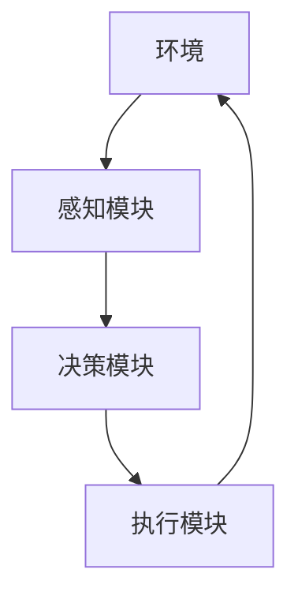
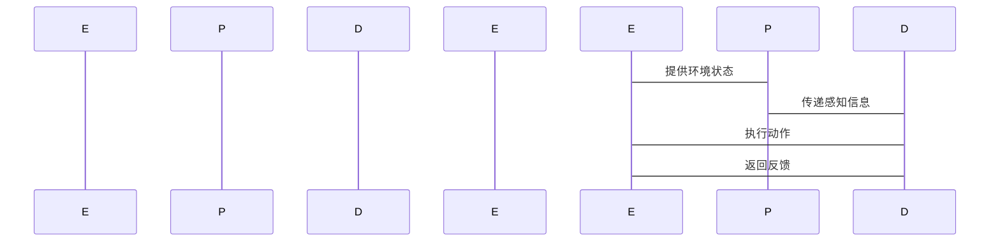

                 


# 强化学习在AI Agent交互式学习中的应用

> 关键词：强化学习，AI Agent，交互式学习，算法原理，系统架构

> 摘要：本文系统地探讨了强化学习在AI Agent交互式学习中的应用，分析了其核心概念、算法原理、系统架构，并通过具体案例展示了其实现过程。文章内容涵盖了从基础理论到实际应用的各个方面，为读者提供了全面而深入的指导。

---

## 第1章: 强化学习概述

### 1.1 强化学习的基本概念

#### 1.1.1 什么是强化学习
强化学习（Reinforcement Learning, RL）是一种机器学习范式，通过智能体与环境的交互，逐步学习策略以最大化累积奖励。与监督学习不同，强化学习不需要标注数据，而是通过试错和奖励机制来优化决策。

#### 1.1.2 强化学习的核心要素
- **状态（State）**：智能体所处的环境信息。
- **动作（Action）**：智能体在给定状态下采取的行动。
- **奖励（Reward）**：智能体采取动作后获得的反馈，用于指导学习。
- **策略（Policy）**：智能体选择动作的规则，可以是确定性的或概率性的。
- **价值函数（Value Function）**：评估状态或动作-状态对的价值。

#### 1.1.3 强化学习与监督学习的区别
| 方面         | 监督学习                          | 强化学习                          |
|--------------|-----------------------------------|-----------------------------------|
| 数据来源     | 标签数据                          | 环境反馈                          |
| 反馈机制     | 单个样本的正确标签                | 延时反馈                          |
| 决策目标     | 预测正确标签                      | 最大化累积奖励                      |
| 适用场景     | 分类、回归                        | 控制、游戏、机器人等                |

### 1.2 AI Agent的基本概念

#### 1.2.1 什么是AI Agent
AI Agent（人工智能代理）是能够感知环境并采取行动以实现目标的智能实体。它可以是一个软件程序或物理设备，通过与环境交互来完成特定任务。

#### 1.2.2 AI Agent的分类
- **简单反射型**：基于当前感知直接行动。
- **基于模型型**：维护环境模型，用于决策。
- **目标驱动型**：根据目标选择最优行动。
- **实用驱动型**：追求效用函数的最大化。

#### 1.2.3 AI Agent的核心功能
- **感知**：通过传感器或数据源获取环境信息。
- **决策**：基于感知信息选择最优动作。
- **行动**：执行决策动作，影响环境状态。

---

## 第2章: 强化学习的基本原理

### 2.1 马尔可夫决策过程

#### 2.1.1 状态、动作、奖励的定义
- **状态（State）**：描述环境的当前情况，例如在迷宫中的位置。
- **动作（Action）**：智能体在给定状态下采取的行为，例如“向右移动”。
- **奖励（Reward）**：智能体采取动作后获得的反馈，例如“到达终点得+1奖励”。

#### 2.1.2 策略与价值函数
- **策略（Policy）**：定义智能体在每个状态下选择动作的概率分布。
- **价值函数（Value Function）**：评估从当前状态开始的预期累积奖励。

#### 2.1.3 最大化期望累积奖励的目标
智能体的目标是通过学习策略，使得在长期过程中累积的期望奖励最大化。

### 2.2 Q-learning算法

#### 2.2.1 Q-learning的基本原理
Q-learning是一种经典的强化学习算法，通过更新Q值表来学习最优策略。

#### 2.2.2 Q值更新的数学公式
$$ Q(s, a) \leftarrow Q(s, a) + \alpha \left[r + \gamma \max Q(s', a') - Q(s, a)\right] $$
其中：
- $\alpha$ 是学习率。
- $\gamma$ 是折扣因子。
- $r$ 是即时奖励。

#### 2.2.3 探索与利用的平衡
- **探索**：尝试未访问或较少访问的状态和动作，以发现更好的策略。
- **利用**：根据当前知识采取已知最优的动作，以最大化累积奖励。

### 2.3 策略梯度方法

#### 2.3.1 策略梯度的基本思想
策略梯度（Policy Gradient）方法通过直接优化策略参数，计算梯度并更新参数，以最大化累积奖励。

#### 2.3.2 梯度计算的数学推导
$$ \nabla J = E\left[ \nabla \log \pi(a|s) \cdot Q(s,a) \right] $$
其中：
- $\pi(a|s)$ 是策略的分布。
- $Q(s,a)$ 是动作-状态对的价值。

#### 2.3.3 策略梯度的优势
- 直接优化策略，避免了价值函数的估计。
- 更适合处理高维状态和动作空间。

---

## 第3章: 强化学习在AI Agent中的应用

### 3.1 AI Agent的交互式学习机制

#### 3.1.1 基于强化学习的交互模型
通过与环境的交互，智能体逐步学习策略，优化累积奖励。

#### 3.1.2 状态空间与动作空间的设计
- **状态空间**：智能体感知到的环境信息。
- **动作空间**：智能体可以采取的所有动作。

#### 3.1.3 奖励机制的实现
设计合理的奖励函数，引导智能体学习期望的行为模式。

### 3.2 多智能体强化学习

#### 3.2.1 多智能体强化学习的挑战
- **协作与竞争**：多个智能体之间需要协调行动。
- **通信与同步**：智能体之间的信息共享和同步。

#### 3.2.2 协作与竞争的平衡
通过设计奖励机制，平衡协作与竞争，实现全局最优。

#### 3.2.3 基于通信的多智能体学习
智能体之间通过通信模块共享信息，提高决策的准确性。

### 3.3 强化学习在具体场景中的应用

#### 3.3.1 游戏AI中的应用
- 在游戏《英雄联盟》中，AI Agent通过强化学习掌握复杂的策略和操作。

#### 3.3.2 推荐系统中的应用
- 基于强化学习的推荐系统能够动态调整推荐策略，提升用户体验。

#### 3.3.3 自动驾驶中的应用
- 强化学习用于自动驾驶汽车的决策控制，优化驾驶行为。

---

## 第4章: 系统分析与架构设计方案

### 4.1 问题场景介绍

#### 4.1.1 问题描述
设计一个AI Agent，在复杂环境中实现自主决策和交互式学习。

#### 4.1.2 问题解决
通过强化学习算法，训练AI Agent在环境中逐步优化策略。

#### 4.1.3 边界与外延
明确AI Agent的感知范围和行动能力，定义系统的输入输出接口。

#### 4.1.4 概念结构与核心要素组成
- **输入**：环境状态、用户指令。
- **输出**：动作选择、反馈信息。
- **核心模块**：感知模块、决策模块、执行模块。

### 4.2 系统功能设计

#### 4.2.1 功能模块划分
- **感知模块**：负责获取环境信息。
- **决策模块**：基于感知信息选择动作。
- **执行模块**：执行决策动作并反馈结果。

#### 4.2.2 系统功能流程
1. 感知模块获取环境信息。
2. 决策模块基于当前状态选择动作。
3. 执行模块执行动作并反馈结果。
4. 决策模块根据反馈更新策略。

### 4.3 系统架构设计

#### 4.3.1 系统架构图


#### 4.3.2 组件职责
- **感知模块**：通过传感器或数据接口获取环境信息。
- **决策模块**：基于强化学习算法选择最优动作。
- **执行模块**：将决策动作转化为实际操作。

### 4.4 系统接口设计

#### 4.4.1 输入接口
- **感知输入**：接收环境状态数据。
- **用户输入**：接收用户的指令或反馈。

#### 4.4.2 输出接口
- **动作输出**：发送决策动作到执行模块。
- **反馈输出**：将结果反馈给环境或用户。

### 4.5 系统交互设计

#### 4.5.1 交互流程


---

## 第5章: 项目实战

### 5.1 环境安装

#### 5.1.1 安装Python
```bash
python --version
# 确保Python版本为3.8或以上
```

#### 5.1.2 安装TensorFlow
```bash
pip install tensorflow
```

#### 5.1.3 安装Keras
```bash
pip install keras
```

### 5.2 系统核心实现源代码

#### 5.2.1 模型定义
```python
import tensorflow as tf
from tensorflow import keras

class DQN(tf.keras.Model):
    def __init__(self, state_space, action_space):
        super(DQN, self).__init__()
        self.fc1 = keras.layers.Dense(64, activation='relu')
        self.fc2 = keras.layers.Dense(32, activation='relu')
        self.fc3 = keras.layers.Dense(action_space, activation='linear')

    def call(self, x):
        x = self.fc1(x)
        x = self.fc2(x)
        x = self.fc3(x)
        return x
```

#### 5.2.2 训练循环
```python
def train_step(agent, env, episodes=1000):
    for episode in range(episodes):
        state = env.reset()
        while not done:
            action = agent.act(state)
            next_state, reward, done = env.step(action)
            agent.remember(state, action, reward, next_state, done)
            agent.replay()
```

### 5.3 代码应用解读与分析

#### 5.3.1 模型结构
- **DQN类**：定义了一个深度Q网络，包含三层全连接层。
- **call方法**：定义了前向传播过程。

#### 5.3.2 训练过程
- **train_step函数**：实现了训练循环，包括状态重置、动作选择、环境交互和经验回放。

### 5.4 实际案例分析和详细讲解剖析

#### 5.4.1 案例选择
选择一个简单的迷宫导航问题，训练AI Agent学习最优路径。

#### 5.4.2 训练过程
- 初始化环境和模型。
- 进行多次训练，逐步优化模型参数。

#### 5.4.3 结果展示
- 记录每一步的累积奖励，观察模型的收敛情况。

### 5.5 项目小结

#### 5.5.1 成果总结
通过强化学习算法，成功训练了一个能够在复杂环境中自主决策的AI Agent。

#### 5.5.2 改进建议
- 引入更深的网络结构，提高模型的表达能力。
- 调整奖励机制，优化学习效果。

---

## 第6章: 扩展与展望

### 6.1 强化学习的前沿技术

#### 6.1.1 结合生成模型
将生成模型（如GAN）与强化学习结合，提升生成样本的质量。

#### 6.1.2 元学习
通过元学习，使AI Agent能够快速适应新任务，减少训练时间。

### 6.2 未来的研究方向

#### 6.2.1 多智能体协作
研究如何在多智能体系统中实现高效的协作与通信。

#### 6.2.2 强化学习与转移学习的结合
探索如何将强化学习与转移学习结合，提升模型的泛化能力。

---

## 结论

强化学习作为一种强大的机器学习范式，在AI Agent的交互式学习中展现了巨大的潜力。通过本文的系统分析和实践案例，我们不仅掌握了强化学习的基本原理，还学会了如何将其应用于实际场景。未来，随着算法的不断进步和计算能力的提升，强化学习将在更多领域发挥重要作用。

---

## 参考文献

1. Sutton, R. S., & Barto, A. G. (2018). Reinforcement Learning: An Introduction. MIT Press.
2. Mnih, V., et al. (2015). Human-level control through deep reinforcement learning. Nature, 518(7537), 529-533.

---

## 作者信息

作者：AI天才研究院/AI Genius Institute & 禅与计算机程序设计艺术 /Zen And The Art of Computer Programming

---

**[END]**

