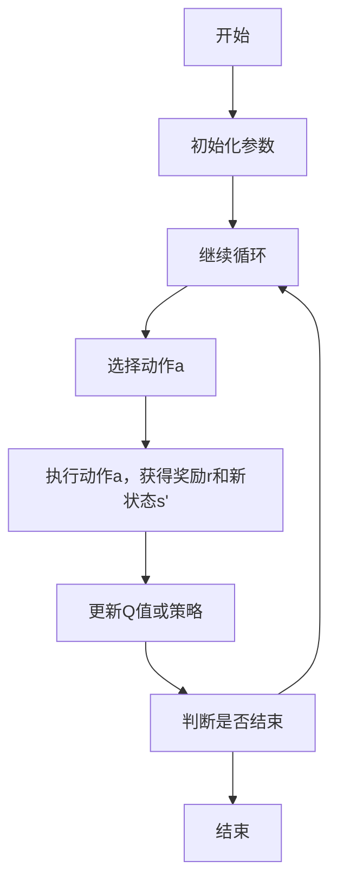
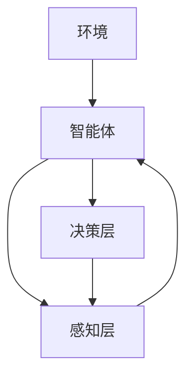
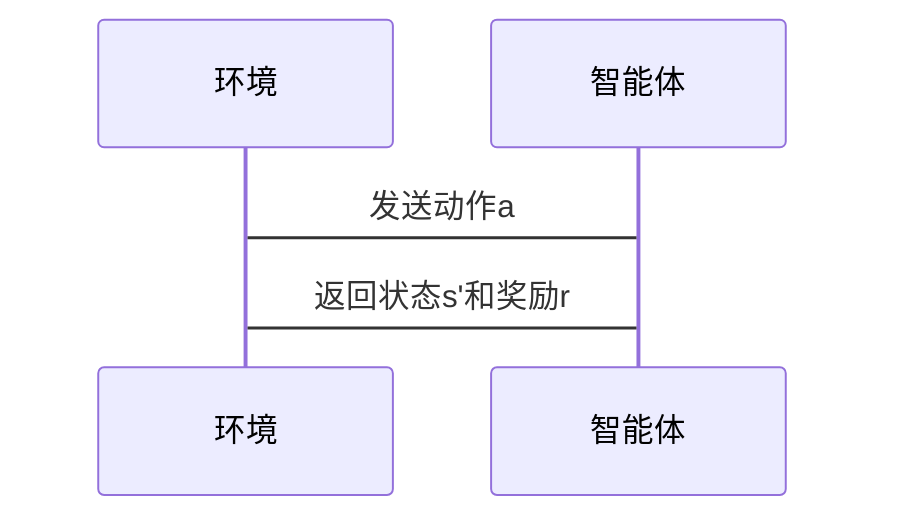

                 


# 强化学习在AI Agent任务规划中的应用

> 关键词：强化学习，任务规划，AI Agent，数学模型，算法，系统架构

> 摘要：本文深入探讨了强化学习在AI Agent任务规划中的应用，从强化学习的基本概念到任务规划的核心原理，再到具体的算法实现和系统架构设计，结合实际案例分析，详细阐述了强化学习如何驱动任务规划，并通过数学模型和公式进一步解析其内在机制。

---

## 第一部分: 强化学习与任务规划的背景介绍

### 第1章: 强化学习的基本概念

#### 1.1 强化学习的定义与核心概念
##### 1.1.1 强化学习的定义
强化学习（Reinforcement Learning, RL）是一种机器学习方法，通过智能体与环境的交互，逐步学习最优策略以最大化累计奖励。与监督学习和无监督学习不同，强化学习不需要明确的标签数据，而是通过试错机制优化行为。

##### 1.1.2 强化学习的核心概念
- **环境（Environment）**：智能体所处的外部世界，提供状态、动作和奖励。
- **智能体（Agent）**：能够感知环境并采取行动的主体。
- **状态（State）**：环境在某一时刻的描述，反映智能体的感知。
- **动作（Action）**：智能体在给定状态下采取的行为。
- **奖励（Reward）**：环境对智能体行为的反馈，用于指导优化策略。

##### 1.1.3 强化学习与监督学习、无监督学习的区别
- **监督学习**：基于标记数据，学习输入到输出的映射。
- **无监督学习**：从无标记数据中发现模式。
- **强化学习**：通过与环境交互，学习最优策略。

#### 1.2 任务规划的基本概念
##### 1.2.1 任务规划的定义
任务规划（Task Planning）是智能体根据目标和环境状态，制定并执行一系列动作以达成目标的过程。

##### 1.2.2 任务规划的核心要素
- **目标（Goal）**：智能体需要实现的任务。
- **动作（Action）**：完成任务的具体步骤。
- **状态（State）**：任务执行过程中的状态变化。
- **奖励（Reward）**：任务完成的反馈。

##### 1.2.3 任务规划与强化学习的关系
强化学习为任务规划提供了优化策略，而任务规划为强化学习提供了明确的目标和行动方向。

#### 1.3 强化学习在AI Agent中的应用背景
##### 1.3.1 AI Agent的基本概念
AI Agent是具有感知和行动能力的智能实体，能够自主决策并完成任务。

##### 1.3.2 任务规划在AI Agent中的重要性
任务规划是AI Agent实现复杂任务的核心能力，决定了其行动策略和效率。

##### 1.3.3 强化学习在任务规划中的优势
强化学习通过试错优化策略，能够在动态环境中适应性地调整任务规划。

#### 1.4 本章小结
本章介绍了强化学习和任务规划的基本概念，及其在AI Agent中的重要性。

---

### 第2章: 强化学习与任务规划的核心概念与联系

#### 2.1 强化学习的核心原理
##### 2.1.1 状态-动作-奖励-状态（SARSA）模型
SARSA模型描述了智能体在状态s采取动作a，获得奖励r，进入新状态s'的过程。

##### 2.1.2 Q-learning算法
Q-learning通过更新Q值函数，学习状态-动作对的最优奖励。

##### 2.1.3 策略梯度方法
策略梯度通过优化策略直接寻找最优动作概率分布。

#### 2.2 任务规划的核心原理
##### 2.2.1 任务分解与动作选择
任务分解将复杂任务拆解为简单动作，动作选择决定每一步的具体行动。

##### 2.2.2 状态空间与动作空间的建模
状态空间描述所有可能的状态，动作空间定义可用的动作。

##### 2.2.3 奖励函数的设计与优化
奖励函数定义了任务完成的反馈，直接影响智能体的学习动机。

#### 2.3 强化学习与任务规划的联系
##### 2.3.1 强化学习如何驱动任务规划
通过奖励机制，强化学习驱动智能体选择最优动作以完成任务。

##### 2.3.2 任务规划如何影响强化学习策略
任务规划决定了智能体的行动路径，影响强化学习的策略优化。

##### 2.3.3 强化学习在任务规划中的应用案例
例如，在机器人路径规划中，强化学习优化任务规划以提高效率。

#### 2.4 本章小结
本章探讨了强化学习和任务规划的核心原理及其相互作用。

---

### 第3章: 强化学习算法的数学模型与公式

#### 3.1 Q-learning算法的数学模型
Q值函数更新公式：
$$ Q(s, a) = Q(s, a) + \alpha (r + \gamma \max Q(s', a') - Q(s, a)) $$

其中，$\alpha$为学习率，$\gamma$为折扣因子。

#### 3.2 策略梯度方法的数学模型
策略梯度通过优化目标函数：
$$ J(\theta) = \mathbb{E}_{\tau} [\sum_{t} r_t] $$
其中，$\tau$为轨迹，$\theta$为参数。

#### 3.3 算法流程图


---

### 第4章: 强化学习在任务规划中的系统架构设计

#### 4.1 问题场景介绍
智能体需要在动态环境中完成复杂任务，如路径规划、资源分配等。

#### 4.2 系统功能设计
领域模型类图：


#### 4.3 系统架构设计
分层架构图：


#### 4.4 系统接口设计
序列图：


---

### 第5章: 项目实战

#### 5.1 环境安装
安装Python和相关库，如numpy、tensorflow、keras。

#### 5.2 核心代码实现
Q-learning实现：
```python
import numpy as np

class QLearning:
    def __init__(self, state_space, action_space):
        self.q_table = np.zeros((state_space, action_space))
    
    def choose_action(self, state, epsilon=0.1):
        if np.random.random() < epsilon:
            return np.random.randint(action_space)
        return np.argmax(self.q_table[state])
    
    def update_q(self, state, action, reward, next_state, alpha=0.1, gamma=0.9):
        self.q_table[state][action] += alpha * (reward + gamma * np.max(self.q_table[next_state]) - self.q_table[state][action])
```

#### 5.3 代码应用解读与分析
详细分析代码功能，解释每部分的作用和实现逻辑。

#### 5.4 实际案例分析
通过具体案例，如机器人导航，展示强化学习如何优化任务规划。

#### 5.5 项目小结
总结项目成果，讨论遇到的问题及解决方法。

---

### 第6章: 最佳实践与小结

#### 6.1 小结
总结全文内容，强调强化学习在任务规划中的重要性。

#### 6.2 注意事项
- 状态空间和动作空间的设计要合理。
- 奖励函数的设计要明确目标导向。
- 学习率和折扣因子要适当调优。

#### 6.3 拓展阅读
推荐相关书籍和论文，如《强化学习》和《深度强化学习》。

---

## 作者：AI天才研究院 & 禅与计算机程序设计艺术

---

本文通过系统地介绍强化学习在AI Agent任务规划中的应用，从理论到实践，详细阐述了其核心原理和实现方法，为读者提供了全面的技术指导。

