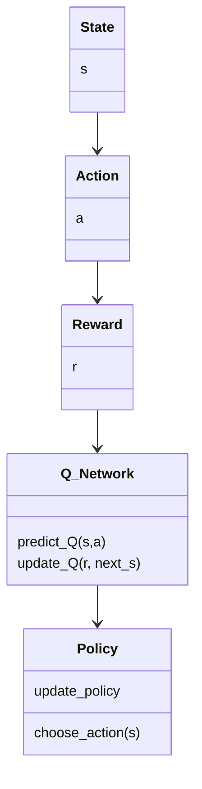
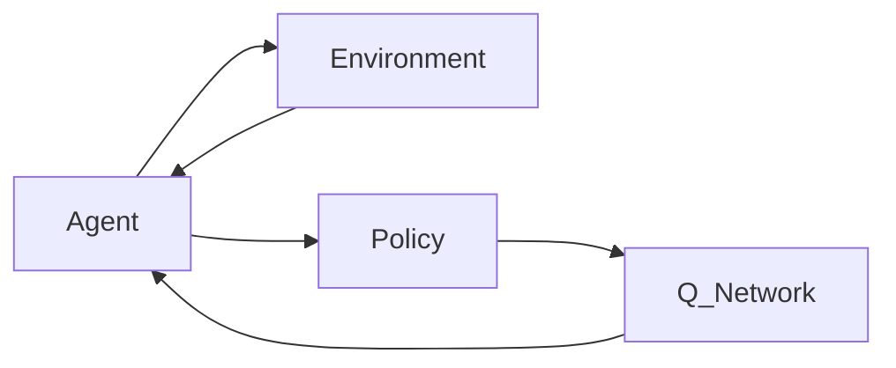
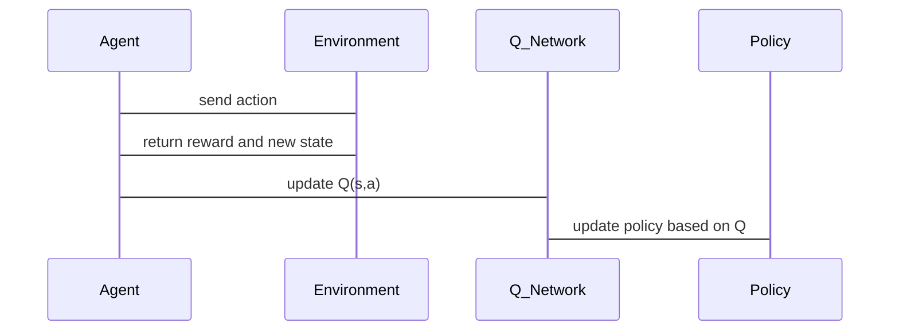

                 


# 强化学习在AI Agent决策优化中的应用

> 关键词：强化学习，AI Agent，决策优化，马尔可夫决策过程，Q-Learning，Deep Q-Networks（DQN）

> 摘要：本文深入探讨了强化学习在AI Agent决策优化中的应用，从强化学习的基本概念、算法原理到实际应用中的系统设计与项目实战，结合丰富的案例分析和代码实现，全面剖析强化学习在AI Agent决策优化中的核心思想和实现方法。通过本文的学习，读者将能够理解强化学习的核心原理，并掌握如何将其应用于实际的AI Agent决策优化问题中。

---

## 第一部分: 强化学习基础

### 第1章: 强化学习基本概念

#### 1.1 强化学习的定义与特点

强化学习是一种机器学习范式，通过智能体与环境的交互，学习如何做出最优决策以最大化累积奖励。与监督学习不同，强化学习不需要明确的标注数据，而是通过试错机制进行学习。

**特点：**
- **自主性**：智能体根据经验自主决策。
- **环境交互**：智能体通过与环境交互获得反馈。
- **奖励驱动**：通过奖励信号指导学习方向。
- **策略优化**：目标是找到最优策略以最大化累计奖励。

#### 1.2 强化学习的核心要素

| 要素 | 定义 | 示例 |
|------|------|------|
| 状态 (State) | 智能体所处的环境状况 | 在迷宫中的位置 |
| 行动 (Action) | 智能体可采取的动作 | 向左、向右、前进 |
| 奖励 (Reward) | 环境对智能体行为的反馈 | 到达目标奖励+1，碰撞障碍物奖励-1 |
| 策略 (Policy) | 智能体选择动作的概率分布 | $\pi(a|s)$ 表示在状态$s$下选择动作$a$的概率 |
| 值函数 (Value Function) | 表征状态或动作的价值 | $V(s)$ 表示从状态$s$开始的期望累计奖励 |

#### 1.3 强化学习的数学基础

**状态值函数**：
$$ V(s) = E[r_t + \gamma r_{t+1} + \gamma^2 r_{t+2} + \dots ] $$
其中，$r_t$ 表示第$t$步的奖励，$\gamma$ 表示折扣因子，$0 \leq \gamma \leq 1$。

**动作值函数**：
$$ Q(s,a) = E[r_t + \gamma r_{t+1} + \gamma^2 r_{t+2} + \dots ] $$
表示在状态$s$采取动作$a$后的期望累计奖励。

**Bellman方程**：
$$ Q(s,a) = r(s,a) + \gamma \max_{a'} Q(s',a') $$
其中，$s'$ 是采取动作$a$后的下一状态。

#### 1.4 强化学习的核心算法

**Q-Learning算法**：
```python
初始化 Q 表为全零矩阵
while 环境未终止：
    选择动作 a（例如，ε-greedy策略）
    执行动作 a，观察奖励 r 和新状态 s'
    更新 Q 表：
    Q(s, a) = Q(s, a) + α [r + γ max Q(s', a') - Q(s, a)]
```

**Deep Q-Networks（DQN）算法**：
使用神经网络近似Q值函数，通过经验回放和目标网络改进Q-Learning。

**Policy Gradient方法**：
直接优化策略，计算策略的梯度并进行更新。

#### 1.5 本章小结

本章介绍了强化学习的基本概念、核心要素和数学基础，并简要介绍了几种经典的强化学习算法。理解这些内容是后续学习强化学习在AI Agent中的应用的基础。

---

## 第二部分: 强化学习在AI Agent中的应用

### 第2章: AI Agent与强化学习的结合

#### 2.1 AI Agent的基本概念

**AI Agent** 是一个能够感知环境、自主决策并采取行动的智能实体。Agent 的决策过程需要考虑当前状态、可能的动作及其带来的奖励。

#### 2.2 强化学习在Agent决策中的作用

**优化目标**：最大化累计奖励，即找到最优策略。
**优势**：强化学习通过试错机制，能够适应动态变化的环境，并在复杂任务中找到最优解。

#### 2.3 强化学习与多智能体协作

**多智能体协作**：多个智能体通过协作完成任务，例如多机器人编队或游戏中的团队合作。

**挑战**：
- **通信开销**：智能体之间的通信可能带来额外的计算开销。
- **策略协调**：不同智能体的策略需要协调一致，避免冲突。
- **环境共享**：多个智能体共享同一环境，需要处理状态冲突问题。

**算法**：基于强化学习的多智能体协作算法，例如多智能体DQN（MADQN）和基于价值分解的方法（如VDN和QV分解）。

#### 2.4 本章小结

本章探讨了AI Agent与强化学习的结合，强调了强化学习在Agent决策优化中的优势，并讨论了多智能体协作的挑战与解决方案。

---

## 第三部分: 强化学习算法的数学模型与实现

### 第3章: 强化学习的数学模型

#### 3.1 状态值函数与动作值函数

**状态值函数**：
$$ V(s) = \max_{a} Q(s,a) $$
表示状态$s$下的最大价值。

**动作值函数**：
$$ Q(s,a) = r(s,a) + \gamma V(s') $$
表示采取动作$a$后的期望累计奖励。

#### 3.2 Bellman方程的求解

**Q-Learning算法的Bellman方程**：
$$ Q(s,a) = r(s,a) + \gamma \max_{a'} Q(s',a') $$

**Deep Q-Networks（DQN）的实现**：
使用神经网络近似Q值函数，并通过经验回放和目标网络改进学习稳定性。

---

## 第四部分: 强化学习在AI Agent决策优化中的系统架构与实现

### 第4章: 强化学习在AI Agent中的系统架构

#### 4.1 系统功能设计

**领域模型**：


**系统架构**：


#### 4.2 系统接口设计

- **输入接口**：接收环境状态$s$。
- **输出接口**：输出动作$a$。
- **奖励接口**：接收奖励$r$并更新Q值函数。

#### 4.3 系统交互流程



#### 4.4 本章小结

本章通过系统架构图和交互图详细描述了强化学习在AI Agent中的系统设计与实现流程。

---

## 第五部分: 强化学习在AI Agent中的项目实战

### 第5章: 强化学习项目实战

#### 5.1 环境搭建

**工具选择**：
- **Python**：编程语言。
- **OpenAI Gym**：强化学习环境库。
- **TensorFlow/PyTorch**：深度学习框架。

**安装步骤**：
```bash
pip install gym numpy tensorflow
```

#### 5.2 核心实现

**Q-Learning实现**：
```python
import numpy as np
import gym

# 初始化环境
env = gym.make('CartPole-v0')
env.seed(42)

# 初始化Q表
Q = np.zeros([env.observation_space.shape[0], env.action_space.n])

# 参数设置
alpha = 0.1
gamma = 0.99
epsilon = 0.1

# Q-Learning算法
for episode in range(1000):
    state = env.reset()
    total_reward = 0
    done = False
    while not done:
        # 探索与利用
        if np.random.random() < epsilon:
            action = env.action_space.sample()
        else:
            action = np.argmax(Q[state])
        # 执行动作
        next_state, reward, done, info = env.step(action)
        # 更新Q表
        Q[state][action] = Q[state][action] + alpha * (reward + gamma * np.max(Q[next_state]) - Q[state][action])
        state = next_state
        total_reward += reward
    # 衰减epsilon
    epsilon = max(epsilon * 0.995, 0.01)
    print(f"Episode {episode}, Total Reward: {total_reward}")
```

**Deep Q-Networks（DQN）实现**：
```python
import torch
import torch.nn as nn
import torch.optim as optim
import gym

class DQN(nn.Module):
    def __init__(self, input_dim, output_dim):
        super(DQN, self).__init__()
        self.fc = nn.Linear(input_dim, 64)
        self.fc2 = nn.Linear(64, output_dim)
    
    def forward(self, x):
        x = x.float()
        x = torch.relu(self.fc(x))
        x = self.fc2(x)
        return x

# 初始化环境
env = gym.make('CartPole-v0')
env.seed(42)

# 网络参数
input_dim = env.observation_space.shape[0]
output_dim = env.action_space.n
model = DQN(input_dim, output_dim)
optimizer = optim.Adam(model.parameters(), lr=0.001)
loss_fn = nn.MSELoss()

# DQN算法
for episode in range(1000):
    state = env.reset()
    total_reward = 0
    done = False
    while not done:
        # 探索与利用
        if np.random.random() < 0.1:
            action = env.action_space.sample()
        else:
            with torch.no_grad():
                q = model(torch.tensor(state))
                action = torch.argmax(q).item()
        # 执行动作
        next_state, reward, done, info = env.step(action)
        # 训练网络
        target = torch.tensor(reward + gamma * torch.max(model(torch.tensor(next_state))).item())
        optimizer.zero_grad()
        outputs = model(torch.tensor(state))
        loss = loss_fn(outputs[action], target)
        loss.backward()
        optimizer.step()
        state = next_state
        total_reward += reward
    print(f"Episode {episode}, Total Reward: {total_reward}")
```

#### 5.3 实际案例分析

**案例：CartPole-v0**

- **目标**：通过控制杆子的左右移动，保持杆子不倒。
- **挑战**：杆子的动态特性使得需要实时调整策略。
- **结果**：经过训练，智能体能够稳定控制杆子，获得较高的累计奖励。

#### 5.4 本章小结

本章通过实际案例分析和代码实现，展示了如何将强化学习算法应用于AI Agent的决策优化问题中。通过Q-Learning和DQN的实现，读者可以理解强化学习在实际应用中的具体步骤和实现细节。

---

## 第六部分: 强化学习在AI Agent中的高级主题与未来趋势

### 第6章: 强化学习的高级主题

#### 6.1 多智能体强化学习

**挑战**：
- **通信开销**：智能体之间的通信可能带来额外的计算开销。
- **策略协调**：不同智能体的策略需要协调一致，避免冲突。

**解决方案**：
- **价值分解方法**（如VDN和QV分解）：将整体价值分解为个体价值的组合。
- **中央化决策**：通过中央控制器协调多个智能体的行动。

#### 6.2 强化学习的前沿技术

- **元强化学习**：通过学习如何学习，适应不同任务和环境。
- **无模型强化学习**：不依赖于环境模型，直接在环境中学习策略。
- **自适应强化学习**：根据环境变化动态调整学习策略。

#### 6.3 未来发展趋势

- **多智能体协作的优化**：研究如何提高多智能体协作的效率和稳定性。
- **强化学习的可解释性**：如何让强化学习的决策过程更加透明和可解释。
- **强化学习的安全性**：研究如何避免强化学习算法带来的安全风险。

#### 6.4 本章小结

本章探讨了强化学习的高级主题和未来发展趋势，展望了强化学习在AI Agent中的潜在研究方向。

---

## 第七部分: 最佳实践与注意事项

### 第7章: 最佳实践

#### 7.1 环境设计

- **简洁性**：环境设计应尽可能简单，避免过多复杂的状态和动作。
- **可扩展性**：环境应具备良好的扩展性，以适应不同的任务需求。

#### 7.2 策略优化

- **探索与利用的平衡**：通过适当的策略选择，平衡探索和利用，避免陷入局部最优。
- **奖励设计**：合理设计奖励机制，引导智能体朝着预期目标行动。

#### 7.3 系统优化

- **算法优化**：通过优化算法参数和结构，提高学习效率。
- **硬件加速**：利用GPU加速计算，提高训练速度。

### 第8章: 小结与注意事项

- **小结**：强化学习在AI Agent中的应用前景广阔，通过合理的设计和优化，可以显著提高智能体的决策能力。
- **注意事项**：
  - 确保环境设计的合理性和可扩展性。
  - 选择合适的算法和策略，平衡探索与利用。
  - 重视系统的优化和维护，确保高效运行。

---

## 作者信息

作者：AI天才研究院/AI Genius Institute & 禅与计算机程序设计艺术 /Zen And The Art of Computer Programming

---

以上是《强化学习在AI Agent决策优化中的应用》的完整目录和内容概要，涵盖了从基础理论到实际应用的各个方面，结合丰富的案例分析和代码实现，为读者提供了一条系统学习强化学习在AI Agent中的应用的路径。

