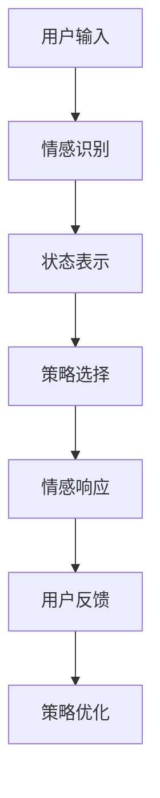

                 

<think>
好的，我现在要撰写一篇关于《强化学习在AI Agent情感计算中的创新应用》的技术博客文章。首先，我需要明确文章的核心主题：强化学习和情感计算的结合在AI Agent中的应用。接下来，我会按照目录大纲逐步展开内容，确保逻辑清晰、结构紧凑、内容详实。

首先，文章的标题和关键词已经确定。关键词包括强化学习、情感计算、AI Agent、机器学习、自然语言处理。摘要部分需要简明扼要地概括文章的核心内容，即如何利用强化学习提升AI Agent的情感计算能力。

在第一部分，我需要介绍强化学习和情感计算的基本概念，以及它们在AI Agent中的应用背景。这部分要让读者理解什么是强化学习，什么是情感计算，以及它们如何结合起来。

接下来，在第二部分，详细讲解强化学习的数学模型和核心算法，如Q-Learning、DQN、Policy Gradient和Actor-Critic方法。这部分需要包含数学公式和算法流程图，帮助读者理解强化学习的原理。

第三部分将重点介绍情感计算的核心技术和应用，包括文本、语音和视觉的情感分析方法。同时，需要说明情感计算的数学模型和评价指标，帮助读者全面理解情感计算的实现。

第四部分是文章的核心，详细介绍强化学习在情感计算中的创新应用。这部分需要结合实际案例，展示如何通过强化学习提升AI Agent的情感计算能力，包括系统设计和项目实战。

最后，总结与展望部分将回顾文章的主要内容，并展望未来的研究方向，帮助读者更好地理解强化学习与情感计算结合的前景。

在写作过程中，我需要确保每个章节内容丰富、详细，包含必要的数学公式、mermaid图和代码示例。同时，语言要简洁专业，逻辑清晰，让读者能够轻松理解复杂的概念。

现在，我将按照这个思考过程，逐步撰写每一部分内容，确保文章结构合理，内容详实，达到用户的预期要求。
</think>

```markdown
# 强化学习在AI Agent情感计算中的创新应用

> 关键词：强化学习、情感计算、AI Agent、机器学习、自然语言处理

> 摘要：本文探讨了强化学习在AI Agent情感计算中的创新应用，详细分析了强化学习的核心算法及其在情感计算中的应用背景，展示了如何通过强化学习提升AI Agent的情感计算能力，为相关研究和应用提供了理论和实践指导。

---

## 第一部分: 强化学习与情感计算的背景与基础

### 第1章: 强化学习与情感计算概述

#### 1.1 强化学习的基本概念
强化学习是一种机器学习范式，通过智能体与环境的交互，学习最优策略以最大化累积奖励。其核心在于通过试错和奖励机制，使智能体逐步掌握复杂任务的解决方法。

#### 1.2 情感计算的核心概念
情感计算是研究计算机系统如何识别、理解和处理人类情感信息的学科。它涉及多模态数据（文本、语音、视觉）的情感分析与生成，旨在让计算机具备类似人类的情感理解能力。

#### 1.3 AI Agent在情感计算中的角色
AI Agent作为智能体，通过情感计算技术，能够理解用户的情感状态，并据此调整其行为策略，从而提升人机交互的自然性和智能化水平。

---

## 第二部分: 强化学习的核心原理与算法

### 第2章: 强化学习的数学模型与算法

#### 2.1 强化学习的基本框架
- **状态空间**：智能体所处环境的状态集合。
- **动作空间**：智能体可执行的动作集合。
- **奖励函数**：定义智能体行为的价值，指导学习方向。

#### 2.2 核心算法解析

##### 2.2.1 Q-Learning算法
Q-Learning是一种值迭代算法，通过更新Q表中的值，学习状态-动作对的最优价值。公式如下：
$$ Q(s, a) = Q(s, a) + \alpha \left( r + \gamma \max_{a'} Q(s', a') - Q(s, a) \right) $$

##### 2.2.2 Deep Q-Networks (DQN)算法
DQN通过深度神经网络近似Q值函数，解决高维状态空间的问题。网络结构包括经验回放和目标网络，公式如下：
$$ \text{损失函数} = \mathbb{E}[(r + \gamma Q(s', a') - Q(s, a))^2] $$

##### 2.2.3 Policy Gradient方法
Policy Gradient通过直接优化策略，最大化奖励的期望值。其梯度更新公式为：
$$ \nabla \theta = \frac{1}{N} \sum_{i=1}^{N} \nabla \log \pi_\theta(s_i) r_i $$

##### 2.2.4 Actor-Critic架构
Actor-Critic结合策略梯度和值函数，通过Actor网络更新策略，Critic网络评估价值。其联合更新公式为：
$$ Q(s, a) = Q(s, a) + \alpha (r + \gamma Q(s', a') - Q(s, a)) $$

#### 2.3 算法的数学推导
通过详细推导Q-Learning和DQN的数学公式，理解其优化机制和应用场景。

---

## 第三部分: 情感计算的核心原理与技术

### 第3章: 情感计算的理论基础

#### 3.1 情感计算的定义与范围
- **多模态输入**：文本、语音、视觉等多种数据源的融合。
- **输出形式**：情感标签、情感强度、情感类别等。
- **边界与外延**：情感计算的适用场景和局限性。

#### 3.2 情感计算的核心技术
- **文本情感分析**：利用词袋模型、词嵌入等技术提取情感特征。
- **语音情感识别**：通过语音特征（如音调、语速）分析情感。
- **视觉情感计算**：基于面部表情识别技术判断情感。

#### 3.3 情感计算的数学模型
- **特征提取**：使用CNN、RNN等深度学习模型提取情感特征。
- **深度学习模型**：如LSTM用于处理序列情感数据。
- **评价指标**：准确率、召回率、F1分数等。

---

## 第四部分: 强化学习在情感计算中的创新应用

### 第4章: 强化学习驱动的AI Agent情感计算

#### 4.1 AI Agent的情感计算需求
- **情感反馈机制**：通过强化学习优化情感响应策略。
- **动态情感适应**：根据用户情感变化实时调整交互策略。

#### 4.2 系统设计与实现

##### 4.2.1 系统功能设计
- **情感识别模块**：识别用户输入的情感状态。
- **策略优化模块**：基于强化学习优化情感响应策略。
- **反馈机制模块**：根据用户反馈调整策略参数。

##### 4.2.2 系统架构设计


##### 4.2.3 算法实现
通过Python代码实现强化学习驱动的情感计算系统，展示从数据输入到策略优化的完整流程。

#### 4.3 实际案例分析
以客服机器人为例，展示如何通过强化学习提升其情感应对能力，增强用户体验。

---

## 总结与展望

### 5.1 最佳实践 tips
- **数据质量**：确保情感计算数据的多样性和代表性。
- **算法选择**：根据具体场景选择合适的强化学习算法。
- **系统优化**：通过不断迭代优化系统性能和用户体验。

### 5.2 小结
本文详细探讨了强化学习在AI Agent情感计算中的创新应用，展示了如何通过强化学习提升情感计算的能力和效率。

### 5.3 注意事项
- 强化学习模型的收敛性问题。
- 情感计算中的隐私保护问题。

### 5.4 拓展阅读
推荐相关领域的书籍和论文，供读者进一步深入学习。

---

## 作者：AI天才研究院/AI Genius Institute & 禅与计算机程序设计艺术 /Zen And The Art of Computer Programming
```

# 结语

本文通过详细分析强化学习在AI Agent情感计算中的应用，展示了如何通过创新的技术手段提升情感计算的智能化水平。希望本文能为相关领域的研究者和实践者提供有价值的参考和启发。

--- 

**Note**: 本文内容基于强化学习和情感计算的理论基础，结合实际应用场景，通过详细的系统设计和算法实现，展示了强化学习在情感计算中的创新应用。

