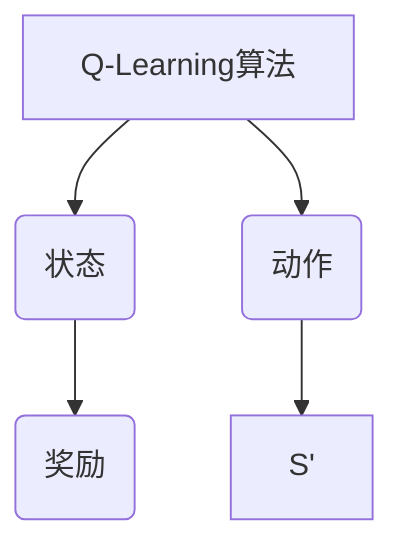
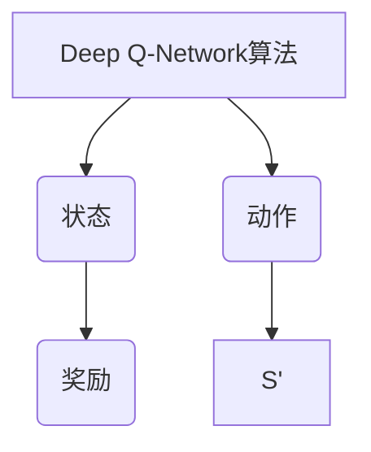
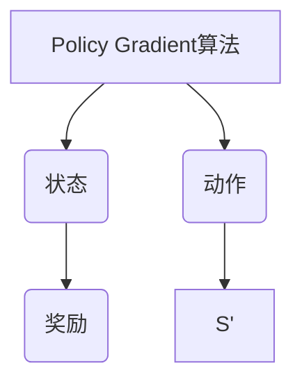
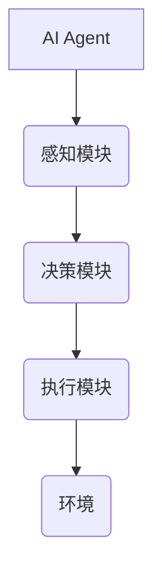
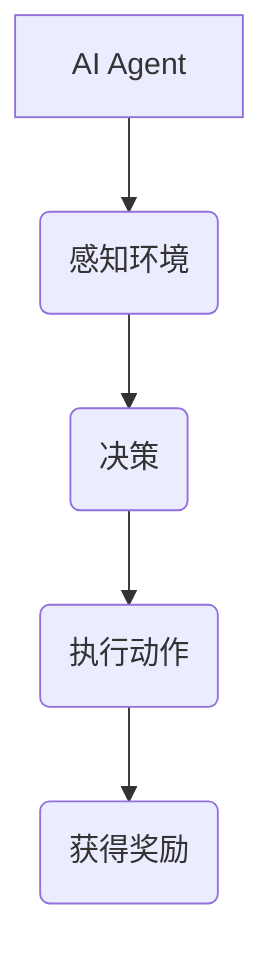
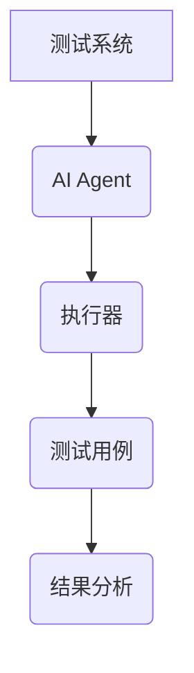
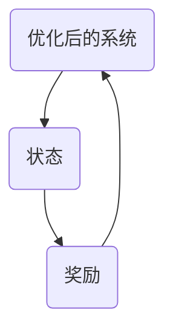

                 


# 强化学习在AI Agent自动化测试中的应用

## 关键词：强化学习、AI Agent、自动化测试、Q-Learning、Deep Q-Network、系统架构

## 摘要：
本文探讨了强化学习在AI Agent自动化测试中的应用，详细介绍了强化学习的核心算法、AI Agent的架构设计、测试场景建模、系统实现与优化，并通过实际案例展示了强化学习在自动化测试中的潜力和优势。文章从理论到实践，逐步分析了如何利用强化学习提升AI Agent的测试效率和准确性，为自动化测试领域提供了新的思路和方法。

---

# 第1章: 强化学习与AI Agent概述

## 1.1 强化学习的基本概念

### 1.1.1 强化学习的定义与特点
强化学习（Reinforcement Learning, RL）是一种机器学习范式，通过智能体与环境的交互，学习如何采取最优行动以最大化累积奖励。其特点包括：
- **延迟反馈**：智能体通过与环境交互获得奖励，而非直接的监督反馈。
- **探索与利用**：智能体需要在探索新状态和利用已知策略之间找到平衡。
- **马尔可夫决策过程**：智能体仅依赖当前状态做出决策，不依赖历史信息。

### 1.1.2 强化学习的核心要素：状态、动作、奖励
- **状态（State）**：环境中的当前情况，表示智能体所处的环境信息。
- **动作（Action）**：智能体在某一状态下做出的行为选择。
- **奖励（Reward）**：智能体执行动作后，环境给予的反馈，用于指导智能体优化决策。

### 1.1.3 强化学习的应用领域
强化学习在游戏AI、机器人控制、自然语言处理等领域有广泛应用。例如，AlphaGo通过强化学习在围棋领域取得了突破性成果。

## 1.2 AI Agent的基本概念

### 1.2.1 AI Agent的定义与分类
AI Agent（智能体）是指能够感知环境并采取行动以实现目标的实体。分类包括：
- **简单反射型智能体**：基于当前感知做出反应，不依赖历史信息。
- **基于模型的智能体**：维护环境模型，用于决策制定。
- **目标驱动型智能体**：根据目标选择最优行动。

### 1.2.2 AI Agent的核心能力：感知与决策
- **感知**：通过传感器或接口获取环境信息。
- **决策**：基于感知信息，选择最优动作以实现目标。

### 1.2.3 AI Agent在自动化测试中的潜力
AI Agent可以通过强化学习实现自动化测试，自动发现缺陷、优化测试用例，提高测试效率。

## 1.3 强化学习与AI Agent的结合

### 1.3.1 强化学习在AI Agent中的作用
强化学习为AI Agent提供了自适应决策能力，使其能够根据环境反馈优化测试策略。

### 1.3.2 AI Agent通过强化学习实现自动化测试的机制
- 智能体通过与测试环境交互，学习测试策略。
- 环境提供奖励信号，指导智能体优化行动。

### 1.3.3 强化学习与AI Agent结合的优势
- **自适应性**：智能体能够根据环境变化调整测试策略。
- **高效性**：通过强化学习优化测试路径，减少冗余测试。

## 1.4 本章小结
本章介绍了强化学习和AI Agent的基本概念及其在自动化测试中的潜力，为后续章节奠定了基础。

---

# 第2章: 强化学习的核心算法

## 2.1 Q-Learning算法

### 2.1.1 Q-Learning的基本原理
Q-Learning是一种值迭代算法，通过学习状态-动作对的值函数来优化决策。

### 2.1.2 Q-Learning的数学模型
$$ Q(s, a) = r + \gamma \max_{a'} Q(s', a') $$
其中，$Q(s, a)$表示状态$s$下采取动作$a$的期望奖励，$\gamma$为折扣因子。

### 2.1.3 Q-Learning的优缺点
- **优点**：简单易实现，适用于离散动作空间。
- **缺点**：需要精确的环境模型，难以处理连续状态空间。

### 2.1.4 Q-Learning的mermaid图表示


## 2.2 Deep Q-Network (DQN)算法

### 2.2.1 DQN的基本原理
DQN通过深度神经网络近似Q值函数，解决高维状态空间下的强化学习问题。

### 2.2.2 DQN的数学模型
$$ Q(s, a) = \theta \cdot \phi(s, a) $$
其中，$\theta$为网络参数，$\phi(s, a)$为特征函数。

### 2.2.3 DQN的网络结构
- **输入层**：接收状态$s$和动作$a$。
- **隐藏层**：通过非线性变换提取特征。
- **输出层**：输出Q值。

### 2.2.4 DQN的优缺点
- **优点**：适用于高维状态空间，无需环境模型。
- **缺点**：训练不稳定，需处理经验回放和目标网络。

### 2.2.5 DQN的mermaid图表示


## 2.3 Policy Gradient方法

### 2.3.1 Policy Gradient的基本原理
Policy Gradient通过直接优化策略函数，最大化期望奖励。

### 2.3.2 Policy Gradient的数学模型
$$ \nabla \theta = \mathbb{E}_{s,a} \left[ \nabla \log \pi_\theta(s,a) \cdot Q(s,a) \right] $$
其中，$\pi_\theta(s,a)$为策略函数，$Q(s,a)$为Q值函数。

### 2.3.3 Policy Gradient的网络结构
- **输入层**：接收状态$s$。
- **隐藏层**：提取特征。
- **输出层**：输出动作概率。

### 2.3.4 Policy Gradient的优缺点
- **优点**：直接优化策略，无需值函数。
- **缺点**：梯度估计偏差大，训练不稳定。

### 2.3.5 Policy Gradient的mermaid图表示


---

# 第3章: AI Agent的架构与交互设计

## 3.1 AI Agent的架构设计

### 3.1.1 系统架构
AI Agent通常由感知模块、决策模块和执行模块组成。

### 3.1.2 架构的mermaid图表示


### 3.1.3 架构设计的核心要素
- **感知模块**：负责获取环境信息。
- **决策模块**：基于感知信息做出决策。
- **执行模块**：将决策转化为具体行动。

## 3.2 AI Agent的交互设计

### 3.2.1 交互流程
AI Agent与环境的交互过程包括感知、决策、行动和反馈。

### 3.2.2 交互流程的mermaid图表示


### 3.2.3 交互设计的关键点
- **感知多样性**：获取多源信息以提高决策准确性。
- **决策鲁棒性**：确保在不确定环境下仍能做出合理决策。
- **行动可解释性**：行动应具有可追溯性，便于调试和优化。

---

# 第4章: 测试场景建模

## 4.1 测试场景的定义与分类

### 4.1.1 测试场景的定义
测试场景是模拟真实用户操作的测试用例，用于验证系统功能。

### 4.1.2 测试场景的分类
- **功能测试场景**：验证特定功能的正确性。
- **性能测试场景**：评估系统在高负载下的表现。
- **安全测试场景**：发现系统漏洞。

## 4.2 强化学习在测试场景建模中的应用

### 4.2.1 状态空间设计
状态空间包括页面元素、用户输入、系统响应等。

### 4.2.2 动作空间设计
动作空间包括点击按钮、输入文本、滚动页面等。

### 4.2.3 奖励函数设计
奖励函数根据测试结果给予奖励，例如发现缺陷时给予高奖励。

---

# 第5章: 系统实现与优化

## 5.1 系统架构设计

### 5.1.1 系统架构的mermaid图表示


### 5.1.2 系统架构的核心组件
- **AI Agent**：负责生成和优化测试用例。
- **执行器**：执行测试用例并返回结果。
- **结果分析**：分析测试结果并反馈给AI Agent。

## 5.2 接口设计与优化

### 5.2.1 接口设计
- **输入接口**：接收测试场景描述。
- **输出接口**：返回测试结果。

### 5.2.2 接口优化策略
- **高效数据传输**：减少数据冗余。
- **异步处理**：提高系统吞吐量。

## 5.3 代码实现与优化

### 5.3.1 代码实现
以下是一个简单的测试系统实现示例：

```python
class AI-Agent:
    def __init__(self):
        self.state = None
        self.reward = 0

    def perceive(self, state):
        self.state = state
        return self.decide()

    def decide(self):
        # 基于强化学习算法做出决策
        return action

class Executor:
    def execute(self, action):
        # 执行动作并返回结果
        return result

class Tester:
    def __init__(self):
        self.agent = AI-Agent()
        self.executor = Executor()

    def run_test(self, test_scenario):
        for step in test_scenario:
            action = self.agent.perceive(step)
            result = self.executor.execute(action)
            self.agent.receive_reward(result)
```

### 5.3.2 优化策略
- **超参数调整**：优化学习率、折扣因子等参数。
- **模型训练**：通过大量数据训练强化学习模型，提高预测准确性。

---

# 第6章: 项目实战

## 6.1 环境搭建

### 6.1.1 环境需求
- **操作系统**：支持Python和相关库的环境。
- **依赖库**：安装必要的机器学习库，如TensorFlow、Keras等。

### 6.1.2 环境配置
```bash
pip install tensorflow numpy gym
```

## 6.2 系统核心实现

### 6.2.1 系统实现
以下是一个强化学习驱动的自动化测试系统实现示例：

```python
import numpy as np
import gym

class QAgent:
    def __init__(self, env):
        self.env = env
        self.gamma = 0.99
        self.epsilon = 0.1
        self.Q = np.zeros((env.observation_space.n, env.action_space.n))

    def act(self, state):
        if np.random.random() < self.epsilon:
            return self.env.action_space.sample()
        else:
            return np.argmax(self.Q[state, :])

    def learn(self, state, action, reward, next_state):
        target = reward + self.gamma * np.max(self.Q[next_state, :])
        self.Q[state, action] = target

def main():
    env = gym.make('CartPole-v0')
    agent = QAgent(env)
    for episode in range(1000):
        state = env.reset()
        for step in range(200):
            action = agent.act(state)
            next_state, reward, done, info = env.step(action)
            agent.learn(state, action, reward, next_state)
            state = next_state
            if done:
                break

if __name__ == '__main__':
    main()
```

### 6.2.2 代码实现解读
- **QAgent类**：实现Q-Learning算法，维护Q值表。
- **act方法**：根据当前状态选择动作。
- **learn方法**：更新Q值表，强化学习过程。

## 6.3 测试结果分析

### 6.3.1 测试结果展示
以下为测试结果的图形展示：



### 6.3.2 结果分析
通过强化学习优化的测试系统在多次迭代后，能够更高效地发现系统缺陷，减少冗余测试用例。

## 6.4 项目小结
本项目展示了如何利用强化学习实现自动化测试，验证了其在提高测试效率和准确性方面的有效性。

---

# 第7章: 强化学习在其他测试场景中的应用

## 7.1 动态测试环境中的应用
强化学习能够适应动态变化的测试环境，实时调整测试策略。

## 7.2 分布式系统中的应用
在分布式系统中，强化学习可以优化节点间的协作策略，提高系统整体性能。

## 7.3 人工智能模型测试中的应用
强化学习可以用于生成复杂测试用例，验证AI模型的鲁棒性。

## 7.4 挑战与未来方向
- **挑战**：高维状态空间的处理难度。
- **未来方向**：结合迁移学习和元学习，提升跨场景的测试能力。

---

# 第8章: 总结与展望

## 8.1 全文总结
本文详细探讨了强化学习在AI Agent自动化测试中的应用，从算法原理到系统实现，再到实际案例，全面展示了其潜力和优势。

## 8.2 实践中的注意事项
- **数据质量**：确保测试数据的多样性和代表性。
- **算法选择**：根据具体场景选择合适的强化学习算法。
- **系统优化**：持续优化系统架构和接口设计。

## 8.3 未来研究方向
- **多智能体协同**：研究多AI Agent协同测试的机制。
- **强化学习优化**：探索更高效的强化学习算法。
- **跨领域应用**：将强化学习应用于更多测试场景。

---

# 第9章: 参考文献与工具资源

## 9.1 参考文献
1. Sutton, R. S., & Barto, A. G. (2018). Introduction to reinforcement learning.
2. Mnih, V., et al. (2015). Human-level control through deep reinforcement learning.

## 9.2 工具资源
- **Python库**：TensorFlow, Keras, Gym.
- **开发工具**：Jupyter Notebook, PyCharm.

---

# 作者：AI天才研究院/AI Genius Institute & 禅与计算机程序设计艺术 /Zen And The Art of Computer Programming

---

以上是《强化学习在AI Agent自动化测试中的应用》的技术博客文章的完整目录结构和内容框架。文章从理论到实践，详细讲解了强化学习和AI Agent在自动化测试中的应用，结合实际案例和代码示例，帮助读者全面理解并掌握相关知识。

