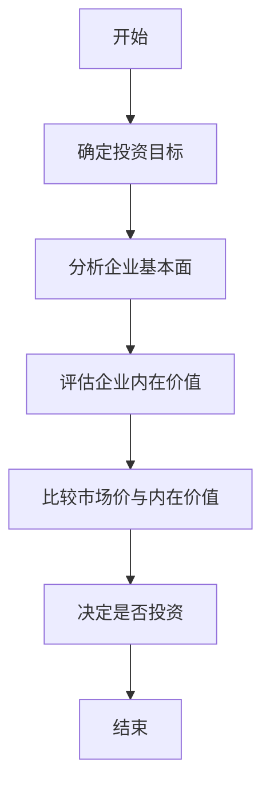
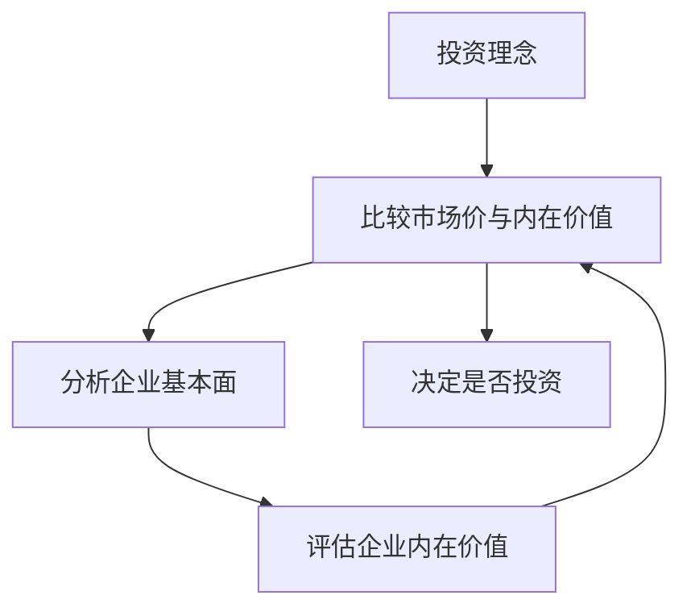

                 


# 彼得·林奇投资理念：注重长期和简单业务

## 关键词：彼得·林奇，长期投资，简单业务，投资理念，价值评估，系统架构

## 摘要：彼得·林奇是全球著名的投资专家，他的投资理念强调长期投资和专注于简单业务。本文详细分析了彼得·林奇的投资策略，探讨了长期投资与简单业务的核心概念、算法原理、系统架构以及项目实战，最后总结了最佳实践和注意事项。

---

## 第1章: 投资理念的背景与核心概念

### 1.1 投资理念的背景介绍

#### 1.1.1 传统投资理念的局限性

传统的投资理念往往注重短期收益和复杂的市场操作，这种方法容易受到市场波动的影响，投资者在面对短期亏损时容易产生恐慌性抛售，导致投资回报不稳定。此外，复杂的业务模式和频繁的市场操作增加了投资成本和风险。

#### 1.1.2 彼得·林奇投资理念的提出背景

彼得·林奇作为富达投资集团的前董事长，以其独特的长期投资理念闻名。他主张通过长期持有优质股票，避免频繁交易，从而降低投资成本，提高收益的稳定性。这种理念在20世纪80年代取得了显著的成功，为投资者提供了新的思路。

#### 1.1.3 长期投资与简单业务的核心问题

长期投资的核心问题是选择那些具有长期增长潜力的企业，而简单业务则是指那些业务模式简单、易于理解的企业。两者的结合可以帮助投资者在复杂的市场环境中找到稳定的投资标的。

### 1.2 彼得·林奇的生平与投资风格

#### 1.2.1 彼得·林奇的个人经历

彼得·林奇出生于1940年，毕业于宾夕法尼亚大学和哈佛大学法学院。他在1977年加入富达投资集团，担任麦哲伦基金的经理，取得了卓越的投资业绩，使该基金的规模从1977年的2000万美元增长到1990年的140亿美元。

#### 1.2.2 林奇投资风格的核心特点

林奇的投资风格以长期持有、价值发现和分散投资为核心。他认为，投资者应该选择那些具有强大竞争优势、管理团队优秀且财务状况稳健的企业进行投资。

#### 1.2.3 林奇投资理念对企业的影响

林奇的投资理念推动了许多企业注重长期发展和稳健经营，鼓励企业专注于核心业务，避免盲目扩张。

### 1.3 长期投资与简单业务的定义与特点

#### 1.3.1 长期投资的定义与核心要素

长期投资是指投资者在较长的时间内持有某种资产，通常为股票或债券，期望通过资产增值获得收益。核心要素包括选择优质资产、分散投资、长期持有和定期评估。

#### 1.3.2 简单业务的定义与核心要素

简单业务是指业务模式简单、易于理解且竞争优势明显的企业。核心要素包括清晰的商业模式、稳定的市场需求和强大的核心竞争力。

#### 1.3.3 长期投资与简单业务的联系与区别

长期投资和简单业务的联系在于，简单业务更容易被长期投资者选择，因为其稳定性和可预测性较高。区别在于，长期投资是一种投资策略，而简单业务是企业的一种特征。

---

## 第2章: 长期投资的核心概念与原理

### 2.1 长期投资的核心概念

#### 2.1.1 长期投资的哲学基础

长期投资的哲学基础是相信市场具有自我纠正的能力，优质资产的价值终将反映在价格上。投资者需要耐心等待，避免短期波动的干扰。

#### 2.1.2 长期投资的数学模型

价值评估模型是长期投资的重要工具，其核心公式为：

$$ V = \frac{E}{P} $$

其中，\( V \) 表示投资价值，\( E \) 表示企业未来现金流的现值，\( P \) 表示当前股价。

#### 2.1.3 长期投资的风险与收益分析

长期投资的风险主要来自市场波动和企业基本面变化，但其收益通常高于短期投资，因为复利效应会放大收益。

### 2.2 简单业务的核心概念

#### 2.2.1 简单业务的定义与特征

简单业务是指业务模式简单、易于管理的企业，例如公用事业、消费品制造等。这类企业通常具有稳定的现金流和较低的经营风险。

#### 2.2.2 简单业务的长期稳定性分析

简单业务由于其业务模式的稳定性，通常能够在经济周期中保持较好的表现，为长期投资者提供稳定的回报。

#### 2.2.3 简单业务的市场竞争力分析

简单业务的竞争优势通常体现在成本控制和品牌忠诚度上，这使得它们在市场中具有较强的竞争力。

### 2.3 长期投资与简单业务的关系

#### 2.3.1 长期投资与简单业务的协同效应

简单业务的稳定性和可预测性使得它们成为长期投资的理想标的。长期投资者通过持有简单业务的股票，可以在较长的时间内获得稳定的收益。

#### 2.3.2 简单业务对长期投资的支撑作用

简单业务的稳定性和长期性为投资者提供了较高的安全保障，使得长期投资的风险可控。

#### 2.3.3 长期投资对简单业务的促进作用

长期投资者通常会关注企业的长期发展，推动企业注重稳健经营和持续创新。

---

## 第3章: 彼得·林奇投资理念的算法原理

### 3.1 投资理念的数学模型

#### 3.1.1 投资价值的计算公式

$$ V = \frac{E}{P} $$

其中，\( V \) 表示投资价值，\( E \) 表示企业未来现金流的现值，\( P \) 表示当前股价。

#### 3.1.2 内在价值的计算公式

$$ \text{内在价值} = \sum_{t=1}^{n} \frac{C_t}{(1 + r)^t} $$

其中，\( C_t \) 表示第 \( t \) 年的现金流，\( r \) 表示折现率。

### 3.2 投资理念的算法流程图



### 3.3 本章小结

---

## 第4章: 投资理念的系统分析与架构设计

### 4.1 投资理念的系统架构

#### 4.1.1 投资理念的系统组成

系统主要包括数据采集、价值评估、投资决策和风险控制四个模块。

#### 4.1.2 投资理念的系统功能

系统功能包括数据采集、企业分析、价值评估和投资决策。

#### 4.1.3 投资理念的系统架构图



### 4.2 系统架构设计

#### 4.2.1 项目介绍

本项目旨在通过系统化的架构设计，实现彼得·林奇投资理念的算法和流程。

#### 4.2.2 系统功能设计

系统功能包括数据采集、企业分析、价值评估和投资决策。

#### 4.2.3 系统架构设计

系统架构采用分层设计，包括数据层、业务逻辑层和用户界面层。

#### 4.2.4 系统接口设计

系统接口包括数据输入接口、数据处理接口和结果输出接口。

#### 4.2.5 系统交互设计

系统交互采用流程图形式，展示投资决策的全过程。

---

## 第5章: 项目实战与案例分析

### 5.1 环境安装

安装Python和必要的库，如Pandas、NumPy等。

### 5.2 核心实现源代码

```python
import pandas as pd
import numpy as np

def calculate_intrinsic_value(enterprise_value, discount_rate):
    cash_flows = [100, 120, 150, 200]
    present_value = sum(cash_flow / (1 + discount_rate) ** t for t, cash_flow in enumerate(cash_flows))
    return present_value

enterprise_value = 500
discount_rate = 0.08
intrinsic_value = calculate_intrinsic_value(enterprise_value, discount_rate)
print(f"企业内在价值: {intrinsic_value}")
```

### 5.3 实际案例分析

以某公司为例，计算其内在价值，并与市场价进行比较，决定是否投资。

### 5.4 项目小结

---

## 第6章: 最佳实践与注意事项

### 6.1 最佳实践 tips

- 选择简单业务，降低投资风险。
- 长期持有，避免频繁交易。

### 6.2 小结

彼得·林奇的投资理念强调长期投资和简单业务，这种理念在实践中已经被证明是有效的。

### 6.3 注意事项

- 风险提示：长期投资仍需关注企业基本面的变化。
- 投资者需根据自身情况调整投资策略。

---

## 第7章: 拓展阅读与深入探讨

### 7.1 拓展阅读

推荐书籍：《彼得·林奇的选股标准》。

### 7.2 深入探讨

探讨长期投资与简单业务的结合对企业价值的影响。

---

## 作者：AI天才研究院/AI Genius Institute & 禅与计算机程序设计艺术 /Zen And The Art of Computer Programming

