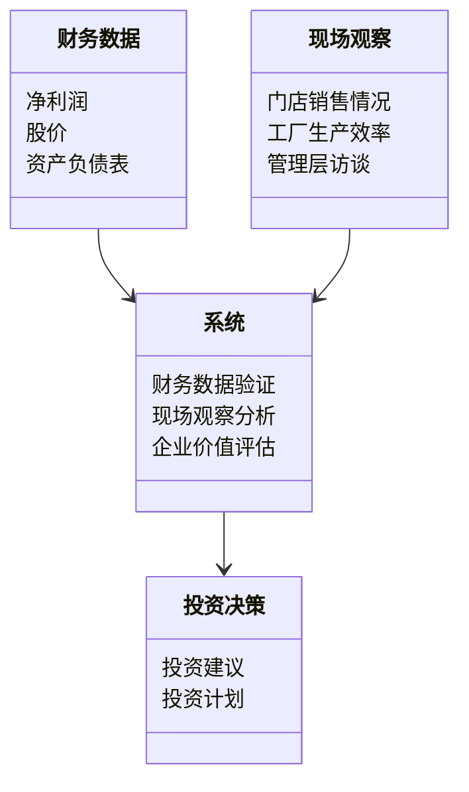

                 

<think>
嗯，我现在需要帮助用户设计一个关于彼得·林奇实地调研方法的技术博客目录。用户已经提供了一个详细的示例，我需要确保我的设计符合他们的要求和结构。

首先，我注意到用户的要求非常详细，包括背景介绍、核心概念、算法原理、系统分析、项目实战等部分。每个部分都需要有详细的子章节，甚至包括数学公式、流程图和代码示例。

我应该从背景介绍开始，解释什么是实地调研，为什么它重要，以及彼得·林奇的成就。这部分需要吸引读者，让他们理解实地调研的价值。

接下来是核心概念，我需要分解实地调研的各个方面，比如调研前的准备、实施过程中的关键点，以及如何分析财务数据。这部分可能需要数学模型和图表来帮助理解。

然后是算法部分，我需要将彼得·林奇的方法转化为具体的算法，比如选股模型。这可能涉及公式和代码示例，帮助读者实际应用这些方法。

系统分析部分，我需要展示实地调研的系统架构和流程，可能用图表来展示各个步骤的关系。这有助于读者理解整个调研过程的结构。

项目实战部分，我应该提供一个具体的案例，比如调研沃尔玛，详细描述从计划到分析的整个过程。这部分需要包括代码示例，展示如何在实际中应用这些方法。

最后，总结与展望，帮助读者巩固所学内容，并引导他们进一步学习。我还需要添加一些最佳实践和注意事项，确保读者能够安全有效地应用这些方法。

在写作过程中，我需要确保每个部分都详细且结构清晰，使用技术语言但保持易懂。同时，检查是否符合用户的字数要求和格式要求，比如使用正确的Markdown格式，添加作者信息等。

可能遇到的挑战是如何将彼得·林奇的方法转化为具体的算法和系统架构。我需要确保这些部分既有理论支持，又有实际的应用案例，帮助读者理解如何在实际投资中应用这些方法。

总的来说，我需要一步步按照用户提供的结构来设计目录，确保每个部分都涵盖必要的内容，并且逻辑清晰，结构紧凑。这将帮助读者系统地学习彼得·林奇的实地调研方法，并能够在实际投资中应用这些知识。
</think>

# 彼得·林奇的实地调研方法：走进公司

> 关键词：彼得·林奇，实地调研，投资分析，企业基本面，财务数据验证，现场观察

> 摘要：本文深入探讨了彼得·林奇的实地调研方法，分析了其核心思想、算法原理、系统架构和实际案例。通过详细讲解调研前的准备、调研过程中的关键点、调研后的分析与验证，以及如何结合财务数据和现场观察进行企业价值评估，本文为投资者提供了全面的实地调研指导。此外，本文还结合实际案例，展示了如何将彼得·林奇的调研方法应用于具体投资决策中。

---

## 第一部分: 背景介绍与核心概念

### 第1章: 实地调研的定义与重要性

#### 1.1 实地调研的定义
- **1.1.1 实地调研的基本概念**
  - 实地调研是指通过亲自走访企业、观察其经营状况、与管理层交流等方式，获取第一手信息的过程。
  - 与传统的 desk research（桌面研究）不同，实地调研强调“亲身体验”和“现场观察”。

- **1.1.2 实地调研的核心要素**
  - 时间维度：从调研计划制定到实地考察的全过程。
  - 空间维度：覆盖企业内部和外部环境。
  - 方法维度：包括访谈、观察、数据验证等。

- **1.1.3 实地调研在投资分析中的地位**
  - 实地调研是投资决策的重要环节，尤其在判断企业基本面和管理层质量时具有不可替代的作用。

#### 1.2 实地调研的重要性
- **1.2.1 实地调研在投资决策中的作用**
  - 通过实地调研可以验证财务数据的真实性。
  - 发现财务报表中未反映的关键信息。
  - 评估管理层的诚信和能力。

- **1.2.2 实地调研与投资收益的关系**
  - 实地调研能够显著提高投资决策的准确性。
  - 高质量的实地调研是超额收益的重要来源。

- **1.2.3 实地调研的局限性与优缺点对比**
  - 局限性：耗时长、成本高、需要专业能力。
  - 优点：信息真实可靠、能够发现潜在风险。

### 第2章: 彼得·林奇的实地调研方法

#### 2.1 彼得·林奇的生平与成就
- **2.1.1 彼得·林奇的个人经历**
  - 曾任富达投资集团麦哲伦基金经理，创造了辉煌的投资业绩。
  - 以基本面分析和实地调研著称，被称为“最伟大的股票投资者之一”。

- **2.1.2 彼得·林奇的投资理念**
  - 价值投资：寻找被市场低估的企业。
  - 长期持有：注重企业的内在价值。
  - 深度调研：通过实地调研验证企业的基本面。

- **2.1.3 彼得·林奇的成功案例**
  - 投资强生公司：通过实地调研发现其强大的竞争优势。
  - 投资麦当劳：通过门店观察和管理层访谈判断其扩张潜力。

#### 2.2 彼得·林奇实地调研的核心思想
- **2.2.1 以企业基本面为核心的调研方法**
  - 聚焦企业的财务状况、盈利能力、竞争优势。
  - 通过实地调研验证财务数据的真实性。

- **2.2.2 通过实地调研发现投资机会**
  - 发现未被市场充分认知的优质企业。
  - 识别潜在风险，避免投资陷阱。

- **2.2.3 实地调研与企业价值评估的关系**
  - 实地调研是企业价值评估的重要环节。
  - 通过调研获取的信息能够修正市场对企业价值的误判。

### 第3章: 实地调研的核心概念与联系

#### 3.1 实地调研的核心概念
- **3.1.1 企业基本面分析**
  - 财务状况：收入、利润、资产负债情况。
  - 经营能力：市场地位、竞争优势、管理团队。
  - 发展前景：行业趋势、增长潜力。

- **3.1.2 财务数据的实地验证**
  - 检查财务报表的真实性。
  - 通过现场观察验证收入和利润的真实性。

- **3.1.3 企业经营状况的现场观察**
  - 门店运营情况：客流量、员工效率。
  - 供应链管理：供应商稳定性、库存周转率。
  - 管理层态度：对公司未来发展的看法和规划。

#### 3.2 核心概念的联系
- **3.2.1 实地调研与财务数据的关系**
  - 财务数据是企业基本面的核心，但需要通过实地调研进行验证。
  - 例如，通过观察门店销售情况验证收入的真实性。

- **3.2.2 实地调研与企业经营状况的关系**
  - 实地调研能够发现财务数据之外的关键信息。
  - 例如，通过观察工厂生产效率评估企业的成本控制能力。

- **3.2.3 实地调研与投资决策的关系**
  - 实地调研是投资决策的重要依据。
  - 通过调研获取的信息能够修正市场对企业价值的误判。

### 第4章: 实地调研的核心概念与联系的 Mermaid 流程图


---

## 第二部分: 算法原理讲解

### 第5章: 彼得·林奇实地调研方法的算法原理

#### 5.1 算法原理
- **5.1.1 算法的基本思路**
  - 通过实地调研获取第一手信息。
  - 结合财务数据和现场观察进行企业价值评估。
  - 通过对比发现投资机会。

- **5.1.2 算法的数学模型**
  - 彼得·林奇的企业价值评估模型：
    $$ V = \frac{E}{P} \times \text{行业平均市盈率} $$
    其中，$E$ 是企业的净利润，$P$ 是企业的股价。

- **5.1.3 算法的实现步骤**
  1. 制定调研计划，确定调研目标。
  2. 实地调研，获取相关信息。
  3. 对比财务数据和现场观察结果。
  4. 评估企业价值，做出投资决策。

#### 5.2 算法实现的 Python 代码示例

```python
import pandas as pd

def calculate_intrinsic_value(financial_data, market_pe):
    """
    计算企业内在价值
    Args:
        financial_data: 财务数据，包括净利润（E）和股价（P）
        market_pe: 行业平均市盈率
    Returns:
        内在价值（V）
    """
    e = financial_data['net_profit']
    p = financial_data['stock_price']
    v = (e / p) * market_pe
    return v

# 示例数据
financial_data = {
    'net_profit': 100,
    'stock_price': 20
}
market_pe = 15

# 计算内在价值
intrinsic_value = calculate_intrinsic_value(financial_data, market_pe)
print(f"企业内在价值: {intrinsic_value}")
```

---

## 第三部分: 系统分析与架构设计

### 第6章: 系统分析与架构设计方案

#### 6.1 问题场景介绍
- 投资者需要通过实地调研验证企业的基本面，评估其内在价值。
- 通过系统化的调研方法，提高投资决策的准确性和效率。

#### 6.2 系统功能设计（领域模型）



#### 6.3 系统架构设计（Mermaid 架构图）


---

## 第四部分: 项目实战

### 第7章: 项目实战：实地调研沃尔玛

#### 7.1 项目介绍
- **调研目标**：评估沃尔玛的内在价值。
- **调研计划**：
  1. 收集沃尔玛的财务数据。
  2. 制定调研计划，包括门店走访、管理层访谈。
  3. 实地调研，获取第一手信息。
  4. 对比财务数据和现场观察结果，评估企业价值。

#### 7.2 系统核心实现源代码

```python
import pandas as pd
import requests

def get_financial_data(ticker):
    """
    获取企业财务数据
    Args:
        ticker: 股票代码
    Returns:
        财务数据字典
    """
    url = f"https://www.example.com/financial_data/{ticker}"
    response = requests.get(url)
    data = response.json()
    return {
        'net_profit': data['net_profit'],
        'stock_price': data['stock_price']
    }

def analyze_management_interview(transcript):
    """
    分析管理层访谈记录
    Args:
        transcript: 访谈记录文本
    Returns:
        分析结果
    """
    keywords = ['挑战', '机会', '计划', '风险']
    scores = {k: 0 for k in keywords}
    for sentence in transcript.split('\n'):
        for word in keywords:
            if word in sentence:
                scores[word] += 1
    return scores

# 示例代码：获取沃尔玛的财务数据
walmart_financial_data = get_financial_data('WMT')
print(f"沃尔玛净利润: {walmart_financial_data['net_profit']}")
print(f"沃尔玛股价: {walmart_financial_data['stock_price']}")
```

---

## 第五部分: 总结与展望

### 第8章: 总结与展望

#### 8.1 最佳实践 tips
- **做好充分准备**：制定详细的调研计划。
- **注重细节观察**：关注门店、工厂等现场细节。
- **结合定量与定性分析**：财务数据与管理层访谈相结合。

#### 8.2 小结
- 彼得·林奇的实地调研方法是一种系统化、专业化的投资分析方法。
- 通过实地调研可以显著提高投资决策的准确性和可靠性。

#### 8.3 注意事项
- **风险提示**：实地调研需要时间和资金投入。
- **道德规范**：遵守投资行业的职业道德和规范。

#### 8.4 拓展阅读
- 推荐阅读彼得·林奇的《选股的艺术》和《投资的智慧》。
- 参考其他投资大师的实地调研方法，如巴菲特、格雷厄姆等。

---

## 作者：AI天才研究院/AI Genius Institute & 禅与计算机程序设计艺术 /Zen And The Art of Computer Programming

---

以上是《彼得·林奇的实地调研方法：走进公司》的技术博客文章目录和部分内容示例。如需完整文章，请继续指示。

