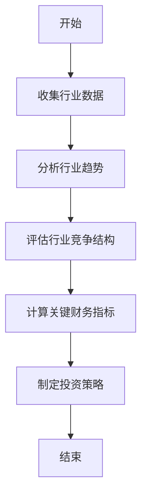
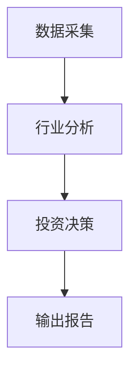

                 

<think>
好的，我现在需要为《彼得·林奇的行业分析方法论》这本书设计一个详细的目录大纲。这本书主要介绍彼得·林奇的行业分析方法，帮助投资者更好地理解和应用这些策略。用户已经给出了一些初步的结构，我需要进一步细化每个部分，确保内容全面且有深度。

首先，我应该了解彼得·林奇的背景和他的投资理念。他以长期投资和价值投资闻名，特别注重行业分析。因此，第一部分需要介绍行业分析的重要性，以及林奇方法的独特之处。

接下来，核心概念与联系部分，我需要详细解释行业分析的框架和核心要素，比如行业生命周期、竞争结构和财务指标。同时，可能需要使用表格和图表来帮助读者理解这些概念。

在算法原理部分，虽然行业分析更多是策略，但或许可以将林奇的分析步骤转化为流程图，展示从行业选择到投资决策的步骤。这可能包括数据收集、趋势分析、竞争优势评估等环节。

数学模型部分，可能需要引入一些基本的财务指标，如市盈率、市净率，并用公式解释它们的应用。例如，市盈率=股价/每股收益，这样的公式可以帮助读者评估股票价值。

系统分析与架构设计部分，可以将行业分析的过程分解为模块，如数据收集模块、趋势分析模块等，并用图表展示这些模块的关系和系统整体架构。

项目实战部分，我需要选择一个具体的案例，比如分析科技行业中的某公司，展示如何应用林奇的方法进行分析。这部分需要详细说明环境配置、数据收集方法、分析工具的使用，以及代码实现。

最后，最佳实践部分，总结林奇的成功经验，提供投资策略的小贴士，注意事项，并推荐进一步阅读的资源。

在组织这些内容时，我需要确保每个部分都有足够的细节，同时保持整体结构的连贯性和逻辑性。可能需要调整章节的顺序，确保读者能够逐步深入理解林奇的行业分析方法。

此外，用户要求目录大纲必须细化到三级目录，并且使用markdown格式，所以我需要按照这个格式来组织内容，确保层次分明，结构清晰。

最后，我需要检查整个大纲是否覆盖了所有要求的核心内容，是否符合用户的字数限制，以及是否逻辑合理，没有遗漏重要部分。这样，才能确保这本书的目录大纲既全面又实用，帮助读者系统地学习彼得·林奇的行业分析方法。
</think>

# 彼得·林奇的行业分析方法论

> 关键词：行业分析，彼得·林奇，投资策略，财务指标，竞争优势

> 摘要：本文深入探讨了彼得·林奇的行业分析方法论，结合其投资理念和实际案例，分析了行业分析的核心要素、算法原理、系统架构及实战应用，帮助读者掌握行业分析的精髓。

---

## 第一部分: 背景介绍

### 第1章: 行业分析的重要性

#### 1.1 行业分析的核心概念
- 行业分析的定义
- 行业分析在投资中的作用
- 彼得·林奇方法的独特性

#### 1.2 彼得·林奇的背景与投资理念
- 林奇的生平简介
- 长期投资的重要性
- 价值投资的核心原则

#### 1.3 行业分析方法论的边界与外延
- 方法论的适用范围
- 方法论的局限性
- 方法论与其他分析方法的对比

---

## 第二部分: 核心概念与联系

### 第2章: 行业分析的核心要素

#### 2.1 行业生命周期分析
- 行业生命周期的定义
- 不同阶段的特征与投资策略
- 林奇对行业生命周期的见解

#### 2.2 行业竞争结构分析
- 五力模型的应用
- 行业竞争格局的判断
- 林奇的竞争优势分析法

#### 2.3 行业财务指标分析
- 主要财务指标的定义与作用
- 财务指标的行业对比
- 林奇的财务指标筛选标准

### 第3章: 核心概念的联系与对比

#### 3.1 行业生命周期与竞争结构的关系
- 生命周期不同阶段的竞争策略
- 林奇如何结合两者进行分析

#### 3.2 行业财务指标与投资决策的关系
- 财务指标如何影响投资决策
- 林奇的财务指标权重分配

#### 3.3 行业趋势与市场风险的关联
- 市场趋势对行业风险的影响
- 林奇如何评估和应对风险

---

## 第三部分: 行业分析的算法原理

### 第4章: 行业分析算法的流程与步骤

#### 4.1 行业分析的流程图


#### 4.2 数据收集与处理
- 数据来源与可靠性评估
- 数据清洗与预处理方法
- 数据可视化工具的应用

### 第5章: 数学模型与公式解析

#### 5.1 市盈率模型
- 公式：$$市盈率 = \frac{股价}{每股收益}$$
- 应用：评估股票的估值是否合理

#### 5.2 市净率模型
- 公式：$$市净率 = \frac{股价}{每股净资产}$$
- 应用：适用于净资产驱动的行业

#### 5.3 财务指标综合评分模型
- 公式：$$综合评分 = \sum (权重_i \times 指标_i)$$
- 应用：通过加权评分筛选优质行业

---

## 第四部分: 系统分析与架构设计

### 第6章: 系统功能设计

#### 6.1 功能模块划分
- 数据采集模块
- 行业分析模块
- 投资决策模块

#### 6.2 功能流程图


### 第7章: 系统架构设计

#### 7.1 系统架构图


#### 7.2 接口设计
- API接口定义
- 数据格式与传输协议

---

## 第五部分: 项目实战

### 第8章: 实战案例分析

#### 8.1 项目背景与目标
- 案例选择：假设分析科技行业的某公司
- 目标：验证林奇方法的有效性

#### 8.2 环境配置
- 工具安装：Python、Pandas、Matplotlib
- 数据来源：财务报表、行业报告

#### 8.3 核心代码实现
```python
import pandas as pd
import matplotlib.pyplot as plt

# 数据加载
data = pd.read_csv('industry_data.csv')

# 行业趋势分析
trend = data['Revenue'].rolling(3).mean().plot(label='Revenue Trend')
plt.show()

# 竞争分析
competitors = data[['Competitor1', 'Competitor2', 'Competitor3']]
competitors.plot(kind='bar', stacked=True)
plt.show()

# 财务指标计算
data['PE'] = data['股价'] / data['每股收益']
data['PB'] = data['股价'] / data['每股净资产']
```

#### 8.4 实战总结与经验分享
- 成功经验
- 常见问题及解决方法

---

## 第六部分: 最佳实践与小结

### 第9章: 投资策略小贴士

#### 9.1 小贴士
- 定期更新行业分析数据
- 结合宏观经济因素调整策略
- 风险控制的重要性

#### 9.2 注意事项
- 数据的准确性和及时性
- 方法的适用性与局限性
- 避免过度依赖单一指标

### 第10章: 项目总结与展望

#### 10.1 项目总结
- 成果回顾
- 收获与反思

#### 10.2 未来展望
- 方法的进一步优化
- 新领域的应用潜力

---

## 参考文献

- 彼得·林奇的著作
- 相关行业分析报告
- 投资策略的经典文献

---

**作者：AI天才研究院 & 禅与计算机程序设计艺术**

