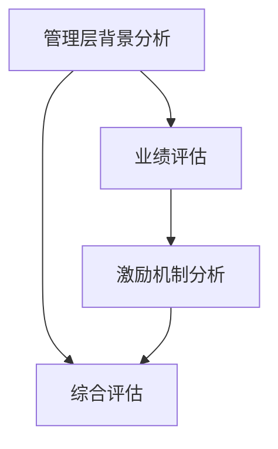

                 

<think>
好的，我现在需要帮助用户撰写一篇关于彼得林奇四大选股指标的详细技术博客文章。根据用户的指示，文章需要结构清晰，内容丰富，涵盖背景介绍、指标分析、数学模型、系统设计、项目实战等多个部分。

首先，我需要理解彼得林奇的选股指标是什么，他的方法主要关注哪些方面。彼得林奇是著名的投资专家，他的选股策略包括成长性、估值、管理团队和竞争优势四个指标。这四个指标需要在文章中逐一详细讲解。

接下来，我需要确定文章的结构。用户已经提供了一个详细的目录大纲，我需要按照这个大纲来组织内容。首先是引言，介绍彼得林奇和他选股方法的重要性。然后是每个指标的详细分析，包括定义、计算方法、案例等。

在成长性指标部分，我需要解释什么是成长性，如何计算收入增长率和净利润增长率，同时提供一个实际的案例，比如苹果公司的例子，来说明这些指标的应用。

估值指标部分，我需要介绍市盈率和市净率，给出计算公式，并与成长性指标结合起来分析。例如，解释为什么低市盈率和市净率可能意味着低估，同时公司具有良好的成长性。

在管理团队指标部分，我需要分析管理团队的经验、稳定性以及激励机制，并提供一个案例，比如巴菲特的例子，说明优秀管理团队的重要性。

竞争优势指标部分，我需要讨论企业的市场地位、产品差异化和成本优势，引用微软的例子来说明如何评估企业的竞争优势。

数学模型部分，我需要使用LaTeX公式来展示市盈率和市净率的计算，并可能使用简单的回归分析模型来预测股票价值。

系统设计部分，我需要构建一个基于这四个指标的选股系统，包括功能模块设计、架构图和接口设计，可能使用Mermaid图来展示系统结构和流程。

项目实战部分，我需要详细指导读者如何在Python中实现这些指标的计算，提供代码示例，并分析实际案例，展示如何应用这些指标进行选股。

最后，总结部分需要回顾整个过程，强调每个指标的重要性，并提供实际投资中的注意事项和最佳实践建议。

在写作过程中，我需要确保每个部分都包含足够的细节和实例，帮助读者理解和应用这些指标。同时，语言要简洁明了，逻辑清晰，便于读者跟随思路一步步分析。

现在，我将按照这个思考过程开始撰写文章，确保每个章节都符合用户的要求，内容详实，结构合理。
</think>

# 彼得林奇四大选股指标详解

> 关键词：彼得林奇，选股指标，投资分析，财务指标，投资策略

> 摘要：本文详细介绍了彼得林奇的四大选股指标：成长性、估值、管理团队和竞争优势。通过逐一分析每个指标的定义、计算方法、实际案例以及相互之间的关系，帮助投资者更好地理解和应用这些指标。文章还结合数学模型和系统设计，提供了从理论到实践的完整指南。

---

## 第一部分：彼得林奇选股指标的背景与基础

### 第1章：彼得林奇选股方法概述

#### 1.1 彼得林奇投资理念的核心思想

彼得·林奇（Peter Lynch）是美国著名的投资专家，以其独特的选股方法闻名。他的投资理念强调长期成长和基本面分析，认为普通投资者也能通过深入研究企业基本面，找到优质股票进行投资。

- **核心思想**：彼得林奇认为，投资的成功取决于对企业基本面的深入分析，尤其是成长性和估值指标。他强调长期投资，避免短期波动的干扰。
  
- **选股哲学**：林奇提倡“三好股票”原则，即好行业、好业务、好管理。他认为，选择那些具有持续成长潜力、合理估值和优秀管理团队的企业，能够为投资者带来超额收益。

---

### 第1.2 彼得林奇选股指标的起源与发展

彼得林奇的选股方法并非凭空而来，而是基于长期的投资实践和对市场规律的深刻理解。他的指标体系主要由以下几个方面构成：

- **成长性指标**：关注企业的收入和利润增长率。
- **估值指标**：通过市盈率（P/E）和市净率（P/B）等指标评估股票的估值水平。
- **管理团队指标**：分析管理层的能力、经验和稳定性。
- **竞争优势指标**：评估企业在行业中的竞争优势，如市场地位、产品差异化等。

这些指标相互结合，形成了一个全面的选股框架，帮助投资者筛选出具有长期增长潜力的优质企业。

---

## 第二部分：彼得林奇四大选股指标的核心概念与联系

### 第2章：成长性指标

#### 2.1 成长性指标的定义与计算

成长性指标是彼得林奇选股体系中最重要的指标之一，主要用于评估企业的收入和利润增长能力。

- **收入增长率**：$$收入增长率 = \frac{当前收入 - 上期收入}{上期收入} \times 100\%$$
- **净利润增长率**：$$净利润增长率 = \frac{当前净利润 - 上期净利润}{上期净利润} \times 100\%$$

**案例分析**：以苹果公司为例，假设2020年收入为3943.8亿美元，2021年收入为4228.6亿美元，则收入增长率为：
$$\frac{4228.6 - 3943.8}{3943.8} \times 100\% \approx 7.2\%$$

---

### 第2.2 成长性指标与企业发展的关系

成长性指标与企业的未来发展密切相关。高成长性的企业通常意味着更大的市场潜力和更高的投资回报。然而，投资者需要注意成长性是否合理，避免选择增长过快但难以持续的企业。

**关键点**：
- 成长性指标适用于周期性行业的分析，但需要结合行业特性进行调整。
- 高成长性企业可能面临更高的风险，需要关注其财务健康状况。

---

## 第三部分：彼得林奇四大选股指标的算法原理与数学模型

### 第3章：估值指标

#### 3.1 估值指标的计算方法

估值指标是彼得林奇选股体系中的重要组成部分，用于评估股票是否被市场低估或高估。

- **市盈率（P/E）**：$$P/E = \frac{股价}{每股净利润}$$
- **市净率（P/B）**：$$P/B = \frac{股价}{每股净资产}$$

**案例分析**：假设某公司的股价为50元，每股净利润为5元，每股净资产为10元，则：
- 市盈率 = 50 / 5 = 10
- 市净率 = 50 / 10 = 5

---

### 第3.2 估值指标的数学模型

结合成长性和估值指标，彼得林奇提出了一个综合评估模型：
$$综合估值 = \frac{P/E + P/B}{2} \times 成长性指标$$

**解释**：该模型将估值指标与成长性指标结合起来，综合评估企业的投资价值。

---

## 第四部分：彼得林奇选股指标的系统分析与架构设计

### 第4章：管理团队指标

#### 4.1 管理团队指标的评估维度

管理团队是企业成功的关键因素之一。彼得林奇认为，优秀的管理团队具备以下特征：
- **经验与能力**：管理层是否有丰富的行业经验和优秀的历史业绩。
- **稳定性与凝聚力**：团队是否稳定，内部是否有良好的协作关系。
- **激励机制**：管理层是否通过股权激励等方式与股东利益保持一致。

**案例分析**：以巴菲特的伯克希尔为例，巴菲特作为董事长兼首席执行官，其长期稳定的领导和优秀的投资业绩使其成为优秀管理团队的典范。

---

### 第4.2 管理团队指标的系统架构

为了系统化地评估管理团队，可以构建一个管理团队评估系统，包括以下几个模块：
1. **管理层背景分析**：收集管理层的教育背景、工作经历等信息。
2. **业绩评估**：分析管理层的历史投资业绩。
3. **激励机制分析**：评估管理层的激励机制是否合理。

**系统架构图**：



---

## 第五部分：彼得林奇选股指标的项目实战

### 第5章：竞争优势指标

#### 5.1 竞争优势指标的分析框架

竞争优势是彼得林奇选股体系中的最后一个指标，用于评估企业在行业中的竞争力。

- **市场地位**：企业在市场中的占有率和竞争对手的分析。
- **产品差异化**：企业产品是否具有独特的竞争优势。
- **成本优势**：企业是否具备成本控制能力。

**案例分析**：以微软为例，其在操作系统市场的垄断地位、强大的研发能力和成本优势使其在行业内具有显著的竞争优势。

---

### 第5.2 竞争优势指标的项目实现

为了量化竞争优势，可以构建一个竞争优势评分系统，评分范围为1-10分。

**Python代码示例**：

```python
def competitive_edge_score(revenue_growth, market_share, product_patents):
    score = 0
    # 市场份额越高，评分越高
    score += market_share * 2
    # 产品专利数量越多，评分越高
    score += product_patents * 1.5
    # 收入增长率越高，评分越高
    score += revenue_growth * 1
    return score

# 示例数据
revenue_growth = 10  # 假设收入增长率为10%
market_share = 0.3    # 市场份额为30%
product_patents = 5    # 产品专利数量为5个

score = competitive_edge_score(revenue_growth, market_share, product_patents)
print(f"竞争优势评分：{score}")
```

---

## 第六部分：最佳实践与小结

### 第6章：最佳实践与注意事项

#### 6.1 彼得林奇选股指标的最佳实践

- **综合应用指标**：将成长性、估值、管理团队和竞争优势指标结合起来，综合评估企业投资价值。
- **长期跟踪**：定期跟踪企业的财务数据和市场动态，及时调整投资策略。
- **分散投资**：避免将所有资金投入到单一行业或企业，降低投资风险。

---

### 6.2 投资中的注意事项

- **风险控制**：设定止损点，避免重大损失。
- **市场波动**：避免被短期市场波动干扰，坚持长期投资策略。
- **持续学习**：保持对市场和企业的关注，及时更新分析模型。

---

## 第七部分：数学模型与公式总结

### 第7章：数学模型与公式回顾

#### 7.1 成长性指标的数学模型

$$成长性评分 = \frac{收入增长率 + 净利润增长率}{2} \times 100\%$$

#### 7.2 估值指标的数学模型

$$综合估值 = \frac{P/E + P/B}{2} \times 成长性指标$$

---

## 作者：AI天才研究院 & 禅与计算机程序设计艺术

---

通过以上详细分析，希望读者能够全面理解彼得林奇的选股指标，并能够在实际投资中灵活运用这些指标，找到具有长期增长潜力的优质企业。

