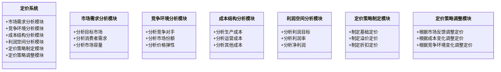
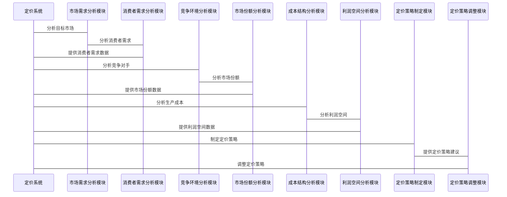

                 


# 彼得林奇如何分析公司的产品定价策略

> 关键词：产品定价策略，彼得林奇，定价模型，定价算法，系统架构，项目实战

> 摘要：本文将详细介绍彼得林奇如何分析公司的产品定价策略。通过背景介绍、核心概念、算法原理、系统架构、项目实战和最佳实践等六个部分，深入剖析定价策略的各个方面，帮助读者全面掌握定价策略的分析方法。

---

## 第一部分: 背景介绍与核心概念

### 第1章: 产品定价策略的背景与重要性

#### 1.1 产品定价策略的基本概念
##### 1.1.1 定价策略的定义与核心要素
定价策略是指企业在确定产品价格时所采取的策略和方法。其核心要素包括：
- **成本**：产品的生产成本和运营成本。
- **市场需求**：消费者对产品的需求程度。
- **竞争环境**：市场上竞争对手的定价策略。
- **品牌价值**：品牌在市场上的影响力。
- **利润目标**：企业希望通过定价实现的利润目标。

##### 1.1.2 定价策略在企业中的作用
定价策略是企业经营的核心环节之一，直接影响企业的利润、市场份额和品牌价值。合理的定价策略能够帮助企业实现以下目标：
1. **覆盖成本**：确保定价能够覆盖企业的生产和运营成本。
2. **获取利润**：通过合理定价实现盈利目标。
3. **扩大市场份额**：通过定价策略吸引更多的消费者。
4. **提升品牌价值**：通过优质定价策略增强品牌形象。

##### 1.1.3 彼得林奇对定价策略的重视
彼得·林奇是著名的投资专家，他在分析公司时非常重视定价策略。他认为，定价策略是企业竞争力的重要体现，能够反映出企业的市场定位和盈利能力。林奇通常会从以下几个方面分析定价策略：
- 企业的定价目标是什么？
- 定价策略是否与市场需求相匹配？
- 定价策略是否能够覆盖成本并实现利润目标？
- 定价策略是否具有竞争力？

#### 1.2 定价策略的演进与分类
##### 1.2.1 成本导向定价法
成本导向定价法是以产品的成本为基础来确定价格。常见的成本导向定价法包括：
1. **成本加成定价法**：在成本的基础上加上一定比例的利润。公式为：
   $$ 定价 = 成本 + 利润 $$
2. **目标利润定价法**：根据目标利润和预计销量来确定价格。公式为：
   $$ 定价 = (总成本 + 目标利润) / 销量 $$

##### 1.2.2 市场导向定价法
市场导向定价法是以市场需求为基础来确定价格。常见的市场导向定价法包括：
1. **价值定价法**：根据产品的实际价值和消费者愿意支付的价格来确定价格。
2. **需求弹性定价法**：根据市场需求弹性调整价格。需求弹性大的产品可以通过降价来增加销量，而需求弹性小的产品则可以通过提价来保持利润。

##### 1.2.3 竞争导向定价法
竞争导向定价法是以竞争对手的定价策略为基础来确定价格。常见的竞争导向定价法包括：
1. **跟随定价法**：根据竞争对手的定价策略来确定自己的价格。
2. **差异化定价法**：根据产品的差异化特征制定价格。

##### 1.2.4 差异化定价法
差异化定价法是根据产品的差异化特征制定不同的价格。例如，高端产品可以采用溢价定价策略，而低端产品则可以采用成本定价策略。

#### 1.3 定价策略与企业利润的关系
##### 1.3.1 定价对利润率的影响
定价策略直接影响企业的利润率。例如，如果企业能够通过合理定价覆盖成本并实现利润目标，利润率就会提高。

##### 1.3.2 定价对市场份额的影响
定价策略也影响企业的市场份额。例如，如果企业能够通过合理定价吸引更多的消费者，市场份额就会扩大。

##### 1.3.3 定价对品牌价值的影响
定价策略还影响企业的品牌价值。例如，高端产品的溢价定价策略可以提升品牌形象，而低端产品的成本定价策略则可能削弱品牌形象。

---

## 第二部分: 核心概念与原理

### 第2章: 彼得林奇的定价策略分析框架

#### 2.1 彼得林奇分析定价策略的核心思想
##### 2.1.1 从基本面分析出发
彼得林奇认为，定价策略的分析应该从企业的基本面分析出发。他通常会关注以下几个方面：
1. **企业的成本结构**：包括生产成本、运营成本等。
2. **市场需求**：包括目标市场的规模、消费者的需求特征等。
3. **竞争环境**：包括竞争对手的定价策略、市场份额等。
4. **企业的盈利能力**：包括利润率、ROE等。

##### 2.1.2 重点关注企业的定价能力
彼得林奇认为，定价策略的核心在于企业的定价能力。他通常会关注以下几个方面：
1. **企业的定价目标**：企业的定价目标是否合理？
2. **定价策略的灵活性**：企业的定价策略是否具有灵活性？
3. **定价策略的可持续性**：定价策略是否能够长期维持？

##### 2.1.3 定价策略与企业竞争力的关系
彼得林奇认为，定价策略是企业竞争力的重要体现。他通常会关注以下几个方面：
1. **定价策略是否能够覆盖成本**：定价是否能够覆盖企业的生产成本和运营成本？
2. **定价策略是否能够实现利润目标**：定价是否能够实现企业的利润目标？
3. **定价策略是否具有竞争力**：定价是否能够在市场上具有竞争力？

#### 2.2 彼得林奇定价策略分析的步骤
##### 2.2.1 确定企业的定价目标
彼得林奇认为，定价策略的第一步是确定企业的定价目标。他通常会关注以下几个方面：
1. **利润目标**：企业希望通过定价实现的利润目标。
2. **市场份额目标**：企业希望通过定价实现的市场份额目标。
3. **品牌目标**：企业希望通过定价实现的品牌目标。

##### 2.2.2 分析市场需求与竞争环境
彼得林奇认为，定价策略的第二步是分析市场需求与竞争环境。他通常会关注以下几个方面：
1. **市场需求**：目标市场的规模、消费者的需求特征等。
2. **竞争环境**：竞争对手的定价策略、市场份额等。

##### 2.2.3 评估成本结构与利润空间
彼得林奇认为，定价策略的第三步是评估成本结构与利润空间。他通常会关注以下几个方面：
1. **成本结构**：企业的生产成本、运营成本等。
2. **利润空间**：定价是否能够覆盖成本并实现利润目标。

##### 2.2.4 制定与调整定价策略
彼得林奇认为，定价策略的最后一步是制定与调整定价策略。他通常会关注以下几个方面：
1. **制定定价策略**：根据分析结果制定合理的定价策略。
2. **调整定价策略**：根据市场变化和企业目标的调整，及时调整定价策略。

#### 2.3 彼得林奇定价策略分析的工具与方法
##### 2.3.1 SWOT分析法
SWOT分析法是一种常用的定价策略分析工具，可以帮助企业分析定价策略的优缺点。SWOT分析法包括以下几个方面：
1. **优势**：定价策略的优势。
2. **劣势**：定价策略的劣势。
3. **机会**：定价策略的机会。
4. **威胁**：定价策略的威胁。

##### 2.3.2 价值链分析法
价值链分析法是一种常用的定价策略分析工具，可以帮助企业分析定价策略对价值链的影响。价值链分析法包括以下几个方面：
1. **上游供应商**：供应商的成本和供应稳定性。
2. **生产过程**：生产成本和效率。
3. **下游客户**：客户的需求和支付能力。

##### 2.3.3 战略定位法
战略定位法是一种常用的定价策略分析工具，可以帮助企业确定在市场中的定位。战略定位法包括以下几个方面：
1. **目标市场**：企业的目标市场是什么？
2. **竞争对手**：竞争对手的定价策略是什么？
3. **品牌定位**：企业的品牌定位是什么？

---

## 第三部分: 算法原理与数学模型

### 第3章: 定价模型的原理与数学公式

#### 3.1 成本加成定价模型
##### 3.1.1 成本加成定价法的定义
成本加成定价法是一种常见的定价策略，其核心思想是在成本的基础上加上一定比例的利润。

##### 3.1.2 成本加成定价法的公式
$$ 定价 = 成本 + (成本 \times 利润率) $$

##### 3.1.3 成本加成定价法的优缺点
- **优点**：简单易懂，能够确保定价覆盖成本。
- **缺点**：忽视市场需求和竞争环境，可能导致定价过高或过低。

#### 3.2 价值定价模型
##### 3.2.1 价值定价法的定义
价值定价法是一种以产品价值为基础的定价策略，其核心思想是根据产品的实际价值和消费者愿意支付的价格来确定价格。

##### 3.2.2 价值定价法的公式
$$ 定价 = 产品价值 + 品牌价值 + 服务价值 $$

##### 3.2.3 价值定价法的优缺点
- **优点**：能够反映产品的实际价值，提高客户满意度。
- **缺点**：需要准确评估产品的价值，实施难度较大。

#### 3.3 需求弹性定价模型
##### 3.3.1 需求弹性定价法的定义
需求弹性定价法是一种以市场需求弹性为基础的定价策略，其核心思想是根据市场需求弹性调整价格。

##### 3.3.2 需求弹性定价法的公式
$$ 需求弹性 = \frac{需求量的变化率}{价格的变化率} $$

##### 3.3.3 需求弹性定价法的优缺点
- **优点**：能够根据市场需求弹性调整价格，提高销量和利润。
- **缺点**：需要准确预测市场需求弹性，实施难度较大。

---

## 第四部分: 系统分析与架构设计

### 第4章: 系统分析与架构设计方案

#### 4.1 问题场景介绍
定价系统需要能够帮助企业实现定价策略的分析与优化。主要问题包括：
1. **如何分析市场需求与竞争环境**？
2. **如何评估成本结构与利润空间**？
3. **如何制定与调整定价策略**？

#### 4.2 项目介绍
本项目旨在构建一个基于彼得林奇定价策略分析框架的定价系统，帮助企业在复杂的市场环境中制定合理的定价策略。

#### 4.3 系统功能设计
##### 4.3.1 领域模型（Mermaid 类图）


##### 4.3.2 系统架构设计（Mermaid 架构图）


##### 4.3.3 系统接口设计
- **输入接口**：市场需求数据、竞争环境数据、成本数据。
- **输出接口**：定价策略建议、定价策略调整建议。

##### 4.3.4 系统交互（Mermaid 序列图）


---

## 第五部分: 项目实战

### 第5章: 项目实战与案例分析

#### 5.1 环境配置
- **操作系统**：Windows 10 或更高版本。
- **开发工具**：Python 3.9 或更高版本，Jupyter Notebook。
- **依赖库**：pandas、numpy、scipy。

#### 5.2 核心代码实现
##### 5.2.1 市场需求分析模块
```python
import pandas as pd
import numpy as np

def analyze_market_demand(data):
    # 数据预处理
    df = pd.DataFrame(data)
    df['需求量'] = df['需求量'].astype(int)
    df['价格'] = df['价格'].astype(int)
    
    # 需求弹性分析
    demand_elasticity = np.abs((df['需求量'].diff() / df['价格'].diff()).mean())
    return demand_elasticity

# 示例数据
market_data = {
    '产品': ['A', 'B', 'C'],
    '需求量': [100, 200, 150],
    '价格': [50, 60, 55]
}

print(analyze_market_demand(market_data))
```

##### 5.2.2 竞争环境分析模块
```python
import pandas as pd
import numpy as np

def analyze_competition(data):
    df = pd.DataFrame(data)
    df['价格'] = df['价格'].astype(int)
    df['市场份额'] = df['市场份额'].astype(float)
    
    # 竞争分析
    competition_index = df['价格'].rank() + df['市场份额'].rank()
    return competition_index

competition_data = {
    '产品': ['A', 'B', 'C'],
    '价格': [50, 60, 55],
    '市场份额': [0.3, 0.5, 0.2]
}

print(analyze_competition(competition_data))
```

##### 5.2.3 成本结构分析模块
```python
import pandas as pd
import numpy as np

def analyze_cost(data):
    df = pd.DataFrame(data)
    df['成本'] = df['成本'].astype(int)
    df['利润'] = df['利润'].astype(int)
    
    # 成本分析
    cost_ratio = df['成本'] / df['利润']
    return cost_ratio

cost_data = {
    '产品': ['A', 'B', 'C'],
    '成本': [20, 30, 25],
    '利润': [10, 15, 12]
}

print(analyze_cost(cost_data))
```

#### 5.3 项目小结
通过以上代码实现，我们可以看到定价系统的核心模块已经基本完成。市场需求分析模块可以帮助企业分析目标市场的需求弹性，竞争环境分析模块可以帮助企业分析竞争对手的定价策略，成本结构分析模块可以帮助企业分析成本结构与利润空间。接下来，我们需要将这些模块集成起来，完成定价策略的制定与调整。

---

## 第六部分: 最佳实践

### 第6章: 最佳实践与小结

#### 6.1 小结
通过本文的分析，我们可以看到，彼得林奇的定价策略分析框架是一种非常有效的定价策略分析方法。它可以帮助企业在复杂的市场环境中制定合理的定价策略，实现利润目标和品牌目标。

#### 6.2 注意事项
1. **数据的准确性**：定价策略的分析需要准确的数据支持，数据的准确性直接影响分析结果。
2. **模型的适用性**：不同的定价模型适用于不同的市场环境和企业需求，选择合适的模型非常重要。
3. **动态调整**：市场环境和企业目标可能会发生变化，定价策略需要根据实际情况进行动态调整。

#### 6.3 拓展阅读
1. 《彼得·林奇的选股法则》
2. 《定价的艺术》
3. 《竞争战略》

---

## 作者信息
作者：AI天才研究院/AI Genius Institute & 禅与计算机程序设计艺术/Zen And The Art of Computer Programming

