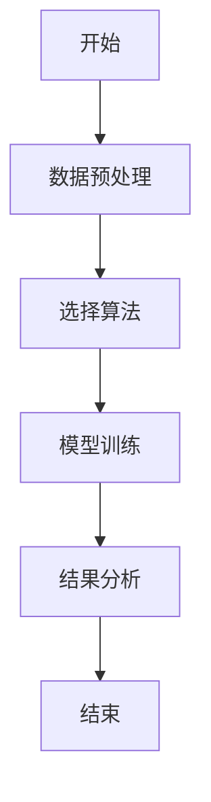
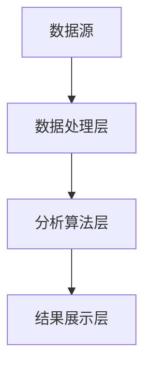

                 


# 彼得林奇如何分析公司的客户分层策略

> 关键词：客户分层，彼得·林奇，客户价值，市场细分，数据分析

> 摘要：本文详细探讨了彼得·林奇如何通过客户分层策略分析企业价值，分析了客户分层的核心概念、算法原理、系统架构以及实战应用，帮助读者掌握这一方法。

---

## 第一部分: 客户分层策略的背景与重要性

### 第1章: 客户分层策略的定义与意义

#### 1.1 客户分层策略的定义
- **客户分层**：将客户按属性分成不同层次的过程，识别高价值客户，优化资源配置。
- **客户分层的重要性**：精准营销，提升客户满意度和忠诚度，提高企业收益。
- **应用范围**：适用于多个行业，如零售、金融、电商等。

#### 1.2 彼得·林奇的分析方法
- **彼得·林奇的投资者背景**：以价值投资闻名，关注企业基本面和管理层。
- **分析方法**：通过客户分层识别高潜力企业，评估客户价值。
- **现代适用性**：适用于数据驱动的分析，帮助识别优质客户。

#### 1.3 本章小结
客户分层是企业优化资源配置的重要工具，彼得·林奇的方法为企业分析提供了新视角。

---

## 第二部分: 客户分层的核心概念与联系

### 第2章: 客户分层的核心概念

#### 2.1 客户分层的原理
- **基本原理**：基于客户属性（如收入、行为）进行分类。
- **模型与方法**：聚类分析、决策树等。

#### 2.2 客户分层与企业价值的关系
- **客户价值定义**：客户为企业带来的收入和利润。
- **影响分析**：高价值客户贡献更多利润，企业应优先服务。
- **贡献分析**：通过数据分析确定客户分层的经济效益。

#### 2.3 客户分层的属性特征对比
- **对比表格**：展示不同客户层次的特征。
- **ER实体关系图**：展示客户分层的数据结构。

---

## 第三部分: 客户分层的算法原理与数学模型

### 第3章: 客户分层的算法原理

#### 3.1 常用算法
- **聚类分析**：K-means、层次聚类。
- **决策树**：CART、ID3。

#### 3.2 算法流程图


#### 3.3 Python代码示例
```python
from sklearn.cluster import KMeans
import pandas as pd

# 示例数据
data = pd.DataFrame({
    '收入': [10, 20, 30, 40, 50],
    '支出': [5, 15, 25, 35, 45]
})

# 模型训练
kmeans = KMeans(n_clusters=2)
kmeans.fit(data)

# 获取聚类结果
labels = kmeans.labels_
print(labels)
```

#### 3.4 数学模型
- **公式**：$$ 聚类中心计算公式 $$
- **解释**：通过距离度量确定样本的聚类中心。

---

## 第四部分: 客户分层的系统分析与架构设计

### 第4章: 系统分析与架构设计

#### 4.1 系统功能设计
- **功能模块**：数据收集、分析、策略执行。
- **类图设计**：展示系统各模块之间的关系。

#### 4.2 系统架构图


---

## 第五部分: 项目实战

### 第5章: 项目实战

#### 5.1 环境安装
- **Python**：安装Anaconda。
- **库安装**：使用pip安装scikit-learn、pandas。

#### 5.2 核心代码实现
```python
from sklearn.cluster import KMeans
import pandas as pd

data = pd.DataFrame({
    '收入': [10, 20, 30, 40, 50],
    '支出': [5, 15, 25, 35, 45]
})

kmeans = KMeans(n_clusters=2)
kmeans.fit(data)

labels = kmeans.labels_
print("聚类结果：", labels)
```

#### 5.3 实际案例分析
- **案例背景**：某零售企业客户数据。
- **分析步骤**：数据预处理、模型训练、结果解读。

---

## 第六部分: 最佳实践与总结

### 第6章: 最佳实践

#### 6.1 小结
- 客户分层是企业优化资源配置的关键工具。
- 彼得·林奇的方法结合了数据驱动和价值投资。

#### 6.2 注意事项
- 数据质量影响结果准确性。
- 模型选择需根据具体情况调整。

#### 6.3 拓展阅读
- 推荐书籍：《彼得·林奇的成功投资》。

---

**作者：AI天才研究院/AI Genius Institute & 禅与计算机程序设计艺术 /Zen And The Art of Computer Programming**

