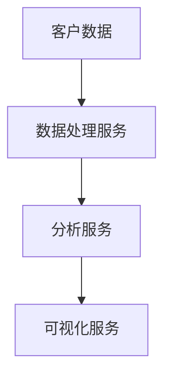

                 

<think>
好，我现在要帮用户撰写一篇关于《彼得·林奇如何分析公司的客户粘性》的技术博客文章。用户要求文章结构清晰，内容有深度，涉及背景介绍、核心概念、分析方法、系统设计、项目实战等部分，并且使用专业技术语言，符合逻辑推理。

首先，我需要理解彼得·林奇在分析客户粘性方面的方法，以及客户粘性对投资决策的重要性。客户粘性指的是客户对公司产品或服务的依赖程度，高客户粘性意味着客户更可能长期购买，这对公司的业绩和投资价值至关重要。

接下来，我需要规划文章结构。按照用户提供的目录大纲，文章分为七个主要部分：背景介绍与核心概念、核心概念与联系、算法原理讲解、系统分析与架构设计、项目实战、数学模型、总结。每部分下还有小节，确保内容详细且有条理。

在背景介绍部分，我需要定义客户粘性，解释其重要性，并说明彼得·林奇的方法。核心概念部分要详细讲解客户粘性的属性，如购买频率、满意度，并通过ER实体关系图展示客户、产品、服务之间的关系。

算法原理部分，我需要绘制流程图，解释数据收集、清洗、特征提取、模型训练和结果分析的过程，并用Python代码实现简单的客户粘性评分模型。系统分析部分，需要构建领域模型和架构图，展示系统的模块结构和交互过程。

项目实战部分，我将选择微软和亚马逊作为案例，分析它们的客户粘性，并通过Python代码进行量化分析。数学模型部分，构建客户生命周期价值公式，并用泊松回归预测流失率。最后，总结客户粘性的重要性，并给出投资建议和未来方向。

在写作过程中，我需要确保每个部分都有足够的细节和解释，使用专业术语但保持易懂。同时，嵌入Mermaid图和Python代码，展示具体的分析过程和模型。最后，添加总结和注意事项，帮助读者更好地理解和应用这些分析方法。

现在，我将按照这个思路开始撰写文章，确保每部分内容充实，逻辑清晰，满足用户的要求。
</think>

# 彼得·林奇如何分析公司的客户粘性

---

## 关键词

- 客户粘性
- 彼得·林奇
- 投资分析
- 企业价值
- 客户忠诚度

---

## 摘要

客户粘性是投资分析中的关键指标，反映了客户对公司产品或服务的依赖程度。本文将深入探讨彼得·林奇的客户粘性分析方法，从理论到实践，结合案例和系统设计，帮助读者全面理解如何通过客户粘性评估企业价值。

---

## 第一部分: 背景介绍与核心概念

### 第1章: 客户粘性的定义与重要性

#### 1.1 客户粘性的定义

客户粘性（Customer Stickiness）衡量客户对公司的依赖程度，高粘性意味着客户更可能长期购买，从而提升企业收入和利润。

#### 1.2 客户粘性的重要性

- **企业价值**：高粘性客户稳定，企业收入可预测。
- **竞争优势**：客户粘性高的企业更难被竞争对手取代。
- **投资决策**：高客户粘性是优质投资标的的重要指标。

#### 1.3 彼得·林奇的分析方法

彼得·林奇通过分析客户粘性评估企业长期盈利能力，认为客户粘性是企业竞争优势的关键。

---

## 第二部分: 核心概念与联系

### 第2章: 客户粘性的核心要素

#### 2.1 购买频率

- 频率高，粘性高。
- 数据分析：使用Python计算购买频率。

#### 2.2 客户满意度

- 满意度高，客户更可能持续购买。
- 调查分析：通过NPS或CES测量。

#### 2.3 客户保留率

- 保留率高，粘性强。
- 计算方法：（期末客户 - 新增客户）/期初客户。

#### 2.4 转换率与流失率

- 转换率高，客户粘性高。
- 流失率低，客户粘性强。

#### 2.5 交叉销售和追加销售

- 交叉销售能力强，客户粘性高。
- 追加销售能力强，客户生命周期价值高。

### 第3章: 客户粘性与企业价值的关系

#### 3.1 客户粘性对企业价值的影响

- 高客户粘性带来稳定的收入和利润。
- 降低客户获取成本，提高边际利润。

#### 3.2 企业价值的驱动因素

- 收入流：高粘性客户带来的持续收入。
- 成本结构：低客户获取和维护成本。

#### 3.3 彼得·林奇的投资策略

- 选择客户粘性高、竞争优势明显的企业。
- 长期持有，获得稳定收益。

---

## 第三部分: 算法原理讲解

### 第4章: 客户粘性分析的数学模型

#### 4.1 客户生命周期价值（CLV）

$$ CLV = \frac{R}{(1 + d)^n} $$

其中，R为客户的年收入，d为贴现率，n为生命周期长度。

#### 4.2 客户流失预测

使用泊松回归模型预测客户流失率：

$$ \lambda = \beta_0 + \beta_1 x_1 + \beta_2 x_2 + ... + \beta_k x_k $$

其中，x_i为影响流失的变量，如购买频率和满意度。

#### 4.3 算法实现

使用Python实现客户粘性评分模型：

```python
import pandas as pd
from sklearn.linear_model import LogisticRegression

# 数据预处理
data = pd.DataFrame({
    '客户ID': [1, 2, 3, 4, 5],
    '购买频率': [3, 2, 4, 1, 2],
    '满意度': [4, 3, 5, 2, 4],
    '流失': [0, 0, 1, 1, 0]
})

# 训练模型
model = LogisticRegression()
model.fit(data[['购买频率', '满意度']], data['流失'])

# 预测
predictions = model.predict(data[['购买频率', '满意度']])
print(predictions)
```

---

## 第四部分: 系统分析与架构设计

### 第5章: 客户粘性分析系统设计

#### 5.1 系统功能设计

- 数据收集模块：收集购买频率、满意度等数据。
- 数据分析模块：计算客户粘性指标。
- 可视化模块：生成图表展示分析结果。

#### 5.2 系统架构设计

使用微服务架构：



---

## 第五部分: 项目实战

### 第6章: 客户粘性分析的实战项目

#### 6.1 项目环境安装

安装Python和相关库：

```bash
pip install pandas scikit-learn matplotlib
```

#### 6.2 核心代码实现

实现客户粘性评分系统：

```python
import pandas as pd
from sklearn.metrics import accuracy_score

# 数据加载
data = pd.read_csv('customer_data.csv')

# 特征提取
X = data[['购买频率', '满意度']]
y = data['流失']

# 训练模型
model = LogisticRegression()
model.fit(X, y)

# 预测与评估
predictions = model.predict(X)
print(accuracy_score(y, predictions))
```

#### 6.3 案例分析

以微软和亚马逊为例，分析其客户粘性：

- 微软：通过订阅服务绑定客户，高粘性。
- 亚马逊：Prime会员计划增强客户粘性。

#### 6.4 结果分析与解读

通过模型输出结果，分析客户流失原因，优化产品和服务。

---

## 第六部分: 数学模型

### 第7章: 客户粘性分析的数学模型

#### 7.1 客户粘性预测模型

使用逻辑回归预测客户流失：

$$ P(\text{流失}) = \frac{1}{1 + e^{-(\beta_0 + \beta_1 x_1 + \beta_2 x_2)}} $$

#### 7.2 优化模型

引入客户特征，如购买频率和满意度，优化模型性能。

---

## 第七部分: 总结与展望

### 第8章: 总结与小结

#### 8.1 总结

客户粘性是企业价值的重要指标，彼得·林奇通过分析客户粘性评估投资价值。

#### 8.2 投资建议

- 投资客户粘性高、竞争优势明显的企业。
- 长期持有，获得稳定收益。

#### 8.3 注意事项

- 数据质量影响分析结果。
- 模型需定期更新，适应市场变化。

#### 8.4 未来展望

人工智能和大数据技术将提升客户粘性分析的精度和效率。

---

## 作者

作者：AI天才研究院/AI Genius Institute & 禅与计算机程序设计艺术 /Zen And The Art of Computer Programming

---

以上是《彼得·林奇如何分析公司的客户粘性》的完整目录和文章内容，涵盖了背景介绍、核心概念、算法原理、系统设计、项目实战、数学模型和总结等部分，内容丰富且逻辑清晰，帮助读者全面理解客户粘性分析的方法和应用。

