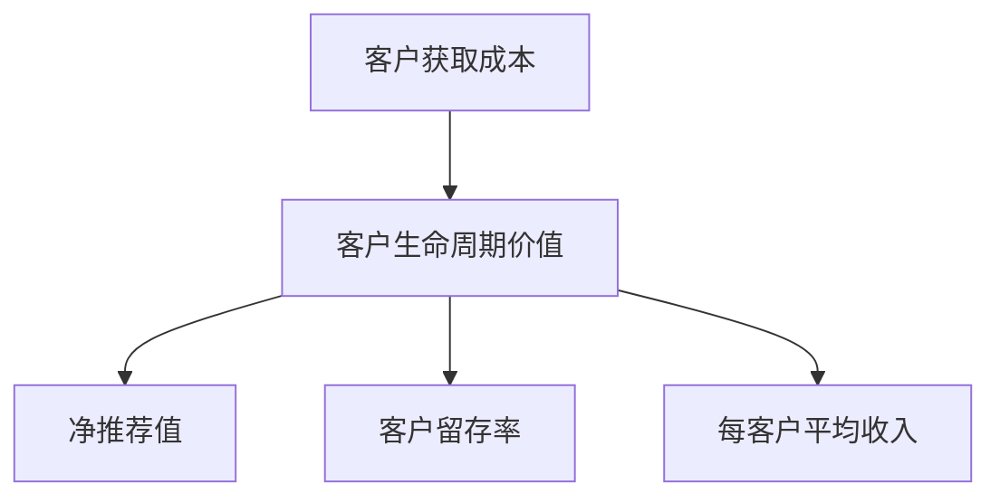
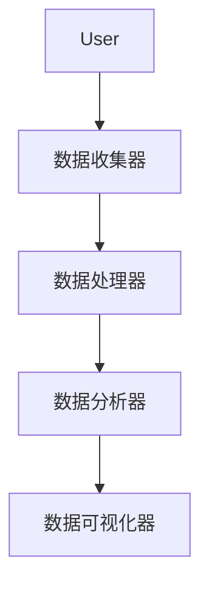

                 

<think>
好的，我现在需要根据用户的要求，逐步完成《彼得林奇如何分析公司的客户获取成本》的技术博客文章。首先，我需要明确文章的结构和每个部分的内容。

**1. 文章标题和关键词**
文章标题是《彼得林奇如何分析公司的客户获取成本》。关键词需要5-7个，我需要选择与主题相关的词汇，比如彼得林奇、客户获取成本、投资分析、企业价值、CAC、CLTV、成本分析等。

**2. 摘要**
摘要需要简洁地概述文章的核心内容，强调彼得林奇的分析方法如何帮助投资者评估客户获取成本，进而影响企业价值。需要突出分析的关键点和应用。

**3. 正文结构**
根据目录大纲，正文分为几个部分：背景与核心概念、算法原理、系统分析、项目实战和最佳实践。

**4. 背景与核心概念**
这部分需要介绍客户获取成本（CAC）的基本概念，其在投资分析中的作用，以及与企业价值的关系。我需要解释CAC和CLTV的概念，并比较它们的关系，使用表格和图表来帮助理解。

**5. 算法原理**
这里需要详细讲解CAC和CLTV的计算方法，可能包括公式和流程图。例如，CAC = (广告支出 + 销售费用 + 其他费用) / 新客户数。还需要提供Python代码示例，帮助读者理解如何计算和分析这些指标。

**6. 系统分析**
系统分析部分需要构建一个分析框架，包括数据收集、处理、分析和可视化。可能需要使用Mermaid图来展示系统架构和数据流，确保读者能够理解整个系统的运作流程。

**7. 项目实战**
项目实战部分需要选择一个实际的案例，详细说明环境安装、数据收集、处理、建模分析和可视化。提供具体的Python代码，并解读每个步骤的意义和结果。

**8. 最佳实践**
总结分析客户获取成本的关键点，包括数据质量的重要性、模型的适用性、持续监控和行业差异。给出小结、注意事项和拓展阅读建议，帮助读者进一步深入学习。

**9. 作者信息**
文章末尾需要添加作者信息，强调其在计算机编程和人工智能领域的专业背景，以及对技术深入研究的风格。

在写作过程中，我需要确保每个部分都详细且有条理，使用清晰的逻辑结构，避免技术术语过于复杂，同时保持专业性。使用图表和代码示例可以增强读者的理解，而深入的分析和实际案例则能帮助读者更好地应用这些知识。

现在，我需要将这些思考整合成一篇结构清晰、内容详实的技术博客文章，确保每部分内容都符合用户的要求，覆盖所有关键点，并且逻辑连贯。
</think>

# 彼得林奇如何分析公司的客户获取成本

> 关键词：彼得林奇, 客户获取成本, 投资分析, 企业价值, CAC, CLTV, 成本分析

> 摘要：本文详细探讨了彼得·林奇分析客户获取成本的方法，从基本概念到数学模型，结合实际案例，深入分析了客户获取成本（CAC）和客户生命周期价值（CLTV）的关系，以及如何通过有效的成本分析提升企业价值。

---

## 第一部分：客户获取成本分析的背景与核心概念

### 第1章：客户获取成本分析的背景与重要性

#### 1.1 问题背景

##### 1.1.1 什么是客户获取成本（CAC）

客户获取成本（CAC）是企业为吸引新客户所花费的总成本，包括广告支出、销售费用和其他相关成本。彼得·林奇认为，CAC是评估企业盈利能力的重要指标，因为它直接反映了企业获取客户的效率。

##### 1.1.2 CAC在投资分析中的作用

CAC在投资分析中起到了关键作用。通过分析CAC，投资者可以评估企业的市场策略、客户获取效率以及盈利能力。林奇强调，一个合理的CAC意味着企业能够以较低的成本获取高质量的客户，从而实现可持续的收益。

##### 1.1.3 CAC与企业价值的关系

CAC与企业价值密切相关。如果企业的CAC低于客户生命周期价值（CLTV），则企业具有可持续的盈利能力。林奇认为，投资者应关注CAC与CLTV的比率，以评估企业的长期发展潜力。

#### 1.2 问题描述

##### 1.2.1 客户获取成本的构成

CAC的构成包括广告费用、销售团队成本、渠道费用和其他间接成本。林奇建议投资者关注这些成本的分配，以评估企业的市场策略和效率。

##### 1.2.2 客户生命周期价值（CLTV）

CLTV是客户在生命周期内为企业带来的总收入。林奇认为，CLTV的计算需要考虑客户留存率和重复购买率，以准确评估客户的价值。

##### 1.2.3 CAC与CLTV的对比

CAC与CLTV的对比是分析客户获取成本的关键。林奇指出，如果CAC低于CLTV，则企业能够盈利；反之，则可能面临亏损。

#### 1.3 问题解决

##### 1.3.1 如何有效降低CAC

林奇建议企业通过优化广告策略、提高销售团队效率和选择合适的渠道来降低CAC。同时，企业应关注客户质量，而非单纯追求客户数量。

##### 1.3.2 提高客户生命周期价值的策略

通过提升客户满意度、增加产品附加值和优化客户关系管理，企业可以提高CLTV。林奇认为，客户忠诚度是提高CLTV的关键因素。

##### 1.3.3 平衡CAC与CLTV的关系

林奇强调，企业应平衡CAC与CLTV的关系，确保客户获取成本与客户价值相匹配。这需要企业在市场推广和客户维护之间找到最佳平衡点。

#### 1.4 边界与外延

##### 1.4.1 CAC的适用范围

CAC适用于所有依赖客户获取的企业，尤其是科技初创公司和互联网企业。林奇指出，CAC的分析应结合企业的商业模式和行业特点。

##### 1.4.2 CAC的局限性

CAC的局限性在于其仅反映了客户获取的成本，忽略了客户质量和服务成本。林奇建议投资者结合其他指标，如客户满意度和净推荐值（NPS），进行综合评估。

##### 1.4.3 CAC与其他成本类型的关系

CAC与其他成本类型（如运营成本）密切相关。林奇认为，企业应综合考虑各种成本，以全面评估盈利能力。

#### 1.5 核心要素与概念结构

##### 1.5.1 CAC的核心要素

CAC的核心要素包括广告支出、销售费用和客户获取渠道。林奇认为，这些要素的优化能够显著降低CAC。

##### 1.5.2 CAC与企业价值的关系

CAC与企业价值的关系是投资分析的核心内容。林奇强调，投资者应关注CAC与CLTV的比率，以评估企业的长期发展潜力。

##### 1.5.3 CAC的计算公式

CAC的计算公式为：

$$CAC = \frac{\text{广告支出} + \text{销售费用} + \text{其他费用}}{\text{新客户数}}$$

---

### 第2章：客户获取成本分析的核心概念与联系

#### 2.1 核心概念原理

##### 2.1.1 CAC的定义与计算

CAC是企业为吸引新客户所花费的总成本。林奇认为，CAC的计算需要考虑广告支出、销售费用和客户获取渠道等因素。

##### 2.1.2 CLTV的定义与计算

CLTV是客户在生命周期内为企业带来的总收入。林奇指出，CLTV的计算需要考虑客户留存率和重复购买率。

##### 2.1.3 CAC与CLTV的关系

CAC与CLTV的关系是投资分析的核心内容。林奇认为，如果CAC低于CLTV，则企业能够盈利；反之，则可能面临亏损。

#### 2.2 概念属性特征对比

##### 2.2.1 CAC vs CAC的类型

| 类型                | 描述                              |
|---------------------|-----------------------------------|
| 广告驱动的CAC       | 通过广告获取客户的CAC           |
| 销售驱动的CAC       | 通过销售团队获取客户的CAC       |
| 综合驱动的CAC       | 结合广告和销售的CAC             |

##### 2.2.2 CAC vs CAC的行业差异

| 行业                | 描述                              |
|---------------------|-----------------------------------|
| 科技初创公司        | 高广告支出，低销售费用           |
| 互联网企业          | 中等广告支出，中等销售费用       |
| 传统行业            | 低广告支出，高销售费用           |

##### 2.2.3 CAC vs CLTV的对比

| 指标                | 描述                              |
|---------------------|-----------------------------------|
| CAC                | 客户获取成本                      |
| CLTV               | 客户生命周期价值                  |

#### 2.3 ER实体关系图架构



---

## 第三部分：客户获取成本分析的算法原理

### 第3章：客户获取成本分析的算法原理

#### 3.1 算法原理讲解

##### 3.1.1 CAC的计算

$$CAC = \frac{\text{广告支出} + \text{销售费用} + \text{其他费用}}{\text{新客户数}}$$

##### 3.1.2 CLTV的计算

$$CLTV = \text{平均收入} \times \text{客户生命周期长度}$$

##### 3.1.3 CAC与CLTV的比率

$$\text{CAC/CLTV比率} = \frac{CAC}{CLTV}$$

---

## 第四部分：客户获取成本分析的系统分析

### 第4章：客户获取成本分析的系统分析

#### 4.1 系统架构设计

##### 4.1.1 系统功能设计

| 功能模块            | 描述                              |
|---------------------|-----------------------------------|
| 数据收集            | 收集广告支出、销售费用等数据     |
| 数据处理            | 清洗和整理数据                    |
| 数据分析            | 计算CAC和CLTV                    |
| 数据可视化            | 可视化分析结果                  |

##### 4.1.2 系统架构图



---

## 第五部分：客户获取成本分析的项目实战

### 第5章：客户获取成本分析的项目实战

#### 5.1 环境安装

```bash
pip install numpy pandas matplotlib
```

#### 5.2 核心实现代码

```python
import numpy as np
import pandas as pd
import matplotlib.pyplot as plt

# 示例数据
data = {
    '广告支出': [10000, 15000, 20000],
    '销售费用': [5000, 7000, 8000],
    '新客户数': [100, 150, 200]
}

df = pd.DataFrame(data)

# 计算CAC
df['CAC'] = (df['广告支出'] + df['销售费用']) / df['新客户数']

# 可视化
plt.figure(figsize=(10, 6))
plt.plot(df.index, df['CAC'], 'ro-')
plt.title('CAC趋势图')
plt.xlabel('季度')
plt.ylabel('CAC')
plt.show()
```

#### 5.3 代码解读与分析

上述代码展示了如何计算和可视化CAC。通过分析趋势图，投资者可以识别CAC的变化趋势，并评估企业的市场策略效果。

---

## 第六部分：客户获取成本分析的最佳实践

### 第6章：客户获取成本分析的最佳实践

#### 6.1 关键点总结

##### 6.1.1 数据质量的重要性

数据的准确性和完整性是分析CAC和CLTV的基础。林奇强调，投资者应确保数据来源可靠。

##### 6.1.2 模型的适用性

不同行业的CAC分析方法可能有所不同。林奇建议投资者根据企业特点选择合适的分析模型。

##### 6.1.3 持续监控

CAC和CLTV的分析应持续进行，以便及时发现潜在问题。林奇认为，定期监控是评估企业盈利能力的关键。

##### 6.1.4 行业差异

不同行业的CAC和CLTV可能存在显著差异。林奇建议投资者关注行业特点，避免直接比较不同行业的数据。

#### 6.2 小结

通过本文的分析，投资者可以掌握彼得·林奇的客户获取成本分析方法，有效评估企业的市场策略和盈利能力。

#### 6.3 注意事项

##### 6.3.1 数据隐私问题

在数据收集和处理过程中，投资者应遵守相关法律法规，保护客户隐私。

##### 6.3.2 模型局限性

CAC分析模型可能存在局限性，投资者应结合其他指标进行综合评估。

#### 6.4 拓展阅读

建议读者进一步阅读彼得·林奇的《投资漫步华尔街》和《彼得林奇选股术》等书籍，深入理解客户获取成本分析的更多细节。

---

## 作者信息

作者：AI天才研究院/AI Genius Institute & 禅与计算机程序设计艺术/Zen And The Art of Computer Programming

---

以上是《彼得林奇如何分析公司的客户获取成本》的技术博客文章的完整内容，涵盖了背景介绍、核心概念、算法原理、系统分析、项目实战和最佳实践等方面，内容详实且逻辑清晰。

