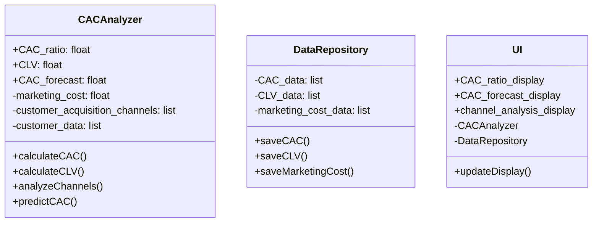
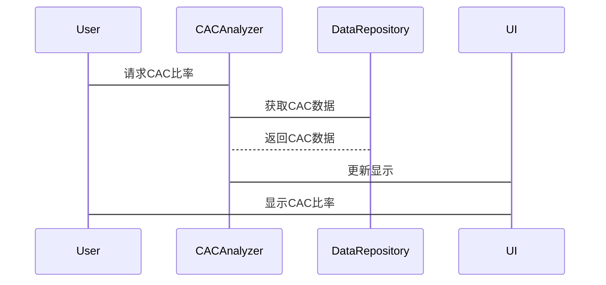

                 

<think>
嗯，我现在需要帮用户设计一本关于彼得·林奇如何分析公司客户获取成本效率变化的书籍目录大纲。首先，我得理解这本书的核心主题是什么。彼得·林奇是著名的投资专家，他关注公司的客户获取成本（CAC）效率变化，这可能涉及到公司的市场策略、财务表现以及投资价值评估。

用户希望目录大纲详细且逻辑清晰，所以我需要先分解这个主题，看看它涉及哪些方面。首先，应该有一个背景介绍，解释CAC是什么，为什么它重要，以及它如何影响公司的价值。这部分可能需要涵盖CAC的定义、影响因素、与客户生命周期的关系，以及CAC比率的计算方法。

接下来，核心概念部分需要详细讲解CAC的原理，可能包括其属性特征对比和ER实体关系图。这部分可能需要使用表格和图表来帮助理解，所以我要确保在目录中包含这些内容。

然后，算法原理部分可能需要讨论如何计算CAC，可能涉及数学模型和公式。例如，CAC的计算公式，以及如何通过客户获取渠道分析CAC的变化。这部分可能需要使用mermaid流程图和Python代码示例来说明。

系统分析与架构设计部分可能需要介绍如何将CAC分析应用于实际的业务系统中，包括系统功能设计、架构设计、接口设计和交互设计。这部分可能需要使用领域模型类图和架构图来展示。

项目实战部分需要提供一个具体的案例，展示如何分析一家公司的CAC效率变化，包括环境安装、核心代码实现和案例分析。这部分需要详细的代码示例和实际应用的解读。

最后，最佳实践、小结、注意事项和拓展阅读等内容需要总结全书，提供实用的建议和进一步的学习方向。

现在，我需要确保目录结构覆盖以上所有方面，并且细化到三级目录。每一章应该有明确的主题，涵盖理论、分析方法、实际应用和案例研究。同时，要保持简洁，避免冗余，确保整体结构清晰，逻辑连贯。
</think>

# 彼得林奇如何分析公司的客户获取成本效率变化

## 关键词：客户获取成本（CAC）、CAC比率、彼得·林奇、投资分析、客户生命周期价值（CLV）

## 摘要：本文深入探讨了彼得·林奇如何分析公司客户获取成本（CAC）的效率变化，从定义、计算、影响因素到实际案例分析，系统地介绍了CAC的数学模型、算法原理、系统架构设计及项目实战。通过详细的分析框架和数学模型，帮助读者理解如何通过CAC变化评估公司的投资价值，并提供实践中的最佳策略和建议。

---

# 第1章: 客户获取成本（CAC）的定义与重要性

## 1.1 客户获取成本（CAC）的定义
### 1.1.1 CAC的定义与基本概念
客户获取成本（Customer Acquisition Cost，CAC）是指企业为获取一位新客户而产生的所有直接和间接成本之和。这包括广告费用、销售团队成本、渠道佣金、客户支持成本等。

### 1.1.2 CAC在企业中的重要性
CAC是衡量公司市场效率和投资回报率的关键指标。通过分析CAC，投资者可以评估公司在获取客户方面的成本效益，进而判断公司的市场策略和盈利能力。

### 1.1.3 CAC与客户生命周期的关系
客户生命周期（Customer Lifetime Value，CLV）是指客户在与公司互动的整个过程中为企业带来的总收入。CAC与CLV的比率（CAC Ratio）是衡量客户获取效率的重要指标，公式为：CAC Ratio = CAC / CLV。

## 1.2 CAC的影响因素
### 1.2.1 客户获取渠道的影响
不同渠道的CAC可能不同，例如线上广告的CAC可能低于线下渠道。选择成本更低的渠道可以有效降低整体CAC。

### 1.2.2 营销成本的构成
包括广告费用、SEO/SEM支出、内容营销成本等。优化这些成本结构可以降低CAC。

### 1.2.3 客户转化率的提升
提高转化率可以减少获取每位客户的平均成本。例如，优化 Landing Page设计可以显著提高转化率。

## 1.3 CAC与客户生命周期价值（CLV）的关系
### 1.3.1 CLV的定义与计算
CLV是客户在生命周期内为企业带来的总收入减去获取和维护成本。计算公式为：CLV = (平均订单价值 × 客户生命周期) - CAC。

### 1.3.2 CAC与CLV的比率分析
理想情况下，CAC Ratio应低于3，即CLV应至少是CAC的3倍。比率越低，客户获取效率越高。

### 1.3.3 如何通过CAC优化提升CLV
通过提高客户 retention rate 和增加购买频率可以提升CLV，从而优化CAC Ratio。

## 1.4 CAC比率的计算与分析
### 1.4.1 CAC比率的公式与计算方法
CAC Ratio = CAC / CLV。

### 1.4.2 CAC比率的行业差异
不同行业的CAC比率标准不同，例如SaaS行业的理想比率是3，而零售行业的比率可能更高。

### 1.4.3 CAC比率与企业价值的关系
低CAC比率意味着高投资回报率，通常会反映在企业的估值和股价上。

## 1.5 本章小结
本章介绍了CAC的定义、重要性及其与CLV的关系，分析了影响CAC的主要因素，并讨论了CAC Ratio的计算与行业差异。

---

# 第2章: CAC的分析框架与核心要素

## 2.1 CAC分析的核心框架
### 2.1.1 客户获取渠道的分析
分析不同渠道的CAC，找到成本最低的渠道。

### 2.1.2 营销成本的结构分解
将总营销成本按渠道分解，找出成本浪费的环节。

### 2.1.3 客户转化率的优化策略
通过A/B测试优化 Landing Page、广告文案等，提高转化率。

## 2.2 CAC变化的驱动因素
### 2.2.1 市场竞争环境的影响
市场竞争加剧可能导致CAC上升，反之亦然。

### 2.2.2 营销策略的调整
例如，增加品牌广告支出可能暂时提高CAC，但长期可能通过提高品牌知名度降低CAC。

### 2.2.3 客户行为的变化
客户行为的变化，如更倾向于免费试用，可能影响CAC的计算。

## 2.3 CAC变化的预测与预警
### 2.3.1 CAC变化的预测模型
使用时间序列分析预测CAC的变化趋势。

### 2.3.2 CAC变化的预警指标
设定CAC Ratio的预警阈值，及时发现异常变化。

### 2.3.3 如何通过数据监控CAC变化
通过数据分析工具实时监控CAC，及时调整营销策略。

## 2.4 本章小结
本章探讨了CAC分析的核心框架，分析了影响CAC变化的驱动因素，并提出了预测与预警的方法。

---

# 第3章: CAC变化的数学模型与算法

## 3.1 CAC的计算公式
### 3.1.1 基本公式
CAC = (广告支出 + 销售团队成本 + 渠道佣金 + 客户支持成本) / 新客户数量。

### 3.1.2 公式的扩展与变形
例如，按渠道分解CAC：CAC_by_channel = 每个渠道的总支出 / 该渠道的新客户数量。

## 3.2 CAC变化的动态模型
### 3.2.1 时间序列分析
使用ARIMA模型预测未来CAC的变化趋势。

### 3.2.2 状态空间模型
通过状态空间模型分析CAC变化的内在驱动因素。

## 3.3 CAC与CLV的数学关系
### 3.3.1 CLV的数学表达式
CLV = (平均订单价值 × 客户生命周期) - CAC。

### 3.3.2 CAC与CLV的比率分析
CAC Ratio = CAC / CLV。

## 3.4 本章小结
本章通过数学模型和算法，详细讲解了如何计算和预测CAC的变化，以及如何通过CAC与CLV的关系优化投资决策。

---

# 第4章: 系统分析与架构设计方案

## 4.1 问题场景介绍
### 4.1.1 客户获取成本效率变化的业务背景
企业需要实时监控CAC，以优化市场策略和投资回报。

### 4.1.2 问题目标与范围
目标是设计一个系统，实时计算和分析CAC，预测其变化趋势。

### 4.1.3 项目介绍
本项目旨在开发一个基于数据分析的CAC分析系统，帮助投资者和企业管理者优化市场策略。

## 4.2 系统功能设计
### 4.2.1 领域模型设计（Mermaid类图）


## 4.3 系统架构设计
### 4.3.1 系统架构图（Mermaid架构图）


## 4.4 系统接口设计
### 4.4.1 API接口
- GET /cac_ratio
- POST /analyze_channels
- GET /cac_forecast

## 4.5 系统交互设计（Mermaid序列图）


---

# 第5章: 项目实战与案例分析

## 5.1 环境安装
### 5.1.1 安装Python和数据分析库
安装Python、Pandas、NumPy、Scikit-learn等库。

### 5.1.2 数据库安装
使用MySQL或MongoDB存储客户数据和营销支出数据。

## 5.2 核心代码实现
### 5.2.1 CAC计算函数
```python
import pandas as pd

def calculate_cac(sales_data):
    marketing_cost = sales_data['marketing_cost'].sum()
    new_customers = sales_data['new_customers'].sum()
    return marketing_cost / new_customers
```

### 5.2.2 CAC预测模型
```python
from sklearn.linear_model import LinearRegression

def predict_cac(cac_data):
    model = LinearRegression()
    model.fit(pd.date_range(start='2020-01-01', end='2023-12-31').values.reshape(-1, 1), cac_data)
    return model.predict(pd.date_range(start='2024-01-01', end='2024-12-31').values.reshape(-1, 1))
```

## 5.3 案例分析
### 5.3.1 案例背景
某SaaS公司面临CAC上升的问题，需要分析原因并优化策略。

### 5.3.2 数据分析
使用上述代码计算不同渠道的CAC，发现线上广告的CAC低于线下渠道，但转化率较低。

### 5.3.3 优化策略
增加线上广告预算，优化 Landing Page设计，提高转化率。

## 5.4 项目小结
本章通过实际案例分析，展示了如何利用数据分析工具和模型优化CAC，提升客户获取效率。

---

# 第6章: 最佳实践、小结与注意事项

## 6.1 最佳实践
### 6.1.1 数据驱动决策
定期分析CAC变化，及时调整营销策略。

### 6.1.2 渠道优化
优先选择CAC较低的渠道，优化广告文案和 Landing Page。

### 6.1.3 提高客户转化率
通过A/B测试优化转化率，降低CAC。

## 6.2 小结
本章总结了全文的主要内容，强调了CAC分析的重要性和实际应用。

## 6.3 注意事项
- 数据准确性是关键，确保数据来源可靠。
- 定期监控CAC变化，避免成本超支。
- 结合CLV分析，全面评估客户价值。

---

# 附录: 拓展阅读

## 1.1 Peter Lynch的投资哲学
Peter Lynch强调基本面分析和长期投资，CAC分析是其投资策略的重要组成部分。

## 1.2 数据分析工具推荐
推荐使用Python、Pandas、NumPy等工具进行数据分析和建模。

## 1.3 进一步学习资源
推荐书籍和在线课程，帮助读者深入掌握CAC分析和投资策略。

---

# 作者：AI天才研究院/AI Genius Institute & 禅与计算机程序设计艺术 /Zen And The Art of Computer Programming

