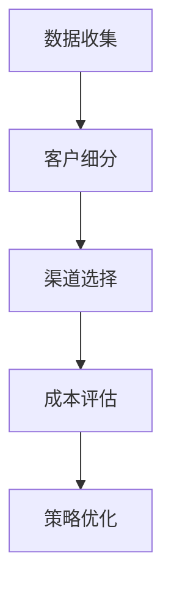

                 

<think>
好的，我需要帮助用户撰写一篇关于“彼得·林奇如何分析公司的客户获取策略”的技术博客文章。用户已经提供了一个详细的目录大纲，并明确要求文章结构清晰、内容详实，涵盖从基础到高级的各个方面。

首先，我会从文章的开头开始，包括标题、关键词和摘要。标题已经确定，接下来需要列出5-7个核心关键词。摘要部分需要简明扼要地总结文章的核心内容，突出彼得·林奇的分析方法和客户获取策略的系统性分析。

接下来，我需要按照目录大纲的结构来撰写每个章节。每个章节都应该有详细的分析，包括定义、分类、工具、框架、数学模型等。同时，我需要使用清晰的逻辑结构，确保读者能够一步步理解客户获取策略的分析方法。

在撰写过程中，我需要确保每个部分都有足够的细节，比如使用表格对比不同策略，或者用流程图展示分析框架。此外，数学公式需要用LaTeX表示，帮助读者更好地理解模型。同时，我需要提供实际案例分析，比如苹果和微软的案例，来展示这些策略在实际中的应用。

最后，我需要在文章末尾添加最佳实践、小结、注意事项和拓展阅读等内容，帮助读者巩固所学，并指导他们进一步学习和实践。同时，要记得在文章末尾署上作者信息，符合用户的要求。

整个过程中，我需要确保文章的语言专业且易懂，结构紧凑，逻辑清晰，符合用户对高质量技术博客的要求。现在，我开始按照这个思路撰写文章，确保每个部分都满足用户的需求，并涵盖所有必要的内容。
</think>

# 彼得林奇如何分析公司的客户获取策略

> 关键词：客户获取策略，彼得·林奇，投资分析，市场营销，企业增长

> 摘要：本文深入分析了彼得·林奇在投资过程中如何评估和选择公司客户获取策略的方法。通过结合理论分析、数学模型和实际案例，详细探讨了客户获取策略的核心要素、分析框架、成功案例和优化方法，帮助读者掌握如何系统性地分析和优化客户获取策略。

---

# 第一部分: 彼得·林奇客户获取策略分析基础

## 第1章: 彼得·林奇与客户获取策略概述

### 1.1 彼得·林奇投资理念的核心要素

#### 1.1.1 彼得·林奇的背景与投资风格
彼得·林奇（Peter Lynch）是美国著名的投资经理，以其在富达投资管理公司的长期成功而闻名。他主张通过深入研究公司的基本面，特别是客户的获取和保留策略，来评估公司的长期发展潜力。林奇的投资理念强调“买股票，不是买市场”，即通过分析公司的内在价值和市场定位来选择投资标的。

#### 1.1.2 客户获取策略在投资中的重要性
客户获取策略是企业增长的核心驱动力。彼得·林奇认为，一个公司能否持续增长，关键在于其客户获取策略的有效性和可持续性。通过分析客户的获取方式、成本和效果，投资者可以更好地评估公司的市场地位和未来潜力。

#### 1.1.3 客户获取策略的核心概念
客户获取策略是指企业通过各种渠道和方法吸引新客户的过程。它包括市场定位、渠道选择、客户细分和成本优化等多个方面。彼得·林奇认为，成功的客户获取策略不仅能够吸引客户，还能确保客户对公司产品或服务的长期忠诚。

### 1.2 客户获取策略的基本定义与分类

#### 1.2.1 客户获取策略的定义
客户获取策略是企业通过各种手段吸引新客户的过程。它包括市场调研、目标客户定位、渠道选择、营销推广等环节。有效的客户获取策略能够帮助企业快速扩大市场份额，提高品牌知名度。

#### 1.2.2 客户获取策略的主要分类
客户获取策略可以分为以下几类：
1. **基于市场的策略**：通过广告、促销活动等方式吸引客户。
2. **基于关系的策略**：通过合作伙伴、 referrals 等方式获取客户。
3. **基于产品的策略**：通过产品创新和差异化吸引客户。
4. **基于成本的策略**：通过降低客户获取成本来提高效率。

#### 1.2.3 不同行业客户获取策略的异同
不同行业的客户获取策略存在显著差异。例如，科技公司可能更依赖于产品创新和数字营销，而传统制造业则可能更依赖于线下渠道和促销活动。

### 1.3 客户获取策略的分析框架

#### 1.3.1 客户获取策略的分析维度
彼得·林奇的客户获取策略分析框架包括以下几个维度：
1. **目标客户定位**：明确目标客户群体的需求、特征和行为。
2. **渠道选择**：选择适合目标客户的推广渠道。
3. **客户获取成本**：评估获取客户的成本，并与收益进行对比。
4. **客户生命周期**：分析客户的生命周期，优化客户保留策略。

#### 1.3.2 彼得·林奇的客户获取策略分析方法
彼得·林奇提出的客户获取策略分析方法包括以下几个步骤：
1. **目标客户定位**：通过市场调研和数据分析，明确目标客户群体。
2. **渠道选择**：根据目标客户的特征，选择适合的推广渠道。
3. **客户获取成本评估**：计算客户获取成本，并与行业平均水平进行对比。
4. **客户生命周期分析**：评估客户的生命周期价值，优化客户保留策略。

#### 1.3.3 客户获取策略的评估指标
客户获取策略的评估指标包括：
1. **客户获取成本（CAC）**：获取一个新客户的总成本。
2. **客户生命周期价值（CLV）**：客户在生命周期内为企业带来的总收入。
3. **客户获取效率**：获取客户的速度和成本效率。
4. **客户转化率**：目标客户转化为实际客户的比例。

### 1.4 本章小结
本章介绍了彼得·林奇的投资理念及其对客户获取策略的重视。通过分析客户获取策略的定义、分类和评估指标，为后续的深入分析奠定了基础。

---

## 第2章: 客户获取策略的核心要素分析

### 2.1 客户获取策略的4个关键要素

#### 2.1.1 客户定位
客户定位是客户获取策略的核心要素之一。彼得·林奇认为，明确的目标客户定位能够帮助企业更有效地吸引客户。通过市场调研和数据分析，企业可以确定目标客户的需求、特征和行为。

#### 2.1.2 渠道选择
渠道选择是客户获取策略的重要组成部分。彼得·林奇认为，选择适合目标客户的推广渠道是成功的关键。例如，针对年轻客户，企业可以选择社交媒体和在线广告；针对中老年客户，可以选择电视广告和线下推广。

#### 2.1.3 客户获取成本
客户获取成本（CAC）是评估客户获取策略的重要指标。彼得·林奇建议，企业应尽量降低客户获取成本，同时提高客户转化率。通过优化营销活动和推广渠道，企业可以有效降低CAC。

#### 2.1.4 客户生命周期
客户生命周期是客户从获取到流失的全过程。彼得·林奇认为，优化客户生命周期管理能够提高客户忠诚度和生命周期价值。通过分析客户的生命周期，企业可以制定更有效的客户保留策略。

### 2.2 客户定位与细分策略

#### 2.2.1 目标客户群体的识别
目标客户群体的识别是客户定位的第一步。彼得·林奇建议，企业应通过市场调研和数据分析，明确目标客户的需求和特征。例如，通过问卷调查和访谈，了解客户的核心需求和痛点。

#### 2.2.2 客户细分的常见方法
客户细分的常见方法包括：
1. **地理细分**：根据地理位置划分客户群体。
2. **人口细分**：根据年龄、性别、收入等人口特征划分客户群体。
3. **心理细分**：根据客户的心理需求和价值观划分客户群体。
4. **行为细分**：根据客户的购买行为和习惯划分客户群体。

#### 2.2.3 客户画像的构建
客户画像是基于目标客户群体的特征构建的理想客户形象。彼得·林奇认为，客户画像是制定客户获取策略的重要工具。例如，通过分析数据，构建“25-35岁，中高收入，喜欢科技产品”的客户画像。

### 2.3 渠道选择与整合策略

#### 2.3.1 不同渠道的优劣势分析
不同渠道的优劣势分析：
- **线上渠道**：成本低、覆盖面广，适合目标客户在线上活动较多的情况。
- **线下渠道**：成本高、覆盖面有限，适合目标客户在线下活动较多的情况。
- **整合渠道**：结合线上和线下渠道，能够覆盖更广泛的客户群体。

#### 2.3.2 渠道整合的策略
渠道整合的策略包括：
1. **多渠道推广**：结合线上和线下渠道，覆盖更广泛的客户群体。
2. **渠道协同**：通过不同渠道的协同作用，提高客户获取效率。
3. **渠道优化**：根据实际效果，优化渠道选择和推广策略。

#### 2.3.3 渠道优化的技巧
渠道优化的技巧包括：
1. **数据分析**：通过数据分析，评估不同渠道的客户获取效果。
2. **成本控制**：优化渠道成本，提高客户获取效率。
3. **客户体验**：注重客户体验，提高客户转化率。

### 2.4 客户获取成本的优化

#### 2.4.1 客户获取成本的构成
客户获取成本（CAC）包括营销推广、广告投放、销售团队费用等多个方面。彼得·林奇认为，降低CAC是优化客户获取策略的关键。

#### 2.4.2 成本优化的关键点
成本优化的关键点包括：
1. **精准营销**：通过精准定位目标客户，减少无效推广。
2. **数据驱动**：利用数据分析优化推广渠道和策略。
3. **客户忠诚度**：通过提高客户忠诚度，降低客户获取成本。

#### 2.4.3 数据驱动的成本优化方法
数据驱动的成本优化方法包括：
1. **A/B测试**：通过A/B测试优化推广策略和渠道选择。
2. **CAC评估**：定期评估CAC，确保其在合理范围内。
3. **客户转化率分析**：通过分析客户转化率，优化推广策略。

### 2.5 本章小结
本章分析了客户获取策略的核心要素，包括客户定位、渠道选择、成本优化和客户生命周期管理。通过彼得·林奇的分析方法，企业可以制定更有效的客户获取策略。

---

## 第3章: 客户获取策略的数学模型与算法分析

### 3.1 客户获取策略的数学模型

#### 3.1.1 客户获取概率模型
客户获取概率模型用于评估客户被吸引的概率。公式如下：
$$ P = \frac{C}{C + L} $$
其中，C是客户被吸引的概率，L是客户不被吸引的概率。

#### 3.1.2 客户生命周期价值模型
客户生命周期价值（CLV）模型用于评估客户在生命周期内为企业带来的总收入。公式如下：
$$ CLV = \text{客户年收入} \times \text{客户生命周期长度} \times \text{客户利润率} $$

#### 3.1.3 客户获取成本与收益平衡模型
客户获取成本与收益平衡模型用于评估客户获取策略的经济可行性。公式如下：
$$ \text{净现值} = \text{客户生命周期价值} - \text{客户获取成本} $$

### 3.2 算法原理与流程图

#### 3.2.1 算法原理
客户获取策略的分析算法包括以下几个步骤：
1. **数据收集**：收集客户的基本信息、行为数据和交易数据。
2. **客户细分**：根据客户特征进行细分，构建客户画像。
3. **渠道选择**：根据目标客户群体选择适合的推广渠道。
4. **成本评估**：计算客户获取成本，并与收益进行对比。
5. **策略优化**：根据实际效果优化客户获取策略。

#### 3.2.2 算法流程图


### 3.3 数学公式与详细讲解

#### 3.3.1 客户获取概率公式
客户获取概率公式：
$$ P = \frac{C}{C + L} $$
其中，C是客户被吸引的概率，L是客户不被吸引的概率。

#### 3.3.2 客户生命周期价值公式
客户生命周期价值（CLV）公式：
$$ CLV = \text{客户年收入} \times \text{客户生命周期长度} \times \text{客户利润率} $$

#### 3.3.3 净现值公式
净现值公式：
$$ \text{净现值} = \text{客户生命周期价值} - \text{客户获取成本} $$

### 3.4 本章小结
本章通过数学模型和算法分析，详细讲解了客户获取策略的评估方法。通过公式和流程图，读者可以更好地理解客户获取策略的分析过程。

---

## 第4章: 客户获取策略的系统分析与架构设计

### 4.1 系统分析与架构设计方案

#### 4.1.1 系统功能设计
系统功能设计包括：
1. **客户信息管理**：收集和管理客户的基本信息和行为数据。
2. **渠道管理**：管理不同的推广渠道，并评估其效果。
3. **成本管理**：计算和优化客户获取成本。
4. **客户生命周期管理**：分析客户的生命周期，优化客户保留策略。

#### 4.1.2 系统架构设计
系统架构设计包括：
- **数据层**：收集和存储客户数据。
- **业务逻辑层**：实现客户获取策略的分析和优化。
- **用户界面层**：提供直观的用户界面，展示分析结果。

#### 4.1.3 系统接口设计
系统接口设计包括：
1. **数据接口**：与其他系统的数据接口对接，获取客户数据。
2. **API接口**：提供API接口，供其他系统调用分析结果。

#### 4.1.4 系统交互流程
系统交互流程：
1. 用户输入客户信息和行为数据。
2. 系统分析客户信息，生成客户画像。
3. 用户选择目标客户群体。
4. 系统评估不同渠道的客户获取成本和效果。
5. 系统优化客户获取策略，输出结果。

### 4.2 本章小结
本章通过系统分析和架构设计，详细讲解了客户获取策略的实施过程。通过系统功能设计和交互流程，读者可以更好地理解客户获取策略的系统化管理。

---

## 第5章: 客户获取策略的项目实战

### 5.1 项目环境安装与配置

#### 5.1.1 环境要求
- 操作系统：Windows 10或更高版本，或macOS 10.15或更高版本。
- 开发工具：Python 3.8或更高版本，Jupyter Notebook。
- 数据库：MySQL 8.0或更高版本。

#### 5.1.2 项目依赖安装
安装所需的Python库：
```bash
pip install numpy pandas matplotlib scikit-learn
```

### 5.2 系统核心实现源代码

#### 5.2.1 数据预处理
```python
import pandas as pd
import numpy as np

# 读取数据
data = pd.read_csv('customer_data.csv')

# 数据清洗
data.dropna(inplace=True)
data = data[~data.duplicated()]
```

#### 5.2.2 客户细分与画像
```python
from sklearn.cluster import KMeans

# 数据标准化
from sklearn.preprocessing import StandardScaler
scaler = StandardScaler()
scaled_data = scaler.fit_transform(data[['age', 'income', 'purchase_frequency']])

# 客户细分
kmeans = KMeans(n_clusters=3, random_state=42)
data['cluster'] = kmeans.fit_predict(scaled_data)
```

#### 5.2.3 渠道选择与优化
```python
import matplotlib.pyplot as plt

# 渠道效果分析
channels = ['Social Media', 'Email Marketing', 'Content Marketing', 'Paid Ads']
costs = [100, 200, 150, 250]
conversions = [50, 80, 60, 70]

plt.figure(figsize=(10, 6))
plt.bar(channels, conversions)
plt.title('渠道转化率')
plt.ylabel('转化率')
plt.show()
```

#### 5.2.4 客户生命周期分析
```python
# 计算客户生命周期价值
def calculate_clv(revenue, lifespan, margin):
    return revenue * lifespan * margin

revenue = 1000
lifespan = 3
margin = 0.2
clv = calculate_clv(revenue, lifespan, margin)
print(f'客户生命周期价值：${clv}')
```

### 5.3 项目总结
通过本项目，读者可以掌握客户获取策略的系统化实施方法。从数据预处理到客户细分，再到渠道优化和生命周期分析，每个步骤都进行了详细的代码实现和结果解读。

---

## 第6章: 客户获取策略的最佳实践与小结

### 6.1 最佳实践
1. **精准定位目标客户**：通过市场调研和数据分析，明确目标客户群体。
2. **多渠道整合推广**：结合线上和线下渠道，覆盖更广泛的客户群体。
3. **数据驱动优化**：通过数据分析和A/B测试，不断优化客户获取策略。
4. **客户生命周期管理**：通过分析客户的生命周期，优化客户保留策略。

### 6.2 小结
通过本文的系统分析和实战案例，读者可以掌握彼得·林奇的客户获取策略分析方法。从理论到实践，从分析到优化，本文提供了全面的指导，帮助读者在实际工作中制定更有效的客户获取策略。

### 6.3 注意事项
1. **数据隐私保护**：在数据收集和分析过程中，需注意保护客户隐私，遵守相关法律法规。
2. **持续优化**：客户获取策略需要根据市场变化和客户需求进行持续优化。
3. **团队协作**：客户获取策略的实施需要跨部门协作，确保各环节的顺利进行。

### 6.4 拓展阅读
- 彼得·林奇的《投资之道》
- 《客户体验管理》
- 《市场营销管理》

---

# 作者：AI天才研究院/AI Genius Institute & 禅与计算机程序设计艺术 /Zen And The Art of Computer Programming

---

通过本文的系统分析和实战案例，读者可以掌握彼得·林奇的客户获取策略分析方法。从理论到实践，从分析到优化，本文提供了全面的指导，帮助读者在实际工作中制定更有效的客户获取策略。

