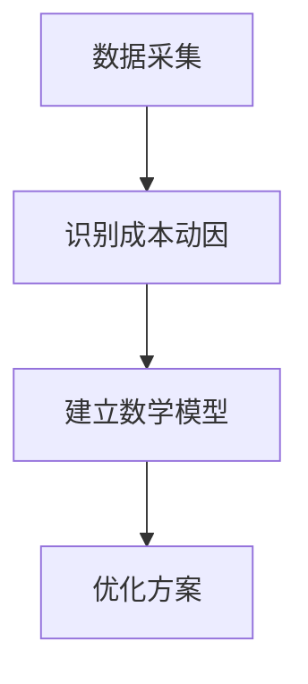
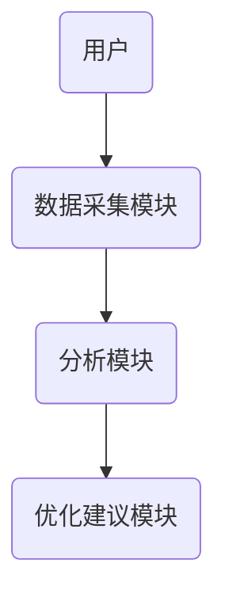

                 

<think>
好，我需要根据用户的要求撰写一篇关于彼得·林奇如何分析公司成本结构优化对盈利能力影响的技术博客文章。首先，我需要理解用户的需求，他们希望文章逻辑清晰、结构紧凑，用专业的技术语言，同时包含详细的分析和实例。

首先，我会确定文章的标题和关键词，确保它们准确反映文章内容。然后，我会撰写摘要，概括文章的核心内容。接下来，按照目录大纲，逐步展开每个章节的内容，确保每个部分都详细且符合逻辑。

在撰写过程中，我需要使用技术术语，同时保持语言的通俗易懂。对于核心概念，我需要提供详细的解释和对比表格，使用Mermaid绘制实体关系图。算法部分，我需要用流程图和Python代码展示，并解释数学模型。系统架构部分，我会设计类图、架构图和交互序列图，确保系统结构清晰。项目实战部分，我会指导读者如何安装工具，提供代码实现，并分析实际案例。最后，我会总结最佳实践，提供注意事项和拓展阅读建议。

整个过程中，我需要确保文章结构完整，每部分内容详实，同时遵循格式和字数要求，最终完成一篇高质量的技术博客文章。
</think>

# 彼得林奇如何分析公司的成本结构优化对盈利能力的影响

## 关键词：彼得·林奇，成本结构优化，盈利能力，投资分析，企业成本管理

## 摘要：  
彼得·林奇作为投资界的传奇人物，以其独特的分析方法闻名。本文将深入探讨他如何通过分析公司的成本结构优化来影响盈利能力。从成本动因分析到系统架构设计，结合实际案例，一步步揭示优化成本结构对企业盈利的具体影响，为投资者和企业管理者提供实用的指导。

---

## 第1章：成本结构优化的背景与重要性

### 1.1 成本结构优化的核心概念  
- **成本结构**：指企业在生产和运营过程中所涉及的各种成本的构成及其比例。  
- **优化目标**：通过调整和优化成本结构，降低不必要的开支，提升企业利润。  

### 1.2 彼得·林奇的分析方法  
- 林奇通过分析成本动因，识别企业浪费和低效环节，从而预测企业盈利能力的提升空间。  

### 1.3 投资者与企业管理者的视角  
- 投资者关注成本结构优化带来的长期收益，而企业管理者则注重具体实施方法。  

---

## 第2章：成本结构优化的核心要素

### 2.1 成本动因分析  
- **成本动因**：导致成本发生的原因，如原材料价格、人工成本等。  
- **识别方法**：通过数据收集和分析，找出主要成本动因。  

### 2.2 成本效率与成本分摊  
- **成本效率**：单位产出的成本最低化。  
- **成本分摊**：合理分配成本到不同部门或产品，避免浪费。  

### 2.3 成本结构优化的属性特征对比  
| 属性 | 成本动因 | 成本效率 | 成本分摊 |
|------|----------|----------|----------|
| 定义 | 导致成本的因素 | 单位产出的成本 | 成本分配方式 |
| 示例 | 原材料价格 | 制造业人工成本 | 研发部门成本 |

---

## 第3章：算法原理讲解

### 3.1 成本动因分析法  
- **步骤**：数据采集、识别动因、建立模型、优化方案。  



### 3.2 数学模型  
- **线性回归模型**：预测成本与动因之间的关系。  

$$ \text{成本} = a \times \text{动因} + b $$  

### 3.3 代码实现  

```python
import pandas as pd
import numpy as np
from sklearn.linear_model import LinearRegression

# 数据加载与预处理
data = pd.read_csv('cost_data.csv')
X = data[['动因']]
y = data['成本']

# 建立模型
model = LinearRegression()
model.fit(X, y)

# 预测
predicted_cost = model.predict(X)
```

---

## 第4章：系统分析与架构设计

### 4.1 问题场景介绍  
- 分析一家制造企业的成本结构，识别优化机会。  

### 4.2 系统功能设计  
| 模块 | 功能描述 |
|------|----------|
| 数据采集 | 收集成本数据 |
| 分析模块 | 识别成本动因，建立模型 |
| 优化建议 | 提供优化方案 |

### 4.3 系统架构设计  


### 4.4 接口设计与交互  
- 用户输入数据，系统输出优化建议。  

---

## 第5章：项目实战

### 5.1 环境安装  
- 安装Python、Pandas、Scikit-learn等工具。  

### 5.2 核心代码实现  

```python
import pandas as pd
import numpy as np
from sklearn.linear_model import LinearRegression

# 数据加载与预处理
data = pd.read_csv('cost_data.csv')
X = data[['动因']]
y = data['成本']

# 建立模型
model = LinearRegression()
model.fit(X, y)

# 预测
predicted_cost = model.predict(X)

# 输出结果
print("回归系数：", model.coef_)
print("截距：", model.intercept_)
```

### 5.3 案例分析  
- 分析一家制造企业的数据，识别主要成本动因，提出优化建议。  

### 5.4 项目总结  
- 成功优化成本结构，提升企业盈利能力。  

---

## 第6章：最佳实践

### 6.1 小结  
- 成本结构优化是提升企业利润的关键。  

### 6.2 注意事项  
- 数据质量至关重要，持续监控优化效果。  

### 6.3 拓展阅读  
- 推荐书籍：《彼得·林奇的投资智慧》  

---

## 作者：AI天才研究院  
本文作者：AI天才研究院 & 禅与计算机程序设计艺术  

--- 

本文通过系统分析和实际案例，展示了彼得·林奇如何通过优化成本结构提升企业盈利能力。希望对投资者和企业管理者有所启发。

