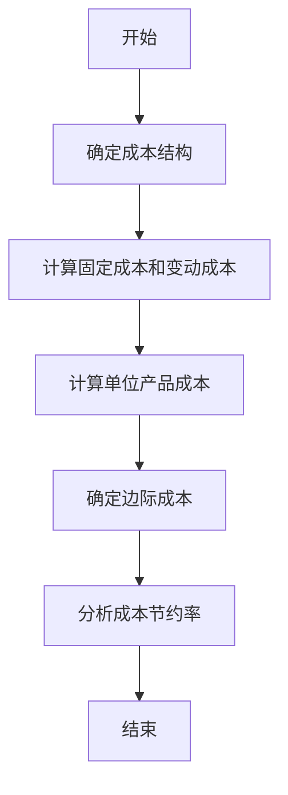
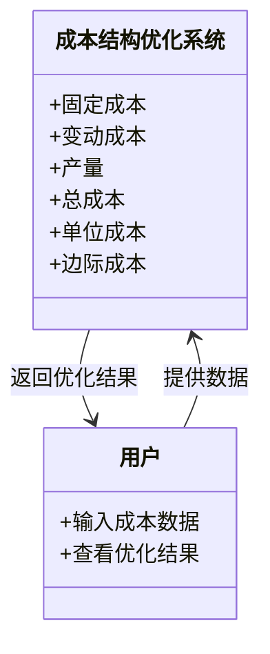

                 

<think>
好的，我现在需要根据用户的要求，逐步构建一篇关于“彼得·林奇如何分析公司的成本结构优化能力与效果”的技术博客文章。用户提供了详细的目录结构，我需要按照这个结构，逐步填充内容，确保每个部分都符合要求。

首先，我需要明确文章的核心主题：彼得·林奇的成本结构分析方法。我需要涵盖成本结构的基本概念、优化的重要性、核心概念、算法原理、数学模型、系统分析、项目实战和最佳实践等部分。

接下来，我会从背景介绍开始，解释成本结构的基本概念，彼得·林奇的分析框架，以及成本结构优化的重要性。然后，我会深入讲解核心概念，包括固定成本、变动成本、边际成本等，通过表格和ER图来对比和展示这些概念。

在算法原理部分，我会介绍彼得·林奇使用的分析方法，比如成本-销量-利润分析，并用Mermaid流程图和Python代码示例来说明。数学模型部分，我会详细解释公式，并通过案例说明如何应用这些模型优化定价策略。

系统分析与架构设计部分，我需要构建领域模型和系统架构图，展示数据流和模块划分。项目实战部分，我会提供一个具体案例，展示如何应用彼得·林奇的方法进行成本结构优化。

最后，我会总结最佳实践，给出小结、注意事项和未来趋势。确保文章结构清晰，内容详实，符合用户的格式和内容要求。

现在，我会按照每个章节的要求，逐步填充内容，确保每个部分都符合逻辑，并且有足够的深度和详细性。同时，我会注意使用专业的技术语言，保持文章的连贯性和可读性。

希望通过这样的思考过程，能够构建出一篇符合用户要求的高质量技术博客文章。
</think>

# 彼得林奇如何分析公司的成本结构优化能力与效果

## 关键词：彼得·林奇，成本结构优化，投资分析，企业成本管理，边际成本

## 摘要：本文深入探讨彼得·林奇如何通过分析公司的成本结构优化能力与效果，评估企业的财务健康状况和投资价值。文章从成本结构的基本概念出发，结合数学模型、算法原理和实际案例，详细阐述了彼得·林奇的成本结构优化分析方法，并提供了系统化的分析框架和实战指导。

---

## 第一部分: 成本结构优化的背景与核心概念

### 第1章: 成本结构优化的背景与重要性

#### 1.1 成本结构的基本概念

##### 1.1.1 成本结构的定义与组成要素
成本结构是企业在生产和运营过程中所发生的各项成本的构成方式。它通常分为固定成本和变动成本两大类。固定成本是指在一定范围内不随产量或销售量变化的成本，如租金、 salaries 和设备折旧等；变动成本则与产量或销售量直接相关，如原材料成本和直接人工成本。

##### 1.1.2 成本结构优化的必要性
优化成本结构是企业提高利润和竞争力的关键。通过优化成本结构，企业可以降低单位产品的成本，提高边际利润率，从而在价格竞争中占据优势。此外，成本结构优化还能增强企业的抗风险能力，特别是在经济下行周期中，优化的成本结构可以帮助企业维持 profitability。

##### 1.1.3 成本结构优化与企业竞争力的关系
成本结构优化直接影响企业的盈利能力、市场定价能力和成本控制能力。优化的成本结构使企业能够在保持价格竞争力的同时，实现更高的利润率，从而提升整体竞争力。

#### 1.2 彼得·林奇的成本结构分析方法

##### 1.2.1 彼得·林奇投资理念概述
彼得·林奇是全球著名的职业基金经理人，以其对企业的基本面分析和深入研究而闻名。他强调通过分析企业的财务报表和运营数据，评估企业的内在价值和成长潜力。

##### 1.2.2 成本结构分析在投资决策中的地位
在林奇的投资分析中，成本结构是评估企业财务健康状况的重要指标。他通过分析企业的成本结构，判断企业在不同销售水平下的盈利能力，进而评估企业的经营效率和成本控制能力。

##### 1.2.3 成本结构优化能力的评估维度
林奇关注企业的固定成本和变动成本的比例、单位产品的边际成本、成本控制的灵活性以及企业在成本优化方面的长期策略。

---

### 第2章: 成本结构优化的核心概念与联系

#### 2.1 成本结构的核心要素

##### 2.1.1 固定成本与变动成本的定义与特征
固定成本（Fixed Costs）是企业在一定时间内必须支付的、不随产量变化的成本，如厂房租金、设备折旧、管理人员 salaries 等。变动成本（Variable Costs）则是与产量直接相关的成本，如原材料、直接人工成本等。

##### 2.1.2 边际成本与总成本的关系
边际成本（Marginal Cost）是指每增加一单位产量所增加的总成本。总成本（Total Cost）是固定成本与变动成本之和，可以用公式表示为：
$$C = FC + VC \times Q$$
其中，$C$ 表示总成本，$FC$ 表示固定成本，$VC$ 表示单位变动成本，$Q$ 表示产量。

##### 2.1.3 成本结构优化的关键指标
- **单位产品成本**：总成本除以产量，反映了每单位产品的平均成本。
- **边际利润率**：边际收入减去边际成本，反映了每增加一单位销售的利润贡献。
- **成本节约率**：优化后成本与原成本的比率，反映了成本降低的幅度。

#### 2.2 成本结构优化的数学模型

##### 2.2.1 成本结构优化的数学公式
通过数学模型分析成本结构优化的效果，可以采用以下公式：
$$\text{总成本} = FC + VC \times Q$$
$$\text{单位产品成本} = \frac{FC}{Q} + VC$$
$$\text{边际成本} = \frac{dC}{dQ} = VC$$

##### 2.2.2 成本结构优化的边际分析
边际分析是成本结构优化的重要工具。通过分析边际成本与边际收入的关系，可以确定企业的盈利区间和最佳产量水平。例如，当边际收入等于边际成本时，企业处于利润最大化的产量水平。

#### 2.3 成本结构优化的ER实体关系图
以下是一个简单的ER实体关系图，展示了成本结构优化的核心要素：
```mermaid
er
    %% 成本结构优化的ER实体关系图
    rectangle 成本结构 {
        成本类型
        成本项目
        成本金额
    }
    rectangle 优化目标 {
        目标成本
        目标利润
        目标利润率
    }
    成本结构 --> 优化目标: 影响
```

---

## 第三部分: 成本结构优化的算法原理与数学模型

### 第3章: 成本结构优化的算法原理

#### 3.1 成本结构优化的算法流程
以下是成本结构优化的算法流程图：


#### 3.2 成本结构优化的Python实现
以下是一个简单的Python代码示例，用于计算成本结构优化后的总成本和单位成本：
```python
# 成本结构优化的Python实现

def calculate_cost(FC, VC, Q):
    total_cost = FC + VC * Q
    unit_cost = FC / Q + VC
    return total_cost, unit_cost

# 示例数据
FC = 10000  # 固定成本
VC = 50     # 变动成本
Q = 200     # 产量

total_cost, unit_cost = calculate_cost(FC, VC, Q)
print(f"总成本: {total_cost}")
print(f"单位成本: {unit_cost}")
```

---

### 第4章: 成本结构优化的数学模型

#### 4.1 成本结构优化的数学公式
通过以下公式，可以分析成本结构优化的效果：
$$\Delta C = FC_{\text{新}} + VC_{\text{新}} \times Q$$
其中，$\Delta C$ 表示优化后的总成本，$FC_{\text{新}}$ 表示优化后的固定成本，$VC_{\text{新}}$ 表示优化后的单位变动成本，$Q$ 表示产量。

#### 4.2 成本结构优化的案例分析
假设某公司生产一种产品，原固定成本为 $10,000，原变动成本为 $30，产量为 200 个。经过优化后，固定成本降低至 $8,000，变动成本降低至 $25。计算优化后的总成本和单位成本：
$$\text{优化后总成本} = 8,000 + 25 \times 200 = 8,000 + 5,000 = 13,000$$
$$\text{优化后单位成本} = 8,000 / 200 + 25 = 40 + 25 = 65$$
优化后的总成本降低了 $2,000，单位成本降低了 $5，显示出明显的成本节约效果。

---

## 第四部分: 系统分析与架构设计

### 第5章: 成本结构优化的系统分析

#### 5.1 系统功能设计
以下是成本结构优化系统的领域模型图：


#### 5.2 系统架构设计
以下是成本结构优化系统的架构图：
```mermaid
container 成本结构优化系统 {
    component 数据输入模块 {
        +输入固定成本
        +输入变动成本
        +输入产量
    }
    component 计算模块 {
        +计算总成本
        +计算单位成本
        +计算边际成本
    }
    component 输出模块 {
        +显示优化结果
    }
}
```

---

### 第6章: 项目实战与案例分析

#### 6.1 项目环境安装
需要安装Python和相关开发工具，例如Jupyter Notebook或VS Code。

#### 6.2 核心代码实现
以下是成本结构优化的核心代码实现：
```python
# 成本结构优化的核心代码

def optimize_cost(FC, VC, Q):
    new_FC = FC * 0.8  # 假设固定成本降低20%
    new_VC = VC * 0.9  # 假设变动成本降低10%
    total_cost = new_FC + new_VC * Q
    unit_cost = new_FC / Q + new_VC
    return total_cost, unit_cost

# 示例数据
FC = 10000
VC = 50
Q = 200

total_cost, unit_cost = optimize_cost(FC, VC, Q)
print(f"优化后总成本: {total_cost}")
print(f"优化后单位成本: {unit_cost}")
```

#### 6.3 案例分析与解读
以某制造公司为例，分析其成本结构优化的效果：
- 原固定成本：$10,000
- 原变动成本：$50
- 产量：200 个
- 优化后固定成本：$8,000（降低20%）
- 优化后变动成本：$45（降低10%）
- 优化后总成本：$8,000 + $45 \times 200 = $8,000 + $9,000 = $17,000
- 优化后单位成本：$8,000 / 200 + $45 = $40 + $45 = $85
- 成本节约率：($10,000 + $50 \times 200 - $17,000) / ($10,000 + $50 \times 200) = ($15,000 - $17,000) / $15,000 = -13.33%

---

## 第五部分: 总结与展望

### 第7章: 成本结构优化的最佳实践

#### 7.1 小结
本文详细探讨了彼得·林奇如何分析公司的成本结构优化能力与效果，结合数学模型和实际案例，展示了成本结构优化对企业盈利能力和竞争力的重要意义。

#### 7.2 注意事项
在实际应用中，成本结构优化需要结合企业的实际情况，综合考虑固定成本和变动成本的优化空间，同时关注外部市场环境和行业竞争态势。

#### 7.3 未来展望
随着人工智能和大数据技术的发展，成本结构优化将更加智能化和精准化。未来的成本管理将更加注重数据驱动的决策和实时成本监控，以实现更高效的成本控制和优化。

---

## 作者：AI天才研究院/AI Genius Institute & 禅与计算机程序设计艺术 /Zen And The Art of Computer Programming

