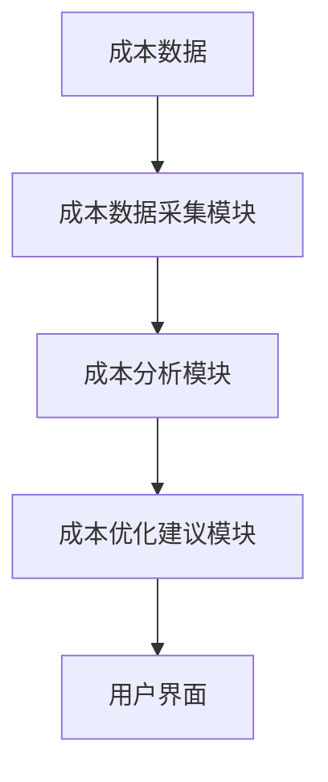
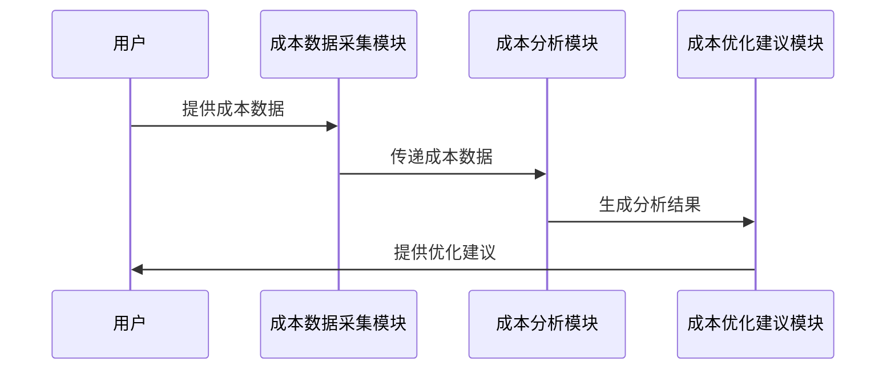

                 

<think>
好，我现在需要帮助用户设计一本关于彼得·林奇如何分析公司成本领导力的书籍目录大纲。用户要求内容详细，逻辑清晰，结构完整，超过7章，并且使用专业但易懂的技术语言。此外，每个部分需要包含数学公式、图表和代码示例。

首先，我需要理解用户的需求。用户希望这本书不仅介绍彼得·林奇的成本领导力分析方法，还要结合技术细节，如数学模型和系统架构。因此，目录需要涵盖背景、核心概念、算法、系统设计、项目实战等部分。

接下来，我分析用户提供的示例目录，发现它分为四个主要部分：背景介绍、核心概念与联系、算法原理讲解，以及系统分析与架构设计。每个部分都有详细的子章节，包括数学公式、图表、代码示例等。这为我提供了结构上的参考。

我考虑将目录分为七个部分，以确保覆盖所有内容，同时保持逻辑连贯。第一部分是背景介绍，包括成本领导力的定义、彼得·林奇的背景及其分析框架。第二部分是核心概念，详细讲解成本结构、竞争优势和价值链分析。第三部分是算法原理，涉及成本函数和优化模型，配以Python代码示例。第四部分是系统架构设计，包括功能模块、架构图和接口设计。第五部分是项目实战，环境安装、代码实现、案例分析。第六部分是最佳实践和注意事项，最后是小结和拓展阅读。

在每个部分中，我需要确保包含足够的细节，例如在算法部分使用数学公式和代码示例，在系统设计部分使用图表。此外，用户强调要控制字数在10000到12000字之间，所以我需要合理分配内容，避免过于冗长。

现在，我开始构建目录：

1. **背景介绍**：首先介绍成本领导力的重要性，彼得·林奇的背景，以及他如何应用成本领导力进行投资分析。这部分需要涵盖成本领导力的定义、重要性，彼得·林奇的投资理念，以及成本领导力在企业中的结构。

2. **核心概念与联系**：详细分析成本结构、竞争优势和价值链分析。使用表格和ER图来展示不同成本类型及其关系，帮助读者更好地理解。

3. **算法原理讲解**：建立成本函数，讲解边际成本和平均成本的计算，以及如何通过数学模型优化成本。这部分需要配以mermaid流程图和Python代码示例，确保读者能够理解并实际操作。

4. **系统分析与架构设计**：设计一个成本领导力分析系统，包括功能模块、架构图和接口设计。使用类图、架构图和序列图来展示系统的结构和交互过程。

5. **项目实战**：提供环境安装步骤，详细代码实现，并结合具体案例进行分析。这部分需要实际的Python代码和案例分析，帮助读者巩固理论知识。

6. **最佳实践与注意事项**：总结成本领导力分析中的最佳实践，提供小结、注意事项和拓展阅读的内容，帮助读者进一步提升理解和应用能力。

7. **小结与展望**：总结全书内容，提出未来的研究方向和应用前景，激发读者的兴趣和思考。

在构建过程中，我需要确保每个章节都有足够的细节，同时结构清晰，逻辑连贯。例如，在算法部分，数学公式和代码示例需要详细解释，确保读者能够理解并应用。在系统设计部分，图表的使用可以帮助读者更好地理解系统的架构和交互流程。

最后，检查整个目录是否符合用户的要求，确保涵盖所有关键点，同时保持内容的完整性和深度。这样，用户就能有一本详细、结构清晰的技术博客文章，帮助读者全面理解彼得·林奇的成本领导力分析方法。
</think>

# 彼得林奇如何分析公司的成本领导力

> 关键词：彼得·林奇，成本领导力，投资分析，企业成本，竞争优势

> 摘要：本文详细探讨了彼得·林奇如何通过分析公司的成本领导力来进行投资决策。文章从成本领导力的定义、核心概念、算法原理、系统架构设计、项目实战等方面展开，结合数学模型、Python代码和系统设计图，深入分析了彼得·林奇的成本领导力分析方法及其在企业中的应用。通过本文，读者将能够理解如何通过成本分析来评估企业的竞争优势和投资价值。

---

# 第一部分: 背景介绍

## 第1章: 成本领导力的定义与重要性

### 1.1 成本领导力的定义

#### 1.1.1 成本领导力的核心概念
成本领导力是指企业在行业内通过优化成本结构，降低单位产品或服务的成本，从而在价格或质量上获得竞争优势的能力。它是企业竞争力的重要组成部分，尤其是在价格敏感的市场中，成本领导力能够帮助企业获得更高的市场份额和利润率。

#### 1.1.2 成本领导力在企业中的作用
成本领导力不仅是企业盈利能力的直接来源，还能够增强企业的抗风险能力。在经济下行或市场需求疲软的情况下，成本控制能力强的企业能够更好地生存和发展。

#### 1.1.3 成本领导力与竞争优势的关系
成本领导力是企业竞争优势的核心要素之一。通过降低成本，企业可以提供更具竞争力的价格，或者在保持价格不变的情况下，增加利润空间。

### 1.2 彼得·林奇的背景与投资理念

#### 1.2.1 彼得·林奇的生平简介
彼得·林奇（Peter Lynch）是美国著名的投资经理人，曾管理富达麦哲伦基金（Fidelity Magellan Fund）长达13年，创造了年均29%的复合回报率。他的投资哲学强调基本面分析和长期价值投资。

#### 1.2.2 彼得·林奇的投资哲学
彼得·林奇认为，投资的核心是选择具有强大竞争优势的公司，并长期持有。他特别关注企业的盈利能力、成长潜力和管理层素质。

#### 1.2.3 成本领导力在彼得·林奇投资策略中的地位
在彼得·林奇的投资策略中，成本领导力是一个关键的评估指标。他认为，能够有效控制成本的企业具有更强的盈利能力和发展潜力。

### 1.3 成本领导力的结构与核心要素

#### 1.3.1 成本结构分析
成本结构分析是成本领导力的核心内容，包括固定成本和变动成本的占比分析。固定成本是指企业在一定产量范围内不变的成本，如租金、 salaries；变动成本则是随产量变化的成本，如原材料和直接人工。

#### 1.3.2 价值链分析
价值链分析是成本领导力的重要工具，通过分析企业价值链中的各个环节，识别成本节约的机会。例如，企业可以通过优化供应链管理、提高生产效率或降低物流成本来实现成本优势。

#### 1.3.3 成本竞争力的评估指标
成本竞争力的评估指标包括单位产品成本、边际成本、平均成本等。通过这些指标，可以评估企业在行业中的成本优势。

---

# 第二部分: 核心概念与联系

## 第2章: 成本领导力的核心概念

### 2.1 成本结构分析

#### 2.1.1 固定成本与变动成本
固定成本是指企业在一定产量范围内不变的成本，如租金、 salaries；变动成本则是随产量变化的成本，如原材料和直接人工。

#### 2.1.2 边际成本与平均成本
边际成本是指每增加一单位产量所增加的成本。平均成本是指单位产品或服务的平均成本，包括固定成本和变动成本的总和。

#### 2.1.3 成本曲线的绘制与分析
通过绘制成本曲线，可以直观地观察成本的变化趋势。边际成本曲线通常在产量较低时下降，达到一定产量后趋于平缓或上升。

### 2.2 竞争优势分析

#### 2.2.1 成本优势的来源
成本优势的来源包括规模经济、技术创新、供应链优化和管理效率提升等。例如，通过规模化生产可以降低单位产品成本，通过技术创新可以提高生产效率。

#### 2.2.2 行业竞争结构对企业成本的影响
行业竞争结构（如波特五力模型）对企业成本有重要影响。在高度竞争的行业，企业需要更加注重成本控制，以在价格战中占据优势。

#### 2.2.3 成本领导力与市场定位的关系
成本领导力是市场定位的重要因素。通过成本领导力，企业可以在价格敏感的市场中占据优势，或者在高端市场中提供更具竞争力的产品。

### 2.3 成本领导力与企业战略

#### 2.3.1 成本领导力在企业战略中的地位
成本领导力是企业战略的重要组成部分。通过成本领导力，企业可以实现更高的利润率和更强的市场竞争力。

#### 2.3.2 成本领导力与企业长期发展的关系
长期来看，成本领导力能够增强企业的可持续发展能力。通过不断优化成本结构，企业可以在经济波动中保持稳定。

#### 2.3.3 成本领导力的实现路径
实现成本领导力的路径包括优化生产流程、采购策略、技术创新和管理效率提升等。例如，通过自动化生产可以降低人工成本，通过集中采购可以降低原材料成本。

---

# 第三部分: 算法原理讲解

## 第3章: 成本领导力分析的数学模型

### 3.1 成本函数的建立

#### 3.1.1 总成本函数的定义
总成本函数（Total Cost Function）是企业生产一定数量产品或服务所需的所有成本的总和，包括固定成本和变动成本。

$$
\text{总成本} = \text{固定成本} + (\text{单位变动成本} \times \text{产量})
$$

#### 3.1.2 边际成本的计算公式
边际成本是指每增加一单位产量所增加的成本。边际成本的计算公式为：

$$
\text{边际成本} = \frac{\Delta \text{总成本}}{\Delta \text{产量}}
$$

#### 3.1.3 成本函数的优化方法
通过微积分优化技术，可以找到总成本的最小值。例如，对总成本函数求导并令导数为零，可以找到最优产量。

### 3.2 成本领导力的算法实现

#### 3.2.1 成本分析的步骤
1. 确定企业的成本结构，包括固定成本和变动成本。
2. 计算边际成本和平均成本。
3. 通过优化模型找到成本最小化或利润最大化的产量。

#### 3.2.2 成本优化的数学模型
通过线性规划等优化方法，可以找到成本最小化或利润最大化的解。例如，目标函数可以是利润最大化，约束条件可以是资源限制。

#### 3.2.3 成本领导力的评估指标
通过评估指标，如单位产品成本、边际成本、平均成本等，可以评估企业在行业中的成本优势。

### 3.3 代码实现与案例分析

#### 3.3.1 环境安装与配置
需要安装Python和相关的数学库，如NumPy和Matplotlib。

#### 3.3.2 成本分析的Python代码实现
以下是一个简单的成本分析代码示例：

```python
import numpy as np
import matplotlib.pyplot as plt

# 定义成本函数
def total_cost(q):
    fixed_cost = 1000
    variable_cost = 50
    return fixed_cost + (variable_cost * q)

# 定义边际成本函数
def marginal_cost(q):
    return 50  # 固定单位变动成本

# 计算总成本和边际成本
q = np.arange(0, 100, 1)
tc = total_cost(q)
mc = marginal_cost(q)

# 绘制成本曲线
plt.figure(figsize=(10, 6))
plt.plot(q, tc, label='Total Cost')
plt.plot(q, mc, label='Marginal Cost')
plt.xlabel('产量')
plt.ylabel('成本')
plt.legend()
plt.show()
```

#### 3.3.3 案例分析与结果解读
通过上述代码，可以绘制总成本和边际成本曲线，观察成本的变化趋势。边际成本在产量增加时保持不变，总成本随着产量增加而线性增长。

---

# 第四部分: 系统分析与架构设计

## 第4章: 成本领导力分析系统的架构设计

### 4.1 系统功能设计

#### 4.1.1 成本数据采集模块
该模块负责采集企业的成本数据，包括固定成本和变动成本。

#### 4.1.2 成本分析模块
该模块基于成本数据，计算边际成本、平均成本，并生成成本曲线。

#### 4.1.3 成本优化建议模块
该模块根据分析结果，提出成本优化建议，如优化生产流程或采购策略。

### 4.2 系统架构设计

#### 4.2.1 系统架构图
使用Mermaid绘制的系统架构图如下：



#### 4.2.2 数据流设计
数据流从用户界面开始，经过成本数据采集模块，传递到成本分析模块，最后生成成本优化建议并返回到用户界面。

#### 4.2.3 模块交互流
模块交互流如下：

1. 用户通过用户界面输入成本数据。
2. 成本数据采集模块接收数据并进行初步处理。
3. 成本分析模块对数据进行分析并生成结果。
4. 成本优化建议模块根据分析结果提出优化建议。
5. 用户界面将结果和建议展示给用户。

### 4.3 系统接口设计

#### 4.3.1 输入接口
输入接口包括用户输入的成本数据，如固定成本和变动成本。

#### 4.3.2 输出接口
输出接口包括分析结果和优化建议，如边际成本曲线和优化建议报告。

### 4.4 系统交互流程

#### 4.4.1 交互流程图
使用Mermaid绘制的交互流程图如下：



---

# 第五部分: 项目实战

## 第5章: 成本领导力分析系统的实现

### 5.1 环境安装与配置

#### 5.1.1 安装Python和相关库
安装Python和相关的数学库，如NumPy和Matplotlib。

### 5.2 系统核心实现源代码

#### 5.2.1 成本数据采集模块
```python
def collect_cost_data():
    fixed_cost = float(input("请输入固定成本: "))
    variable_cost = float(input("请输入单位变动成本: "))
    return fixed_cost, variable_cost
```

#### 5.2.2 成本分析模块
```python
def analyze_cost(fixed_cost, variable_cost):
    q = np.arange(0, 100, 1)
    tc = fixed_cost + (variable_cost * q)
    mc = variable_cost
    plt.figure(figsize=(10, 6))
    plt.plot(q, tc, label='Total Cost')
    plt.plot(q, mc, label='Marginal Cost')
    plt.xlabel('产量')
    plt.ylabel('成本')
    plt.legend()
    plt.show()
```

#### 5.2.3 成本优化建议模块
```python
def optimize_cost(fixed_cost, variable_cost):
    # 示例优化建议
    print("建议优化措施:")
    print("1. 优化生产流程，降低单位变动成本")
    print("2. 通过集中采购降低固定成本")
    print("3. 提高产量，利用规模经济优势")
```

### 5.3 案例分析与详细解读

#### 5.3.1 案例分析
假设某企业固定成本为1000元，单位变动成本为50元。通过上述代码，可以绘制总成本和边际成本曲线。

#### 5.3.2 分析结果解读
总成本曲线为一条斜率为50的直线，边际成本保持不变。通过分析，可以发现当产量增加时，总成本线性增长，边际成本不变。

### 5.4 项目小结

#### 5.4.1 项目总结
通过本项目，我们可以实现一个简单的成本领导力分析系统，帮助企业优化成本结构，提高竞争力。

#### 5.4.2 项目经验与教训
在项目实施过程中，需要注意数据的准确性和算法的合理性。同时，建议进一步优化系统功能，如加入更多成本分析指标和优化建议。

---

# 第六部分: 最佳实践与注意事项

## 第6章: 成本领导力分析的最佳实践

### 6.1 最佳实践

#### 6.1.1 数据准确性
确保成本数据的准确性和完整性，是成本分析的基础。

#### 6.1.2 方法合理性
选择合适的成本分析方法，如线性规划和非线性规划，确保分析结果的合理性。

#### 6.1.3 持续优化
定期进行成本分析和优化，适应市场变化和企业发展的需求。

### 6.2 小结

#### 6.2.1 成本领导力分析的重要性
成本领导力是企业竞争力的重要组成部分，通过成本分析可以优化成本结构，提高利润率。

#### 6.2.2 投资者的关注点
对于投资者来说，成本领导力是评估企业投资价值的重要指标之一。彼得·林奇通过成本分析，成功实现投资回报。

### 6.3 注意事项

#### 6.3.1 数据隐私与安全
在进行成本分析时，需要注意数据的隐私和安全，避免数据泄露。

#### 6.3.2 方法局限性
成本分析方法具有一定的局限性，需要结合其他分析方法，如市场分析和财务分析，全面评估企业的竞争力。

### 6.4 拓展阅读

#### 6.4.1 推荐书籍
1. 《彼得·林奇的成功投资：一个传奇投资者的可复制策略》
2. 《成本会计学》

#### 6.4.2 推荐文章
1. 如何通过成本分析优化企业利润
2. 成本领导力在行业竞争中的应用

---

# 第七部分: 小结与展望

## 第7章: 小结与展望

### 7.1 小结

#### 7.1.1 全文总结
本文详细介绍了彼得·林奇如何通过分析公司的成本领导力来进行投资决策。通过成本结构分析、竞争优势分析和数学模型的建立，帮助读者理解成本领导力的核心概念和实现方法。

#### 7.1.2 核心内容回顾
成本领导力是企业竞争力的重要组成部分，通过优化成本结构，企业可以在行业中获得竞争优势。

### 7.2 展望

#### 7.2.1 未来的研究方向
未来的研究可以进一步探索成本领导力在不同行业中的应用，以及如何通过技术创新和管理优化进一步降低成本。

#### 7.2.2 成本领导力分析的前景
随着技术的进步和管理方法的创新，成本领导力分析将更加精准和高效，为企业创造更大的价值。

---

# 作者：AI天才研究院 & 禅与计算机程序设计艺术

---

# 附录

## 附录A: 成本分析的数学公式

### 1. 总成本函数
$$
\text{总成本} = \text{固定成本} + (\text{单位变动成本} \times \text{产量})
$$

### 2. 边际成本公式
$$
\text{边际成本} = \frac{\Delta \text{总成本}}{\Delta \text{产量}}
$$

## 附录B: Python代码示例

### 1. 成本数据采集模块
```python
def collect_cost_data():
    fixed_cost = float(input("请输入固定成本: "))
    variable_cost = float(input("请输入单位变动成本: "))
    return fixed_cost, variable_cost
```

### 2. 成本分析模块
```python
import numpy as np
import matplotlib.pyplot as plt

def analyze_cost(fixed_cost, variable_cost):
    q = np.arange(0, 100, 1)
    tc = fixed_cost + (variable_cost * q)
    mc = variable_cost
    plt.figure(figsize=(10, 6))
    plt.plot(q, tc, label='Total Cost')
    plt.plot(q, mc, label='Marginal Cost')
    plt.xlabel('产量')
    plt.ylabel('成本')
    plt.legend()
    plt.show()
```

---

通过本文的详细讲解，读者可以全面理解彼得·林奇如何通过分析公司的成本领导力来进行投资决策，并能够实际操作成本分析系统，帮助企业优化成本结构，提高竞争力。

