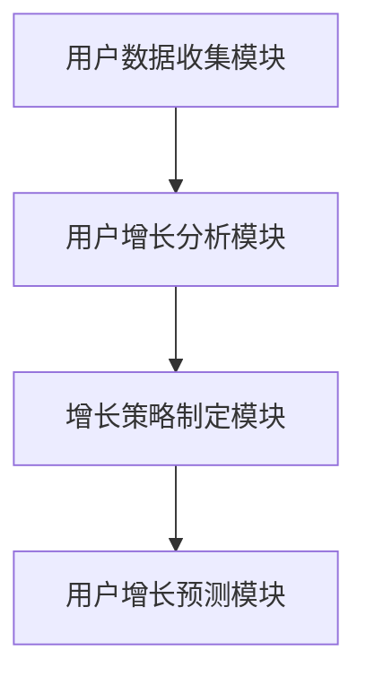
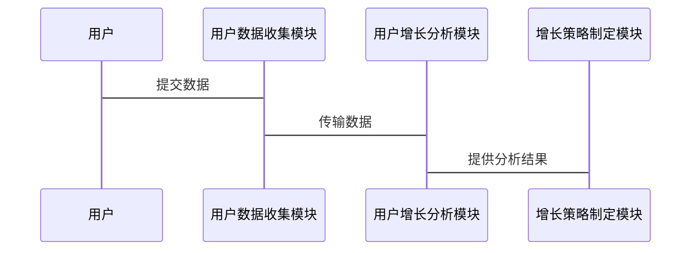

                 


# 彼得林奇如何分析公司的用户增长策略

> 关键词：用户增长策略，彼得·林奇，投资分析，用户增长模型，用户留存率

> 摘要：本文通过分析彼得·林奇的投资理念，详细探讨他如何分析公司的用户增长策略。文章从用户增长的核心概念、关键指标、驱动因素、增长策略框架、算法原理、数学模型、系统设计、项目实战等多维度展开，结合实际案例和代码实现，为读者提供全面的分析方法和实用工具。

---

# 第1章: 彼得·林奇与用户增长策略概述

## 1.1 彼得·林奇的基本介绍

### 1.1.1 彼得·林奇的生平简介

彼得·林奇（Peter Lynch）是全球最著名的投资经理之一，曾任富达投资集团麦哲伦基金的经理。他在投资领域的成就可以用“传奇”来形容，管理的基金在13年的时间里创造了年均29%的复合增长率，远远跑赢市场指数。林奇的投资理念以基本面分析为核心，注重对公司基本面的深入研究，尤其是对公司增长潜力的评估。

### 1.1.2 彼得·林奇的投资理念

林奇的投资理念可以概括为“买入并持有”，他强调长期投资和对公司基本面的深入分析。他认为，投资者应该关注公司的财务状况、行业地位、竞争优势以及管理层能力等因素。这些因素不仅影响公司的盈利能力，也决定了公司的增长潜力。

### 1.1.3 彼得·林奇与用户增长策略的关联

尽管林奇的投资理念主要是针对股票投资，但其核心思想——深入分析公司基本面和竞争优势——同样适用于用户增长策略的分析。用户增长策略是企业发展的关键驱动力之一，而林奇的方法为我们提供了一种系统性的分析框架。

---

## 1.2 用户增长策略的核心概念

### 1.2.1 用户增长的定义与背景

用户增长策略是指通过各种手段吸引新用户并提高现有用户的活跃度和留存率，以实现用户数量和质量的双重提升。在当今竞争激烈的市场环境中，用户增长已经成为企业生存和发展的关键因素之一。

### 1.2.2 用户增长的驱动因素

用户增长的驱动因素可以分为以下几个方面：
1. **产品吸引力**：产品是否能满足用户的需求，是否具有独特的竞争优势。
2. **市场推广效果**：通过广告、营销活动等方式吸引用户。
3. **用户口碑传播**：用户是否愿意推荐产品给他人。
4. **用户体验**：用户在使用产品过程中的体验是否良好。

### 1.2.3 用户增长与企业价值的关系

用户增长与企业价值密切相关。用户数量的增长往往意味着收入的增长，而用户质量的提升则意味着企业的盈利能力增强。因此，用户增长是企业价值增长的重要驱动力。

---

## 1.3 彼得·林奇分析用户增长策略的方法论

### 1.3.1 基于基本面分析的增长策略

林奇的基本面分析方法强调对公司的财务状况、行业地位、竞争优势等进行深入研究。这种方法同样适用于用户增长策略的分析。我们需要关注以下指标：
1. 用户增长率：用户数量的增加速度。
2. 用户留存率：用户在一定时间内的留存情况。
3. 用户活跃度：用户在使用产品过程中的活跃程度。

### 1.3.2 用户增长的多维度评估

用户增长的评估需要从多个维度进行，包括用户数量、用户质量、用户行为等。我们需要综合考虑这些因素，才能全面评估用户增长的潜力。

### 1.3.3 彼得·林奇的增长策略框架

林奇的增长策略框架包括以下几个步骤：
1. **数据收集**：收集用户增长相关的数据，包括用户数量、用户行为、用户反馈等。
2. **数据分析**：对收集到的数据进行分析，识别用户增长的关键驱动因素。
3. **增长潜力评估**：基于数据分析结果，评估公司的用户增长潜力。
4. **增长策略制定**：根据评估结果，制定用户增长策略，并实施相应的措施。

---

## 1.4 本章小结

本章主要介绍了彼得·林奇的基本投资理念，以及用户增长策略的核心概念和方法论。我们通过分析林奇的投资方法，将其应用于用户增长策略的分析，为后续的详细分析奠定了基础。

---

# 第2章: 用户增长策略的核心要素分析

## 2.1 用户增长的核心指标

### 2.1.1 用户增长率

用户增长率是指用户数量的增长速度。计算公式为：
$$用户增长率 = \frac{新增用户数}{现有用户数} \times 100\%$$

---

### 2.1.2 用户留存率

用户留存率是指用户在一定时间内的留存情况。计算公式为：
$$用户留存率 = \frac{留存用户数}{初始用户数} \times 100\%$$

---

### 2.1.3 用户活跃度

用户活跃度是指用户在使用产品过程中的活跃程度。通常可以通过用户在一定时间内的登录次数、使用时长等指标来衡量。

---

## 2.2 用户增长的驱动因素分析

### 2.2.1 产品吸引力

产品吸引力是用户增长的核心驱动力。一个能够满足用户需求且具有竞争优势的产品，能够吸引更多的用户。

### 2.2.2 市场推广效果

市场推广效果是用户增长的重要推动力。通过有效的广告和营销活动，可以快速吸引大量用户。

### 2.2.3 用户口碑传播

用户口碑传播是用户增长的另一个重要驱动力。满意的用户会通过口碑传播吸引更多的用户。

---

## 2.3 彼得·林奇的增长策略框架

### 2.3.1 用户增长的多维度评估

我们需要从多个维度对用户增长进行评估，包括用户数量、用户质量、用户行为等。例如，我们可以使用以下指标：
1. 用户增长率。
2. 用户留存率。
3. 用户活跃度。
4. 用户转化率。

---

### 2.3.2 增长策略的优先级排序

在制定增长策略时，我们需要根据用户增长的潜力和实施成本等因素，对不同的增长策略进行优先级排序。

---

### 2.3.3 增长策略的动态调整

用户增长的环境是动态变化的，因此我们需要根据市场变化和用户反馈，对增长策略进行动态调整。

---

## 2.4 本章小结

本章详细分析了用户增长的核心指标和驱动因素，并提出了基于彼得·林奇方法的增长策略框架。通过多维度的评估和动态调整，我们可以更好地制定和实施用户增长策略。

---

# 第3章: 彼得·林奇用户增长策略的算法原理

## 3.1 用户增长评估的算法框架

### 3.1.1 数据收集与预处理

在进行用户增长评估之前，我们需要收集相关的数据，包括用户数量、用户行为、用户反馈等。数据预处理是确保数据质量的重要步骤。

---

### 3.1.2 关键指标计算

基于收集到的数据，我们需要计算用户增长率、用户留存率、用户活跃度等关键指标。

---

### 3.1.3 增长潜力评估

通过分析关键指标，我们可以评估公司的用户增长潜力，并制定相应的增长策略。

---

## 3.2 用户增长策略的优化算法

### 3.2.1 增长策略的多目标优化

在制定增长策略时，我们需要在多个目标之间进行权衡，例如用户增长率和用户留存率之间的平衡。

---

### 3.2.2 增长策略的动态调整算法

用户增长的环境是动态变化的，因此我们需要根据实时数据，对增长策略进行动态调整。

---

### 3.2.3 增长策略的实验与验证

在实施增长策略之前，我们可以进行小规模的实验，验证策略的有效性。

---

## 3.3 本章小结

本章详细介绍了用户增长评估的算法框架和优化算法。通过数据收集、关键指标计算和动态调整，我们可以更好地制定和实施用户增长策略。

---

# 第4章: 用户增长的数学模型

## 4.1 用户增长的基本模型

### 4.1.1 用户增长率模型

$$用户增长率 = \frac{新增用户数}{现有用户数} \times 100\%$$

---

### 4.1.2 用户留存率模型

$$用户留存率 = \frac{留存用户数}{初始用户数} \times 100\%$$

---

### 4.1.3 用户活跃度模型

$$用户活跃度 = \frac{总活跃次数}{总用户数}$$

---

## 4.2 用户增长的驱动因素模型

我们可以将用户增长的驱动因素分为以下几个方面：
1. 产品吸引力。
2. 市场推广效果。
3. 用户口碑传播。

---

## 4.3 用户增长的预测模型

基于历史数据，我们可以建立用户增长的预测模型，例如ARIMA模型。

---

## 4.4 本章小结

本章通过数学模型的方式，详细分析了用户增长的关键指标和驱动因素。这些模型为我们提供了定量分析的工具，帮助我们更好地理解用户增长的内在规律。

---

# 第5章: 用户增长策略的系统设计

## 5.1 系统功能设计

### 5.1.1 用户数据收集模块

该模块负责收集用户相关的数据，包括用户数量、用户行为、用户反馈等。

---

### 5.1.2 用户增长分析模块

该模块负责对收集到的数据进行分析，计算用户增长率、用户留存率等关键指标。

---

### 5.1.3 增长策略制定模块

该模块负责根据分析结果，制定相应的增长策略。

---

## 5.2 系统架构设计

### 5.2.1 系统架构图



---

## 5.3 系统接口设计

### 5.3.1 数据接口

用户数据收集模块与用户增长分析模块之间需要通过数据接口进行数据传输。

---

### 5.3.2 控制接口

系统管理员可以通过控制接口对系统进行配置和管理。

---

## 5.4 系统交互设计

### 5.4.1 用户数据收集流程



---

## 5.5 本章小结

本章详细介绍了用户增长策略的系统设计，包括功能设计、架构设计、接口设计和交互设计。通过系统的构建，我们可以更好地实现用户增长的分析和管理。

---

# 第6章: 项目实战——彼得·林奇视角下的用户增长分析

## 6.1 项目背景

假设我们是一家互联网公司，希望通过用户增长策略的分析，提升用户数量和质量。

---

## 6.2 项目环境安装

### 6.2.1 数据库安装

我们需要安装MySQL数据库来存储用户数据。

```bash
sudo apt-get install mysql-server
```

---

### 6.2.2 数据分析工具安装

我们需要安装Python和相关数据分析库，例如Pandas和Matplotlib。

```bash
pip install pandas matplotlib
```

---

## 6.3 系统核心实现

### 6.3.1 数据收集

我们需要收集用户相关的数据，包括用户数量、用户行为、用户反馈等。

```python
import pandas as pd

# 数据收集
data = pd.read_csv('user.csv')
print(data.head())
```

---

### 6.3.2 数据分析

通过对收集到的数据进行分析，计算用户增长率、用户留存率等关键指标。

```python
# 用户增长率计算
user_growth_rate = data['新增用户数'] / data['现有用户数'] * 100
print("用户增长率:", user_growth_rate.mean())

# 用户留存率计算
user_retention_rate = data['留存用户数'] / data['初始用户数'] * 100
print("用户留存率:", user_retention_rate.mean())
```

---

### 6.3.3 增长策略制定

根据分析结果，制定相应的增长策略，例如优化产品体验、加大市场推广力度等。

---

## 6.4 项目小结

通过本次实战项目，我们学会了如何从彼得·林奇的视角进行用户增长分析，并掌握了相关工具和技术。

---

# 第7章: 用户增长策略的优化与展望

## 7.1 最佳实践 tips

1. 定期监控用户增长的关键指标。
2. 根据用户反馈动态调整增长策略。
3. 注重用户质量而非单纯追求用户数量。

---

## 7.2 小结

通过本文的分析，我们了解了彼得·林奇的投资理念，并将其应用于用户增长策略的分析。我们从用户增长的核心概念、关键指标、驱动因素、增长策略框架、算法原理、数学模型、系统设计、项目实战等多维度进行了详细探讨。

---

## 7.3 注意事项

1. 数据分析时需要注意数据的准确性和完整性。
2. 制定增长策略时需要结合企业的实际情况。
3. 定期评估增长策略的实施效果。

---

## 7.4 拓展阅读

1. 《彼得·林奇投资指南》
2. 《增长黑客：如何在互联网下半场实现快速增长》

---

# 作者信息

作者：AI天才研究院/AI Genius Institute & 禅与计算机程序设计艺术 /Zen And The Art of Computer Programming

---

感谢您的阅读！希望本文能为您提供有价值的内容和启发。

