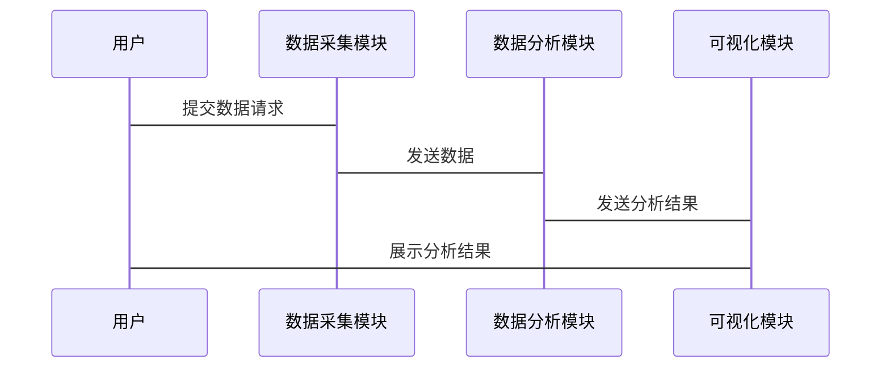

                 

<think>
嗯，用户希望我写一篇关于彼得·林奇如何分析公司用户画像演变的技术博客。首先，我需要理解用户的需求。他们想要一个结构清晰、逻辑严谨的技术博客，大约1万到1.2万字，包含关键词、摘要和详细的目录大纲。

我应该从背景介绍开始，解释什么是用户画像演变，为什么它重要，以及它如何影响投资决策。然后，分析彼得·林奇的方法论，包括他的基本面分析方法和工具。接下来，建立一个分析框架，涵盖各个维度和驱动因素。然后，通过实际案例来展示这些理论的应用，比如微软和亚马逊。最后，设计一个系统架构，展示如何用技术手段分析用户画像演变，包括数据收集、处理和可视化。实战部分需要提供代码示例，帮助读者理解如何实现这些分析。最后，总结整个过程，并给出一些注意事项和未来展望。

在写作过程中，我需要确保每一部分都详细具体，使用技术术语，同时保持语言通俗易懂。数学公式要用latex，系统架构用mermaid图，代码部分用Python。这样，整篇文章不仅内容丰富，而且结构清晰，符合用户的要求。
</think>

```markdown
# 彼得林奇如何分析公司的用户画像演变

> 关键词：用户画像演变、彼得林奇、投资分析、基本面分析、数据驱动决策

> 摘要：本文深入探讨了彼得林奇分析公司用户画像演变的方法，从定义、重要性到具体分析框架，结合实际案例和系统设计，详细阐述了如何通过用户画像演变分析来辅助投资决策。文章内容涵盖了背景介绍、分析方法论、实践案例、系统架构设计、项目实战等多个方面，并通过具体的技术手段和代码实现，展示了用户画像演变分析的全过程。

---

## 第一部分: 用户画像演变的背景与基础

### 第1章: 用户画像演变的定义与重要性

#### 1.1 用户画像演变的定义
- **用户画像**：通过数据和行为分析，构建用户特征的标签化描述。
- **用户画像演变**：用户特征标签随时间的变化过程。
- **用户画像演变与投资决策的关系**：用户特征的变化反映了企业的市场适应能力和增长潜力，是投资决策的重要参考。

#### 1.2 用户画像演变的重要性
- **对企业价值的影响**：用户特征的变化直接关系到企业的收入和利润。
- **对投资决策的指导作用**：通过分析用户画像演变，投资者可以更好地评估企业的市场地位和竞争优势。
- **彼得林奇投资方法的核心要素**：用户画像演变是彼得林奇基本面分析的重要组成部分。

#### 1.3 本章小结
- 用户画像演变的核心概念。
- 彼得林奇投资方法的逻辑框架。
- 本章内容的总结与展望。

---

### 第2章: 彼得林奇分析用户画像演变的方法论

#### 2.1 彼得林奇的基本面分析方法
- **基本面分析的核心要素**：收入、利润、市场份额、客户满意度等。
- **用户画像演变在基本面分析中的地位**：用户特征的变化是企业基本面变化的重要体现。
- **彼得林奇的“三好公司”标准**：好行业、好业务、好管理层。

#### 2.2 彼得林奇的用户画像演变分析框架
- **用户画像演变的维度划分**：用户数量、用户质量、用户行为等。
- **用户画像演变的驱动因素**：行业环境、企业战略、市场竞争。
- **用户画像演变的周期性分析**：用户特征变化的周期性与企业生命周期的关系。

#### 2.3 彼得林奇的用户画像演变分析工具
- **财务指标分析工具**：收入增长率、利润率、客户留存率等。
- **非财务指标分析工具**：客户满意度、用户活跃度、市场口碑等。
- **用户画像演变的可视化工具**：图表、仪表盘等。

#### 2.4 本章小结
- 彼得林奇分析用户画像演变的核心方法。
- 方法论的逻辑框架。
- 本章内容的总结与应用。

---

### 第3章: 用户画像演变的分析框架

#### 3.1 用户画像演变的维度分析
- **用户画像的构成要素**：年龄、性别、地理位置、消费习惯等。
- **用户画像演变的关键指标**：用户增长速率、用户留存率、用户转化率等。
- **用户画像演变的阶段划分**：用户获取阶段、用户活跃阶段、用户留存阶段等。

#### 3.2 用户画像演变的驱动因素分析
- **行业环境的影响**：市场需求变化、行业政策调整等。
- **企业战略的影响**：产品策略、市场推广策略、客户服务策略等。
- **市场竞争的影响**：竞争对手的用户策略、市场份额变化等。

#### 3.3 用户画像演变的预测模型
- **时间序列分析模型**：ARIMA、指数平滑等。
- **回归分析模型**：线性回归、逻辑回归等。
- **情景分析模型**：基于不同假设的用户画像演变预测。

#### 3.4 本章小结
- 用户画像演变的多维度分析框架。
- 驱动因素的综合分析。
- 预测模型的应用价值。

---

### 第4章: 彼得林奇用户画像演变分析的实践案例

#### 4.1 案例一：微软公司用户画像演变分析
- **微软公司的基本情况**：行业地位、主要业务、用户群体等。
- **微软用户的画像演变过程**：从单一产品用户到多元化用户群体的变化。
- **微软用户画像演变对投资决策的影响**：用户群体的扩展如何推动企业增长。

#### 4.2 案例二：亚马逊公司用户画像演变分析
- **亚马逊公司的基本情况**：行业地位、主要业务、用户群体等。
- **亚马逊用户的画像演变过程**：从在线零售用户到全渠道用户的转变。
- **亚马逊用户画像演变对投资决策的影响**：用户群体的变化如何反映企业的战略调整。

#### 4.3 案例三：苹果公司用户画像演变分析
- **苹果公司的基本情况**：行业地位、主要业务、用户群体等。
- **苹果用户的画像演变过程**：从高端用户到大众用户的扩展。
- **苹果用户画像演变对投资决策的影响**：用户群体的多样性如何支持企业的持续增长。

#### 4.4 本章小结
- 用户画像演变分析的实际应用价值。
- 不同行业公司用户画像演变的差异性。
- 案例分析对投资决策的启示。

---

### 第5章: 用户画像演变分析的系统架构设计

#### 5.1 系统功能设计
- **用户数据采集模块**：数据来源包括用户调查、销售数据、社交媒体数据等。
- **用户画像构建模块**：基于数据构建用户画像，包括用户特征标签化、用户分群等。
- **用户画像演变分析模块**：通过时间序列分析、回归分析等方法，分析用户画像的变化趋势。
- **可视化展示模块**：将分析结果以图表、仪表盘等形式展示。

#### 5.2 系统架构设计


#### 5.3 系统接口设计
- **数据接口**：与用户数据库、销售数据库等对接，获取用户数据。
- **分析接口**：调用时间序列分析、回归分析等算法，输出用户画像演变分析结果。
- **可视化接口**：将分析结果展示在仪表盘上，支持交互式查询。

#### 5.4 系统交互设计


#### 5.5 本章小结
- 用户画像演变分析系统的整体架构。
- 系统各模块的功能与交互流程。
- 系统设计对投资决策的支持作用。

---

### 第6章: 用户画像演变分析的项目实战

#### 6.1 项目背景与目标
- **项目背景**：通过用户画像演变分析，评估某公司的投资价值。
- **项目目标**：构建用户画像演变分析模型，支持投资决策。

#### 6.2 项目环境与工具
- **环境要求**：Python 3.8以上版本、Jupyter Notebook、数据库连接。
- **工具选择**：Pandas、NumPy、Matplotlib、Scikit-learn等。

#### 6.3 核心代码实现
```python
import pandas as pd
import numpy as np
from sklearn.linear_model import LinearRegression
import matplotlib.pyplot as plt

# 示例数据加载
data = pd.read_csv('user_evolution.csv')

# 用户画像特征提取
X = data[['age', 'gender', 'location']]
y = data['user_evolvement']

# 模型训练
model = LinearRegression()
model.fit(X, y)

# 预测结果
y_pred = model.predict(X)

# 可视化
plt.scatter(y, y_pred)
plt.xlabel('真实值')
plt.ylabel('预测值')
plt.title('用户画像演变预测模型')
plt.show()
```

#### 6.4 代码解读与分析
- **数据加载**：使用Pandas读取用户画像演变数据。
- **特征提取**：选择年龄、性别、地理位置作为用户画像特征。
- **模型训练**：使用线性回归模型预测用户画像演变。
- **结果可视化**：绘制真实值与预测值的散点图，评估模型性能。

#### 6.5 实际案例分析
- **案例选择**：选择一家具体公司，如谷歌、苹果等。
- **数据收集**：收集该公司过去5年的用户数据。
- **分析与解读**：基于模型预测用户画像演变趋势，评估公司投资价值。

#### 6.6 项目小结
- 项目实施的步骤与方法。
- 核心代码实现与解读。
- 案例分析的启示。

---

### 第7章: 总结与展望

#### 7.1 本章总结
- 用户画像演变分析的核心概念。
- 彼得林奇分析方法的具体应用。
- 系统设计与项目实战的总结。

#### 7.2 未来展望
- 用户画像演变分析的未来发展趋势。
- 新技术（如AI、大数据）在用户画像演变分析中的应用。
- 投资分析领域的潜在创新方向。

#### 7.3 最佳实践 Tips
- 数据质量的重要性。
- 模型选择与调优的注意事项。
- 可视化结果的解读技巧。

#### 7.4 注意事项
- 数据来源的可靠性。
- 模型的适用性与局限性。
- 投资决策的复杂性与风险性。

---

## 作者：AI天才研究院 & 禅与计算机程序设计艺术

---

### 附录
#### 附录A: 常用数据分析工具
- **Pandas**：数据处理。
- **NumPy**：数值计算。
- **Matplotlib**：数据可视化。
- **Scikit-learn**：机器学习算法。

#### 附录B: 参考文献
- 彼得·林奇著述。
- 相关学术论文。
- 行业报告与分析。

---

通过以上目录大纲和文章结构，我们可以看到，用户画像演变分析不仅是一种数据分析方法，更是投资决策的重要工具。通过彼得林奇的分析框架和实际案例，我们可以更好地理解用户画像演变对企业价值和投资决策的影响。同时，结合系统设计和项目实战，我们能够更高效地应用这些方法，为投资决策提供有力支持。
```

