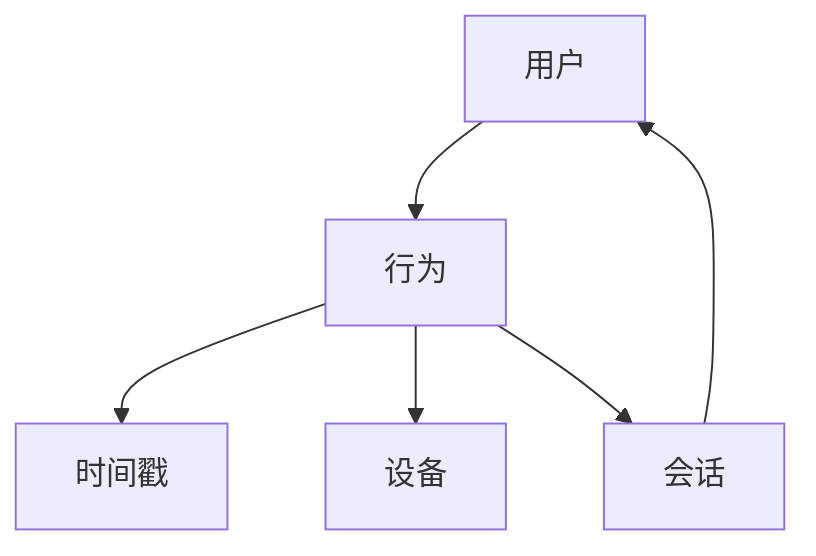
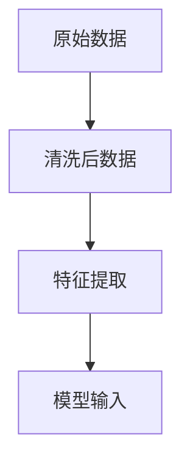
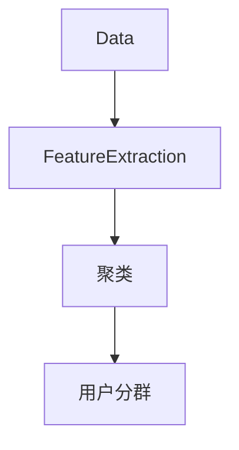
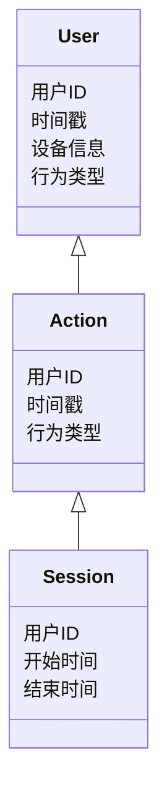
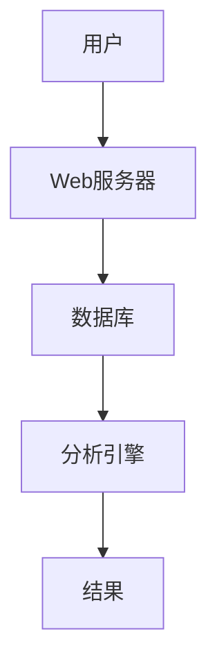
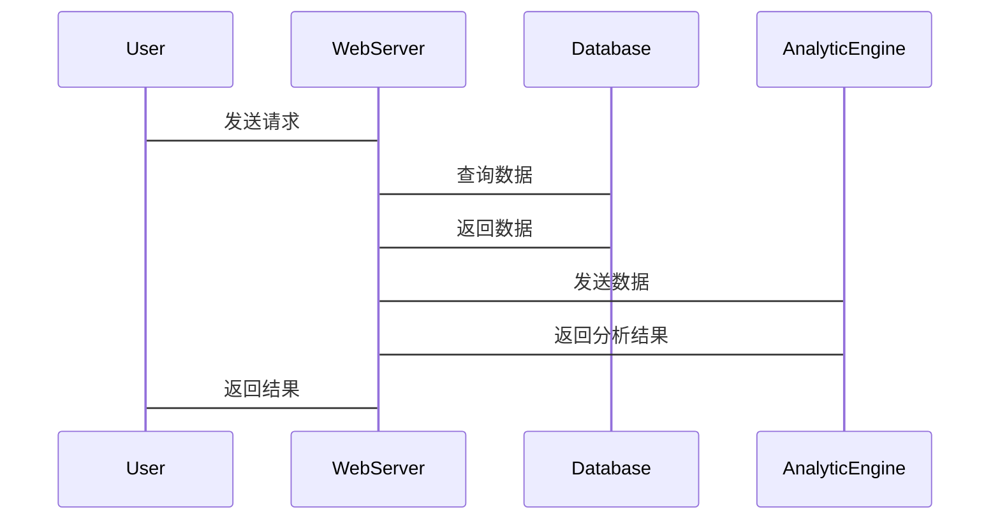

                 


# 彼得林奇如何分析公司的用户行为数据价值

> 关键词：用户行为数据价值，彼得林奇，数据分析，投资决策，数据驱动

> 摘要：本文将详细分析彼得·林奇如何通过用户行为数据的价值来做出投资决策。从用户行为数据的特征分析到数据分析算法的实现，从系统架构设计到项目实战案例，全面解读用户行为数据在投资决策中的应用。

---

# 第一部分：彼得林奇与用户行为数据分析概述

## 第1章：彼得·林奇与用户行为数据分析的背景

### 1.1 彼得·林奇的投资理念概述

彼得·林奇是全球著名投资家，以其在共同基金领域的卓越表现闻名。他的投资策略以基本面分析为核心，注重对公司基本面的深入研究和长期价值的挖掘。在现代投资环境中，数据驱动的分析方法逐渐成为投资决策的重要组成部分，而用户行为数据作为重要的数据来源之一，为彼得·林奇的投资决策提供了新的视角。

#### 问题背景

在传统的投资分析中，基本面分析主要关注财务报表、行业趋势和宏观经济指标。然而，这些指标往往难以捕捉市场的实时动态和用户的真实需求。通过用户行为数据，投资者可以更直接地了解用户的偏好、购买习惯和市场反应，从而为投资决策提供更精准的依据。

#### 问题解决

用户行为数据的分析可以帮助投资者发现市场趋势、识别潜在风险，并评估公司的市场表现。通过对用户行为数据的挖掘，彼得·林奇能够更精准地评估公司的用户粘性和市场竞争力。

#### 边界与外延

用户行为数据的分析并非万能，其应用场景主要集中在与用户交互相关的领域，如电商、互联网服务和金融产品等。本文将聚焦于这些领域，探讨用户行为数据在投资分析中的具体应用。

### 1.2 用户行为数据的定义与特征

用户行为数据是指用户在使用产品或服务时产生的所有交互数据，包括点击、浏览、购买、登录等行为。这些数据通常包括以下特征：

- **时间戳**：记录用户行为发生的时间，用于分析用户行为的时序性。
- **设备信息**：记录用户使用的设备类型和操作系统，用于分析用户使用场景。
- **用户ID**：唯一标识用户，用于分析用户的个体行为特征。
- **行为类型**：记录用户具体的行为类型，如点击、提交、购买等。
- **行为频率**：记录用户在一定时间内的行为次数，用于分析用户的活跃度。

### 1.3 彼得·林奇分析用户行为数据的方法论

彼得·林奇的数据分析方法论以基本面分析为基础，结合用户行为数据的分析，构建了一个更加全面的投资决策框架。其核心步骤包括：

1. **数据收集**：通过日志系统收集用户在使用产品或服务时产生的所有行为数据。
2. **数据预处理**：对收集到的数据进行清洗、去重和格式化处理，确保数据的完整性和准确性。
3. **特征提取**：从原始数据中提取具有投资价值的特征，如用户活跃度、用户留存率、用户转化率等。
4. **数据分析**：通过统计分析、机器学习等方法，挖掘用户行为数据中的潜在规律。
5. **投资决策**：基于数据分析结果，评估公司的市场表现和投资价值。

---

# 第二部分：用户行为数据分析的核心概念与联系

## 第2章：用户行为数据的特征与分析框架

### 2.1 用户行为数据的特征分析

用户行为数据的特征分析是理解用户行为的关键步骤。通过对比不同特征的属性和作用，可以更好地理解用户行为的复杂性。

#### 数据特征对比表格

以下是一个用户行为数据特征的对比表格：

| 特征名称       | 数据类型   | 示例值               | 特征描述                                   |
|----------------|------------|----------------------|-------------------------------------------|
| 用户ID         | 字符串      | "user_123"           | 唯一标识用户                               |
| 时间戳         | 时间戳     | "2023-10-01 10:30:00" | 记录用户行为发生的时间                     |
| 设备信息       | 字符串      | "iOS 16.0"           | 记录用户使用的设备类型和操作系统版本       |
| 行为类型       | 字符串      | "点击商品详情"        | 记录用户具体的行为类型                     |
| 行为频率       | 整数       | 5次                  | 记录用户在一定时间内的行为次数           |

### 2.2 用户行为数据的实体关系图

以下是用户行为数据的实体关系图：



---

## 第3章：用户行为数据分析的算法原理

### 3.1 数据预处理与特征提取

#### 数据预处理流程图

以下是数据预处理的流程图：



#### 数据清洗与特征提取的Python代码示例

以下是一个数据清洗和特征提取的Python代码示例：

```python
import pandas as pd
from datetime import datetime

# 加载数据
data = pd.read_csv('user_behavior.csv')

# 数据清洗
# 删除缺失值
data.dropna(inplace=True)
# 去重
data.drop_duplicates(inplace=True)
# 转换时间戳格式
data['Timestamp'] = data['Timestamp'].apply(lambda x: datetime.strptime(x, '%Y-%m-%d %H:%M:%S'))

# 特征提取
# 提取小时特征
data['Hour'] = data['Timestamp'].apply(lambda x: x.hour)
# 提取设备类型特征
data['DeviceType'] = data['Device'].apply(lambda x: x.split()[0])
```

### 3.2 用户画像构建与聚类分析

#### 用户画像构建流程图

以下是用户画像构建的流程图：



#### 用户聚类分析的Python代码示例

以下是一个用户聚类分析的Python代码示例：

```python
from sklearn.cluster import KMeans
import pandas as pd

# 加载数据
data = pd.read_csv('user_behavior.csv')

# 特征提取
X = data[['Hour', 'DeviceType', 'BehaviorType']]

# 聚类分析
kmeans = KMeans(n_clusters=3, random_state=0)
clusters = kmeans.fit_predict(X)

# 输出结果
print(clusters)
```

### 3.3 数据驱动的决策模型

#### 线性回归模型

以下是线性回归模型的数学公式：

$$
y = \beta_0 + \beta_1x_1 + \beta_2x_2 + \ldots + \beta_kx_k + \epsilon
$$

其中：
- $y$ 是目标变量（如用户购买概率）
- $\beta_0$ 是截距项
- $\beta_1, \beta_2, \ldots, \beta_k$ 是自变量的系数
- $x_1, x_2, \ldots, x_k$ 是自变量（如用户活跃度、用户留存率等）
- $\epsilon$ 是误差项

#### 线性回归模型的Python代码示例

以下是一个线性回归模型的Python代码示例：

```python
import statsmodels.api as sm

# 加载数据
data = pd.read_csv('user_behavior.csv')

# 特征提取
X = data[['Hour', 'DeviceType', 'BehaviorType']]
y = data['PurchaseProbability']

# 添加截距项
X = sm.add_constant(X)

# 线性回归模型
model = sm.OLS(y, X)
results = model.fit()

# 输出结果
print(results.summary())
```

---

# 第三部分：用户行为数据分析的系统架构设计

## 第4章：系统架构设计

### 4.1 系统功能设计

以下是系统功能设计的领域模型图：



### 4.2 系统架构设计

以下是系统架构设计的架构图：



### 4.3 系统接口设计

以下是系统接口设计的序列图：



---

# 第四部分：用户行为数据分析的项目实战

## 第5章：项目实战：基于用户行为数据的投资决策分析

### 5.1 项目背景

本项目旨在通过分析用户行为数据，评估某电商平台的用户行为特征，并基于这些特征做出投资决策。

### 5.2 环境安装与数据采集

#### 环境安装

安装所需的Python库：

```bash
pip install pandas numpy scikit-learn mermaid
```

#### 数据采集

从电商平台的日志系统中采集用户行为数据：

```python
import logging
import sys

# 日志记录
logging.basicConfig(level=logging.INFO)

# 数据采集
def collect_data():
    try:
        # 采集数据
        data = pd.read_csv('user_behavior.csv')
        logging.info('数据采集成功')
        return data
    except Exception as e:
        logging.error(f'数据采集失败：{e}')
        return None

data = collect_data()
```

### 5.3 数据分析与可视化

#### 数据分析

分析用户行为数据的特征：

```python
import pandas as pd
import matplotlib.pyplot as plt

# 数据分析
def analyze_data(data):
    # 统计用户分布
    user_count = data['用户ID'].value_counts()
    print('用户分布：')
    print(user_count.head())

    # 统计行为类型分布
    action_count = data['行为类型'].value_counts()
    print('行为类型分布：')
    print(action_count.head())

    # 绘制用户分布图
    user_count.plot(kind='bar')
    plt.title('用户分布')
    plt.show()

    # 绘制行为类型分布图
    action_count.plot(kind='pie')
    plt.title('行为类型分布')
    plt.show()

analyze_data(data)
```

### 5.4 投资决策建议

基于数据分析结果，提出投资建议：

1. **用户活跃度分析**：高活跃用户的占比表明平台具有较高的用户粘性，可以考虑增加用户留存策略。
2. **用户留存率分析**：低留存率可能表明平台在用户体验方面存在问题，需要优化产品设计。
3. **用户转化率分析**：高转化率表明平台在用户转化方面表现良好，可以考虑扩大市场推广。

---

# 第五部分：总结与展望

## 第6章：总结与展望

### 6.1 最佳实践

1. **数据清洗**：在数据分析之前，必须对数据进行清洗，确保数据的准确性和完整性。
2. **特征提取**：选择具有投资价值的特征，避免过多的无关特征干扰分析结果。
3. **模型选择**：根据具体问题选择合适的模型，避免盲目使用复杂模型。
4. **可视化**：通过可视化工具直观展示分析结果，帮助更好地理解数据。

### 6.2 小结

通过对用户行为数据的分析，彼得·林奇能够更精准地评估公司的市场表现和投资价值。用户行为数据的分析不仅是投资决策的重要工具，也是企业优化产品和服务的重要手段。

### 6.3 注意事项

1. **数据隐私**：在数据采集和分析过程中，必须遵守数据隐私保护的相关法律法规。
2. **模型解释性**：复杂的模型可能难以解释，需要权衡模型的准确性和解释性。
3. **实时性**：用户行为数据的分析需要实时性，才能更好地捕捉市场动态。

### 6.4 未来展望

随着人工智能和大数据技术的不断发展，用户行为数据的分析将更加智能化和自动化。未来，投资者可以通过实时数据分析工具，快速捕捉市场动态，并做出更精准的投资决策。

---

# 作者：AI天才研究院/AI Genius Institute & 禅与计算机程序设计艺术 /Zen And The Art of Computer Programming

