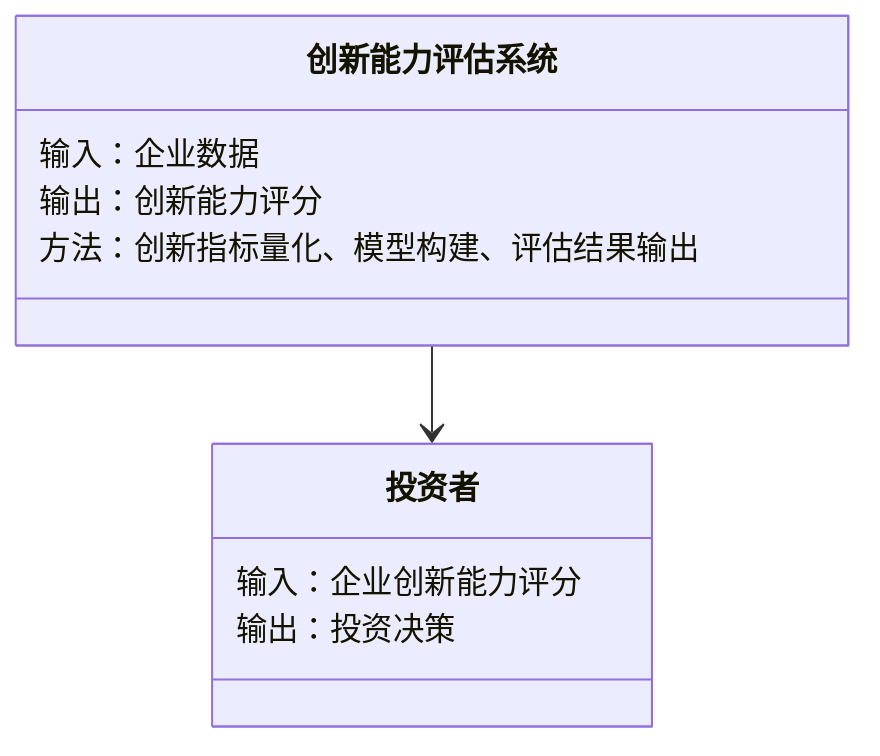
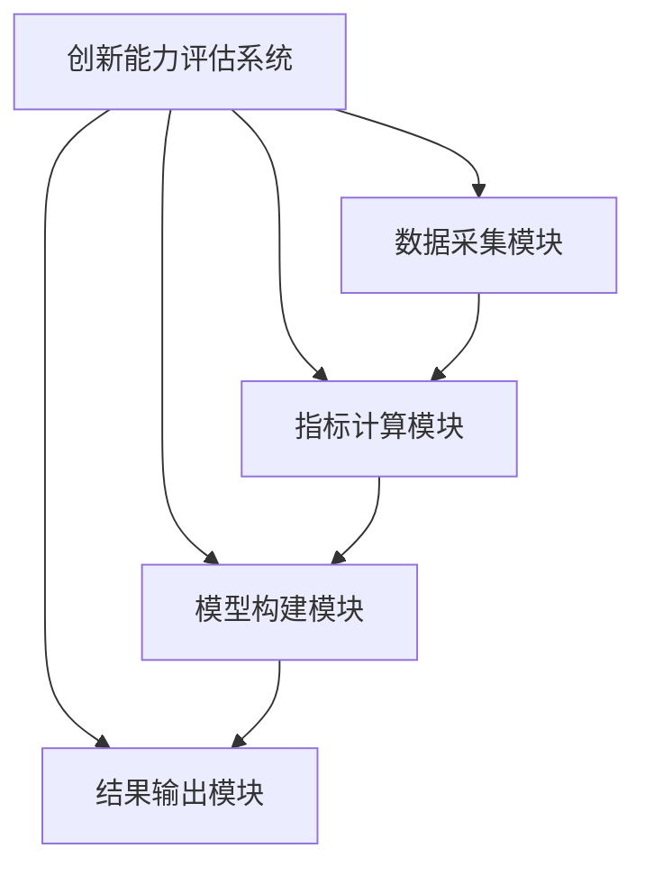
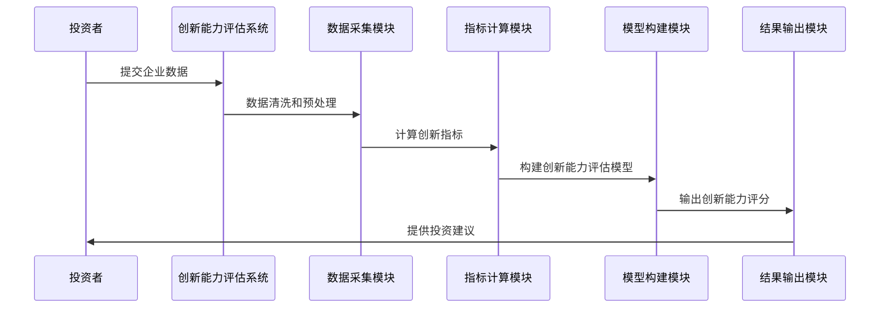

                 


# 彼得林奇如何看待公司的创新能力

---

## 关键词：
- 彼得·林奇
- 公司创新能力
- 投资策略
- 创新评估
- 企业价值

---

## 摘要：
本文从彼得·林奇的投资视角，深入分析公司创新能力的核心要素及其对投资决策的影响。通过定义创新、分类创新能力、构建评估框架、结合实际案例，探讨创新能力如何影响企业价值，并为投资者提供基于创新能力的选股策略和投资建议。文章最后总结了创新能力的重要性，并展望了未来创新评估的发展方向。

---

# 第1章：公司创新能力的背景与重要性

## 1.1 创新能力的核心概念

### 1.1.1 创新能力的定义与内涵
- 创新能力是指企业在市场中通过技术创新、产品创新、商业模式创新等方式持续创造新价值的能力。
- 创新能力是企业竞争优势的核心来源，能够为企业带来超额收益。

### 1.1.2 创新能力与企业价值的关系
- 创新能力强的企业能够更快适应市场变化，抓住新兴机会，从而提升企业价值。
- 创新能力是投资者评估企业长期潜力的重要指标。

### 1.1.3 创新能力的边界与外延
- 创新能力的边界：并非所有创新都对企业价值有正向影响，创新需与企业核心竞争力相结合。
- 创新能力的外延：涵盖技术、产品、商业模式和管理等多个方面。

## 1.2 彼得·林奇的投资哲学

### 1.2.1 彼得·林奇的投资理念概述
- 林奇强调长期投资，注重企业的基本面和竞争优势。
- 他主张投资那些具有持续创新能力的企业，因为这些企业能够保持市场领先地位。

### 1.2.2 投资者视角下的创新能力分析
- 林奇认为创新能力是企业竞争优势的核心，重点关注企业在技术创新、产品迭代和市场适应能力方面的表现。

### 1.2.3 创新能力对投资决策的影响
- 创新能力强的企业具有更强的市场竞争力和盈利能力，是优质的投资标的。
- 创新能力弱的企业难以应对市场竞争，投资价值较低。

---

# 第2章：创新能力的类型与评估维度

## 2.1 创新能力的分类

### 2.1.1 技术创新
- 技术创新是指企业在技术层面的突破，例如新材料、新工艺的应用。
- 技术创新是企业长期竞争力的基石，能够降低生产成本，提高产品质量。

### 2.1.2 产品创新
- 产品创新是指企业不断推出新产品或改进现有产品，以满足市场需求。
- 产品创新能够提升企业的市场份额和客户满意度。

### 2.1.3 商业模式创新
- 商业模式创新是指企业在盈利模式、价值主张或客户关系方面的创新。
- 商业模式创新能够帮助企业以更低的成本获取更高的收益。

### 2.1.4 管理创新
- 管理创新是指企业在组织结构、管理流程或激励机制方面的创新。
- 管理创新能够提高企业的运营效率，增强员工的创造力。

## 2.2 创新能力的评估维度

### 2.2.1 创新投入与资源分配
- 企业研发投入占总收入的比例。
- 创新团队的规模和专业性。

### 2.2.2 创新产出与市场表现
- 新产品或服务的推出频率。
- 新产品或服务的市场接受度和销售表现。

### 2.2.3 创新效率与周期
- 从创意到商业化的时间周期。
- 创新项目的成功率和回报率。

---

# 第3章：彼得·林奇的创新能力分析框架

## 3.1 分析框架的核心要素

### 3.1.1 创新能力的量化指标
- 技术创新：专利数量、研发投入占比。
- 产品创新：新产品推出频率、市场份额增长。
- 商业模式创新：收入增长模式、客户获取成本。

### 3.1.2 创新能力的评估模型
- 林奇提出的创新能力评估模型包括技术创新能力、产品创新能力、商业模式创新能力和管理创新能力四个维度。

### 3.1.3 创新能力与企业生命周期的关系
- 初创期企业：注重产品和商业模式创新。
- 成熟期企业：注重技术创新和管理创新。

## 3.2 创新能力与企业竞争优势

### 3.2.1 创新能力对企业核心竞争力的影响
- 技术创新降低生产成本，提升产品质量。
- 产品创新满足市场需求，提升客户忠诚度。
- 商业模式创新优化盈利模式，提高企业利润。

### 3.2.2 创新能力与市场地位的关联
- 创新能力强的企业能够占据市场领先地位，形成竞争优势。
- 创新能力弱的企业难以与竞争对手抗衡，市场地位岌岌可危。

### 3.2.3 创新能力与企业长期价值的塑造
- 创新能力强的企业具有更强的持续盈利能力。
- 创新能力是企业长期增长的核心驱动力。

---

# 第4章：创新能力的评估方法与投资策略

## 4.1 创新能力的评估方法

### 4.1.1 定性评估方法
- 通过调研、访谈等方式评估企业的创新文化、团队能力和创新战略。
- 评估企业在行业内的创新声誉和市场地位。

### 4.1.2 定量评估方法
- 通过财务数据、专利数量、研发投入等指标量化企业的创新能力。
- 使用行业对标法评估企业的创新能力。

### 4.1.3 综合评估模型的构建
- 结合定性和定量方法，构建综合创新能力评估模型。
- 通过模型输出企业的创新能力得分，并进行排名。

## 4.2 投资策略的制定

### 4.2.1 基于创新能力的选股策略
- 优先选择创新能力得分高的企业。
- 重点关注具有持续创新能力的企业。

### 4.2.2 创新能力强企业的投资价值分析
- 高创新能力意味着高成长潜力。
- 创新能力强的企业具有更强的抗风险能力。

### 4.2.3 创新能力评估中的风险因素
- 创新失败的风险。
- 市场竞争加剧的风险。

---

# 第5章：创新能力的案例分析与经验总结

## 5.1 成功案例分析

### 5.1.1 苹果公司的创新能力分析
- 技术创新：持续推出革命性的产品和技术。
- 产品创新：不断迭代iPhone、iPad等产品，保持市场领先地位。
- 商业模式创新：通过生态系统构建，形成强大的客户粘性。

### 5.1.2 微软公司的创新能力分析
- 技术创新：在云计算、人工智能等领域持续投入。
- 商业模式创新：从软件销售转向订阅制服务。
- 管理创新：通过重组和扁平化管理提升效率。

### 5.1.3 其他创新能力强的公司案例
- 亚马逊：技术创新和商业模式创新并重。
- 谷歌：技术创新和产品创新能力突出。

## 5.2 失败案例分析

### 5.2.1 坍塌的创新型企业案例
- Kodak：技术创新能力强，但商业模式创新不足，导致被数字化革命淘汰。
- 黑莓：产品创新能力弱，无法应对安卓和iOS的竞争。

### 5.2.2 创新失败的原因与教训
- 未能及时适应市场变化。
- 创新资源分配不合理。
- 创新文化缺失，员工缺乏创新动力。

---

# 第6章：创新能力的系统分析与架构设计

## 6.1 系统分析与架构设计方案

### 6.1.1 系统功能设计（领域模型）


### 6.1.2 系统架构设计


### 6.1.3 系统交互设计


---

# 第7章：项目实战与代码实现

## 7.1 环境安装
- Python 3.8+
- 数据处理库：Pandas、NumPy
- 可视化库：Matplotlib、Seaborn
- 机器学习库：Scikit-learn

## 7.2 系统核心实现源代码

### 7.2.1 创新能力评估模型构建

```python
import pandas as pd
import numpy as np
from sklearn.metrics import accuracy_score

# 数据加载
data = pd.read_csv('innovation.csv')

# 数据预处理
# 假设数据包含以下列：'技术创新', '产品创新', '商业模式创新', '管理创新'
X = data[['技术创新', '产品创新', '商业模式创新', '管理创新']]
y = data['创新评分']

# 特征标准化
from sklearn.preprocessing import StandardScaler
scaler = StandardScaler()
X_scaled = scaler.fit_transform(X)

# 模型构建（使用线性回归作为示例）
from sklearn.linear_model import LinearRegression
model = LinearRegression()
model.fit(X_scaled, y)

# 模型预测
y_pred = model.predict(X_scaled)

# 模型评估
print('预测创新能力评分:', y_pred)
print('模型解释力:', model.score(X_scaled, y))
```

### 7.2.2 代码应用解读与分析
- 数据加载：从CSV文件加载创新能力相关数据。
- 数据预处理：对创新指标进行标准化处理。
- 模型构建：使用线性回归模型预测创新能力评分。
- 模型评估：计算模型的解释力和预测准确性。

## 7.3 实际案例分析
- 以苹果公司为例，利用模型评估其创新能力评分。
- 比较实际创新能力与模型预测结果，分析模型的准确性。

---

# 第8章：总结与展望

## 8.1 总结
- 彼得·林奇从投资者的角度，强调创新能力是企业竞争优势的核心。
- 创新能力评估是投资决策的重要依据。
- 创新能力强的企业具有更强的市场竞争力和长期增长潜力。

## 8.2 投资建议
- 优先选择创新能力得分高的企业。
- 关注企业在技术创新、产品创新和商业模式创新方面的表现。

## 8.3 未来展望
- 创新能力评估将更加注重数据化和智能化。
- 人工智能技术将进一步提升创新能力评估的精准度和效率。

---

# 作者：AI天才研究院/AI Genius Institute & 禅与计算机程序设计艺术 /Zen And The Art of Computer Programming

--- 

**注**：本文基于Peter Lynch的投资哲学，结合创新管理理论和系统架构设计，从定性与定量两个维度对企业创新能力进行了全面分析，并通过实际案例和Python代码实现，为投资者提供了基于创新能力的选股策略和投资建议。

