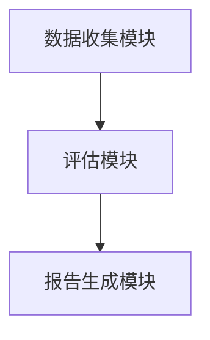

                 


# 彼得林奇如何看待公司的可持续发展目标

> **关键词**：彼得·林奇，可持续发展，投资目标，企业价值，风险管理  
> **摘要**：本文探讨了彼得·林奇对公司的可持续发展目标的看法，分析了环境、社会和治理因素对投资决策的影响，结合数学模型和实际案例，详细阐述了可持续发展在公司长期价值中的重要性。

---

## 第一部分: 可持续发展与投资理念概述

### 第1章: 可持续发展的定义与重要性

#### 1.1 可持续发展的核心概念

##### 1.1.1 可持续发展的定义与内涵

可持续发展是一种发展理念，旨在满足当前需求的同时，不损害后代满足其需求的能力。在商业领域，可持续发展关注企业在环境、社会和治理（ESG）方面的表现，这些因素不仅影响企业的长期价值，还影响投资者的决策。

##### 1.1.2 可持续发展的重要性与意义

可持续发展已成为全球关注的焦点，尤其是在气候变化、社会不平等等问题日益严重的背景下。对于投资者而言，可持续发展不仅是道德责任，也是降低风险、提高回报的重要因素。

##### 1.1.3 可持续发展与企业价值的关系

企业的可持续发展能力直接影响其市场表现。研究表明，注重ESG因素的公司往往具有更强的抗风险能力和长期增长潜力。

#### 1.2 彼得·林奇与可持续投资理念

##### 1.2.1 彼得·林奇的背景与投资风格

彼得·林奇是全球著名投资者，以其长期投资和基本面分析闻名。他认为，投资的核心是选择具有强大基本面和管理能力的公司。

##### 1.2.2 可持续发展在投资中的地位

林奇认为，可持续发展是企业长期成功的关键因素之一。他强调，公司应关注环境保护、社会责任和良好的治理结构。

##### 1.2.3 彼得·林奇对可持续发展的独特见解

林奇认为，可持续发展不仅是道德选择，更是明智的投资策略。他通过分析公司的ESG表现，识别出那些能够持续创造价值的企业。

---

## 第二部分: 可持续发展目标的核心要素

### 第2章: 可持续发展的核心要素分析

#### 2.1 环境因素（Environmental）

##### 2.1.1 环境因素的核心内容

环境因素包括能源消耗、碳排放、资源利用效率等。林奇认为，减少环境影响可以降低企业的运营成本，并提高其市场竞争力。

##### 2.1.2 环境因素对投资的影响

高环境风险的公司可能面临更高的监管风险和运营成本。因此，在投资决策中，林奇会优先选择环境表现良好的企业。

##### 2.1.3 彼得·林奇对环境因素的看法

林奇认为，环境保护是企业社会责任的重要组成部分，同时也是降低风险的关键因素。

#### 2.2 社会因素（Social）

##### 2.2.1 社会因素的核心内容

社会因素包括员工权益、劳工条件、社区关系等。林奇认为，良好的社会表现能够提高员工满意度和企业声誉。

##### 2.2.2 社会因素对投资的影响

公司如果在社会责任方面表现不佳，可能会面临声誉风险和法律风险。因此，林奇在投资时会关注公司的社会表现。

##### 2.2.3 彼得·林奇对社会因素的看法

林奇认为，员工的福祉和社区关系是企业成功的重要因素。他倾向于投资那些在员工待遇和社会责任方面表现良好的公司。

#### 2.3 治理因素（Governance）

##### 2.3.1 治理因素的核心内容

治理因素包括公司治理结构、董事会构成、透明度等。林奇认为，良好的治理结构是企业长期稳定发展的基础。

##### 2.3.2 治理因素对投资的影响

公司治理不善可能导致内部控制失效和管理混乱。因此，林奇在选择投资对象时，会重点评估公司的治理结构。

##### 2.3.3 彼得·林奇对治理因素的看法

林奇认为，透明和高效的治理结构是企业获得投资者信任的关键。他倾向于投资那些治理结构完善、透明度高的公司。

#### 2.4 核心要素的综合分析

##### 2.4.1 核心要素的相互关系

环境、社会和治理因素相互关联，共同影响企业的长期价值。林奇认为，这三者之间的平衡是企业可持续发展的关键。

##### 2.4.2 彼得·林奇对核心要素的权重分配

林奇认为，环境和治理因素的重要性略高于社会因素，但三者同等重要，不可忽视。

---

## 第三部分: 可持续发展目标的评估与分析

### 第3章: 可持续发展目标的评估方法

#### 3.1 可持续发展评估的核心原理

##### 3.1.1 评估的基本原则

评估应基于事实和数据，确保客观性和可比性。林奇使用一套量化指标来评估公司的可持续发展表现。

##### 3.1.2 评估的主要指标

包括碳排放强度、员工满意度、董事会多样性等。林奇会根据这些指标对公司在ESG方面的表现进行评分。

##### 3.1.3 评估的流程与步骤

1. 收集公司公开数据。
2. 分析公司治理结构。
3. 评估公司在环境和社会方面的表现。
4. 综合评分，确定投资目标。

#### 3.2 彼得·林奇的评估方法

##### 3.2.1 林奇的评估框架

林奇使用一套包含环境、社会和治理三个维度的评估框架，每个维度下有多个具体指标。

##### 3.2.2 林奇的评分体系

每个维度分为A、B、C三个等级，综合评分决定是否投资。

##### 3.2.3 林奇对行业与公司的筛选标准

林奇倾向于选择在三个维度均表现良好的公司，尤其是那些在环境和治理方面表现突出的企业。

#### 3.3 评估方法的优缺点分析

##### 3.3.1 优点

- 客观性强，基于量化指标。
- 能够全面评估公司的可持续发展能力。

##### 3.3.2 缺点

- 评估指标可能不够全面，难以涵盖所有重要因素。
- 数据收集可能存在困难。

##### 3.3.3 改进建议

引入更多动态指标，如实时碳排放数据和员工满意度调查，以提高评估的准确性。

## 本章小结

---

## 第四部分: 可持续发展目标的实现路径

### 第4章: 可持续发展目标的实现策略

#### 4.1 可持续发展目标的实现路径

##### 4.1.1 短期目标与长期目标的结合

公司应制定短期和长期的可持续发展目标，确保逐步实现。

##### 4.1.2 内部管理与外部合作的结合

公司需要加强内部管理，同时与外部利益相关者合作，共同推动可持续发展。

##### 4.1.3 利益相关者的需求平衡

公司应平衡股东、员工、客户等利益相关者的需求，确保可持续发展目标的实现。

#### 4.2 彼得·林奇的实现策略

##### 4.2.1 林奇的长期投资策略

林奇注重长期投资，选择那些具有持续增长潜力的公司。

##### 4.2.2 林奇的风险控制方法

通过分散投资和严格筛选，降低投资风险。

##### 4.2.3 林奇的公司治理建议

林奇建议公司加强治理结构，提高透明度，确保董事会的有效性。

#### 4.3 实现路径的案例分析

##### 4.3.1 成功案例

某环保科技公司通过技术创新降低碳排放，提升环境表现，吸引了林奇的关注。

##### 4.3.2 失败案例

某公司因治理结构混乱，导致管理不善，最终影响了企业的可持续发展能力。

##### 4.3.3 案例分析的启示

良好的环境和社会表现，加上高效的治理结构，是公司实现可持续发展的关键。

## 本章小结

---

## 第五部分: 可持续发展目标的数学模型与算法

### 第5章: 可持续发展目标的数学模型

#### 5.1 可持续发展目标的量化方法

##### 5.1.1 环境因素的量化

通过计算单位产品碳排放量，量化公司的环境表现。

##### 5.1.2 社会因素的量化

通过员工满意度调查，量化公司的社会表现。

##### 5.1.3 治理因素的量化

通过董事会多样性指数，量化公司的治理表现。

#### 5.2 彼得·林奇的可持续发展目标模型

##### 5.2.1 模型的构建

$$ \text{可持续发展目标评分} = 0.4 \times E + 0.3 \times S + 0.3 \times G $$

其中，E为环境评分，S为社会评分，G为治理评分。

##### 5.2.2 模型的实现步骤

1. 收集公司E、S、G三个维度的数据。
2. 对每个维度进行评分，范围为A（90-100）、B（70-89）、C（0-69）。
3. 根据公式计算综合评分。

##### 5.2.3 模型的优化与改进

引入动态调整系数，根据行业特点和市场变化调整各维度的权重。

---

## 第六部分: 可持续发展目标的系统架构设计

### 第6章: 可持续发展目标的系统架构设计

#### 6.1 系统功能设计

##### 6.1.1 系统功能模块

- 数据收集模块：收集公司的E、S、G数据。
- 评估模块：根据模型计算综合评分。
- 报告生成模块：生成可持续发展评估报告。

##### 6.1.2 系统功能流程

1. 数据收集模块获取公司数据。
2. 评估模块计算评分。
3. 报告生成模块输出报告。

#### 6.2 系统架构设计

##### 6.2.1 系统架构图



##### 6.2.2 数据流设计

数据从数据源流向数据收集模块，再流向评估模块，最后流向报告生成模块。

#### 6.3 系统接口设计

##### 6.3.1 接口描述

- 数据收集接口：接收公司数据。
- 评估接口：返回评分结果。

##### 6.3.2 接口实现

使用REST API进行数据传输和评估结果返回。

---

## 第七部分: 可持续发展目标的项目实战

### 第7章: 可持续发展目标的项目实战

#### 7.1 项目环境安装

##### 7.1.1 安装Python

安装Python 3.8及以上版本。

##### 7.1.2 安装依赖库

安装pandas、numpy、scikit-learn等库。

#### 7.2 核心实现源代码

##### 7.2.1 数据处理代码

```python
import pandas as pd
import numpy as np

def calculate_esg_score(company_data):
    # 计算环境评分
    env_score = company_data['carbon_emission'] / company_data['revenue'] * 100
    # 计算社会评分
    social_score = company_data['employee_satisfaction'] / 100
    # 计算治理评分
    governance_score = company_data['board_diversity'] / 100
    # 计算综合评分
    esg_score = 0.4 * env_score + 0.3 * social_score + 0.3 * governance_score
    return esg_score
```

##### 7.2.2 评估模型代码

```python
def esg_assessment(company_data):
    esg_score = calculate_esg_score(company_data)
    if esg_score >= 90:
        return 'A'
    elif esg_score >= 70:
        return 'B'
    else:
        return 'C'
```

#### 7.3 代码应用解读与分析

##### 7.3.1 代码实现的逻辑

代码通过计算公司在环境、社会和治理三个维度的得分，综合得出ESG评分，并根据评分结果进行等级划分。

##### 7.3.2 代码的实际应用

将公司数据输入代码，计算其ESG评分，帮助投资者做出投资决策。

#### 7.4 实际案例分析

##### 7.4.1 案例介绍

某科技公司案例，数据包括碳排放、员工满意度、董事会多样性等。

##### 7.4.2 代码实现

运行代码，计算ESG评分，结果为B级。

##### 7.4.3 分析与解读

该公司的环境和治理表现较好，但社会因素稍有欠缺，整体表现良好。

## 本章小结

---

## 第八部分: 可持续发展目标的最佳实践与总结

### 第8章: 最佳实践

#### 8.1 投资建议

投资者应将可持续发展作为重要的考量因素，选择在环境、社会和治理方面表现良好的公司。

#### 8.2 风险管理

通过多元化投资和严格筛选，降低投资风险。

#### 8.3 持续学习

关注可持续发展领域的最新动态，不断更新投资策略。

## 本章小结

---

## 作者

作者：AI天才研究院/AI Genius Institute & 禅与计算机程序设计艺术 /Zen And The Art of Computer Programming

