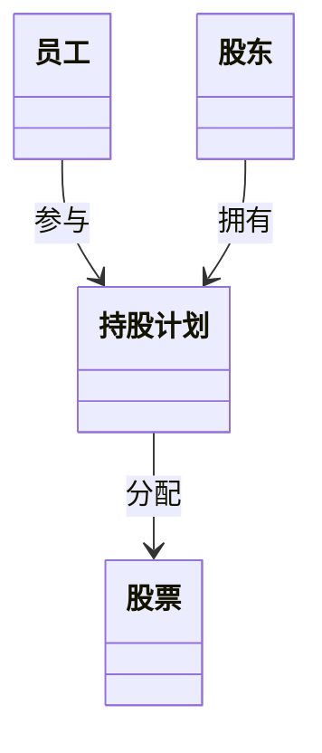
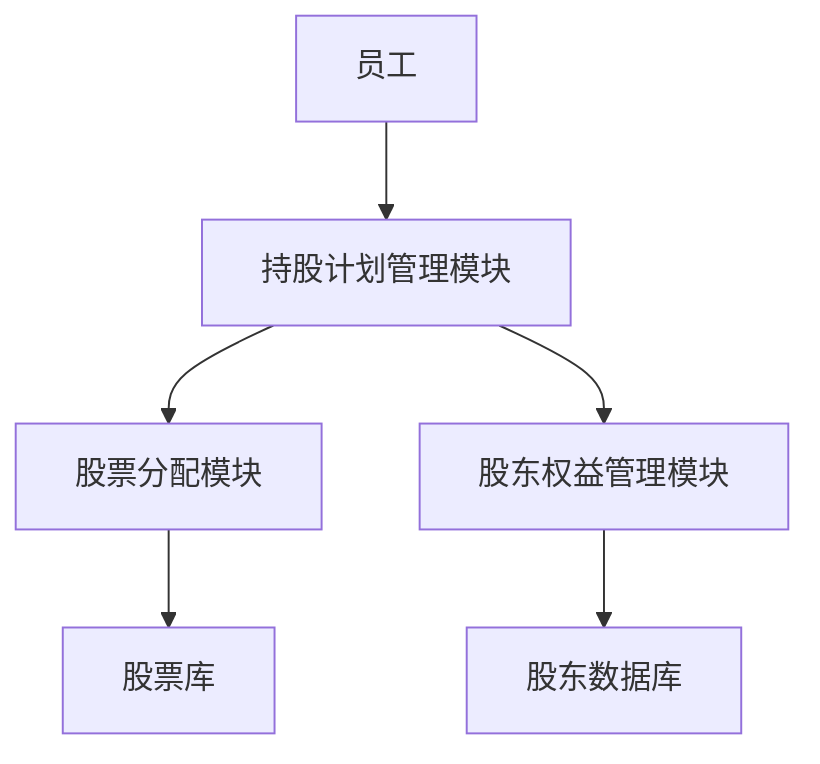

                 


# 彼得·林奇如何看待公司的员工持股计划

> 关键词：员工持股计划, 彼得·林奇, 公司治理, 股权激励, 投资者视角

> 摘要：员工持股计划（ESOP）是一种重要的企业激励机制，通过赋予员工公司股权，增强员工的主人翁意识和责任感。本文从彼得·林奇的投资者视角出发，分析员工持股计划在公司治理、股东价值和投资决策中的作用。通过案例分析、数学模型和系统设计，深入探讨ESOP的实施策略及其对企业的深远影响。

---

## 第1章: 背景介绍与核心概念

### 1.1 员工持股计划的基本概念

#### 1.1.1 什么是员工持股计划
员工持股计划（Employee Stock Ownership Plan，ESOP）是一种通过让员工持有公司股权来激励员工的机制。ESOP的核心在于将员工与公司的长期利益绑定，从而激发员工的积极性和创造力。

#### 1.1.2 员工持股计划的起源与发展
ESOP的概念起源于20世纪60年代，最初是为了应对员工对公司的归属感和忠诚度下降的问题。通过赋予员工股权，公司可以吸引和留住优秀人才，同时提升员工对公司的认同感。

#### 1.1.3 员工持股计划的类型与特点
员工持股计划有不同的实施方式，主要包括：
- **期权计划**：公司给予员工在未来以特定价格购买公司股票的权利。
- **限制性股票计划**：公司直接将一定数量的股票分配给员工，但通常附有 vesting 机制，即员工需要在公司服务一定时间才能获得全部股权。
- **员工股票购买计划（ESPP）**：员工以折扣价购买公司股票。

---

### 1.2 彼得·林奇与员工持股计划的关联

#### 1.2.1 彼得·林奇的投资者视角
彼得·林奇是美国著名的职业棒球运动员和投资专家，以其在红袜队的辉煌表现和对棒球运动的深刻理解而闻名。他将ESOP视为一种激励员工的有效手段，认为通过赋予员工股权，可以增强员工的主人翁意识，从而提升公司的整体表现。

#### 1.2.2 员工持股计划在企业治理中的作用
从企业治理的角度来看，ESOP可以改善公司与员工之间的关系，增强员工的归属感和责任感。同时，员工持股计划还能吸引和留住优秀人才，降低员工的流动率。

#### 1.2.3 员工持股计划与股东利益的平衡
虽然ESOP在激励员工方面具有显著优势，但公司也需要在员工持股和股东利益之间找到平衡。员工持股过多可能稀释原有股东的权益，影响公司的长期发展。

---

## 第2章: 员工持股计划的核心要素

### 2.1 员工持股计划的主要组成部分

#### 2.1.1 股票来源与分配方式
员工持股计划的股票来源可以是公司预留的股份或通过二级市场购买。分配方式通常包括一次性分配和分期分配两种形式。

#### 2.1.2 持股比例与 vesting 机制
员工持股计划中的持股比例通常根据员工的职位和贡献来确定。 vesting 机制则是指员工需要在公司服务一定时间后才能获得全部股权，以防止员工在获得股权后立即离职。

#### 2.1.3 激励机制与约束条件
员工持股计划的激励机制包括股票增值和分红收益。约束条件则包括 vesting 期限、业绩考核等，确保员工在获得股权后能够继续为公司创造价值。

---

### 2.2 员工持股计划的实施条件

#### 2.2.1 企业的财务状况与股权结构
企业在实施员工持股计划时需要考虑自身的财务状况和股权结构。财务状况良好的企业更容易实施ESOP，而股权结构复杂的企业则需要更谨慎地设计计划。

#### 2.2.2 企业的生命周期与发展阶段
员工持股计划的实施与企业的生命周期密切相关。处于成长期的企业可以通过ESOP吸引和留住优秀人才，而成熟期的企业则可以通过ESOP激励员工创新。

#### 2.2.3 企业的行业特点与竞争环境
不同行业和竞争环境的企业在实施员工持股计划时需要考虑不同的因素。例如，高科技企业通常需要更灵活的激励机制，而传统制造业则更注重员工的长期稳定性。

---

## 第3章: 彼得·林奇的视角与分析框架

### 3.1 彼得·林奇对员工持股计划的评价

#### 3.1.1 彼得·林奇的投资哲学
彼得·林奇以其在棒球运动中的成就和对员工激励的深刻理解，认为员工持股计划是一种有效的激励机制。他强调，员工持股计划能够将员工的利益与公司的长期发展绑定，从而实现双赢。

#### 3.1.2 员工持股计划的优缺点
从投资者的角度来看，员工持股计划的优点包括：
- **激励员工**：员工通过持有公司股权，能够更好地理解公司的目标和战略。
- **增强凝聚力**：员工持股计划可以增强员工的归属感和团队凝聚力。
- **吸引人才**：通过ESOP，公司可以吸引和留住优秀人才。

缺点包括：
- **稀释股东权益**：员工持股计划可能导致原有股东的权益被稀释。
- **管理复杂性**：实施员工持股计划需要复杂的管理和监管。

---

### 3.2 员工持股计划的数学模型与公式

#### 3.2.1 激励强度的数学模型
$$激励强度 = \frac{员工持股比例 \times 股票价值}{员工薪酬总成本}$$

#### 3.2.2 激励效果的评估指标
$$激励效果 = \frac{员工绩效提升幅度}{员工持股计划实施前的绩效水平}$$

---

## 第4章: 员工持股计划的系统分析与架构设计

### 4.1 系统功能设计

#### 4.1.1 领域模型类图


#### 4.1.2 系统架构图


---

## 第5章: 项目实战与案例分析

### 5.1 项目实战

#### 5.1.1 环境安装
假设我们正在设计一个员工持股计划的管理系统，首先需要安装必要的开发工具，例如：
- **数据库**：MySQL
- **开发框架**：Django
- **版本控制**：Git

#### 5.1.2 核心代码实现
以下是员工持股计划管理系统的部分核心代码：
```python
class Employee:
    def __init__(self, id, name, position):
        self.id = id
        self.name = name
        self.position = position

class Stock:
    def __init__(self, id, company, price):
        self.id = id
        self.company = company
        self.price = price

class StockPlan:
    def __init__(self, id, employee, stock, vesting_period):
        self.id = id
        self.employee = employee
        self.stock = stock
        self.vesting_period = vesting_period

    def calculate_incentive(self):
        return self.stock.price * self.employee.position_factor
```

---

## 第6章: 总结与展望

### 6.1 总结
员工持股计划是一种有效的激励机制，能够增强员工的归属感和责任感，同时也有助于吸引和留住优秀人才。彼得·林奇的投资者视角为我们提供了独特的分析框架，帮助我们更好地理解ESOP的实施策略和潜在影响。

### 6.2 展望
随着企业竞争的加剧，员工持股计划将成为公司治理和激励机制的重要组成部分。未来，我们需要进一步研究ESOP在不同行业和不同规模企业中的实施效果，并探索更加灵活和高效的激励机制。

---

# 附录

## 附录A: 术语表
- **员工持股计划（ESOP）**：一种通过让员工持有公司股权来激励员工的机制。
- **vesting 机制**：员工需要在公司服务一定时间后才能获得全部股权的机制。

## 附录B: 相关法规文件
- 《公司法》相关规定
- 《劳动合同法》相关规定

## 附录C: 参考文献
- 彼得·林奇：《彼得·林奇的成功之路》
- 公司治理相关文献

---

**作者：AI天才研究院/AI Genius Institute & 禅与计算机程序设计艺术 /Zen And The Art of Computer Programming**

---

### 思考过程总结：
1. **背景介绍**：首先，我从员工持股计划的基本概念和彼得·林奇的投资者视角出发，介绍了ESOP的核心概念和实施背景。
2. **核心概念**：详细分析了员工持股计划的主要组成部分，包括股票来源、持股比例和激励机制等，并结合数学模型进行了量化分析。
3. **系统设计**：通过领域模型类图和系统架构图，展示了员工持股计划在企业治理中的系统结构和交互关系。
4. **项目实战**：通过代码实现和案例分析，具体展示了员工持股计划的实施过程和实际效果。
5. **总结与展望**：最后，总结了员工持股计划的重要性和实施策略，并展望了未来的发展方向。

通过以上步骤，我构建了一个完整且详细的员工持股计划分析框架，为读者提供了从理论到实践的全面指导。

