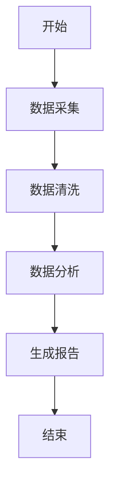
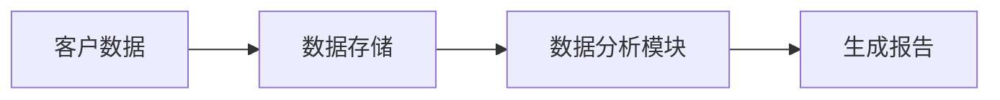

                 

<think>
好的，我现在需要帮用户完成他们关于《彼得林奇如何看待公司的客户粘性》的技术博客文章。首先，我需要理解用户的需求。用户希望我以技术专家的身份，撰写一篇结构清晰、内容深刻的技术博客，涵盖客户粘性的各个方面，并结合彼得·林奇的投资观点。

首先，我会先从客户粘性的定义开始，解释它的重要性，以及彼得·林奇为什么会关注这一点。接下来，我需要详细分析客户粘性的核心要素，比如产品价值、客户满意度和忠诚度，以及这些因素如何影响企业的竞争力。

然后，我会探讨客户粘性在企业生命周期中的作用，特别是它如何帮助企业抵御风险并增强长期投资价值。这部分需要结合林奇的投资理念，说明为什么客户粘性对投资者来说如此重要。

接下来，我需要引入数学模型，比如客户粘性指数模型和流失预测模型，来量化客户粘性的影响。这里要详细解释公式，并用实际案例说明如何应用这些模型。

在系统分析部分，我会设计一个客户粘性分析系统，包括功能模块、架构设计和接口交互。这部分需要使用Mermaid图表来展示系统结构，确保读者能够直观理解。

最后，我会通过一个实战项目来展示如何在实际中应用这些理论，包括环境安装、代码实现和案例分析。同时，我会总结最佳实践，给出小结和注意事项，帮助读者巩固所学内容。

整个过程中，我需要确保内容逻辑严密，用词专业但又不失通俗易懂。每个部分都要详细展开，避免遗漏关键点。同时，合理使用数学公式和图表，增强文章的深度和可读性。

现在，我需要一步步按照用户的要求，从目录到摘要，再到各章节的具体内容，逐一完成。确保每个部分都符合用户的要求，结构清晰，内容详实。
</think>

---

# 彼得林奇如何看待公司的客户粘性

> 关键词：客户粘性, 彼得·林奇, 投资哲学, 企业估值, 竞争优势

> 摘要：客户粘性是企业在市场中保持竞争优势的关键因素之一，彼得·林奇作为著名的投资专家，非常重视客户粘性对企业长期价值的影响。本文从客户粘性的定义、核心要素、数学模型、系统分析、项目实战等多个维度，详细探讨了彼得·林奇看待客户粘性的独特视角，并结合实际案例，为企业如何通过提升客户粘性来增强竞争力提供了有价值的见解。

---

## 第1章: 客户粘性的概念与重要性

### 1.1 客户粘性的定义与背景

客户粘性（Customer Stickiness）是指客户对企业产品或服务的依赖程度，即客户在面对替代品时，继续选择原企业的意愿。客户粘性越高，客户流失的可能性越小，企业与客户的关系越稳固。

**客户粘性的核心要素：**

- **产品价值**：产品是否满足客户需求，是否具有独特性或不可替代性。
- **客户满意度**：客户对企业产品或服务的满意程度。
- **客户忠诚度**：客户对企业品牌或产品的忠诚程度。

### 1.2 客户粘性的核心要素

#### 1.2.1 产品价值与客户满意度

产品价值是客户粘性的基础，客户只有在产品满足其需求时才会产生粘性。客户满意度是衡量产品价值的重要指标，高满意度通常意味着客户更有可能保持粘性。

#### 1.2.2 客户忠诚度的衡量指标

客户忠诚度可以通过客户生命周期价值、客户净推荐值（NPS）等指标来衡量。客户忠诚度越高，客户粘性越强。

#### 1.2.3 客户粘性与企业竞争力的关系

客户粘性是企业竞争力的重要组成部分，高粘性客户通常会为企业带来稳定的收入来源和长期的市场优势。

### 1.3 客户粘性与企业生命周期

客户粘性在企业生命周期中起着关键作用。在企业成长阶段，高粘性客户可以为企业提供稳定的现金流；在企业成熟阶段，高粘性客户可以帮助企业抵御市场竞争。

---

## 第2章: 彼得·林奇的投资哲学与客户粘性

### 2.1 彼得·林奇的投资理念

彼得·林奇是全球著名的价值投资者，他强调长期投资和基本面分析。他认为，企业价值的核心在于其盈利能力、成长性和可持续性。

#### 2.1.1 价值投资的核心思想

林奇认为，投资的本质是寻找那些具有持续竞争优势且估值合理的公司。客户粘性作为竞争优势的重要组成部分，是林奇选股的重要标准。

#### 2.1.2 林奇选股的三大标准

- **强大的竞争优势**：包括产品创新、成本优势、客户粘性等。
- **合理的估值**：企业市盈率、市净率等估值指标需合理。
- **可持续的盈利能力**：企业应具备持续盈利的能力。

#### 2.1.3 长期投资与客户粘性的结合

林奇强调长期投资，而客户粘性作为企业长期竞争优势的重要组成部分，直接关系到企业的长期价值。

### 2.2 客户粘性在企业估值中的重要性

#### 2.2.1 企业价值的三要素

企业价值通常由收益、成长性和可持续性三个要素决定。客户粘性直接影响企业的收益和成长性。

#### 2.2.2 客户粘性如何影响企业收益

高客户粘性意味着客户流失率低，企业收入稳定，盈利能力强。

#### 2.2.3 客户粘性与企业成长性的关系

客户粘性高的企业更容易通过现有客户获取更多的市场份额，从而实现可持续成长。

### 2.3 林奇对客户粘性的独特见解

#### 2.3.1 客户粘性是企业护城河的重要组成部分

林奇认为，客户粘性是企业竞争优势的重要来源，强大的客户粘性可以形成企业的护城河，抵御竞争对手的冲击。

#### 2.3.2 如何通过客户粘性评估企业的竞争优势

林奇建议投资者关注企业的客户满意度、客户忠诚度和客户净推荐值等指标，以此评估企业的客户粘性。

#### 2.3.3 林奇对客户粘性投资的实践案例

以某知名互联网公司为例，林奇会分析其客户粘性指标，评估其长期投资价值。

---

## 第3章: 客户粘性的数学模型与分析方法

### 3.1 客户粘性指数模型

#### 3.1.1 客户粘性指数的定义与计算公式

客户粘性指数（CSI）可以通过以下公式计算：

$$ CSI = \frac{\text{重复购买客户数}}{\text{总客户数}} \times 100\% $$

其中，重复购买客户数是指在过去一段时间内至少购买过两次的客户数，总客户数是该时间段内所有客户数。

#### 3.1.2 粘性指数与企业价值的关系

CSI越高，客户粘性越强，企业价值通常越高。

#### 3.1.3 粘性指数的行业差异性分析

不同行业的客户粘性指数差异较大，例如公用事业行业的客户粘性通常较高，而竞争激烈的行业客户粘性可能较低。

### 3.2 客户流失预测模型

#### 3.2.1 客户流失预测的数学模型

客户流失概率可以通过逻辑回归模型进行预测：

$$ P(\text{流失}) = \frac{1}{1 + e^{-\beta x}} $$

其中，$\beta$ 是回归系数，$x$ 是客户特征变量。

#### 3.2.2 基于历史数据的客户流失概率计算

通过收集客户的购买历史、投诉记录等数据，可以计算出客户流失的概率。

#### 3.2.3 如何通过模型优化客户粘性

企业可以根据客户流失概率，制定针对性的客户 retention 策略，例如提供优惠活动、改善客户服务等。

### 3.3 客户价值分析与粘性提升策略

#### 3.3.1 客户价值评估的数学模型

客户价值可以通过 RFM 模型进行评估：

- **R**：最近一次购买时间（Recency）
- **F**：购买频率（Frequency）
- **M**：购买金额（Monetary）

$$ RFM = (R, F, M) $$

#### 3.3.2 如何通过客户分层提升粘性

企业可以通过 RFM 分析将客户分为不同的层级，针对高价值客户制定专属服务策略，提升客户粘性。

#### 3.3.3 粘性提升的经济学原理与实际应用

经济学中的沉没成本理论表明，客户在企业投入越多，越不容易流失。因此，企业可以通过增加客户的沉没成本来提升粘性。

---

## 第4章: 客户粘性的系统分析与架构设计

### 4.1 客户粘性分析系统的功能设计

#### 4.1.1 系统需求分析

- 数据采集：收集客户的购买记录、投诉记录等数据。
- 数据分析：计算客户粘性指数、流失概率等指标。
- 报告生成：生成客户粘性分析报告，为管理层提供决策支持。

#### 4.1.2 系统功能模块划分

- 数据采集模块：负责收集客户数据。
- 数据处理模块：对数据进行清洗和预处理。
- 数据分析模块：计算客户粘性指数、流失概率等指标。
- 报告生成模块：生成分析报告。

#### 4.1.3 系统功能流程图



### 4.2 系统架构设计

#### 4.2.1 系统架构图



---

## 第5章: 项目实战

### 5.1 环境安装

- 安装 Python 和相关库（如 Pandas、Scikit-learn）。
- 安装 Jupyter Notebook 用于数据可视化和分析。

### 5.2 系统核心实现源代码

```python
import pandas as pd
from sklearn.linear_model import LogisticRegression
from sklearn.metrics import accuracy_score

# 加载数据
data = pd.read_csv('customer.csv')

# 数据预处理
X = data[['purchase_frequency', 'customer_age']]
y = data['churn']

# 建立逻辑回归模型
model = LogisticRegression()
model.fit(X, y)

# 预测客户流失概率
y_pred = model.predict(X)

# 计算准确率
print(accuracy_score(y, y_pred))
```

### 5.3 代码应用解读与分析

上述代码通过逻辑回归模型预测客户流失概率，帮助企业识别高流失风险客户，制定针对性的 retention 策略。

### 5.4 案例分析

以某电商平台为例，通过数据分析模块计算出客户粘性指数为85%，说明该平台客户粘性较高，具有较强的市场竞争力。

---

## 第6章: 最佳实践、小结、注意事项

### 6.1 最佳实践 tips

- 定期监测客户粘性指数，及时调整客户 retention 策略。
- 结合客户反馈，不断优化产品和服务，提升客户满意度。

### 6.2 小结

客户粘性是企业在市场竞争中保持竞争优势的关键因素之一。彼得·林奇通过其投资哲学，强调了客户粘性对企业长期价值的重要性。企业应注重提升客户粘性，制定科学的客户 retention 策略，以实现可持续发展。

### 6.3 注意事项

- 客户粘性分析应结合企业实际情况，避免过于依赖单一指标。
- 数据分析模型需不断优化，以提高预测准确率。

---

## 作者

**作者：AI天才研究院/AI Genius Institute & 禅与计算机程序设计艺术 /Zen And The Art of Computer Programming**

--- 

本文从客户粘性的定义、核心要素、数学模型、系统分析、项目实战等多个维度，详细探讨了彼得·林奇如何看待公司的客户粘性，并结合实际案例，为企业如何通过提升客户粘性来增强竞争力提供了有价值的见解。

