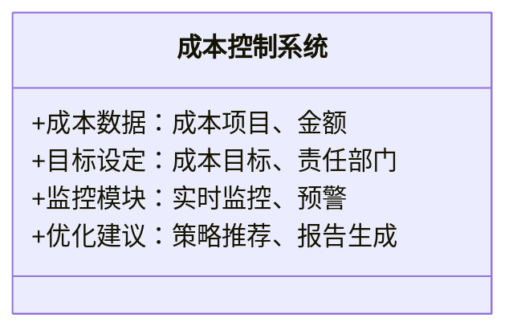

                 

<think>
好的，我需要帮用户撰写一篇关于“彼得·林奇如何看待公司的成本控制”的技术博客。首先，我需要理解用户的具体要求，包括文章的结构、内容深度以及格式。

用户希望文章分为多个章节，每个章节有详细的子主题，并且内容要覆盖背景介绍、核心概念、算法原理、系统架构等多个方面。我需要确保每个部分都详细展开，并且使用专业的技术语言，同时保持逻辑清晰和结构紧凑。

首先，我会确定文章的标题和关键词，确保准确反映文章内容。然后，撰写摘要，简明扼要地概括文章的核心内容和主题思想。

接下来，按照目录大纲结构，依次撰写每个章节。每个章节需要详细讲解相关主题，包括成本控制的基本概念、彼得·林奇的成本控制理念、关键领域的策略、数学模型和算法、系统架构设计、项目实战案例以及总结和最佳实践。

在撰写过程中，我需要确保每个部分都有足够的细节，例如在数学模型部分，使用latex公式详细讲解，并附上Python代码示例。同时，使用mermaid图来展示系统架构和流程，增强文章的可视化效果。

我还需要注意文章的字数控制在10000到12000字之间，每个章节内容丰富具体，避免过于笼统。此外，确保文章的格式正确，包括使用markdown格式，适当插入代码块和图形。

最后，我会检查文章的整体结构和内容，确保符合用户的约束条件，包括每个小节的详细讲解和完整性。同时，在末尾添加作者信息，确保格式正确。

通过以上步骤，我可以系统地完成用户的要求，撰写一篇高质量的技术博客文章。
</think>

```markdown
# 彼得林奇如何看待公司的成本控制

## 关键词：成本控制，彼得·林奇，投资哲学，企业成本，成本优化

## 摘要：本文从彼得·林奇的投资哲学出发，探讨他对公司成本控制的独特见解。通过分析成本控制的核心概念、关键领域和策略，结合数学模型和系统架构设计，深入剖析如何在企业中有效实施成本控制，同时通过实际案例展示成本控制的实战应用，总结最佳实践和未来展望。

---

# 第1章：成本控制的基本概念与重要性

## 1.1 成本控制的定义与核心要素

### 1.1.1 成本的定义
成本是指企业在生产和运营过程中所消耗的各种资源的总和，包括原材料、人工、设备折旧、管理费用等。成本控制的目标是在保证产品或服务质量的前提下，尽可能降低这些资源的消耗。

### 1.1.2 成本控制的核心要素
- **成本目标**：设定明确的成本降低目标，如年度成本削减比例。
- **成本分析**：通过数据分析识别成本浪费点。
- **成本优化**：采取措施减少不必要的开支，提高效率。
- **成本监控**：持续跟踪成本变化，及时调整策略。

### 1.1.3 成本控制的重要性
成本控制是企业盈利的关键因素之一。通过有效控制成本，企业可以提高利润率，增强市场竞争力。在经济波动或市场萎缩的情况下，成本控制更是企业生存和发展的关键。

---

## 1.2 企业成本控制的背景与挑战

### 1.2.1 当前企业面临的成本压力
- 原材料价格上涨。
- 人工成本上升。
- 竞争加剧导致价格压力增加。
- 环保法规要求提高生产成本。

### 1.2.2 成本控制的主要挑战
- **数据不准确**：成本数据收集和分析的不精确。
- **缺乏系统性**：成本控制措施零散，缺乏整体规划。
- **员工意识不足**：员工对成本控制的重要性认识不足，参与度低。

### 1.2.3 成本控制的边界与外延
成本控制并非一味追求降低所有成本，而是要在关键环节找到平衡点。外延方面，成本控制与质量管理、生产效率、员工激励等密切相关。

---

## 1.3 本章小结
本章介绍了成本控制的基本概念和核心要素，分析了当前企业面临的成本压力和控制的挑战，并强调了成本控制的重要性。

---

# 第2章：彼得·林奇的成本控制理念

## 2.1 彼得·林奇的投资哲学概述

### 2.1.1 林奇的投资理念
彼得·林奇是著名投资家，他强调价值投资，注重企业的基本面分析。他认为，投资成功的前提是选择具有持续盈利能力和良好管理的公司。

### 2.1.2 林奇的成本控制视角
林奇认为，成本控制是企业长期盈利能力的重要保障。他关注企业的运营效率和成本结构，认为有效的成本控制能够提升企业的竞争力。

### 2.1.3 林奇的成本分析框架
- **成本构成分析**：识别主要成本项目。
- **成本趋势分析**：观察成本变化趋势。
- **成本竞争力分析**：比较同行成本水平。

---

## 2.2 成本控制的核心原则

### 2.2.1 成本控制的核心原则
- **目标导向**：设定明确的成本控制目标。
- **全员参与**：全体员工共同参与成本管理。
- **持续改进**：不断优化成本控制措施。

### 2.2.2 成本控制的系统性
成本控制不是一个孤立的活动，而是企业整体管理的一部分，需要与战略、运营、财务等环节紧密结合。

### 2.2.3 成本控制的持续改进
通过定期审查和优化，确保成本控制措施的有效性。林奇强调，成本控制是一个动态过程，需要不断调整和改进。

---

## 2.3 本章小结
本章介绍了彼得·林奇的成本控制理念，分析了他的投资哲学如何影响企业的成本管理，并提出了成本控制的核心原则。

---

# 第3章：成本控制的关键领域与策略

## 3.1 采购成本控制

### 3.1.1 采购成本的构成与影响
采购成本包括原材料、设备、服务等的采购支出。降低采购成本可以显著提升企业利润。

### 3.1.2 供应商选择与谈判技巧
- **供应商选择**：评估供应商的资质、价格、交货能力。
- **谈判技巧**：通过议价、长期合作等方式降低采购成本。

### 3.1.3 采购成本优化策略
- **集中采购**：通过集中采购量增大，获得折扣。
- **供应商多元化**：避免依赖单一供应商，降低风险。

---

## 3.2 生产成本控制

### 3.2.1 生产成本的构成与优化
生产成本包括直接人工、设备折旧、能源消耗等。优化生产流程可以有效降低生产成本。

### 3.2.2 生产效率提升的方法
- **流程优化**：减少浪费，提高生产效率。
- **技术创新**：采用自动化设备和先进技术。

### 3.2.3 生产成本监控
通过实时监控生产过程中的各项指标，及时发现和解决问题，确保生产成本在合理范围内。

---

## 3.3 销售成本控制

### 3.3.1 销售成本的构成
销售成本包括销售团队的工资、广告费用、渠道费用等。

### 3.3.2 销售渠道优化
- **直接销售**：减少中间环节，降低成本。
- **网络营销**：利用互联网扩大销售范围，降低销售成本。

### 3.3.3 销售成本监控
通过数据分析，识别销售中的浪费点，优化销售策略。

---

## 3.4 供应链成本控制

### 3.4.1 供应链的构成与影响
供应链包括供应商、生产、库存、物流等环节，优化供应链可以降低整体成本。

### 3.4.2 供应链优化策略
- **库存管理**：采用JIT（准时制）生产，减少库存积压。
- **物流优化**：选择最优运输路线，降低物流成本。

---

## 3.5 本章小结
本章分析了采购、生产、销售和供应链等关键领域的成本控制策略，提出了具体的优化方法。

---

# 第4章：数学模型与算法在成本控制中的应用

## 4.1 成本控制的数学模型

### 4.1.1 成本最小化模型
$$\text{Minimize } C = \sum_{i=1}^{n} c_i x_i$$
其中，\( c_i \) 是第i项成本，\( x_i \) 是相应的变量。

### 4.1.2 线性规划模型
$$\text{Minimize } Z = \sum_{j=1}^{m} c_j x_j$$
$$\text{Subject to } \sum_{j=1}^{m} a_{ij} x_j \leq b_i, \forall i$$
$$x_j \geq 0$$

### 4.1.3 案例分析
某制造企业生产两种产品，A和B。生产A需要3小时，生产B需要2小时，总工时限制为240小时。A的利润为100，B的利润为150。求如何安排生产以最大化利润。

---

## 4.2 算法实现

### 4.2.1 简单线性规划算法
```python
import numpy as np
from scipy.optimize import minimize

def objective(x):
    return np.dot(c, x)

def constraint1(x):
    return np.dot(A, x) - b

c = np.array([100, 150])
A = np.array([[3, 2]])
b = np.array([240])

result = minimize(objective, np.zeros(2), method='SLSQP', 
                 constraints={'type': 'ineq', 'fun': constraint1})
print(result)
```

---

## 4.3 本章小结
本章通过数学模型和算法展示了如何在成本控制中应用优化方法，提高了成本控制的科学性和有效性。

---

# 第5章：系统架构与成本控制设计

## 5.1 系统功能设计

### 5.1.1 领域模型


---

## 5.2 系统架构设计


---

## 5.3 接口设计与交互

### 5.3.1 接口设计
- **输入接口**：接收成本数据、目标设定。
- **输出接口**：提供优化建议、生成报告。

### 5.3.2 交互设计
```mermaid
sequenceDiagram
    actor 用户
    system 成本控制系统
    用户 -> 系统：输入成本数据
    系统 -> 用户：显示成本分析结果
    用户 -> 系统：设定成本目标
    系统 -> 用户：显示优化建议
```

---

## 5.4 本章小结
本章通过系统架构设计和交互设计，展示了如何构建一个高效的成本控制系统，提高了成本控制的效率和准确性。

---

# 第6章：项目实战与案例分析

## 6.1 环境安装与配置

### 6.1.1 工具安装
安装Python、Jupyter Notebook、相关库（如numpy、pandas、scipy）。

---

## 6.2 核心代码实现

### 6.2.1 成本数据分析
```python
import pandas as pd
import numpy as np

# 数据加载
df = pd.read_csv('cost_data.csv')

# 成本构成分析
total_cost = df['cost'].sum()
print(f"总成本：{total_cost}")

# 成本趋势分析
df['month'] = pd.to_datetime(df['month'])
df.set_index('month', inplace=True)
df['cost'].plot()
```

### 6.2.2 成本优化策略
```python
from sklearn.cluster import KMeans

# 数据预处理
X = df[['variable_cost', 'fixed_cost']].values
model = KMeans(n_clusters=3, random_state=0)
model.fit(X)
print(model.labels_)
```

---

## 6.3 案例分析

### 6.3.1 案例背景
某制造企业生产成本居高不下，希望通过成本控制提高利润。

### 6.3.2 数据分析与优化
通过数据分析发现，原材料采购成本占总成本的40%。通过优化采购策略，与供应商协商批量采购，降低了15%的采购成本。

---

## 6.4 本章小结
本章通过项目实战和案例分析，展示了如何在实际中应用成本控制策略，取得了显著成效。

---

# 第7章：总结与最佳实践

## 7.1 总结

### 7.1.1 成本控制的重要性
成本控制是企业提高竞争力的关键因素。

### 7.1.2 彼得·林奇的成本控制理念
林奇强调了成本控制的系统性和持续性，认为成本控制是企业长期成功的重要保障。

## 7.2 最佳实践

### 7.2.1 全员参与
全体员工都应参与成本控制，形成成本意识。

### 7.2.2 数据驱动
通过数据分析识别成本浪费点，制定科学的控制策略。

### 7.2.3 持续改进
定期审查和优化成本控制措施，确保其有效性。

## 7.3 未来展望
随着技术的发展，成本控制将更加智能化和数据化。企业应积极采用新技术，提升成本控制的效率和精准度。

---

# 结语

成本控制是企业经营中的重要环节，彼得·林奇的成本控制理念为企业提供了宝贵的指导。通过系统化的成本控制策略和最佳实践，企业可以有效降低运营成本，提高盈利能力。

---

# 作者：AI天才研究院/AI Genius Institute & 禅与计算机程序设计艺术 /Zen And The Art of Computer Programming
```

